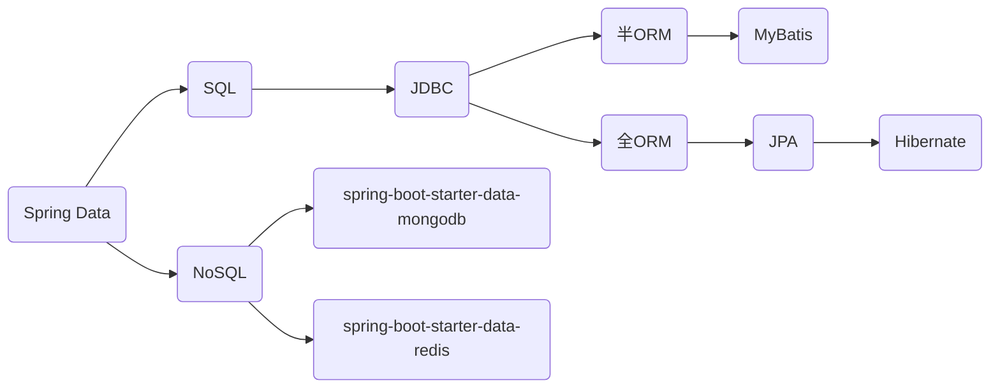

# 1. 概念

## 1.1. ORM

ORM（Object Relational Mapping）对象关系映射，ORM的目的是使数据操作能像操作对象那样方便，让程序员能够运用过面向对象的思想来操作数据对象，通常ORM框架会做到将数据库表映射成对象，封装一些基本的数据操作。

在实际开发时可以选择使用ORM框架，也可以使用直接的数据库操作，有时候因为性能要求只能直接操作数据。 
## 1.2. JDBC和JPA

**JDBC**

JDBC（Java Database Connectivity），JDBC是Java标准库提供的一组API，用于与关系型数据库进行直接交互。它提供了一种底层的、面向数据库的编程模型，开发人员需要手动编写SQL语句来执行数据库的操作，开发人员需要自己处理数据库连接管理、事务管理等方面的细节

**JPA**

JPA（Java Persistence API），JPA是一套基于ORM的规范。JPA通过对象和关系数据库之间的映射，将面向对象的编程模型与关系数据库进行交互。开发人员可以通过定义实体类和注解来描述对象与数据库表之间的映射关系，JPA框架会自动处理数据库的操作，如插入、更新、删除等。JPA提供了对象查询语言（JPQL）来执行数据库查询操作，可以更方便地进行面向对象的查询。

JPA并未提供ORM实现，它只是制订了一些规范

**JDBC和JPA的区别**

-   不同标准：jdbc是Java操作数据库的统一接口标准；jpa是orm框架的统一接口标准。
-   用法区别：jdbc更注重数据库，orm则更注重于java代码，但是实际上jpa实现的框架底层还是用jdbc去和数据库打交道

# 2. 多个数据访问框架的区别

Hibernate：是JPA的一种实现，是一个框架  

Spring Data JPA：对JPA规范的再次抽象，底层使用Hibernate实现  

Spring Data JDBC： jdbcTemplate模板数据库简化对数据库的操作，相比传统JDBC而言省去了，数
据库驱动，连接等无关配置，只需要写sql，设置参数  

Mybatis：是一个持久化框架，但不完全是一个orm框架，不是依照的jpa规范，它需要些sql语句，半ORM。

# 3. 总结

对于数据访问，无论是SQL（关系型数据库）还是NoSQL（非关系型数据库），Spring Boot底层都是采用Spring Data的方式进行统一处理

