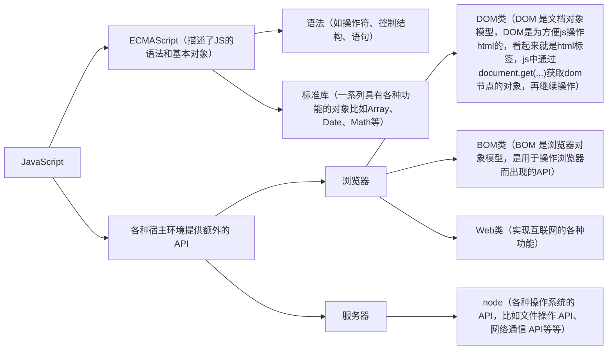

# 1. 前言

JavaScript 是一种轻量级的脚本语言。所谓“脚本语言”（script language），指的是它不具备开发操作系统的能力，而是只用来编写控制其他大型应用程序（比如浏览器）的“脚本”。

JavaScript 本身不提供任何与 I/O（输入/输出）相关的 API，都要靠宿主环境（host）提供。

JavaScript 的核心语法部分相当精简，只包括两个部分：基本的语法构造（比如操作符、控制结构、语句）和标准库（就是一系列具有各种功能的对象比如`Array`、`Date`、`Math`等）。除此之外，各种宿主环境提供额外的 API（即只能在该环境使用的接口），以便 JavaScript 调用。


# 2. 特性

- JavaScript 的所有值都是对象
- 是一种解释型语言，但是在现代浏览器中，JavaScript 都是编译后运行
- JavaScript 程序可以采用事件驱动（event-driven）和非阻塞式（non-blocking）设计

# 3. 作用域

ES5只有全局作用域和函数作用域，没有块级作用域
# 4. 变量

命名规则：不能数字开头、不能以保留字命名、驼峰式命名法（第一个字母应小写，此后每一个单词中的第一个字母当为大写）

`let`、`const`和`var`都是JavaScript中用于声明变量的关键字，但它们的行为和作用域规则有所不同。

**var**

这是最早的JavaScript变量声明方式，它的作用域是函数级的。如果在函数外部声明，它将成为全局变量。`var`声明的变量会被提升到它们所在的函数或全局作用域的顶部。在es6的语法中，已经不建议使用

**let**

这是ES6引入的新的变量声明方式，所声明的变量，只在`let`命令所在的代码块内有效（一个花括号内为一个代码块）

**const**

这也是ES6引入的，用于声明常量的关键字，它的作用域也是块级的。一旦被赋值，就不能改变。

**在现代JavaScript开发中，建议尽可能使用`let`和`const`**，因为它们的块级作用域规则更易于理解和管理。使用`const`可以明确表示变量的值不应该改变，这可以帮助防止在代码中意外地修改这个值。当你需要一个可以改变的变量时，使用`let`。尽量避免使用`var`，除非你有特定的理由需要函数级作用域或变量提升。

# 5. 数据类型

**基础数据类型**

```
String字符串

Number数值型

Boolean布尔型

Null空值：使用typeof检测类型时，输出object型

Undefined未定义型
```

**引用数据类型**

Object对象
# 6. 运算符

算术运算符：加、减、乘、`/` 除、`%` 取余

关系运算符：`==`、`===`恒等、`!=`、`>`、`<`、`>=`、`<=`

赋值运算符：`=`、`+=`、`-=`、`*=`、`/=`、`%=`

一元运算符：a++、++a

逻辑运算符：逻辑与 `&&`、逻辑或 `||`、逻辑非 `！`（`&&`优先于`||`）
# 7. 类型

## 7.1. 相等与比较

### 7.1.1. 等于操作符

等于操作符由两个等号组成：`==`

JavaScript 是弱类型语言，这就意味着，等于操作符会为了比较两个值而进行强制类型转换。

```javascript
""           ==   "0"           // false
0            ==   ""            // true
0            ==   "0"           // true
false        ==   "false"       // false
false        ==   "0"           // true
false        ==   undefined     // false
false        ==   null          // false
null         ==   undefined     // true
" ..."    ==   0             // true
```

上面的表格展示了强制类型转换，这也是使用 `==` 被广泛认为是不好编程习惯的主要原因， 由于它的复杂转换规则，会导致难以跟踪的问题。

此外，强制类型转换也会带来性能消耗，比如一个字符串为了和一个数字进行比较，必须事先被强制转换为数字。
### 7.1.2. 严格等于操作符

不像普通的等于操作符，严格等于操作符不会进行强制类型转换。

```javascript
""           ===   "0"           // false
0            ===   ""            // false
0            ===   "0"           // false
false        ===   "false"       // false
false        ===   "0"           // false
false        ===   undefined     // false
false        ===   null          // false
null         ===   undefined     // false
" ..."    ===   0             // false
```
上面的结果更加清晰并有利于代码的分析。如果两个操作数类型不同就肯定不相等也有助于性能的提升。
### 7.1.3. 比较对象

这里等于操作符比较的不是值是否相等，而是是否属于同一个身份；也就是说，只有对象的同一个实例才被认为是相等的。 这有点像 Python 中的 `is` 和 C 中的指针比较。
## 7.2. `typeof` 操作符

`typeof` 只有一个实际的应用（这个实际应用是用来检测一个对象是否已经定义或者是否已经赋值）， 而这个应用却不是用来检查对象的类型
### 7.2.1. 对象的类定义

JavaScript 标准文档只给出了一种获取 `[[Class]]` 值的方法，那就是使用 `Object.prototype.toString`

```javascript
let a = '123'
// 通过 `slice` 截取指定位置的字符串
console.log(Object.prototype.toString.call(a).slice(8, -1))
```
### 7.2.2. 测试未定义变量

```javascript
typeof foo !== 'undefined'
```

上面代码会检测 `foo` 是否已经定义；如果没有定义而直接使用会导致 `ReferenceError` 的异常。 这是 `typeof` 唯一有用的地方。
## 7.3. `instanceof` 操作符

`instanceof` 操作符用来比较两个操作数的构造函数。只有在比较自定义的对象时才有意义
## 7.4. 类型转换

JavaScript 是弱类型语言，如果对数据类型有要求应该使用**强制类型转换**

```javascript
parseInt()：转为整型

parseFloat()：转为浮点型

Number()：转为数值型

String()：转为字符串型

Boolean()：转换为布尔型，转为false（0、空），其余都会转为true
```

# 8. 数组

由于 `for in` 循环会枚举原型链上的所有属性，唯一过滤这些属性的方式是使用 hasOwnProperty 函数， 因此会比普通的 `for` 循环慢上好多倍。
## 8.1. 数组遍历与属性

### 8.1.1. 遍历

为了达到遍历数组的最佳性能，推荐使用经典的 for 循环。

```javascript
var list = [1, 2, 3, 4, 5, ...... 100000000];
for(var i = 0, l = list.length; i < l; i++) {
    console.log(list[i]);
}
```
上面代码有一个处理，就是通过 l = list.length 来缓存数组的长度。

虽然 length 是数组的一个属性，但是在每次循环中访问它还是有性能开销。

### 8.1.2. `length` 属性

`length` 属性的 _getter_ 方式会简单的返回数组的长度，而 _setter_ 方式会**截断**数组。

```javascript
var foo = [1, 2, 3, 4, 5, 6]; 
foo.length = 3; 
foo; // [1, 2, 3]
```
## 8.2. `Array` 构造函数

由于 `Array` 的构造函数在如何处理参数时有点模棱两可，因此总是推荐使用数组的字面语法 `[]`  来创建数组
# 9. 函数

## 9.1. 函数声明与表达式

函数是 JavaScript 中的一种对象，这意味着可以把函数像值一样传递。 一个常见的用法是把匿名函数作为回调函数传递到异步函数中。
### 9.1.1. 函数声明

```javascript
function foo() {}
```
上面的方法会在执行前被 解析 (hoisted)，因此它存在于当前上下文的任意一个地方， 即使在函数定义体的上面被调用也是对的。

```javascript
foo(); // 正常运行，因为foo在代码运行前已经被创建
function foo() {}
```
### 9.1.2. 匿名函数赋值表达式

把一个匿名的函数赋值给变量 `foo`

```javascript
var foo = function() {};
```
错误方式
```javascript
foo; // 'undefined'
foo(); // 出错：TypeError
var foo = function() {};
```
由于 var 定义了一个声明语句，对变量 foo 的解析是在代码运行之前，因此 foo 变量在代码运行时已经被定义过了。

但是由于赋值语句只在运行时执行，因此在相应代码执行之前， foo 的值缺省为 undefined。
## 9.2. `this` 的工作原理（重点）

**谁调用了函数，this就指向谁**

JavaScript 有一套完全不同于其它语言的对 `this` 的处理机制。 在不同的情况下 ，`this` 指向的各不相同

**全局范围内**

当在全局范围内使用 `this`，它将会指向全局对象。在浏览器中运行的 JavaScript 脚本，这个全局对象是 `window`

**通过`函数名()` 直接调用**

这里 `this` 也会指向全局对象
```javascript
function func(){  
console.log(this);  
}  
func();//this指向window
```
> **ES5 注意:** 在严格模式下（strict mode），不存在全局变量。 这种情况下 `this` 将会是 `undefined`。

**方法调用：`对象.函数名()` 调用**

this指向这个对象
```javascript
test.func(); 
```

**调用构造函数**

函数作为构造函数，用new关键字调用，this指向新new出的对象

```javascript
var obg = new func();//this指向new出的新obg
```

**函数作为数组的一个元素，通过数组下标调用 ---> this指向数组**  
```javascript
var arr = [func,1,2,3];  
arr[0]();//this指向arr
```

**函数作为window内置函数的回调函数调用 ---> this指向window**  
```javascript
setTimeout(func,1000);//this指向window
```
## 9.3. 闭包和引用

闭包是 JavaScript 一个非常重要的特性，这意味着当前作用域**总是**能够访问外部作用域中的变量。 因为 函数 是 JavaScript 中唯一拥有自身作用域的结构，因此闭包的创建依赖于函数。
## 9.4. `arguments` 对象

JavaScript 中每个函数内都能访问一个特别变量 `arguments`。这个变量维护着所有传递到这个函数中的参数列表

注意: 由于 arguments 已经被定义为函数内的一个变量。 因此通过 var 关键字定义 arguments 或者将 arguments 声明为一个形式参数， 都将导致原生的 arguments 不会被创建。

arguments 变量不是一个数组（Array），实际上它是一个对象（Object）。因此，无法对 arguments 变量使用标准的数组方法

**转化为数组**

```javascript
Array.prototype.slice.call(arguments);
```
**自动更新**

`arguments` 对象为其内部属性以及函数形式参数创建 _getter_ 和 _setter_ 方法

因此，改变形参的值会影响到 `arguments` 对象的值，反之亦然

**ES5 提示:** 这些 _getters_ 和 _setters_ 在严格模式下（strict mode）不会被创建。

## 9.5. 作用域与命名空间

尽管 JavaScript 支持一对花括号创建的代码段，但是并不支持块级作用域； 而仅仅支持 _函数作用域_

```javascript
function test() { // 一个作用域
    for(var i = 0; i < 10; i++) { // 不是一个作用域
        // count
    }
    console.log(i); // 10
}
```

**隐式的全局变量**

```javascript
// 脚本 A
foo = '42';

// 脚本 B
var foo = '42'
```
脚本 A 在全局作用域内定义了变量 `foo`，而脚本 B 在当前作用域内定义变量 `foo`。

再次强调，上面的效果**完全不同**，不使用 `var` 声明变量将会导致隐式的全局变量产生

```javascript
// 全局作用域

var foo = 42;

function test() {

    // 局部作用域

    foo = 21;

}

test();

console.log(foo); // 21
```

在函数 `test` 内不使用 `var` 关键字声明 `foo` 变量将会覆盖外部的同名变量。 起初这看起来并不是大问题，但是当有成千上万行代码时，不使用 `var` 声明变量将会带来难以跟踪的 BUG

**局部变量**

JavaScript 中局部变量只可能通过两种方式声明，一个是作为函数参数，另一个是通过 `var` 关键字声明

```javascript
// 全局变量
var foo = 1;
var bar = 2;
var i = 2;

function test(i) {
    // 函数 test 内的局部作用域
    i = 5;

    var foo = 3;
    bar = 4;
}
test(10);
```

`foo` 和 `i` 是函数 `test` 内的局部变量，而对 `bar` 的赋值将会覆盖全局作用域内的同名变量。

**名称解析顺序**

当访问函数内的 foo 变量时，JavaScript 会按照下面顺序查找：

1. 当前作用域内是否有 var foo 的定义。
2. 函数形式参数是否有使用 foo 名称的。
3. 函数自身是否叫做 foo。
4. 回溯到上一级作用域，然后从 `#1` 重新开始。

**命名空间**

推荐使用匿名包装器（也就是自执行的匿名函数）来创建命名空间。这样不仅可以防止命名冲突， 而且有利于程序的模块化。

```javascript
( // 小括号内的函数首先被执行
function() {}
) // 并且返回函数对象
() // 调用上面的执行结果，也就是函数对象
```
有一些其他的调用函数表达式的方法，比如下面的两种方式语法不同，但是效果一模一样。
```javascript
// 另外两种方式
+function(){}();
(function(){}());
```
# 10. 对象

## 10.1. 对象和属性

JavaScript 中所有变量都可以当作对象使用，除了两个例外 null 和 undefined

一个常见的误解是数字的字面值（literal）不能当作对象使用。这是因为 JavaScript 解析器的一个错误， 它试图将点操作符解析为浮点数字面值的一部分。有很多变通方法可以让数字的字面值看起来像对象

```javascript
2..toString(); // 第二个点号可以正常解析
2 .toString(); // 注意点号前面的空格
(2).toString(); // 2先被计算
```

### 10.1.1. 对象作为数据类型

JavaScript 的对象可以作为哈希表使用，主要用来保存命名的键与值的对应关系

使用对象的字面语法  `{}`  可以创建一个简单对象，没有任何自定义属性

```javascript
var foo = {}; // 一个空对象

// 一个新对象，拥有一个值为12的自定义属性'test'
var bar = {test: 12}; 
```
### 10.1.2. 访问属性

有两种方式来访问对象的属性，点操作符或者中括号操作符

```javascript
var foo = {name: 'kitten'}
foo.name; // kitten
foo['name']; // kitten

var get = 'name';
foo[get]; // kitten

foo.1234; // SyntaxError
foo['1234']; // works
```

两种语法是等价的，点操作符是推荐做法，但是中括号操作符在下面两种情况下依然有效

- 动态设置属性
- 属性名不是一个有效的变量名（比如属性名中包含空格，或者属性名是 JS 的关键词）

### 10.1.3. 删除属性

删除属性的唯一方法是使用 `delete` 操作符；设置属性为 `undefined` 或者 `null` 并不能真正的删除属性， 而**仅仅**是移除了属性和值的关联

```javascript
var obj = {
    bar: 1,
    foo: 2,
    baz: 3
};
obj.bar = undefined;
obj.foo = null;
delete obj.baz;

for(var i in obj) {
    if (obj.hasOwnProperty(i)) {
        console.log(i, '' + obj[i]);
    }
}
```

### 10.1.4. 属性名的语法

对象的属性名可以使用字符串或者普通字符声明

```javascript
var test = {
    'case': 'I am a keyword so I must be notated as a string',
    delete: 'I am a keyword too so me' // 出错：SyntaxError
};
```
上面的第二种声明方式在 ECMAScript 5 之前会抛出 SyntaxError 的错误。

这个错误的原因是 delete 是 JavaScript 语言的一个关键词；因此为了在更低版本的 JavaScript 引擎下也能正常运行， 必须使用字符串字面值声明方式。
## 10.2. 原型

在写复杂的 JavaScript 应用之前，充分理解原型链继承的工作方式是每个 JavaScript 程序员必修的功课。 要提防原型链过长带来的性能问题，并知道如何通过缩短原型链来提高性能。 更进一步，绝对不要扩展内置类型的原型，除非是为了和新的 JavaScript 引擎兼容。
## 10.3. `for in` 循环

**对象的遍历**

```javascript
for(键 in 对象){console.log(对象名[键]);}
```
## 10.4. 常用封装对象

**数学对象Math**

取绝对值 `.abs()`、取随机数 `.random()`、向下取整`.rnd()`

**时间对象Date**

JS中获取的时间是计算本地时间

实例化构造函数获取时间对象

```javascript
var da = new Date()
```

获取小时 `.getHours()`

获取年 `.getFullYear()`

获取月份   `.getMonth()`

JS中月份的数组是从0开始的

获取日期 `.getDate()`

**数组对象`[]`**

获取数组长度` .length`

插入元素 `.push(元素)`

删除最后一个元素` .pop()`

**字符串对象**

```javascript
var  n = 'JavaScript'
```

将字符串全转为小写 `.toLowerCase()`

将字符串全转为大写 `.toUpperCase()`

# 11. 核心

## 11.1. 不要使用 `eval`

`eval` 函数会在当前作用域中执行一段 JavaScript 代码字符串。在**任何情况下**我们都应该避免使用 `eval` 函数。99.9% 使用 `eval` 的场景都有**不使用** `eval` 的解决方案
## 11.2. `undefined` 和 `null`

JavaScript 有两个表示`空`的值，其中比较有用的是 `undefined`

下面的情况会返回 undefined 值：

- 访问未修改的全局变量 undefined。
- 由于没有定义 return 表达式的函数隐式返回。
- return 表达式没有显式的返回任何内容。
- 访问不存在的属性。
- 函数参数没有被显式的传递值。
- 任何被设置为 undefined 值的变量。

## 11.3. 自动分号插入

尽管 JavaScript 有 C 的代码风格，但是它不强制要求在代码中使用分号，实际上可以省略它们。

JavaScript 不是一个没有分号的语言，恰恰相反上它需要分号来就解析源代码。 因此 JavaScript 解析器在遇到由于缺少分号导致的解析错误时，会自动在源代码中插入分号。

建议绝对不要省略分号，同时也提倡将花括号和相应的表达式放在一行， 对于只有一行代码的 if 或者 else 表达式，也不应该省略花括号。 这些良好的编程习惯不仅可以提到代码的一致性，而且可以防止解析器改变代码行为的错误处理。
# 12. 事件

## 12.1. 何为事件

用户鼠标的点击，键盘某个按键的点击

## 12.2. 基本交互方法

输出

```javascript
document.write(内容)
```

信息对话框：alert(内容)，接收到的是字符串值

选择对话框：confirm(内容)，接收一个参数，并转为字符串显示，返回一个值，true或false

显示提示的对话框：prompt(提示文本内容，文本输入框为默认文本)，接收两个参数，第二个参数可不填，只返回一个值，用户点击取消时，返回null

# 13. ES6

ECMAScript 6.0（以下简称 ES6）。ECMAScript 和 JavaScript 的关系是，前者是后者的规格，后者是前者的一种实现。在日常场合，这两个词是可以互换的

**最常用的ES6特性**

`let, const, class, extends, super, arrow functions, template string, destructuring, default, rest arguments`  这些是ES6最常用的几个语法
## 13.1. let 和 const

**使用 let 声明变量**

`let`实际上为JavaScript新增了块级作用域。用它所声明的变量，只在`let`命令所在的代码块内有效

```
let name = 'zach'

while (true) {
    let name = 'obama'
    console.log(name)  //obama
    break
}

console.log(name)  //zach
```

**使用 const 声明常量**

```
const PI = Math.PI
```

const有一个很好的应用场景，就是当我们引用第三方库的时候，用const来声明可以避免未来不小心重命名而导致出现bug：

```
const monent = require('moment')
```
## 13.2. class, extends, super

这三个特性涉及了ES5中最令人头疼的的几个部分：原型、构造函数，继承...，ES6提供了更接近传统语言的写法，引入了Class（类）这个概念。新的class写法让对象原型的写法更加清晰、更像面向对象编程的语法

```
class Animal {
    constructor(){
        this.type = 'animal'
    }
    says(say){
        console.log(this.type + ' says ' + say)
    }
}

let animal = new Animal()
animal.says('hello') //animal says hello

class Cat extends Animal {
    constructor(){
        super()
        this.type = 'cat'
    }
}

let cat = new Cat()
cat.says('hello') //cat says hello
```

上面代码首先用`class`定义了一个“类”，可以看到里面有一个`constructor`方法，这就是构造方法，而`this`关键字则代表实例对象。简单地说，`constructor`内定义的方法和属性是实例对象自己的，而`constructor`外定义的方法和属性则是所有实例对象可以共享的。

Class之间可以通过`extends`关键字实现继承，这比ES5的通过修改原型链实现继承，要清晰和方便很多。上面定义了一个Cat类，该类通过`extends`关键字，继承了Animal类的所有属性和方法。

`super`关键字，它指代父类的实例（即父类的this对象）。子类必须在`constructor`方法中调用`super`方法，否则新建实例时会报错。这是因为子类没有自己的`this`对象，而是继承父类的`this`对象，然后对其进行加工。如果不调用`super`方法，子类就得不到`this`对象。

ES6的继承机制，实质是先创造父类的实例对象this（所以必须先调用super方法），然后再用子类的构造函数修改this。

P.S 如果你写react的话，就会发现以上三个东西在最新版React中出现得很多。创建的每个component都是一个继承`React.Component`的类
## 13.3. arrow function（箭头函数）

```
function(i){ return i + 1; } //ES5
(i) => i + 1 //ES6
```

如果方程比较复杂，则需要用`{}`把代码包起来

```
function(x, y) { //ES5
    x++;
    y--;
    return x + y;
}
(x, y) => {x++; y--; return x+y} //ES6
```

**arrow function还有一项超级无敌的功能**

当我们使用箭头函数时，函数体内的this对象，就是定义时所在的对象，而不是使用时所在的对象。

并不是因为箭头函数内部有绑定this的机制，实际原因是箭头函数根本没有自己的this，它的this是继承外面的，因此内部的this就是外层代码块的this

```
class Animal {
    constructor(){
        this.type = 'animal'
    }
    says(say){
        setTimeout(function(){
            console.log(this.type + ' says ' + say)
        }, 1000)
    }
}

 var animal = new Animal()
 animal.says('hi')  //undefined says hi
```

运行上面的代码会报错，这是因为`setTimeout`中的`this`指向的是全局对象

```
class Animal {
    constructor(){
        this.type = 'animal'
    }
    says(say){
        setTimeout( () => {
            console.log(this.type + ' says ' + say)
        }, 1000)
    }
}
 var animal = new Animal()
 animal.says('hi')  //animal says hi
```

## 13.4. template string（模板字符串）

这个东西也是非常有用，当我们要插入大段的html内容到文档中时，传统的写法非常麻烦

用反引号 \` 来包裹，用`${}`来引用变量，而且所有的空格和缩进都会被保留在输出之中

```javascript
const name = 'Alice';
const message = `Hello, ${
     name}!
This is a multiline string.`;
console.log(message)
```
## 13.5. destructuring（解构）

ES6允许按照一定模式，从数组和对象中提取值，对变量进行赋值，这被称为解构

看下面的例子：

```
let cat = 'ken'
let dog = 'lili'
let zoo = {cat: cat, dog: dog}
console.log(zoo)  //Object {cat: "ken", dog: "lili"}
```

用ES6完全可以像下面这么写：

```
let cat = 'ken'
let dog = 'lili'
let zoo = {cat, dog}
console.log(zoo)  //Object {cat: "ken", dog: "lili"}
```

反过来可以这么写：

```
let dog = {type: 'animal', many: 2}
let { type, many} = dog
console.log(type, many)   //animal 2
```

`const { printName } = logger` 等于`const printName = logger.printName`
## 13.6. default（默认值）

在函数定义时为参数指定默认值，简化函数调用时的参数传递

```javascript
function greet(name = 'World') {
    console.log(`Hello, ${
       name}!`);
  }
  greet(); // 输出：Hello, World!
  greet('Alice'); // 输出：Hello, Alice!
```
## 13.7. `...`运算符

**函数 `rest` 参数的使用**

```
function f(a, ...b) {
    console.log(a, b)
}
f(1,2,3,4,5) // 1 [2,3,4,5]
```

**数组拆解**

```
const a = [1,2,3]
const b = [4,5,6]
const c = [...a, ...b]
c // [1,2,3,4,5,6]
```

**对象拆解**

```
const obj = { a: 111, b:222 }
const copyObj = { ...obj, c: 333 }
copyObj // { a: 111, b:222, c: 333 }
```
## 13.8. import和export

这两个对应的就是es6自己的`module`功能。ES6模块的设计思想，是尽量的静态化，使得编译时就能确定模块的依赖关系，以及输入和输出的变量

### 13.8.1. 传统的写法

首先我们回顾下require.js的写法。假设我们有两个js文件: `index.js`和`content.js`,现在我们想要在`index.js`中使用`content.js`返回的结果，我们要怎么做呢？

首先定义：

```
//content.js
define('content.js', function(){
    return 'A cat';
})
```
然后require：

```
//index.js
require(['./content.js'], function(animal){
    console.log(animal);   //A cat
})
```
那CommonJS是怎么写的呢？

```
//index.js
var animal = require('./content.js')

//content.js
module.exports = 'A cat'
```
### 13.8.2. ES6的写法

```
//index.js
import animal from './content'

//content.js
export default 'A cat'
```

**注意**

`export default` 用于导出一个默认的模块，而 `export {}` 用于导出多个模块。区别在导入时，`export default`导出的不要使用大括号引入，而 `export {}`导出的需要使用大括号并指定导出的模块名称

```
// 导出
export default Index;
// 导入
import Index

// 导出
export {Index};
// 导入
import {Index}
```
## 13.9. ES6 module的其他高级用法

### 13.9.1. 输出输入多个变量

```
//content.js

export default 'A cat'    
export function say(){
    return 'Hello!'
}    
export const type = 'dog' 
```

上面可以看出，export命令除了输出变量，还可以输出函数，甚至是类（react的模块基本都是输出类）

```
//index.js

import { say, type } from './content'  
let says = say()
console.log(`The ${type} says ${says}`)  //The dog says Hello
```

这里输入的时候要注意：大括号里面的变量名，必须与被导入模块（content.js）对外接口的名称相同。

如果还希望输入content.js中输出的默认值(default), 可以写在大括号外面。

```
//index.js

import animal, { say, type } from './content'  
let says = say()
console.log(`The ${type} says ${says} to ${animal}`)  
//The dog says Hello to A cat
```
### 13.9.2. 修改变量名

此时我们不喜欢type这个变量名，因为它有可能重名，所以我们需要修改一下它的变量名。在es6中可以用`as`实现一键换名。

```
//index.js

import animal, { say, type as animalType } from './content'  
let says = say()
console.log(`The ${animalType} says ${says} to ${animal}`)  
//The dog says Hello to A cat
```
### 13.9.3. 模块的整体加载

除了指定加载某个输出值，还可以使用整体加载，即用星号（`*`）指定一个对象，所有输出值都加载在这个对象上面。

```
//index.js

import animal, * as content from './content'  
let says = content.say()
console.log(`The ${content.type} says ${says} to ${animal}`)  
//The dog says Hello to A cat
```

通常星号`*`结合`as`一起使用比较合适。

## 13.10. Promise

一种用来处理异步操作的对象，它可以让异步操作更加简洁、可读和可维护

```javascript
function fetchData() {
    return new Promise((resolve, reject) => {

      // 异步操作
      setTimeout(() => {
        resolve('Data fetched successfully.');
      }, 1000);
      //
      console.log('first');
    });
  }

  fetchData()
    .then(data => console.log(data))
    .catch(error => console.error(error));
```
