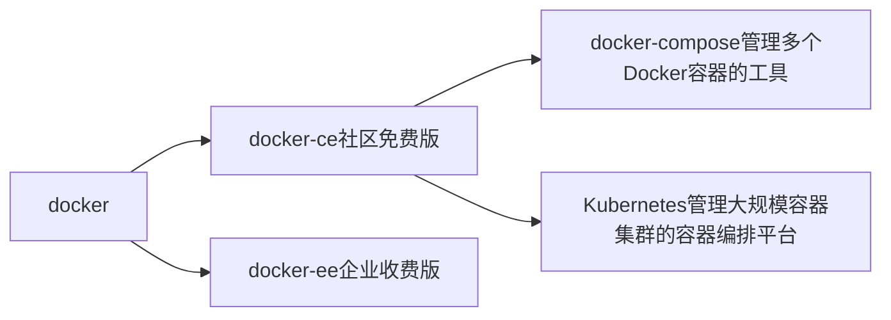

# 1. 概念



# 2. Docker 是什么

Docker容器对进程封装隔离，属于操作系统层面的虚拟化技术。由于隔离的进程独立于宿主和其它的隔离的进程

Docker允许开发中将应用、依赖、函数库、配置一起打包，形成可移植镜像

Docker镜像中包含完整运行环境， 包括系统函数库（仅依赖系统的Linux内核），因此可以在任意Linux操作系统上运行

传统虚拟机技术是虚拟出一套硬件后，在其上运行一个完整操作系统，在该系统上再运行所需应用进程。而**容器内的应用进程直接运行于宿主的内核**，容器内没有自己的内核，而且也没有进行硬件虚拟。因此容器要比传统虚拟机更为轻便
# 3. 为什么要用 Docker

- 高效利用系统资源
- 快速的启动时间
- 一致的运行环境。避免由于开发环境、测试环境、生产环境不一致，导致的 bug 
- 持续交付和部署。一次创建或配置，可以在任意地方正常运行。使用 Docker 可以通过定制应用镜像来实现持续集成、持续交付、部署。使用Dockerfile 使镜像构建透明化，不仅仅开发团队可以理解应用运行环境，也方便运维团队理解应用运行所需条件。
- 更轻松的维护和扩展。`Docker` 使用的分层存储以及镜像的技术，使得应用的维护更新更加简单，基于基础镜像进一步扩展镜像也变得非常简单。[官网镜像库](https://hub.docker.com/search/?type=image&image_filter=official&q=)

# 4. Docker 核心组件

## 4.1. Docker 架构图概览

```
+-----------------------+
|       用户界面        |
| (CLI / API / UI)     |
+-----------+----------+
            |
            v
+-----------------------+
|    Docker 客户端      |
|  (docker CLI/API)     |
+-----------+----------+
            |
            v
+-----------------------+
|   Docker 守护进程     |
| (Docker Daemon)       |
+-----+--------+--------+
      |        |         |
      v        v         v
+------+  +------+  +------+
| 镜像 |  | 容器 |  | 存储 |
+------+  +------+  +------+
      |        |         |
      v        v         v
+------+  +------+  +------+
| 网络 |  | 卷   |  | 其他 |
+------+  +------+  +------+
```
## 4.2. Docker客户端

通过命令或Docker API 向Docker服务端发送指令。可以在本地或远程向服务端发送指令
## 4.3. Docker服务端

**服务端=Docker引擎=Docker守护进程**， 负责管理容器、镜像、网络、卷等资源
## 4.4. Docker镜像

Docker 镜像 是一个特殊的文件系统（基于 UnionFS（联合文件系统）），除了提供容器运行时所需的程序、库、资源、配置等文件外，还包含了一些为运行时准备的一些配置参数（如匿名卷、环境变量、用户等）。镜像 **不包含任何动态数据**，其内容在构建之后也不会被改变

本地构建（通过 Dockerfile），Docker 镜像构建时，会一层一层地构建，前一层是后一层的基础。每一层构建完就不会再发生改变，后一层上的任何改变只发生在自己这一层。

**分层结构**的特征还使得镜像的复用、定制变的更为容易。甚至可以用之前构建好的镜像作为基础层，然后进一步添加新的层，以定制自己所需的内容，构建新的镜像

**为何系统镜像如此之小**

Linux操作系统由内核空间和用户空间组成内核空间是kernel，Linux刚启动时会加载bootfs文件系统，之后bootfs会被卸载掉。用户空间的文件系统是rootfs，包含我们熟悉的/dev、/proc、/bin等目录对于base镜像来说，底层直接用Host的kernel，自己只需要提供rootfs就行了一个精简的OS,rootfs可以很小，只需要包括最基本的命令、工具和程序库就可以了。相比其他Linux发行版，CentOS的rootfs已经算臃肿的了，alpine还不到10MB
## 4.5. Docker容器

**容器是镜像运行时的实体**

每个容器都有自己的文件系统、网络、IP 地址、进程空间等。

容器之间默认相互隔离，但可通过网络通信。

容器的生命周期独立于镜像：可以启动、停止、重启、删除。

Docker 不是虚拟机，**容器中的应用都应该以前台执行**，而不是像虚拟机、物理机里面那样，用 `systemd` 去启动后台服务，**容器内没有后台服务的概念**。

对于容器而言，其启动程序就是容器应用进程，容器就是为了主进程而存在的，主进程退出，容器就失去了存在的意义，从而退出，其它辅助进程不是它需要关心的东西

**容器存储层（不建议使用）**

每一个容器运行时，是以镜像为基础层，在其上创建一个当前容器的存储层（为容器运行时读、写而准备的存储层），容器存储层的生存周期和容器一样，容器消亡时，容器存储层也随之消亡

**Docker 最佳实践**的要求，容器不应该向其存储层内写入任何数据，容器存储层要保持无状态化。**所有的文件写入操作，都应该使用数据卷、或者绑定宿主目录**，在这些位置的读写会跳过容器存储层，直接对宿主（或网络存储）发生读写，其性能和稳定性更高。
## 4.6. Docker存储

为容器提供持久化数据存储能力

**主要类型**
- **命名卷（Named Volumes）** ：Docker 自动管理的独立存储，适合生产环境。
- **绑定挂载（Bind Mounts）** ：将宿主机目录挂载到容器中，适合开发调试。
 - **tmpfs** ：仅存在于内存中的临时存储，容器停止后数据丢失。

## 4.7. Docker网络

管理容器之间的通信和外部访问。

**网络驱动类型** 
- `bridge`：默认网络模式，用于单机多容器通信。
- `host`：容器直接使用宿主机网络。
- `none`：无网络。
- `overlay`：用于跨主机通信（Docker Swarm 模式下使用）。

# 5. Docker安装

安全前先卸载原有 docker

```
yum remove docker.*
```
## 5.1. ~~官方脚本自动安装（推荐）~~

```shell
curl -fsSL get.docker.com -o get-docker.sh
sudo sh get-docker.sh --mirror Aliyun
```

~~官方被封了，用这个~~

```shell
sudo curl -fsSL https://github.com/tech-shrimp/docker_installer/releases/download/latest/linux.sh| bash -s docker --mirror Aliyun
```
## 5.2. 安装

Linux 内核：官方建议 3.10 以上

查看当前的内核版本

```
uname -r
```

具体步骤

```
# step 1: 安装必要的一些系统工具
sudo yum install -y yum-utils

# Step 2: 添加软件源信息
yum-config-manager --add-repo https://mirrors.aliyun.com/docker-ce/linux/centos/docker-ce.repo

# Step 3: 安装Docker
sudo yum install docker-ce docker-ce-cli containerd.io docker-buildx-plugin docker-compose-plugin

# Step 4: 开启Docker服务
sudo service docker start

# Step 5: 查看安装结果
docker version

# 注意：
# 官方软件源默认启用了最新的软件，您可以通过编辑软件源的方式获取各个版本的软件包。例如官方并没有将测试版本的软件源置为可用，您可以通过以下方式开启。同理可以开启各种测试版本等。
# vim /etc/yum.repos.d/docker-ce.repo
#   将[docker-ce-test]下方的enabled=0修改为enabled=1
#
# 安装指定版本的Docker-CE:
# Step 1: 查找Docker-CE的版本:
# yum list docker-ce.x86_64 --showduplicates | sort -r
#   Loading mirror speeds from cached hostfile
#   Loaded plugins: branch, fastestmirror, langpacks
#   docker-ce.x86_64            17.03.1.ce-1.el7.centos            docker-ce-stable
#   docker-ce.x86_64            17.03.1.ce-1.el7.centos            @docker-ce-stable
#   docker-ce.x86_64            17.03.0.ce-1.el7.centos            docker-ce-stable
#   Available Packages
# Step2: 安装指定版本的Docker-CE: (VERSION例如上面的17.03.0.ce.1-1.el7.centos)
# sudo yum -y install docker-ce-[VERSION]
```

配置docker镜像下载加速，编辑配置文件`/etc/docker/daemon.json`

```
vi /etc/docker/daemon.json

{ "registry-mirrors": [ "https://hub-mirror.c.163.com", "https://mirror.baidubce.com","https://docker.1panel.live","https://docker.m.daocloud.io","https://huecker.io" ] }
```

重启服务

```
sudo systemctl daemon-reload
sudo systemctl restart docker
```

检查加速器是否生效

```
docker info
```

启动 Docker 并设置开机自启

```
systemctl start docker
systemctl enable docker
```
## 5.3. 建立 docker 用户组

默认情况下，**docker命令会使用 Unix socket 与 Docker 引擎通讯**。而只有root用户和 docker 组的用户才可以访问 Docker 引擎的 Unix socket。出于安全考虑，一般 Linux 系统上不会直接使用 `root` 用户。因此，更好地做法是**将需要使用 docker 的用户加入 docker 用户组**

建立docker组

```shell
sudo groupadd docker
```

将当前用户加入 docker 组

```shell
sudo usermod -aG docker $USER
```
# 6. Docker 镜像操作

Docker 运行容器前需要本地存在对应的镜像，如果本地不存在该镜像，Docker 会从镜像仓库下载该镜像
## 6.1. 获取镜像

```shell
docker pull [OPTIONS] NAME[:TAG|@DIGEST]
```

- OPTIONS：可选参数，用于控制拉取行为 
- NAME：镜像名称（可包含注册表地址、仓库路径） 
- TAG：镜像标签（默认latest，latest标签可能在不同时间拉取到不同镜像） 
- DIGEST：镜像摘要（SHA256哈希值）

```
# 从Docker Hub拉取官方镜像（等效于 docker.io/library/ubuntu:22.04）
docker pull ubuntu:22.04
# 精准拉取
docker pull ubuntu@sha256:67211c14fa74f070d27cc59d69f7b529b9c78669ebd1a5
```

tag选型决策树：  是否需要 极致体积？ → Alpine ；是否需 临时安装编译工具？ → Slim

| 维度     | Alpine               | Slim              |
| -------- | -------------------- | ----------------- |
| 核心目标 | 最小体积与安全       | 平衡体积与扩展性  |
| 典型体积 | 5-50MB               | 100-300MB         |
| 适用场景 | 生产微服务、边缘计算 | CI/CD、轻量级应用 |

## 6.2. 列出镜像

查看本地镜像

```shell
docker image ls
```

查看镜像、容器、数据卷所占用的空间

```shell
docker system df
```

同时显示依赖的中间层镜像

```shell
docker image ls -a
```

## 6.3. 导出导入

导出镜像到本地

```
docker save -o <保存的文件名>.tar <镜像名称>
```

导入

```
docker load -i /path/to/myimage.tar
```

这将在另一台机器上导入名为`myimage`的镜像

## 6.4. 删除镜像

`<镜像>` 可以是 `镜像短 ID`、`镜像长 ID`、`镜像名` 或者 `镜像摘要`

```shell
docker image rm [选项] <镜像1> [<镜像2> ...]
```

**Untagged 和 Deleted**

删除镜像的时候，实际上是在要求删除某个标签的镜像。所以首先需要做的是将满足我们要求的所有镜像标签都取消，这就是我们看到的 `Untagged` 的信息。因为一个镜像可以对应多个标签，因此当我们删除了所指定的标签后，可能还有别的标签指向了这个镜像，如果是这种情况，那么 `Delete` 行为就不会发生。所以并非所有的 `docker image rm` 都会产生删除镜像的行为，有可能仅仅是取消了某个标签而已

当该镜像所有的标签都被取消了，该镜像很可能会失去了存在的意义，因此会触发删除行为。镜像是多层存储结构，因此在删除的时候也是从上层向基础层方向依次进行判断删除。因此很有可能某个其它镜像正依赖于当前镜像的某一层。这种情况，依旧不会触发删除该层的行为。直到没有任何层依赖当前层时，才会真实的删除当前层

除了镜像依赖以外，还需要注意的是容器对镜像的依赖。如果有用这个镜像启动的容器存在（即使容器没有运行），那么同样不可以删除这个镜像
# 7. Docker 容器操作

容器是独立运行的一个或一组应用，以及它们的运行态环境
## 7.1. 启动

启动容器有两种方式，一种是基于镜像新建一个容器并启动，另外一个是将在终止状态（`exited`）的容器重新启动。

**新建并启动**

命令主要为 `docker run`

当利用 `docker run` 来创建容器时，Docker 在后台运行的标准操作包括：

-   检查本地是否存在指定的镜像，不存在就从仓库下载

-   利用镜像创建并启动一个容器

-   分配一个文件系统，并在只读的镜像层外面挂载一层可读写层

-   从宿主主机配置的网桥接口中桥接一个虚拟接口到容器中去

-   从地址池配置一个 ip 地址给容器

-   执行用户指定的应用程序

-   执行完毕后容器被终止


**启动已终止容器**

利用 `docker container start` 命令，直接将一个已经终止（`exited`）的容器启动运行。

## 7.2. 守护态运行

更多的时候，需要**让 Docker 在后台运行**，而不是直接把执行命令的结果输出在当前宿主机下。此时，可以通过添加 `-d` 参数来实现 `docker run -d`

**注：** 容器是否会长久运行和 `docker run` 指定的命令有关，和 `-d` 参数无关

要获取容器的输出信息，可以通过 `docker container logs` 命令

使用 `-d` 参数启动后会返回一个唯一的 id，也可以通过 `docker container ls` 命令来查看容器信息

## 7.3. 终止

使用 `docker container stop` 来终止一个运行中的容器

注：当 Docker 容器中指定的应用终结时，容器也自动终止

## 7.4. 进入容器

推荐 `docker exec` 命令，`docker exec` command allows you to run commands inside a Docker container

使用`-it` 参数，可以看到我们熟悉的 Linux 命令提示符

```
eg：docker exec -it container-name bash
```

## 7.5. 导出导入

导出容器快照到本地 `tar`文件，可以使用 `docker export` 命令
```
docker export [CONTAINER ID] > ubuntu.tar
```

导入容器可以使用`docker load` 来导入镜像存储文件到本地镜像库，也可以使用`docker import` 来导入一个容器快照到本地镜像库

**镜像与容器快照的区别**

容器快照文件将丢弃所有的历史记录和元数据信息（即仅保存容器当时的快照状态），而镜像存储文件将保存完整记录，体积也要大。此外，从容器快照文件导入时可以重新指定标签等元数据信息

## 7.6. 删除

使用 `docker container rm` 来删除一个处于终止状态的容器

要删除一个运行中的容器，可以添加 `-f` 参数

清理掉所有处于终止状态的容器`docker container prune`
# 8. Docker 数据存储

## 8.1. **UnionFS（联合文件系统）**

Docker 镜像采用分层结构，基于 UnionFS 技术将多个只读层与一个可写层合并，形成容器的最终文件系统。

**特点** ：
- **镜像是只读层** ：包含基础操作系统、依赖库和应用代码。
- **容器是可写层** ：仅记录运行时的修改（如新增文件、配置变更）。

## 8.2. 存储驱动（Storage Driver）

管理镜像和容器的底层文件系统操作（如分层合并、写入操作）

**常见驱动** ：

- `overlay2`（默认，推荐使用）：基于 OverlayFS，性能优越。
- `aufs`：早期使用的联合文件系统（已逐步淘汰）。
- `btrfs` / `zfs`：支持快照和压缩，适合高级存储管理

## 8.3. Docker 数据存储的类型

| 类型              | 中文名称     | 描述                                                         | 特性                                                       |
| ----------------- | ------------ | ------------------------------------------------------------ | ---------------------------------------------------------- |
| Volumes           | 命名卷       | Docker 管理的独立存储单元，路径由 Docker 自动分配（如 /var/lib/docker/volumes/my_volume/_data） | 独立于容器，即使删除容器，卷中的数据仍然存在。             |
| Anonymous Volumes | 匿名卷       | 未指定名称的卷，由 Docker 自动生成 ID（如 abc123def456）     | 独立于容器，即使删除容器，卷中的数据仍然存在。             |
| Bind Mounts       | 绑定挂载     | 将宿主机目录直接挂载到容器内（如 /host/path:/container/path） | 依赖于宿主机目录的存在，容器无法控制宿主机目录的生命周期。 |
| tmpfs Mounts      | 临时内存挂载 | 数据仅存在于内存中，容器停止后丢失（如 /run/secrets）        |                                                            |
## 8.4. Volumes（命名卷）

由 Docker 管理的独立存储单元，具有显式名称，生命周期与容器解耦。

优先使用 命名卷，更安全、可移植，适合生产环境

**特点** ：
- **自动路径管理** ：Docker 自动生成并维护存储路径。
- **数据持久化** ：即使删除容器，数据仍保留。
- **跨容器共享** ：多个容器可挂载同一卷。

```
# 创建命名卷
docker volume create my_data

# 挂载卷到容器
docker run -d --name db -v my_data:/var/lib/mysql mysql:latest
```

## 8.5. Anonymous Volumes（匿名卷）

未指定名称的卷，Docker 自动生成唯一 ID。

Dockerfile 中 使用`VOLUME ["/data"]`，如果没有在运行时显式绑定宿主机目录（通过 `-v` 或 `--mount`），Docker 会自动为该路径分配一个匿名卷（Anonymous Volume）。
## 8.6. Bind Mounts（绑定挂载）

将宿主机上的物理目录挂载到容器中。容器中的数据改变会直接影响宿主机上的数据，反之亦然

在用 `docker run` 命令的时候，使用 `--mount` 标记可以指定挂载一个本地主机的目录或文件到容器中去

Docker 挂载主机目录的默认权限是 `读写`（容器内进程用户需有宿主机目录的读写权限），用户也可以通过增加 `readonly` 指定为 `只读`

**适用场景**

- 开发环境（如代码热更新、日志查看）。
- 需要与宿主机共享特定文件或目录的场景。


```
docker run -d \
  --name web_app \
  -v /host/code:/app/code \
  my_web_image
```

## 8.7. 数据管理工具与命令

| 操作    | 命令                                 | 说明          |
| ----- | ---------------------------------- | ----------- |
| 查看所有卷 | docker volume ls                   | 列出命名卷       |
| 创建命名卷 | docker volume create &lt;name&gt;  | 指定名称创建卷     |
| 检查卷详情 | docker volume inspect &lt;name&gt; | 查看卷的元数据和路径  |
| 删除卷   | docker volume rm &lt;name&gt;      | 删除指定卷       |
| 清理无用卷 | docker volume prune                | 删除所有未使用的匿名卷 |
## 8.8. 存储方式对比

| 特性    | Named Volumes | Anonymous Volumes | Bind Mounts       |
| ----- | ------------- | ----------------- | ----------------- |
| 路径来源  | Docker 自动生成   | Docker 自动生成       | 宿主机指定目录           |
| 生命周期  | 独立于容器         | 容器删除后仍存在          | 宿主机目录控制           |
| 跨容器共享 | ✅ 支持          | ❌ 不支持             | ✅ 支持（需多个容器挂载相同路径） |
| 安全性   | 高（隔离性强）       | 中等                | 低（容器可访问宿主机文件）     |
| 性能    | 优化较好          | 优化一般              | 直接访问宿主机文件系统       |
| 适用场景  | 生产环境          | 测试环境              | 开发调试              |
# 9. Docker 网络通信

Docker 允许通过外部访问容器、容器互联的方式来提供网络服务
## 9.1. 外部访问容器

使用 `-P` 标记时，Docker 会随机映射一个本地端口到内部容器的端口。让外部也可以访问容器应用

`-P` 标记支持的格式 `ip:hostPort:containerPort` 、`ip::containerPort` 、 `hostPort:containerPort

注：在一个指定端口上只可以绑定一个容器

容器有自己的内部网络和 ip 地址（使用 `docker inspect` 查看，Docker 还可以有一个可变的网络配置。）

 `-p` 标记可以多次使用来绑定多个端口

```
$ docker run -d \
-p 80:80 \
-p 443:443 \
nginx:alpine
```

## 9.2. 容器互联

强烈建议将容器加入自定义的 Docker 网络来连接多个容器，而不是使用 `--link` 参数。如：要想从 Web 容器访问 Redis 容器，我们只需要把他们放到同个网络中就可以了

**新建网络**

`docker network create -d bridge my-net`，`-d` 参数指定 Docker 网络类型，有 `bridge` 、`overlay`

**连接容器**

运行一个容器并连接到新建的 `my-net` 网络，打开新的终端，再运行一个容器并加入到 `my-net` 网络。通过 `ping` 来证明容器与容器间建立了互联关系

**查看网络列表**

`docker network ls` 

## 9.3. 配置 DNS

配置全部容器的 DNS ，也可以在 `/etc/docker/daemon.json` 文件中增加以下内容来设置。
```json
{
  "dns" : [
    "114.114.114.114",
    "8.8.8.8"
  ]
}
```

这样每次启动的容器 DNS 自动配置为 `114.114.114.114` 和 `8.8.8.8`
# 10. Docker仓库

镜像构建完成后，如果需要在其它服务器上使用这个镜像，我们就需要一个集中的存储、分发镜像的服务，Docker Registry 就是这样的服务。

一个 Docker Registry 中可以包含多个仓库。每个仓库可以包含多个标签（Tag）。每个标签对应一个镜像。

通常，一个仓库包含同一个软件不同版本的镜像，而标签就常用于对应该软件的各个版本。我们可以通过`<仓库名>:<标签>`的格式来指定具体是这个软件哪个版本的镜像。如果不给出标签，将以latest 作为默认标签。
## 10.1. 公开 Docker Registry

一般这类公开服务允许用户免费上传、下载公开的镜像

最常使用的 Registry 公开服务是官方的 [Docker Hub](https://hub.docker.com/)，这也是默认的 Registry，并拥有大量的高质量的 [官方镜像](https://hub.docker.com/search?q=&type=image&image_filter=official)。除此以外，还有 Red Hat 的 [Quay.io](https://quay.io/repository/)；Google 的 [Google Container Registry](https://cloud.google.com/container-registry/)，[Kubernetes](https://kubernetes.io/) 的镜像使用的就是这个服务；代码托管平台 [GitHub](https://github.com) 推出的 [ghcr.io](https://docs.github.com/cn/packages/working-with-a-github-packages-registry/working-with-the-container-registry)

## 10.2. 私有 Docker Registry

用户还可以在本地搭建私有 Docker Registry
# 11. Docker 的目录结构

Docker 安装目录：这是 Docker 引擎的安装目录，通常包括二进制文件、配置文件和其他相关文件等。在 Linux 系统中，默认安装目录为 `/usr/bin/docker`

Docker 数据目录：这是 Docker 引擎用于存储容器、映像和其他数据的目录。在 Linux 系统中，默认数据目录为 `/var/lib/docker`。Docker 数据目录下通常包括以下几个子目录：

```
containers：存储容器的相关数据，包括容器文件系统、元数据和日志等。
image：存储 Docker 镜像的相关数据，包括镜像文件、元数据和缓存等。
volumes：存储 Docker 数据卷的相关数据，包括数据卷文件和元数据等。
networks：存储 Docker 网络的相关数据，包括网络配置和元数据等。
```

Docker 配置目录：这是 Docker 引擎的配置目录，通常包括一些配置文件和证书等。在 Linux 系统中，默认配置目录为 `/etc/docker`

Docker 日志目录：这是 Docker 引擎的日志目录，通常包括 Docker 引擎和容器的日志文件。在 Linux 系统中，默认日志目录为 `/var/log/docker`

Docker 工作目录：这是 Docker 引擎的工作目录，通常用于存储一些临时文件和脚本等。在 Linux 系统中，默认工作目录为 `/var/lib/docker/tmp`

# 12. Docker命令

```
Common Commands:
  run         Create and run a new container from an image
  exec        Execute a command in a running container
  ps          List containers
  build       Build an image from a Dockerfile
  pull        Download an image from a registry
  push        Upload an image to a registry
  images      List images
  login       Log in to a registry
  logout      Log out from a registry
  search      Search Docker Hub for images
  version     Show the Docker version information
  info        Display system-wide information

Management Commands:
  builder     Manage builds
  buildx*     Docker Buildx (Docker Inc., v0.11.1)
  compose*    Docker Compose (Docker Inc., v2.19.1)
  container   Manage containers
  context     Manage contexts
  image       Manage images
  manifest    Manage Docker image manifests and manifest lists
  network     Manage networks
  plugin      Manage plugins
  system      Manage Docker
  trust       Manage trust on Docker images
  volume      Manage volumes

Swarm Commands:
  swarm       Manage Swarm

Commands:
  attach      Attach local standard input, output, and error streams to a running container
  commit      Create a new image from a container's changes
  cp          Copy files/folders between a container and the local filesystem
  create      Create a new container
  diff        Inspect changes to files or directories on a container's filesystem
  events      Get real time events from the server
  export      Export a container's filesystem as a tar archive
  history     Show the history of an image
  import      Import the contents from a tarball to create a filesystem image
  inspect     Return low-level information on Docker objects
  kill        Kill one or more running containers
  load        Load an image from a tar archive or STDIN
  logs        Fetch the logs of a container
  pause       Pause all processes within one or more containers
  port        List port mappings or a specific mapping for the container
  rename      Rename a container
  restart     Restart one or more containers
  rm          Remove one or more containers
  rmi         Remove one or more images
  save        Save one or more images to a tar archive (streamed to STDOUT by default)
  start       Start one or more stopped containers
  stats       Display a live stream of container(s) resource usage statistics
  stop        Stop one or more running containers
  tag         Create a tag TARGET_IMAGE that refers to SOURCE_IMAGE
  top         Display the running processes of a container
  unpause     Unpause all processes within one or more containers
  update      Update configuration of one or more containers
  wait        Block until one or more containers stop, then print their exit codes

Global Options:
      --config string      Location of client config files (default "/root/.docker")
  -c, --context string     Name of the context to use to connect to the daemon (overrides
                           DOCKER_HOST env var and default context set with "docker context use")
  -D, --debug              Enable debug mode
  -H, --host list          Daemon socket to connect to
  -l, --log-level string   Set the logging level ("debug", "info", "warn", "error", "fatal")
                           (default "info")
      --tls                Use TLS; implied by --tlsverify
      --tlscacert string   Trust certs signed only by this CA (default "/root/.docker/ca.pem")
      --tlscert string     Path to TLS certificate file (default "/root/.docker/cert.pem")
      --tlskey string      Path to TLS key file (default "/root/.docker/key.pem")
      --tlsverify          Use TLS and verify the remote
  -v, --version            Print version information and quit
```
# 13. Docker GUI 管理

推荐使用[Portainer](https://docs.portainer.io/start/install-ce/server/docker/linux)（Portainer-CE社区版） 作为容器的 GUI 管理方案
## 13.1. 单机版运行

如果仅有一个docker宿主机，则可使用单机版运行

在Docker中创建一个数据卷

```
docker volume create portainer_data
```

该命令的作用是在Docker中创建一个名为portainer_data的数据卷，用于挂载到Portainer容器中的/data目录以保存Portainer的数据

访问`https://ip:9443`，首次登陆需要注册用户，给admin用户设置密码：`adminadminadmin`
```shell
docker run -d -p 8000:8000 -p 9443:9443 --name portainer --restart=always -v /var/run/docker.sock:/var/run/docker.sock -v portainer_data:/data portainer/portainer-ce:latest
```

具体参数的含义如下：

```
-d: 让容器在后台以守护进程方式运行
-p 8000:8000: 将主机的8000端口映射到容器的8000端口，这样可以通过访问主机的8000端口来访问Portainer的Web界面
-p 9443:9443: 将主机的9443端口映射到容器的9443端口，这样可以通过访问主机的9443端口来访问Portainer的Web界面（使用HTTPS）
--name portainer: 为容器指定一个名称，这里指定为portainer
--restart=always: 让Docker在启动时自动重新启动容器，即使容器因为某种原因而停止了
-v /var/run/docker.sock:/var/run/docker.sock: 将主机上的/var/run/docker.sock文件映射到容器内的同一文件，这样Portainer就可以通过Docker API与主机上的Docker守护程序进行交互
-v portainer_data:/data: 将名为portainer_data的Docker卷挂载到容器的/data目录，这样Portainer就可以将其数据保存在该卷中
portainer/portainer-ce:latest: 运行的镜像名称和标签，这里使用的是Portainer社区版的最新版本。
```
## 13.2. 集群版运行

...
...
