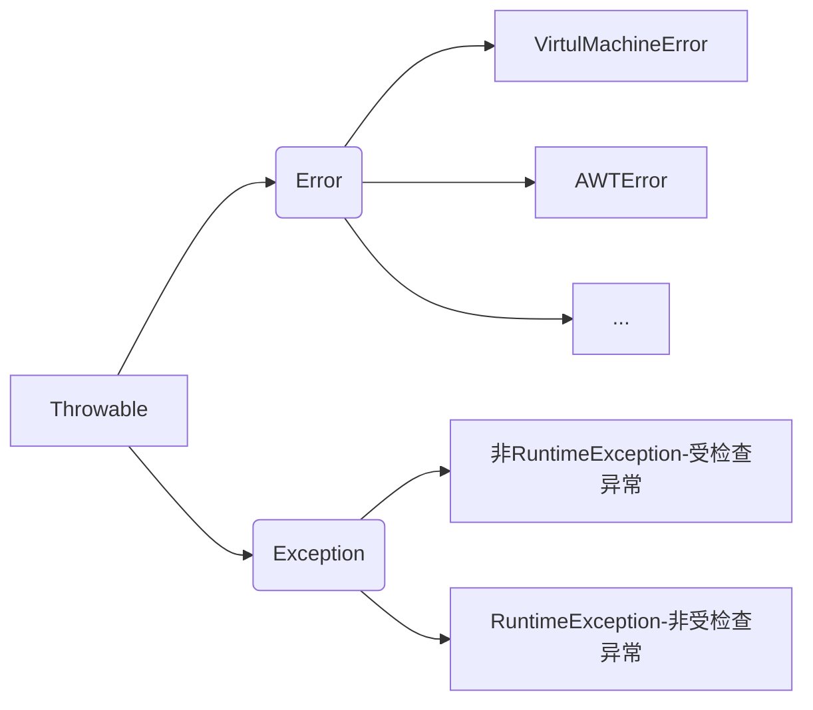
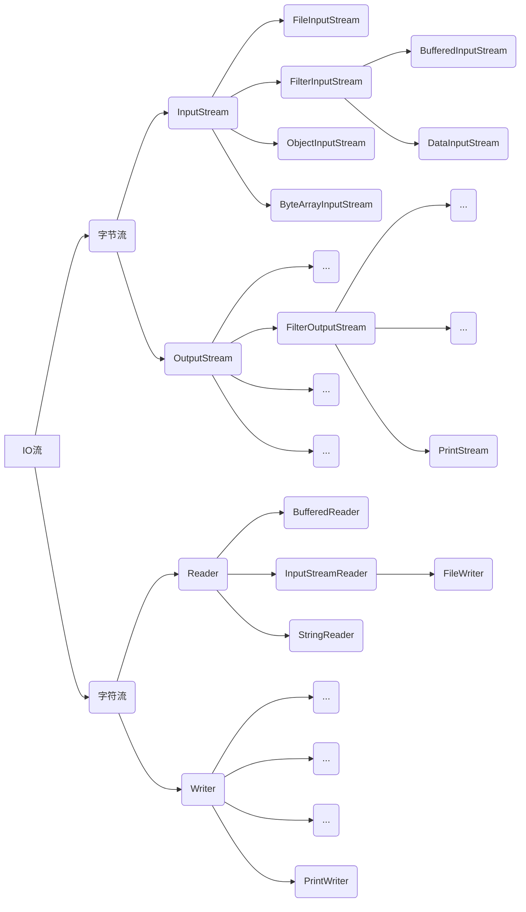
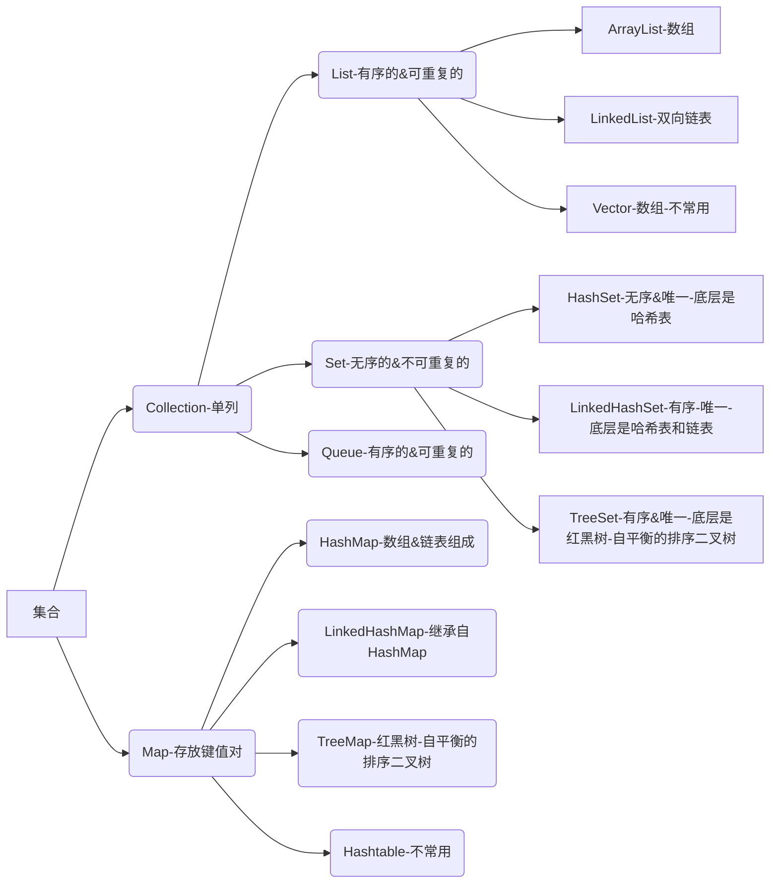

# 1. 异常类

## 1.1. 异常分类

Java把异常当作对象来处理，并定义一个基类java.lang.Throwable作为所有异常的超类




**Error（错误）**

程序本生是不能处理错误的，只能依靠外界干预。Error 是系统内部的错误，由 jvm 抛出，交给系统来处理，如 内存溢出，jvm 虚拟机自身的非正常运行

**Exception（异常）**

异常会导致程序非正常终止，可以预先检测，被捕获处理掉，使程序继续运行

| 分类                                          | 原因                                                         | 解决                                                         |
| --------------------------------------------- | ------------------------------------------------------------ | ------------------------------------------------------------ |
| 编译时异常、Checked Exception、受检查异常     | 有语法错误                                                   | 必须处理。Java 代码在编译过程中，如果受检查异常没有被 `catch`或者`throws` 关键字处理的话，就没办法通过编译 |
| 运行时异常、Unchecked Exception、非受检查异常 | 一般是由程序逻辑错误引起的。比如算术异常，空指针异常 NullPointerException | 可以不处理。Java 代码在编译过程中 ，即使不处理不受检查异常也可以正常通过编译 |

`RuntimeException` 及其子类都统称为非受检查异常

常见的受检查异常有： IO 相关的异常、`ClassNotFoundException` 、`SQLException`

常见的非受检查异常有：`NullPointerException`(空指针错误)

`IllegalArgumentException`(参数错误比如方法入参类型错误)

`NumberFormatException`（字符串转换为数字格式错误，`IllegalArgumentException`的子类）

`ArrayIndexOutOfBoundsException`（数组越界错误）

`ClassCastException`（类型转换错误）

`ArithmeticException`（算术错误）

## 1.2. Throwable

**Throwable的成员方法**

| 方法名                        | 说明                            |
| ----------------------------- | ------------------------------- |
| public String getMessage()    | 返回此throwable的详细消息字符串 |
| public String toString()      | 返回此可抛出的简短描述          |
| public void printStackTrace() | 把异常的错误信息输出在控制台    |

```java
try{
      test(1,2,5);
      System.out.println("end");
    }catch( AnswerWrongException e){
    	// 把异常的错误信息输出在控制台
        e.printStackTrace();
    }
```

## 1.3. 异常处理

异常处理程序机制：

* 抛出异常
* try-catch-finally 捕获和处理异常

```java
class Family{
    int a = 1;
    int b = 0;
}
public  class demo {
    public static void main(String[] args) {
        Family f1 = new Family();
        // try监控区
        try {
            System.out.println(f1.a / f1.b);
        }catch (ArithmeticException e){ // catch捕获异常
            System.out.println(e);
        }finally { //处理善后工作
            System.out.println("family");
        }
    }
}
```

### 1.3.1. 捕获异常

**try-catch**

程序从try中执行代码，出现异常，自动生成一个异常类对象，该异常对象将被提交给Java运行时的系统

当Java运行时系统接收到异常对象时，会到catch中去找匹配的异常类，找到后进行异常的处理

执行完毕后，程序会继续往下执行

```java
try{
    可能出现异常的程序
}catch(异常类型   异常对象){	//指定可能出现的异常类型
    异常处理的代码
}
```

如果要捕获多个异常，则异常类型 要从小到大

```java
try{
    可能出现异常的程序
}catch(Exception e1){
    异常处理的代码
}catch(Throwable e2){
    异常处理的代码
}
```

**finally语句**

可省略，不管是否会出现异常，finally都会执行，通常用于进行资源清除、关闭打开的文件等最后进行的处理

```java
try{ 
    java语句
}catch(异常类型1   异常对象1){    
    异常处理                       
}finally{ 
}
```

### 1.3.2. 抛出异常

**throw**

由程序本身主动抛出类异常对象，并对此异常进行处理

```java
throw 异常类对象 (必须为Throwable子类对象)
```

例

```java
public class work {
    public static void main(String[] args) {
        int a=5,b=0;
        try{
        	if(b==0)
        	    throw new ArithmeticException();		//
        	else
        	    System.out.println(a/b);
        }
        catch(ArithmeticException e){
        	System.out.println("除数不能为零！");
        	e.printStackTrace();   //显示异常信息
        }
    }
}
```

**throws**

写在可能出现异常的方法声明之后，throws可以列出多个可能出现的系统异常，用逗号分隔。声明该方法可能会出现异常

```java
throws 异常类名;
```

例子

```java
public class TestThrows{
	public static void main(String[] args){
		try{
			test();
		}
		catch(Exception e)
		{
			System.out.println(e.getMessage());	
		}		
	}
	static void test() throws ArithmeticException{		//
		System.out.println(6/0);
	}
}
```

**throw和throws区别**

| throws                                           | throw                              |
| ------------------------------------------------ | ---------------------------------- |
| 用在方法声明后面，跟的是异常类名                 | 用在方法体内，跟的是异常对象名     |
| 表示抛出异常，由该方法的调用者来处理             | 表示抛出异常，由方法体内的语句处理 |
| 表示出现异常的一种可能性，并不一定会发生这些异常 | 执行throw一定抛出了某种异常        |

注意

```
编译时异常必须进行处理，可用try-catch或throws，若使用throws，将来谁调用谁处理
运行时异常可以不处理，出问题后修改代码 
```

## 1.4. 自定义异常

自定义异常类只需要继承Exception类即可，并规定哪些方法产生这样异常

使用自定义的异常类创建对象，并抛出所创建的异常对象

```java
public class 异常类名 extends Exception{
    无参构造
    带参构造
}
```

例

```java
import java.util.Scanner;

class ScoreException extends Exception{
    public ScoreException(){}

    public ScoreException(String message){
        super(message);
    }
}


class Check {
    public void checkScore(int score) throws ScoreException{
        if(score<0 || score>100){
            //throw new ScoreException();
            throw new ScoreException("分数异常，分数超范围");

        }else {
            System.out.println("分数正常");
        }
    }
}

class ScanScore{
    public static void main(String[] args) {
        Scanner sc = new Scanner(System.in);
        System.out.println("请输入分数");
        int score = sc.nextInt();

        Check t = new Check();
        try {
            t.checkScore(score);
        } catch (ScoreException e) {
            e.printStackTrace();
        }
    }
}
```

# 2. 泛型

避免项目之中出现 `ClassCastException`

```
本质是将所操作的数据类型指定为一个参数

这种参数可用在类、方法、接口中，分别被称为泛型类、泛型方法、泛型接口

<类型1,类型2> ：可指定多种类型的格式，多种类型之间用逗号隔开，这里的类型可以看作是形参

调用的时候，给定的类型可以看作实参，并且实参的类型只能是引用数据类型，如果要操作基本类型必须使用相应的包装类，如果不设置泛型类型时，自动将使用Object
```

**优点**

把运行时期的问题提前到了编译期间

避免了强制类型转换

同时也避免了对象的向下转型处理（可以避免安全隐患）

## 2.1. 泛型类

```java
修饰符 class 类名<参数>{ //此处参数可以随便写为任意标识，常见如T、E、K、V等形式的参数常用于表示泛型
    
}
例
public class Demo<T>{
    private T param;
    public void show(T t){
    }
}
// 实例化时，传入具体数据类型
Demo<String> s1 = new Demo<String>();
```

## 2.2. 泛型方法

注意：如果一个类上没有定义泛型，那么也可以使用泛型方法

```java
修饰符 <参数> 返回值类型 方法名(参数 变量名){//此处参数可以随便写为任意标识，常见如T、E、K、V等形式的参数常用于表示泛型
}
例
public <T> void show(T t){}
```

例

```java
class Generic{
    public <T> void show(T t){
        System.out.println(t);
    }
}
public class test {
    public static void main(String[] args) {
        Generic g1 = new Generic();		//
        g1.show(2);
        Generic g2 = new Generic();		//
        g2.show("字符串");
    }
}
```

## 2.3. 泛型接口

直接在接口之中进行使用

```java
interface Generic<T>{
    void show(T t);
}
```

对于泛型接口的子类而言现在就有两种实现方式

方法一：在子类之中继续设置泛型定义

```java
class GenericImpl<S>implements Generic<S> {
    @Override
    public void show(S s){
        System.out.println(s);
    }
}
```

方法二：在子类实现父接口的时候直接定义出具体泛型类型

```java
class GenericImpl implements Generic<String> {
    @Override
    public void show(String s){
        System.out.println(s);
    }
}
```

## 2.4. 泛型通配符

**泛型上限**

`<?extends 类>`

```java
?extends Number: 表示该泛型类型只允许设置Number或Number的子类
```

**泛型下限**

`<?super 类>`

```java
<?super Number>：它表示的类型是Number或其父类型
```

# 3. Lambda表达式

用于表示匿名函数，Lambda表达式的格式如下

```java
(parameter1, parameter2, ...) -> { statement1; statement2; ... }
```

参数列表可以为空或包含一个或多个参数。如果有多个参数，它们必须用逗号分隔。花括号内的语句可以是一条语句或多条语句。如果只有一条语句，花括号可以省略

# 4. File类文件操作 

File类是唯一与文件本身操作（创建、删除、重命名等）有关的类

File类是Comparable接口的子类，所以File类的对象可以进行排序

如果想进行File 类的操作，必须提供完整的路径，主要通过File类的构造方法处理

## 4.1. 构造方法

以下三种方法，效果一样，推荐用第一种

| 方法名                           | 说明                                             |
| -------------------------------- | ------------------------------------------------ |
| File(String pathname)            | 创建新的File实例                                 |
| File(String parent,String child) | 从父路径名字符串和子路径名字符串创建新的File实例 |
| File(File parent,String child )  | 从父抽象路径名和子路径名字符串创建新的File实例   |

## 4.2. 创建功能

进行文件创建的时候有一个重要的前提：文件的父路径必须首先存在

| 方法名                         | 说明                              |
| ------------------------------ | --------------------------------- |
| public boolean createNewFile() | 创建新空文件。若文件存在返回false |
| public boolean mkdir()         | 创建单级目录。若目录存在返回false |
| public boolean mkdirs()        | 创建多级目录。若目录存在返回false |

## 4.3. 删除功能

| 方法名                  | 说明           |
| ----------------------- | -------------- |
| public boolean delete() | 删除文件或目录 |

注意：如果一个目录中有内容（子目录或文件），则不能直接删除该目录，需要先删除目录中的内容，才能删除该目录

## 4.4. 获取文件信息

| 方法名                          | 说明                           |
| ------------------------------- | ------------------------------ |
| renameTo(File)                  | 文件重命名                     |
| public boolean isDirectory()    | 是否为目录                     |
| public boolean isFile()         | 是否为文件                     |
| public boolean exists()         | 是否存在文件、目录             |
| public boolean canRead()        | 文件是否可读                   |
| public boolean canWrite()       | 文件是否可写                   |
| public long length()            | 获取文件长度，返回字节长度     |
| public long lastModified()      | 获取最后一次修改日期时间       |
| public String getAbsolutePath() | 获取绝对路径                   |
| public String getPath()         | 获取相对路径                   |
| public String getName()         | 获取文件或目录的名称           |
| public File getParentFile()     | 获取父路径                     |
| public File[] listFiles()       | 列出目录内容，返回File对象数组 |
| public String[] list()          | 列出目录内容，返回字符串数组   |

```java
public  class demo {
    public static void main(String[] args) throws Exception{
        	// 创建一个File实例
        File f1 = new File("d://test//test1//demo1.txt");
        //父路径是否存在
        if (!f1.getParentFile().exists()){  
            // 创建父路径
            f1.getParentFile().mkdirs();  
            //创建文件
            f1.createNewFile();     
        }
        if (f1.exists()){
            // 删除文件
            f1.delete();
        }
    }
}
```

## 4.5. 文件遍历

最好的做法就是利用递归的形式来完成

```java
public static void listDir(File file){
    // 判断是否为目录
    if (file.isDirectory()){
        File[] files = file.listFiles();
        for(int x=0;x<files.length;x++){
            //递归调用
            listDir(files[x]);  
        }
    }
    System.out.println(file);
}
```

# 5. IO流

输入：数据输入到计算机内存的过程即输入

输出：数据输出到外部存储（比如数据库，文件，远程主机）的过程即输出

常见的流：文件复制、文件上传、文件下载




## 5.1. 分类

字节处理流：OutputStream（输出字节流）、InputStream（输入字节流）

字符处理流：Writer（输出字符流）、Reduce（输入字符流）

字节流可以复制任意文件数据，字符流只能复制文本数据

## 5.2. 步骤

要读写的内容，可直接使用记事本打开，则使用字符流，否则使用字节流

下面以文件处理的流程为例：

（1）如果现在要进行的是文件的读写操作，则一定要通过 File 类找到一个文件路径；

（2）通过字节流或字符流的子类把父类对象实例化；

（3）利用字节流或字符流中的方法实现数据的输入与输出操作；

（4）流的操作属于资源操作，资源操作结束后必须进行关闭处理。

## 5.3. 编码和解码

**编码**

```
byte[] getBytes() 使用平台默认的字符集将该String编码为一系列字节，结果存储到新的字节数组中

byte[] getByte(String charsetName) 使用指定的字符集将该String编码为一系列字节，结果存储到新的字节数组中
```

例

```java
public static void main(String[] args) throws IOException {

        String s = "中国";

        byte[] bys1 = s.getBytes("GBK");
        byte[] bys2 = s.getBytes("UTF-8");

        System.out.println(Arrays.toString(bys1));
        System.out.println(Arrays.toString(bys2));
    }
```

**解码**

```
String(byte[] bytes) 使用平台默认的字符集将字节数组解码为String
String(byte[] bytes,String charsetName) 使用指定的字符集将字节数组解码为String
```

例

```java
public static void main(String[] args) throws IOException {

    String s = "中国";

    byte[] bys1 = s.getBytes("GBK");
    byte[] bys2 = s.getBytes("UTF-8");

    System.out.println(Arrays.toString(bys1));
    System.out.println(Arrays.toString(bys2));

    String ss1 = new String(bys1,"GBK");
    System.out.println(ss1);

    String ss2 = new String(bys2,"UTF-8");
    System.out.println(ss2);
}
```

# 6. 字节流（重点）

字节的数据是以 byte 类型为主实现的操作

## 6.1. OutputStream

OutputStream 类定义的是一个公共的输出操作标准

| 方法名                                                       | 功能                                     |
| ------------------------------------------------------------ | ---------------------------------------- |
| public abstract void write(int b) throws IOException         | 输出单个字节数据                         |
| public void write(byte[] b) throws IOException               | 输出一组字节数据                         |
| public void write(byte[] b, int off, int len) throws IOException | 输出部分字节数据                         |
| flush()                                                      | 刷新此输出流并强制写出所有缓冲的输出字节 |
| close()                                                      | 关闭输出流释放相关的系统资源             |

OutputStream 类是一个抽象类，而这个抽象类如果想要获得实例化对象，应该通过子类实例的向上转型完成。如果要进行文件写入操作，则可以使用 FileOutputStream 子类。

```java
public static void main(String[] args) throws Exception {
    File f1 = new File("D:\\test\\test.txt");
    // 只需要确保父目录存在，若没有创建文件，则自动帮助用户创建
    if (!f1.getParentFile().exists()){
        f1.getParentFile().mkdirs();
    }
    // 通过子类实例的向上转型完成实例化
    OutputStream output = new FileOutputStream(f1);
    String str = "www.baidu.com";
    // 将字符串变为字节数组
    output.write(str.getBytes());
    //关闭 IO
    output.close();
}
```

实现换行

```java
//Windows下
f1.write("\r\n".getBytes());
```

追加写入

```java
//增加一个Boolean类型的参数 true
OutputStream output = new FileOutputStream(f1,true);
```

自动释放IO资源

```java
// 使用try-catch结构执行，可实现自动释放IO资源
try {
    f1.write();
}catch (IOException e){
    e.printStackTrace();
}
```

`FileOutputStream` 通常也会配合 `BufferedOutputStream`（字节缓冲输出流）来使用

`ObjectOutputStream`将对象写入到输出流（`ObjectOutputStream`，序列化）

`DataOutputStream` 用于写入指定类型数据，不能单独使用，必须结合 `FileOutputStream`

## 6.2. InputStream

InputStream 类定义的是一个公共的输入操作标准

| 方法                                                         | 功能                                                         |
| ------------------------------------------------------------ | ------------------------------------------------------------ |
| read()                                                       | 读取输入流中下一个字节的数据。返回的值介于 0 到 255 之间，如果现在已经读取到底了，返回-1 |
| public int read(byte[] b) throws IOException                 | 读取一组字节数据，返回读取的字节个数，如果没有数据读取，已经读取到底了，则返回-1 |
| public int read(byte[] b, int off, int len) throws IOException | 读取一组字节数据，只截取一部分                               |
| available()                                                  | 返回输入流中可以读取的字节数                                 |
| close()                                                      | 关闭输入流，释放相关的系统资源                               |
| readAllBytes()                                               | 读取输入流中的所有字节，返回字节数组                         |
| transferTo(OutputStream out)                                 | 将所有字节从一个输入流传递到一个输出流                       |

InputStream 类是一个抽象类，而这个抽象类如果想要获得实例化对象，应该通过子类实例的向上转型完成。如果要进行文件读取操作，则一定要使用 FileInputStream 子类

```java
public static void main(String[] args) throws Exception {
    File f1 = new File("D:\\test\\test.txt");
    // 通过子类实例的向上转型完成实例化
    InputStream input = new FileInputStream(f1);
    // 开辟缓冲区
    byte[] data = new byte[1024];
    // 暂存读取的数据
    input.read(data);
    // 字节转字符串
    System.out.println(new String(data));
    //关闭 IO
    input.close();
}
```

一般不会直接单独使用 `FileInputStream` ，通常会配合 `BufferedInputStream`（字节缓冲输入流）来使用

`ObjectInputStream` 用于从输入流中读取 Java 对象（反序列化）

`DataInputStream` 用于读取指定类型数据，不能单独使用，必须结合 `FileInputStream`

# 7. 字符流（重点）

字符流 = 字节流 + 编码表

因为汉字的存储是有编码的，GBK或UTF-8等，GBK编码占2个字节，UTF-8编码占3个字节，直接使用字节流读取，会导致无法读取到完整的汉字

字符流传输的本质：缓冲区的存在，数据先写入缓冲区，然后数据在缓冲区中根据编码格式进行输出

## 7.1. Writer

| 方法名                                            | 功能                                                       |
| ------------------------------------------------- | ---------------------------------------------------------- |
| write(int b)                                      | 写入单个字符                                               |
| public void write(char[] cbuf) throws IOException | 输出字符数组                                               |
| public void write( String str) throws IOException | 输出字符串                                                 |
| append(CharSequence csq)                          | 将指定的字符序列附加到指定的 Writer对象并返回该 Writer对象 |
| flush()                                           | 刷新此输出流并强制写出所有缓冲的输出字符                   |

Writer 类是一个抽象类，而这个抽象类如果想要获得实例化对象，应该通过子类实例的向上转型完成。如果要进行文件写入操作，则可以使用 FileWriter 子类。

```java
public static void main(String[] args) throws Exception {
    File f1 = new File("D:\\test\\test.txt");
    // 通过子类实例的向上转型完成实例化
    Writer out = new FileWriter(f1);
    String str = "我是是是";
    out.write(str);
    out.close();
}
```

## 7.2. Reader

| 方法名                                          | 功能                 |
| ----------------------------------------------- | -------------------- |
| read()                                          | 从输入流读取一个字符 |
| public int read(char[] cbuf) throws IOException | 接收字符数组         |
| read(char[] cbuf, int off, int len)             | 接收一段字符数组     |

Reader 类是一个抽象类，而这个抽象类如果想要获得实例化对象，应该通过子类实例的向上转型完成。如果要进行文件读取操作，则可以使用 FileReader子类。

```java
public static void main(String[] args) throws IOException {
    File f1 = new File("D:\\test\\test.txt");
    // 通过子类实例的向上转型完成实例化
    Reader in = new FileReader(f1);
    char[] data = new char[1024];
    int len = in.read(data);
    System.out.println(new String(data));
    in.close();
}
```

# 8. 字节流与字符流区别

**字节流默认不使用缓冲区；字符流使用缓冲区**。 字节流在操作的时候本身是不会用到缓冲区的，是与文件本身直接操作的，所以字节流在操作文件时，即使不关闭资源，文件也能输出；字符流在操作的时候是使用到缓冲区的。 如果字符流不调用close或flush方法，则不会输出任何内容

# 9. 字节缓冲流

字节缓冲流采用了装饰器模式来增强 `InputStream` 和`OutputStream`子类对象的功能

## 9.1. BufferedInputStream

会先将读取到的字节存放在缓存区，并从内部缓冲区中单独读取字节。这样大幅减少了 IO 次数，提高了读取效率。

`BufferedInputStream` 内部维护了一个缓冲区，这个缓冲区实际就是一个字节数组。缓冲区的大小默认为 **8192** 字节，也可以通过 `BufferedInputStream(InputStream in, int size)` 这个构造方法来指定缓冲区的大小

## 9.2. BufferedOutputStream

类似BufferedInputStream

# 10. 字符缓冲流

## 10.1. BufferedReader

利用 BufferedReader 类可以很好的解决输入流数据的读取问题

读取一行数据: `public String readLine() throws IOException`

利用这个类实现键盘输入数据的标准化定义，实际开发中所有输入的数据全部都是字符串，方便用户验证与进行字符串的复杂处理。

```java
public static void main(String[] args) throws IOException {
    BufferedReader input = new BufferedReader(new InputStreamReader(System.in));
    System.out.println("请输入内容");
    String msg = input.readLine();
    System.out.println("所输内容为：" + msg);
}
```

## 10.2. BufferedWriter

...

# 11. 打印流

若要通过程序实现内容的输出，核心的本质一定要依靠 OutputStream 类完成，比起直接使用 OutputStream 类，使用装饰设计模式实现的 PrintWriter、 PrintStream 类的处理操作会更加的简单

## 11.1. PrintStream

```java
public static void main(String[] args) throws IOException {
    File file = new File("D:\\test\\test.txt");
    PrintStream pu = new PrintStream(new FileOutputStream(file));
    String str = "www.baidasdasd";
    pu.printf(str);
    pu.close();
}
```

## 11.2. PrintWriter

用法一样

# 12. 随机访问流

RandomAccessFile 支持随意跳转到文件的任意位置进行读写

前提：数据需要对齐存储，数据的保存位数要确定好

| 方法                                                         | 功能                |
| ------------------------------------------------------------ | ------------------- |
| 构造方法: public RandomAccessFile(File file, String mode)throws FileNotFoundException | 文件处理模式: r、rw |
| public int skipBytes(int n) throws IOException               | 向下跳              |
| public void seek(long pos) throws IOException                | 向回跳              |

`RandomAccessFile` 比较常见的一个应用就是实现大文件的 **断点续传** 。何谓断点续传？简单来说就是上传文件中途暂停或失败（比如遇到网络问题）之后，不需要重新上传，只需要上传那些未成功上传的文件分片即可。分片（先将文件切分成多个文件分片）上传是断点续传的基础

# 13. 转换流

实现字节流与字符流操作的功能转换，所谓的转换处理就是将接收到的字节流对象通过向上转型变为字符流对象

**字符流传输的本质：缓冲区的存在，数据先写入缓冲区，然后数据在缓冲区中根据编码格式进行输出**。而字节流的数据不经过缓冲区

## 13.1. InputStreamReader

```java
public static void main(String[] args) throws IOException {
    File f1 = new File("D:\\test\\test.txt");
    InputStream input = new FileInputStream(f1);
    // 字节流转字符流
    char []ss = new char[1024];
    Reader in = new InputStreamReader(input);
    in.read(ss);
    in.close();
    System.out.println(ss);
}
```

## 13.2. OutputStreamWriter

```java
public static void main(String[] args) throws IOException {
    File f1 = new File("D:\\test\\test.txt");
    // 创建字节流对象
    OutputStream output = new FileOutputStream(f1);
    // 字节流转字符流
    Writer out = new OutputStreamWriter(output);
    out.write("www.baidu.com");
    out.close();
}
```

# 14. 文件拷贝实现（重点）

应使用字节流，方便拷贝各类型文件

应使用部分拷贝，即读取一部分输出一部分数据，方便拷贝大型文件

```java
class FileUtil{
    //源文件路径
    private File srcFile;
    // 目标文件路径
    private File desFile;
    public FileUtil(){};
    public FileUtil(String srcFile,String desFile){
        this.srcFile = new File(srcFile);
        this.desFile = new File(desFile);
    }
    // 文件拷贝处理
    public boolean copy() throws IOException {
        // 源文件是否存在
        if(!this.srcFile.exists()){
            return false;
        }
        // 目标路径的父目录是否存在
        if(!this.desFile.getParentFile().exists()){
            this.desFile.getParentFile().mkdirs();
        }

        byte[] data = new byte[1024];
        InputStream input = null;
        OutputStream out = null;
        try{
            input = new FileInputStream(this.srcFile);
            out = new FileOutputStream(this.desFile);
            int len = 0;
            while ((len = input.read(data)) != -1){
                out.write(data,0,len);
            }
        }catch (Exception e){
            System.out.println(e);
        }finally {
            if(input != null) {
                input.close();
            }
            if (out != null){
                out.close();
            }
        }
        return true;
    }
}
```

# 15. 内存流*

需要实现 IO 操作，可是又不希望产生文件（相当于临时文件）则以内存为终端进行处理。

ByteArrayInputStream、ByteArrayOutputStream 分别是InputStream、OutputStream 的子类，如果要进行内存流操作，则应该通过子类实例的向上转型完成

## 15.1. ByteArrayInputStream

| 方法名                                           | 功能 |
| ------------------------------------------------ | ---- |
| 构造方法 public ByteArrayInputStream(byte[] buf) |      |

## 15.2. ByteArrayOutputStream

| 方法名                                  | 功能                           |
| --------------------------------------- | ------------------------------ |
| 构造方法 public ByteArrayOutputStream() |                                |
| public byte[] toByteArray()             | 获取内存数据                   |
| public String toString()                | 使用字符串的形式来获取内存数据 |

```java
public static void main(String[] args) throws IOException {
    String str = "www.baidu.com";
    InputStream input = new ByteArrayInputStream(str.getBytes());
    OutputStream out = new ByteArrayOutputStream();
    int data = 0;
    while ((data = input.read()) != -1){
        out.write(Character.toUpperCase(data));
    }
    System.out.println(out);
}
```

# 16. 管道流*

实现两个线程之间的 IO 处理操作，一个只负责发送，一个负责接收，中间靠一个管道连接

## 16.1. 字节管道流

```
PipedOutputStream、PipedInputStream

连接处理：public void connect(PipedInputStream snk)throws IOException
```

## 16.2. 字符管道流

```
PipedWriter、PipedReader

连接处理：public void connect(PipedReader snk)throws IOException
```

# 17. System类的IO

这个系统类之中提供有三个常量：

标准输出(显示器)：`public static final PrintStream out`

错误输出：` public static final PrintStream err;`

标准输入(键盘)：`public static final InputStream in。`

System.out 和 System.err 都是同一种类型的，如果现在使用的是 IDEA，则在使用System.err 输出的时使用红色字体，而 System.out 会使用黑色字体。

System.in 一般不直接用来接收键盘输入

# 18. Scanner扫描流（重点）

BufferedReader的代替品

| 方法                                         | 功能                             |
| -------------------------------------------- | -------------------------------- |
| 构造方法 public Scanner (InputStream source) |                                  |
| public Scanner useDelimiter(String pattern)  | 设置分隔符，即遇到什么符号时换行 |
| public String next()                         | 取出数据                         |
| public boolean hasNext()                     | 判断是否有数据                   |

**使用 Scanner 实现键盘数据输入**

```java
public static void main(String[] args) throws IOException {
    Scanner scan = new Scanner(System.in);
    System.out.println("请输入年龄：");
    if (scan.hasNextInt()){
        int age = scan.nextInt();
        System.out.println("年龄是:" + age);
    }
    scan.close();
}
```

**使用 Scanner 读取数据**

```java
public static void main(String[] args) throws IOException {
    Scanner scan = new Scanner(new File("D:\\test\\test.txt"));
    scan.useDelimiter("\n");
    while(scan.hasNext()){
        System.out.println(scan.next());
    }
    scan.close();
}
```

# 19. 对象序列化

对象序列化：就是将对象保存到磁盘中，或者在网络中传输对象

对象本来存在于堆内存，将对象保存到磁盘中，就是实现了对象序列化

使用一个字节序列表示一个对象，该字节序列包含：对象的类型、对象的数据和对象中存储的属性等信息，字节序列写到文件之后，相当于文件中持久保存了一个对象的信息

反之，该字节序列还可以从文件中读取回来，重构对象，对它进行反序列化

在 Java 中有一个强制性的要求：如果要序列化对象，那么该对象所在的类必须实现 java.io.Serializable 父接口，作为序列化的标记。这个接口描述的是一种类的能力。Serializable是一个标记接口，实现该接口，不需要重写任何方法

```java
// 实现 Serializable 父接口
class Family implements Serializable{ 
    private int age;
    private String name;
    public Family(int age,String name){
        this.age = age;
        this.name = name;
    }
}
```

| 类名称   | 序列化 ObjectOutputStream                                    | 反序列化 ObjectInputStream                                   |
| -------- | ------------------------------------------------------------ | ------------------------------------------------------------ |
| 构造方法 | public`` ``ObjectOutputStream(OutputStream out) throws IOException | public`` ``ObjectInputStream(InputStream in) throws IOException |
| 操作方法 | public final void writeObject(Object obji) throws IOException | public final Object readObject() throws IOException          |

```java
// 序列化
public static void saveObject(Object obj) throws Exception {
    ObjectOutputStream oos = new ObjectOutputStream(new FileOutputStream("D:\\test\\class.family"));
    oos.writeObject(obj);
    oos.close();
}
// 反序列化
public static Object loadObject() throws Exception{
    ObjectInputStream ois = new ObjectInputStream(new FileInputStream("D:\\test\\class.family"));
    Object obj = ois.readObject();
    ois.close();
    return obj;
}
```

**transient关键字**

假设类之中有一些是需要计算保存的属性内容往往是不需要被数列化的，这个时候就可以使用 transient


# 20. 文件上传的实现（重点）

前端form表单，必须是`multipart/form-data`

```html
<form id="form" th:action="@{/seller/goods}" th:method="post" enctype="multipart/form-data">
```

后端Java

```java
public class Upload {
    // 封装调用
    public static String picture(MultipartFile photo) throws IOException{
        //获取文件名
        System.out.println("fileName:\t" + photo.getOriginalFilename());
        //取文件类型
        System.out.println("fileType:\t" + photo.getContentType());
        //获取当前工程路径
        String path = System.getProperty("user.dir") + "\\upload\\";

        return saveFile(photo,path);
    }
    //保存上传文件至服务器
    public static String saveFile(MultipartFile photo, String path) throws IOException {
        File files = new File(path);
        if (files.exists()){
            System.out.println("文件夹已创建");
        }else {
            files.mkdirs();
            System.out.println("文件夹创建成功");
        }
        String filePath = path + photo.getOriginalFilename();
        File file = new File(path);
        photo.transferTo(file);
        System.out.println("filePath:\t" + filePath);
        return filePath;
    }
}
```

# 21. IO流总结

在以后的开发过程中，如果程序需要输出数据一定使用打印流，输入数据一定使用Scanner扫描流
# 22. 集合

一种存储空间可变的存储模型

**和数组的区别**

数组长度固定，集合长度不固定

数组中只能存储相同类型的数据，而集合可以存储不同类型的数据，前提是它们都是Object类型的

数组可以通过索引直接访问元素，而集合需要通过迭代器或者foreach语句来访问元素

数组是基于连续内存分配的，所以在创建时必须指定大小，而集合则是基于动态内存分配的，可以根据需要自动调整大小

数组是基于连续内存分配的，所以访问数组元素的效率比访问集合元素的效率高。但是集合具有更高的灵活性和可扩展性

**无序性**是指存储的数据在底层数组中并非按照数组索引的顺序添加 ，而是根据数据的哈希值决定的

**不可重复性**是指添加的元素按照 `equals()` 判断时 ，返回 false，需要同时重写 `equals()` 方法和 `hashCode()` 方法




# 23. Collection

是单列集合的顶层接口

| 方法                                              | 功能                                   |
| ------------------------------------------------- | -------------------------------------- |
| public boolean add(E e)                           | 向集合添加元素                         |
| `public boolean addAll(Collection<?extends E> c)` | 向集合追加一组数据                     |
| public boolean remove(Object o)                   | 删除指定元素，需要equals方法支持       |
| public void clear()                               | 清空集合，让根节点为空，同时执行GC操作 |
| public boolean contains(Object o)                 | 判断集合中是否存在指定的元素           |
| public boolean isEmpty()                          | 判断集合是否为空                       |
| public int size()                                 | 获取集合长度                           |
| public Object[] toArray()                         | 将集合变为对象数组返回                 |
| `public Iterator<E> iterator()`                   | 将集合变为Iterator 接口                |

集合操作有两个方法最为常用： add ()、 iterator()

## 23.1. List

有序：插入的顺序就是其存储顺序

其最大的特点是**允许保存重复元素数据**

用户可以**通过索引来增删改查元素**

**List扩充的方法**

| 特有方法                               | 说明                     |
| -------------------------------------- | ------------------------ |
| `public ListIterator<E>listIterator()` | 返回ListIterator接口对象 |
| public E set(int index,E element)      | 修改数据                 |
| public E get(int index)                | 查找数据                 |

List 本身依然属于一个接口，对于接口要想使用则一定要使用子类来完成定义，在 List 子接口中有三个常用子类： ArrayList、Vector、 LinkedList，其中ArrayList使用频率最高

```java
List<String> c = new ArrayList<String>();
```

### 23.1.1. ArrayList（重点）

应用场景：当需要一个基于数组的动态列表，**支持随机访问**和快速的插入/删除操作时

线程是否安全：线程不安全

是否允许重复：可重复的

是否有序：有序的（元素按照插入的顺序存储在数组中）

底层的数据结构：数组

自身数据结构：对象数组

```java
List<String> array = new ArrayList<String>();
```

**方法**

| 构造方法                              | 说明                 |
| ------------------------------------- | -------------------- |
| public ArrayList()                    | 开辟大小为 10 的数组 |
| public ArrayList(int initialCapacity) | 开辟指定大小的数组   |

**ArrayList 的扩容机制（重点）**

`ArrayList` 的底层是数组队列，相当于动态数组。与 Java 中的数组相比，它的容量能动态增长。在添加大量元素前，应用程序可以使用`ensureCapacity`操作来增加 `ArrayList` 实例的容量，`ensureCapacity`方法会创建一个新的数组，并将原始数组中的元素复制到新数组中

以无参数构造方法创建 `ArrayList` 时，实际上初始化赋值的是一个空数组。当真正对数组进行添加元素操作时，才真正分配容量。即向数组中添加第一个元素时，数组容量扩为 10。用`add()`添加元素时调用`ensureCapacityInternal()`，该方法中判断是否大于10，若元素数量大于10，则进入 `grow()`进行扩容，**ArrayList 每次扩容之后容量都会变为原来的 1.5 倍左右（源码：int newCapacity = oldCapacity + (oldCapacity >> 1)）**。有可能会造成垃圾的产生以及性能的下降

所以在使用ArrayList子类的时候一定要估算出你的数据量会有多少，如果超过了 10  个，那么使用有参构造方法进行创建，以避免垃圾数组的产生

**ArrayList保存自定义类对象**

在使用 List 保存自定义类对象的时候如果需要使用到 contains 、remove 方法进行查询与删除处理时候，一定要保证自定义类之中已经成功的重写了 equals 方法。

```java
class Family{
    private int age;
    private String name;
    public Family(int age,String name){
        this.age = age;
        this.name = name;
    }
    @Override
    // 重写equals方法
    public boolean equals(Object obj){
        if (this == obj){
            return true;
        }
        if (obj == null){
            return false;
        }
        if (!(obj instanceof Family)){
        return false;
        }
        Family fam = (Family) obj;
        return this.name.equals(fam.name) && this.age == fam.age;
    }
}
public class demo {
    public static void main(String[] args) throws Exception {
        List<Family> array = new ArrayList<Family>();
        array.add(new Family(10,"一"));
        array.add(new Family(12,"二"));
        array.add(new Family(15,"三"));
        // 不重写equals方法，这里删不掉
        array.remove(new Family(10,"一"));
        array.forEach(System.out::println);
    }
}
```

### 23.1.2. LinkedList

应用场景：当需要一个基于链表的动态列表，支持**高效的添加/删除操作**和迭代操作时

线程是否安全：线程不安全

是否允许重复：可重复的

是否有序：有序的（元素按照添加的顺序存储在链表中）

底层的数据结构：链表

自身数据结构：双向链表

```java
List<String> LinkList = new LinkedList<String>();
```

**方法**

| 方法名                           | 说明                                                         |
| -------------------------------- | ------------------------------------------------------------ |
| 无参构造方法 public LinkedList() | 创建空的list集合                                             |
| public boolean add(E e)          | 编写自定义链表的时候，是判断了传入数据是否为null，如果为null则不进行保存，但是在LinkedList里面并没有做这样的处理，而是所有的数据都可以保存，而后此方法调用了linkLast()方法 |

### 23.1.3. Vector*

继承结构与 ArrayList 是相同的，其实现操作与 ArrayList 是相同的

Vector类之中的操作方法采用的都是 synchronized 同步处理，是线程安全的，但是性能不如 ArrayList高

## 23.2. Set

不包含重复元素、无序

没有带索引的方法，所以不能使用for循环遍历，但**可使用增强for遍历**

Set 集合的常规使用形式一定是依靠子类进行实例化的，所以 Set 接口之中有两个常用子类：HashSet、TreeSet。其中HashSet 使用最多

```java
class work{
    public static void main(String[] args) {
        Set<String> ss = new HashSet<String>();
        ss.add("asd");
        System.out.println(ss.size());
        for (String s:ss){
            System.out.println(s);
        }
    }
}
```

### 23.2.1. HashSet

应用场景：当需要一个无序的集合，其中没有重复元素，并且不需要维护元素的顺序时，**常用于去重和集合运算（即求交、并、补集）**

线程是否安全：线程不安全

是否允许重复：不可重复的

是否有序：无序的（hashCode计算得到保存地址）

底层的数据结构：哈希表

自身数据结构：哈希表

```java
Set<String> hs = new HashSet<String>();
```

**hashCode**

属于Object类的方法，hashCode就是通过hash函数计算出的 int 类型的数值

hashCode确定了对象在hash表中的位置

```java
public int hashCode()
```

### 23.2.2. TreeSet（重点）

应用场景：当需要一个有序的集合，并且需要对元素进行自然排序或指定的比较器进行排序时（如 多线程异步查询数据，最后要保证数据结果的有序性，可使用TreeSet存储）

线程是否安全：线程不安全

是否允许重复：不可重复的

是否有序：有序的（可实现自定义排序）

底层的数据结构：红黑树

自身数据结构：红黑树

```java
Set<String> ts = new TreeSet<String>();
```

### 23.2.3. LinkedHashSet

应用场景：当需要一个有序的集合，可以提供快速的插入、删除和查找元素操作，并且保证元素的有序性，元素的插入和取出顺序满足 FIFO（可利用该数据结构实现一个队列）

线程是否安全：线程不安全

是否允许重复：不可重复的

是否有序：有序的（元素的顺序是插入顺序）

底层的数据结构：哈希表和链表

自身数据结构：哈希表和双向链表（哈希表用于快速查找元素，双向链表用于维护插入顺序）


### 23.2.4. 比较 HashSet&LinkedHashSet&TreeSet

- `HashSet`、`LinkedHashSet` 和 `TreeSet` 都是 `Set` 接口的实现类，都能保证元素唯一，并且都不是线程安全的
- `HashSet`、`LinkedHashSet` 和 `TreeSet` 的主要区别在于底层数据结构不同。`HashSet` 的底层数据结构是哈希表（基于 `HashMap` 实现）`LinkedHashSet` 的底层数据结构是链表和哈希表，元素的插入和取出顺序满足 FIFO。`TreeSet` 底层数据结构是红黑树，元素是有序的，排序的方式有自然排序和定制排序
- 底层数据结构不同又导致这三者的应用场景不同。`HashSet` 用于不需要保证元素插入和取出顺序的场景，`LinkedHashSet` 用于保证元素的插入和取出顺序满足 FIFO 的场景，`TreeSet` 用于支持对元素自定义排序规则的场景

### 23.2.5. 排序的实现（重点）

一般我们需要对一个集合使用自定义排序时，我们就要重写`comparable`接口的`compareTo()`方法或利用比较器`comparator`接口的`compare()`方法

**自然顺序（Comparable）**
TreeSet类的add()方法中会把存入的对象提升为Comparable类型
调用对象的compareTo()方法和集合中的对象比较（比较字符串对象时比较的是Unicode）
根据compareTo()方法返回的结果进行存储

**比较器顺序（Comparator）**
创建TreeSet的时候可以制定 一个Comparator
如果传入了Comparator的子类对象，那么TreeSet就会按照比较器中的顺序排序
add()方法内部会自动调用Comparator接口中compare()方法排序
调用的对象是compare方法的第一个参数，集合中的对象是compare方法的第二个参数

**两种方式的区别**
TreeSet构造函数什么都不传，默认按照类中Comparable的顺序（没有就报错ClassCastException）
TreeSet如果传入Comparator，就优先按照Comparator

**选用**
Comparable 让元素本身具有比较性，当元素本身不具有比较性时，就在TreeSe t建立实例的时候，传入Comparator接口，让容器自身具有比较性

TreeSet 自然排序的过程，即比较自定义对象的过程，需要自定义类实现comparable接口，重写comparaTo() 方法
```java
public class Person implements Comparable<Person> {
    private String name;
    private int age;
    ...
    public int compareTo(Person o) {
        return 0;                //当compareTo方法返回0的时候集合中只有一个元素
        return 1;                //当compareTo方法返回正数的时候集合会怎么存就怎么取
        return -1;                //当compareTo方法返回负数的时候集合会倒序存储
    }
}
```
comparaTo() 方法返回值的含义
```java
return 0:元素每次进行比较，都认为是相同的元素，所以不再向TreeSet里面插入除第一个元素以外的元素，即 TreeSet中就只插入了一个元素。

return 正数:元素每次进行比较，都认为新插入的元素比上一个元素大，于是二叉树存储时，会储存在根的右侧，读取时就是正序排列，先进先出。

return 负数:元素每次进行比较，都认为新插入的元素比上一个元素小，于是二叉树存储时，会储存在根的左侧，读取时就是倒序排列，先进后出
```
在使用自定义类对象进行比较处理的时候，一定要将该类之中的所有属性都依次进行大小关系的匹配，否则如果某一个或某几个属性相同的时候它也会认为是重复数据

```java
class student implements Comparable<student> {
    private int age;
    private String name;
    student(){}
    student(String name,int age){
        this.age = age;
        this.name = name;
    }
    String getName(){
        return name;
    }
    int getAge(){
        return age;
    }
    public int compareTo(student s){		//按照年龄排序
        int num = this.age - s.age;
        return num;
    }
}

class work{
    public static void main(String[] args) {
     TreeSet<student> ts = new TreeSet<student>();


     student s1 = new student("xixi",50);
     student s2 = new student("zhao",12);
     student s3 = new student("dalao",60);

     ts.add(s1);
     ts.add(s2);
     ts.add(s3);

     for (student s:ts){
         System.out.println("name:" + s.getName() + "age:" + s.getAge());
        }
    }
}
```

### 23.2.6. 消除重复的原理（重点）

**TreeSet** 

利用了 Comparable 接口来实现了重复元素的判断，插入元素时调用 compareTo() 来判断重复元素

**HashSet**

`HashSet` 会先计算对象的`hashcode`值来判断对象加入的位置，同时也会与其他加入的对象的 `hashcode` 值作比较，如果没有相符的 `hashcode`，`HashSet` 会假设对象没有重复出现。但是如果发现有相同 `hashcode` 值的对象，这时会调用`equals()`方法来检查 `hashcode` 相等的对象是否真的相同。如果两者相同，`HashSet` 就不会让加入操作成功

**总结**

在 Java 程序之中真正的重复元素的判断处理利用的就是 hashCode() 与 equals() 两个方法共同作用完成的，而只有在排序要求情况下 TreeSet 才会利用Comparable 接口来实现。

## 23.3. Collection 集合的遍历

一共有四种输出迭代输出形式：Iterator迭代输出、ListIterator 双向迭代输出、Enumeration 枚举输出、for-each 输出，其中Iterator迭代输出使用最多

### 23.3.1. Iterator（重要）

只允许由前向后实现输出

获取Iterator接口对象

````java
public Iterator<T>iterator()
````

| 方法                         | 功能           |
| ---------------------------- | -------------- |
| public boolean hasNext()     | 判断是否有数据 |
| public E next()              | 取出当前数据   |
| public default void remove() | 删除           |

```java
public static void main(String[] args) throws Exception {
    List<String> all = new ArrayList<String>();
    all.add("ss");
    all.add("zz");
    all.add("asdasd");
    // 实例化Iterator接口
    Iterator<String> iter = all.iterator();
    while (iter.hasNext()){
        String str = iter.next();
        System.out.println(str);
    }
}
```

**Collection.remove() 与 Iterator.remove() 的区别**

在进行迭代输出的时候如果使用了 Collection.remove() 则会造成并发更新异常，导致程序删除出错，而此时只能使用 Iterator.remove() 方法实现正常的删除处理。

### 23.3.2. ListIterator

进行双向迭代处理，必须依靠 Iterator 的子接口：ListIterator  接口来实现

ListIterator 输出接口是专门为 List 集合准备的

```java
List<String> all = new ArrayList<String>();
all.add("ss");
// 实例化ListIterator接口
ListIterator<String> iter = all.listIterator();
```


| 方法                         | 功能                 |
| :--------------------------- | -------------------- |
| public boolean hasPrevious() | 判断是否有前一个元素 |
| public E previous()          | 获取当前元素         |

如果要想实现由后向前的遍历，那么首先要实现的是由前向后实现遍历处理

```java
public static void main(String[] args) throws Exception {
    List<String> all = new ArrayList<String>();
    all.add("ss");
    all.add("asdasd");
    // 实例化ListIterator 接口
    ListIterator<String> iter = all.listIterator();
    // 先实现由前向后的遍历
    while (iter.hasNext()){
        String str = iter.next();
        System.out.println(str);
    }
    // 再实现由后向前的遍历
    while (iter.hasPrevious()){
        String str = iter.previous();
        System.out.println(str);
    }
}
```

### 23.3.3. Enumeration*

Enumeration 只为Vector  一个类服务，如果要想获取 Enumeration 接口对象，就必须依靠 Vector 类提供的方法

获取Enumeration

```java
public Enumeration<E> elements()
```

| 方法                             | 功能                 |
| -------------------------------- | -------------------- |
| public boolean hasMoreElements() | 判断是否有下一个元素 |
| public E nextElement()           | 获取当前元素         |

### 23.3.4. for-each

加强型 for 循环

```java
public static void main(String[] args) throws Exception {
    List<String> all = new ArrayList<String>();
    all.add("ss");
    all.add("zz");
    all.add("asdasd");
    for (String str : all){
        System.out.println(str);
    }
}
```

## 23.4. Collection常见操作
### 23.4.1. Collection集合判空

使用 `isEmpty()` 方法，而不是 `size()==0` 的方式

### 23.4.2. Collection集合转 Map

在使用 `java.util.stream.Collectors` 类的 `toMap()` 方法转为 `Map` 集合时，一定要注意当 value 为 null 时会抛 NPE 异常

### 23.4.3. Collection集合转数组

使用集合的 `toArray(T[] array)`，传入的是类型完全一致、长度为 0 的空数组

### 23.4.4. 数组转Collection集合

通过`Arrays.asList()` 方法转换，该方法返回的并不是 `java.util.ArrayList` ，而是 `java.util.Arrays` 的一个内部类，这个内部类并没有实现集合的修改方法或者说并没有重写这些方法，所以**使用集合的修改方法: `add()`、`remove()`、`clear()`会抛出异常**

用 Java8 的 `Stream`实现转换（推荐）

```java
Integer [] myArray = { 1, 2, 3 };
List myList = Arrays.stream(myArray).collect(Collectors.toList());
//基本类型也可以实现转换（依赖boxed的装箱操作）
int [] myArray2 = { 1, 2, 3 };
List myList = Arrays.stream(myArray2).boxed().collect(Collectors.toList());
```

## 23.5. Collections 工具类（不重要）

### 23.5.1. Stack*

栈是Vector的一个子类，但是它使用的并不是 Vector 类所提供的方法

它实现了一个标准的后进先出的栈

```java
Stack<Integer> st = new Stack<Integer>();
```

**方法**

| 方法名                             | 说明                                             |
| :--------------------------------- | :----------------------------------------------- |
| public boolean empty()             | 测试堆栈是否为空                                 |
| public Object peek( )              | 查看堆栈顶部的对象，但不从堆栈中移除它。         |
| public Object pop( )               | 移除堆栈顶部的对象，并作为此函数的值返回该对象。 |
| public Object push(Object element) | 把项压入堆栈顶部。                               |
| public int search(Object element)  | 返回对象在堆栈中的位置，以 1 为基数。            |

### 23.5.2. Queue

队列实现可以使用 LinkedList 的子类来完成

```java
Queue<String> queue = new LinkedList<String>()
```

队列的主要依靠 Queue 接口之中提供的方法来处理

| 方法                      | 功能             |
| ------------------------- | ---------------- |
| public boolean offer(E e) | 队列之中追加数据 |
| public E poll()           | 弹出后删除数据   |

**PriortyQueue 优先级队列的实现**

有比较功能

```java
Queue<String> queue = new PriorityQueue<String>()	
```

### 23.5.3. Properties

此类是 Hashtable 的子类

能操作的类型只能是 String 类型

Properties 往往用于读取配置资源的信息

```Java
Properties prop = new Properties()
```

**方法**

| 方法                                        | 功能                                      |
| ------------------------------------------- | ----------------------------------------- |
| setProperty(String key, String value)       | 设置属性                                  |
| getProperty(String key,String defaultValue) | 取得属性，如果没有指定的 key 则返回默认值 |
| list(PrintStream out)                       | 获得属性列表                              |

Properties 类还有一个最重要的功能是它可以通过输出流输出属性，也可以使用输入流读取属性内容，而 Map 没有。

### 23.5.4. Collections

是 Java 提供的一组集合数据的操作工具类，利用它可以实现各个集合的操作

可操作 Collection，可追加操作 List、Set、Queue、Map

| 方法           | 功能                       |
| -------------- | -------------------------- |
| reverse()      | 数据的反转                 |
| binarySearch() | 使用二分查找，要先进行排序 |
| addAll()       | 追加数据                   |
| sort()         | 排序                       |

**Collection 与 Collections 的区别**

Collection  是集合接口，允许保存单值对象。

Collections 是集合操作的工具类。
# 24. Map

在开发中：Collection 集合保存数据的目的是为了输出，Map 集合保存数据的目的是为了进行 key 的查找。

Map 的核心意义在于通过key 获取对应的 value

每个键对应一个值，当键重复时，键的值会被覆盖

**Map接口的定义**

```java
public interface Map<K,V>  // K为键的类型，V为值的类型
```

**方法**

| 常用方法                                     | 说明                                                         |
| -------------------------------------------- | ------------------------------------------------------------ |
| `public V put(K key,V value)`                | 添加元素，当键重复的时候该方法会返回旧的数据内容。默认返回null |
| `public V get(Object key)`                   | 根据Key查询数据                                              |
| `public Set<Map.Entry<K,V>> entrySet()`      | 将Map集合转为Set集合                                         |
| `public V remove(Object key)`                | 根据键删除键值元素                                           |
| `public void clear()`                        | 移除所有键值对元素                                           |
| `public boolean containsKey(Object key)`     | 判断集合是否包含指定的键                                     |
| `public boolean containsValue(Object value)` | 判断集合是否包含指定的值                                     |
| `public boolean isEmpty()`                   | 判断集合是否为空                                             |
| `public int size()`                          | 集合的长度                                                   |
| `public Set<K> keySet()`                     | 返回Map 中所有键的 Set 集合                                  |

开发之中需要通过 Map 集合的子类来进行接口对象的实例化，而常用的子类：HashMap、Hashtable、TreeMap、LinkedHashMap 。其中HashMap使用频率最高

## 24.1. HashMap

应用场景：当需要一个无序的映射，其中键和值都可以为null，并且不需要维护映射的顺序时，**HashMap适用于存储键值对，常用于缓存、索引和快速查找**

线程是否安全：线程不安全

是否允许重复：不可重复的（key是唯一的，用来索引到底层数组中的对应value）

是否有序：无序的

底层的数据结构：哈希表

自身数据结构：哈希表

HashMap使用一个哈希函数将key转换为一个数组索引，哈希函数应该是一致性的，即对于相同的key总是返回相同的索引

HashMap使用链表法来解决哈希冲突，即在相同索引的位置上维护一个链表，将哈希到该位置的所有键值对都添加到链表中

HashMap的性能取决于哈希函数的质量和插入、查找时哈希冲突的数量

```java
Map<String,String> map = new HashMap<String,String>();
```

### 24.1.1. put方法的返回值

```java
Map<String,String> map = new HashMap<String,String>();    
System.out.println(map.put("ggg",3));// 键没重复，返回null
System.out.println(map.put("ggg",4));// 键重复，返回旧的数据
```

### 24.1.2. HashMap 的扩容原理（重点）

在 HashMap 类里面提供有一个 `DEFAULT_INITIAL_CAPACITY` 常量，作为初始化的容量配置，这个常量的默认大小为 16 个元素

当保存的内容的容量超过了`阈值（DEFAULT_LOAD_FACTOR = 0.75f)`， 相当于`容量*阈值=12`的时候就会进行容量的扩充

在进行扩充的时候HashMap 采用的是成倍的扩充模式，即每一次都扩充2倍容量

### 24.1.3. HashMap 的工作原理

从JDK 1.8开始，HashMap的实现出现了改变，HashMap内部类提供有一个重要的常量`static final int TREEIFY_THRESHOLD = 8`，当链表长度小于阈值（默认为 8）时，则使用链表形式存储，若超过，则将链表转为红黑树，保证数据的查询性能

### 24.1.4. HashSet和HashMap区别（重点）

都是基于哈希表实现的

存储方式不同：HashSet存储无序的唯一元素，HashMap存储键值对

元素查找方式不同：HashSet通过哈希值快速定位元素，HashMap先根据键的哈希值找到对应的桶（Bucket），然后再在桶中查找元素

应用场景不同：HashSet常用于去重和集合运算。HashMap常用于缓存、索引和快速查找

**什么是Bucket**

在哈希表中，Bucket（桶）是用来存储元素的容器，通常是一个数组或链表。每个Bucket都有一个唯一的索引或标识符，用于快速定位元素。具体地说，Bucket的作用是将元素根据它们的哈希值分组并存储在不同的位置上，以便在查找元素时能够更快地定位它们。

在Java中，HashMap和HashSet都是基于哈希表实现的集合类，它们内部都使用了Bucket来存储元素。对于HashMap，每个Bucket存储一个键值对，而对于HashSet，每个Bucket存储一个元素。当需要查找元素时，先根据元素的哈希值找到对应的Bucket，然后在Bucket中查找元素。

Bucket的数量通常与哈希表的容量相等，因此在创建哈希表时需要指定初始容量。如果Bucket的数量过少，可能会导致哈希冲突，影响查找效率；如果Bucket的数量过多，可能会浪费内存空间。因此，在使用哈希表时，需要根据实际需求选择合适的容量和负载因子（load factor）。

### 24.1.5. Hash 冲突

HashMap 进行数据操作的时候出现了 Hash  冲突，当出现了 Hash  冲突之后为了保证程序的正常执行，会在冲突的位置上将所有 Hash 冲突的内容转为链表保存
## 24.2. LinkedHashMap

应用场景：当需要一个有序的映射，并且需要维护键值对插入的顺序时

线程是否安全：线程不安全

是否允许重复：不可重复的

是否有序：有序的（数据的保存顺序为添加时的顺序）

底层的数据结构：链表

自身数据结构：双向链表

当一个新元素被插入到LinkedHashMap中时，它会被添加到链表尾部，表示它是最新插入的元素。当访问一个已经存在的元素时，LinkedHashMap会将该元素移动到链表的尾部，表示它是最近访问的元素。因此，LinkedHashMap可以按照插入顺序或者访问顺序来遍历元素

```java
Map<String,Integer> map = new LinkedHashMap<String,Integer>();
```

## 24.3. TreeMap

应用场景：当需要一个有序的映射，并且需要对键进行自然排序或指定的比较器进行排序时

线程是否安全：线程不安全

是否允许重复：不可重复的（key是唯一的，用来索引到底层数组中的对应value）

是否有序：有序的

底层的数据结构：红黑树

自身数据结构：红黑树

## 24.4. Hashtable*

进行数据存储的时候设置的 kev 或 value 都不允许为 null，否则会出现 NullPointerException 异常。

## 24.5. HashMap和Hashtable 区别

HashMap中的方法都属于异步操作（非线程安全），HashMap中允许保存有null数据

Hashtable中的方法都属于同步方法（线程安全），Hashtable中不允许保存null数据

## 24.6. HashMap 和 TreeMap 区别

相比于`HashMap`来说 `TreeMap` 主要多了对集合中的元素根据键排序的能力以及对集合内元素的搜索的能力

## 24.7. HashMap 多线程操作导致死循环问题

不建议在多线程下使用 HashMap，因为多线程下使用 HashMap 还是会存在其他问题比如数据丢失。并发环境下推荐使用 ConcurrentHashMap

**ConcurrentHashMap**

是Java中的一个线程安全的哈希表实现。它是HashMap 的一个并发版本，支持高并发的读写操作。与HashMap 不同的是ConcurrentHashMap 的读操作不需要加锁，因此可以实现高并发的读操作。同时，ConcurrentHashMap 的写操作也是线程安全的，可以保证数据的一致性

## 24.8. Map集合的遍历（重点）

Map的entrySet()方法返回一个实现Map.Entry接口的对象集合Set。集合中每个对象都是Map中一个特定的键值对。可以通过这个集合的迭代器，遍历获得每一个条目的键或值并对值进行更改。

Map.Entry接口中的常用方法如下：

- Object getKey()：返回条目的关键字　
- Object getValue()：返回条目的值
- Object setValue(Object value)：将相关映像中的值改为value，并且返回旧值。

```java
Map<String,String> params = new HashMap<>();
for (Map.Entry<String, String> entry : params.entrySet()) {  
	System.out.println(entry);;  
}
```

## 24.9. 自定义Map

**自定义Map的key类型**

自定义 Key 类型的那个类中一定要重写 hashCode()  与 equals() 方法，否则无法查找到。

**自定义Map的value类型**

```java
Map<String, Object> map = new HashMap<String, Object>();
```

在`map.get` 的时候会遇到类型不同的问题，Object不是所有类的基类么？

虽然Object是所有类的基类，但在使用`Map<String, Object>`时，获取值时返回的是Object类型的引用，需要进行类型转换才能使用具体类型的方法和属性。注意在进行类型转换时要确保类型的正确性，以避免ClassCastException异常。