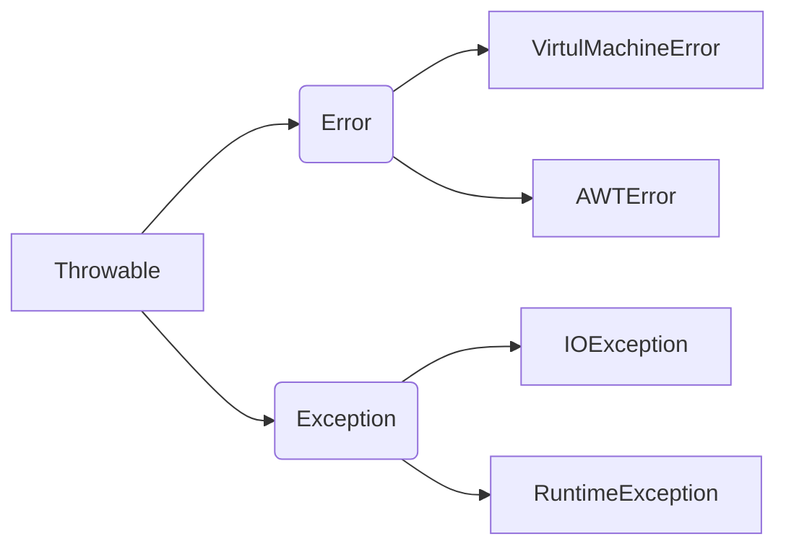
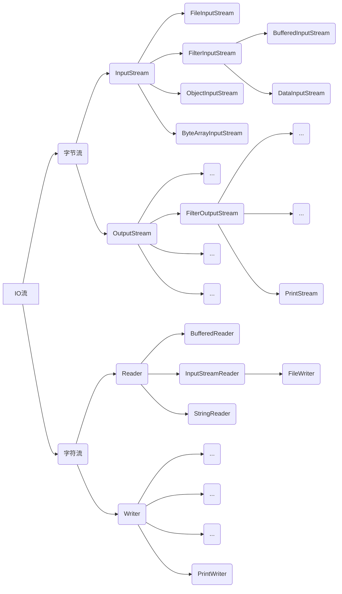
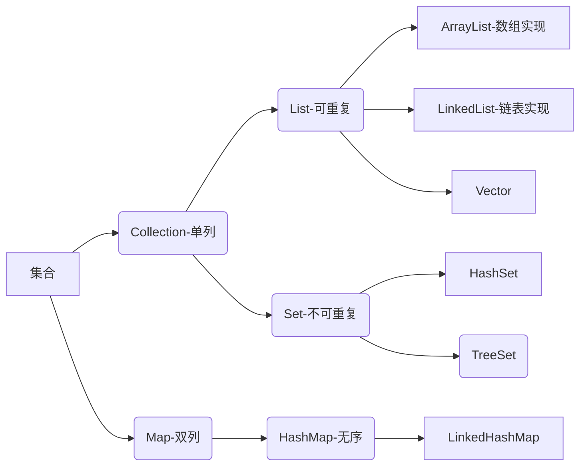

## 异常类

### 异常分类

```
编译时异常(受检异常)，必须显示处理

运行时异常(非受检异常)，所有的RuntimeException类及其子类被称为运行时异常，无须显示处理，修改错误代码即可

错误ERROR，错误不是异常, 而是脱离程序员控制的问题。错误在代码中通常被忽略。例如，当栈溢出时，一个错误就发生了,它们在编译也检查不到的。
```

### 异常体系结构

Java把异常当作对象来处理，并定义一个基类java.lang.Throwable作为所有异常的超类



**Error**

```
Error类对象由Java,虚拟机生成并抛出，大多数错误与代码编写者所执行的操作无关，如栈溢出

Error通常是灾难性的致命的错误，是程序无法控制和处理的，Java虚拟机(JVM) 一般会选择终止线程
```

**Exception**

```
RuntimeException
在编译期是不检测的，需要修改代码

非RuntimeException
编译器就必须处理，否则编译不能通过
```

**Throwable的成员方法**

| 方法名                        | 说明                            |
| ----------------------------- | ------------------------------- |
| public String getMessage()    | 返回此throwable的详细消息字符串 |
| public String toString()      | 返回此可抛出的简短描述          |
| public void printStackTrace() | 把异常的错误信息输出在控制台    |

```java
try{
      test(1,2,5);
      System.out.println("end");
    }catch( AnswerWrongException e){
        e.printStackTrace();
    }
```

### 异常处理

```java
class Family{
    int a = 1;
    int b = 0;
}
public  class demo {
    public static void main(String[] args) {
        Family f1 = new Family();
        // try监控区
        try {
            System.out.println(f1.a / f1.b);
        }catch (ArithmeticException e){ // catch捕获异常
            System.out.println(e);
        }finally { //处理善后工作
            System.out.println("family");
        }
    }
}
```

**捕获异常**

**try-catch**

程序从try中执行代码，出现异常，自动生成一个异常类对象，该异常对象将被提交给Java运行时的系统

当Java运行时系统接收到异常对象时，会到catch中去找匹配的异常类，找到后进行异常的处理

执行完毕后，程序会继续往下执行

```java
try{
    可能出现异常的程序
}catch(异常类型   异常对象){	//指定可能出现的异常类型
    异常处理的代码
}
```

如果要捕获多个异常，则异常类型 要从小到大

```java
try{
    可能出现异常的程序
}catch(Exception e1){
    异常处理的代码
}catch(Throwable e2){
    异常处理的代码
}
```

**finally语句**

可省略，不管是否会出现异常，finally都会执行，通常用于进行资源清除、关闭打开的文件等最后进行的处理

```java
try{ 
    java语句
}catch(异常类型1   异常对象1){    
    异常处理                       
}finally{ 
}
```

**抛出异常**

**throw**

由程序本身主动抛出类异常对象，并对此异常进行处理

```java
throw 异常类对象 (必须为Throwable子类对象)
```

例

```java
public class work {
    public static void main(String[] args) {
        int a=5,b=0;
        try{
        	if(b==0)
        	    throw new ArithmeticException();		//
        	else
        	    System.out.println(a/b);
        }
        catch(ArithmeticException e){
        	System.out.println("除数不能为零！");
        	e.printStackTrace();   //显示异常信息
        }
    }
}
```

**throws**

写在可能出现异常的方法声明之后，throws可以列出多个可能出现的系统异常，用逗号分隔。声明该方法可能会出现异常

```java
throws 异常类名;
```

例子

```java
public class TestThrows{
	public static void main(String[] args){
		try{
			test();
		}
		catch(Exception e)
		{
			System.out.println(e.getMessage());	
		}		
	}
	static void test() throws ArithmeticException{		//
		System.out.println(6/0);
	}
}
```

**throw和throws区别**

| throws                                           | throw                              |
| ------------------------------------------------ | ---------------------------------- |
| 用在方法声明后面，跟的是异常类名                 | 用在方法体内，跟的是异常对象名     |
| 表示抛出异常，由该方法的调用者来处理             | 表示抛出异常，由方法体内的语句处理 |
| 表示出现异常的一种可能性，并不一定会发生这些异常 | 执行throw一定抛出了某种异常        |

注意

```
编译时异常必须进行处理，可用try-catch或throws，若使用throws，将来谁调用谁处理
运行时异常可以不处理，出问题后修改代码 
```

### 自定义异常

自定义异常类只需要继承Exception类即可，并规定哪些方法产生这样异常

使用自定义的异常类创建对象，并抛出所创建的异常对象

```Java
public class 异常类名 extends Exception{
    无参构造
    带参构造
}
```

例

```java
import java.util.Scanner;

class ScoreException extends Exception{
    public ScoreException(){}

    public ScoreException(String message){
        super(message);
    }
}


class Check {
    public void checkScore(int score) throws ScoreException{
        if(score<0 || score>100){
            //throw new ScoreException();
            throw new ScoreException("分数异常，分数超范围");

        }else {
            System.out.println("分数正常");
        }
    }
}

class ScanScore{
    public static void main(String[] args) {
        Scanner sc = new Scanner(System.in);
        System.out.println("请输入分数");
        int score = sc.nextInt();

        Check t = new Check();
        try {
            t.checkScore(score);
        } catch (ScoreException e) {
            e.printStackTrace();
        }
    }
}
```

### 常见异常类

```
IOException：输入输出异常
ArithmeticException：数学异常
NullPointerException：空指针异常
ArrayIndexOutOfBoundsException：下标越界异常
ClassCastException：类型转换异常:
```

## 泛型

避免项目之中出现“ClassCastException”

```
本质是将所操作的数据类型指定为一个参数

这种参数可用在类、方法、接口中，分别被称为泛型类、泛型方法、泛型接口

<类型1,类型2> ：可指定多种类型的格式，多种类型之间用逗号隔开，这里的类型可以看作是形参

调用的时候，给定的类型可以看作实参，并且实参的类型只能是引用数据类型，如果要操作基本类型必须使用相应的包装类，如果不设置泛型类型时，自动将使用Object
```

**优点**

把运行时期的问题提前到了编译期间

避免了强制类型转换

同时也避免了对象的向下转型处理（可以避免安全隐患）

### 泛型类

```Java
修饰符 class 类名<参数>{ //此处参数可以随便写为任意标识，常见如T、E、K、V等形式的参数常用于表示泛型
    
}
例
public class Demo<T>{
    private T param;
    public void show(T t){
    }
}
// 实例化时，传入具体数据类型
Demo<String> s1 = new Demo<String>();
```

### 泛型方法

注意：如果一个类上没有定义泛型，那么也可以使用泛型方法

```java
修饰符 <参数> 返回值类型 方法名(参数 变量名){//此处参数可以随便写为任意标识，常见如T、E、K、V等形式的参数常用于表示泛型
}
例
public <T> void show(T t){}
```

例

```java
class Generic{
    public <T> void show(T t){
        System.out.println(t);
    }
}
public class test {
    public static void main(String[] args) {
        Generic g1 = new Generic();		//
        g1.show(2);
        Generic g2 = new Generic();		//
        g2.show("字符串");
    }
}
```


### 泛型接口

直接在接口之中进行使用

```java
interface Generic<T>{
    void show(T t);
}
```

对于泛型接口的子类而言现在就有两种实现方式

方法一：在子类之中继续设置泛型定义

```java
class GenericImpl<S>implements Generic<S> {
    @Override
    public void show(S s){
        System.out.println(s);
    }
}
```

方法二：在子类实现父接口的时候直接定义出具体泛型类型

```java
class GenericImpl implements Generic<String> {
    @Override
    public void show(String s){
        System.out.println(s);
    }
}
```

### 泛型通配符

**泛型上限**

`<?extends 类>`

```java
?extends Number: 表示该泛型类型只允许设置Number或Number的子类
```

**泛型下限**

`<?super 类>`

```java
<?super Number>：它表示的类型是Number或其父类型
```

## Lambda表达式

替换只有一个抽象方法的匿名内部类

对于Lambda表达式而言，提供有如下几种格式

```
方法没有参数: ()->{}
方法有参数: (参数,参数)->{}
如果现在只有一行语句返回: (参数,参数)->语句
```

## File类文件操作 

File类是唯一与文件本身操作（创建、删除、重命名等）有关的类

File类是Comparable接口的子类，所以File类的对象可以进行排序

如果想进行File 类的操作，必须提供完整的路径，主要通过File类的构造方法处理

### 构造方法

以下三种方法，效果一样，推荐用第一种

| 方法名                           | 说明                                             |
| -------------------------------- | ------------------------------------------------ |
| File(String pathname)            | 创建新的File实例                                 |
| File(String parent,String child) | 从父路径名字符串和子路径名字符串创建新的File实例 |
| File(File parent,String child )  | 从父抽象路径名和子路径名字符串创建新的File实例   |

### 创建功能

进行文件创建的时候有一个重要的前提：文件的父路径必须首先存在

| 方法名                         | 说明                              |
| ------------------------------ | --------------------------------- |
| public boolean createNewFile() | 创建新空文件。若文件存在返回false |
| public boolean mkdir()         | 创建单级目录。若目录存在返回false |
| public boolean mkdirs()        | 创建多级目录。若目录存在返回false |

### 删除功能

| 方法名                  | 说明           |
| ----------------------- | -------------- |
| public boolean delete() | 删除文件或目录 |

注意：如果一个目录中有内容（子目录或文件），则不能直接删除该目录，需要先删除目录中的内容，才能删除该目录

### 获取文件信息

| 方法名                          | 说明                           |
| ------------------------------- | ------------------------------ |
| renameTo(File)                  | 文件重命名                     |
| public boolean isDirectory()    | 是否为目录                     |
| public boolean isFile()         | 是否为文件                     |
| public boolean exists()         | 是否存在文件、目录             |
| public boolean canRead()        | 文件是否可读                   |
| public boolean canWrite()       | 文件是否可写                   |
| public long length()            | 获取文件长度，返回字节长度     |
| public long lastModified()      | 获取最后一次修改日期时间       |
| public String getAbsolutePath() | 获取绝对路径                   |
| public String getPath()         | 获取相对路径                   |
| public String getName()         | 获取文件或目录的名称           |
| public File getParentFile()     | 获取父路径                     |
| public File[] listFiles()       | 列出目录内容，返回File对象数组 |
| public String[] list()          | 列出目录内容，返回字符串数组   |

```java
public  class demo {
    public static void main(String[] args) throws Exception{
        	// 创建一个File实例
        File f1 = new File("d://test//test1//demo1.txt");
        //父路径是否存在
        if (!f1.getParentFile().exists()){  
            // 创建父路径
            f1.getParentFile().mkdirs();  
            //创建文件
            f1.createNewFile();     
        }
        if (f1.exists()){
            // 删除文件
            f1.delete();
        }
    }
}
```

### 文件遍历

最好的做法就是利用递归的形式来完成

```java
public static void listDir(File file){
    // 判断是否为目录
    if (file.isDirectory()){
        File[] files = file.listFiles();
        for(int x=0;x<files.length;x++){
            //递归调用
            listDir(files[x]);  
        }
    }
    System.out.println(file);
}
```

## IO流

流的本质是数据传输，数据流指的就是字节数据

常见的流：文件复制、文件上传、文件下载




### 分类

字节处理流：OutputStream（输出字节流）、InputStream（输入字节流）

字符处理流：Writer（输出字符流）、Reduce（输入字符流）

字节流可以复制任意文件数据

字符流只能复制文本数据

### 步骤

要读写的内容，可直接使用记事本打开，则使用字符流，否则使用字节流

下面以文件处理的流程为例：

（1）如果现在要进行的是文件的读写操作，则一定要通过 File 类找到一个文件路径；

（2）通过字节流或字符流的子类把父类对象实例化；

（3）利用字节流或字符流中的方法实现数据的输入与输出操作；

（4）流的操作属于资源操作，资源操作结束后必须进行关闭处理。

### 编码和解码

**编码**

```
byte[] getBytes() 使用平台默认的字符集将该String编码为一系列字节，结果存储到新的字节数组中

byte[] getByte(String charsetName) 使用指定的字符集将该String编码为一系列字节，结果存储到新的字节数组中
```

例

```java
public static void main(String[] args) throws IOException {

        String s = "中国";

        byte[] bys1 = s.getBytes("GBK");
        byte[] bys2 = s.getBytes("UTF-8");

        System.out.println(Arrays.toString(bys1));
        System.out.println(Arrays.toString(bys2));
    }
```

**解码**

```
String(byte[] bytes) 使用平台默认的字符集将字节数组解码为String
String(byte[] bytes,String charsetName) 使用指定的字符集将字节数组解码为String
```

例

```java
public static void main(String[] args) throws IOException {

    String s = "中国";

    byte[] bys1 = s.getBytes("GBK");
    byte[] bys2 = s.getBytes("UTF-8");

    System.out.println(Arrays.toString(bys1));
    System.out.println(Arrays.toString(bys2));

    String ss1 = new String(bys1,"GBK");
    System.out.println(ss1);

    String ss2 = new String(bys2,"UTF-8");
    System.out.println(ss2);
}
```

因为汉字的存储是有编码的，GBK或UTF-8等，而GBK编码占2个字节，UTF-8编码占3个字节，所以直接使用字节流读取，会导致无法读取到完整的汉字。

## 字节流

字节的数据是以 byte 类型为主实现的操作

### OutputStream

OutputStream 类定义的是一个公共的输出操作标准，一共定义有三个内容输出的方法：

| 方法名                                                       | 功能             |
| ------------------------------------------------------------ | ---------------- |
| public abstract void write(int b) throws IOException         | 输出单个字节数据 |
| public void write(byte[] b) throws IOException               | 输出一组字节数据 |
| public void write(byte[] b, int off, int len) throws IOException | 输出部分字节数据 |

OutputStream 类是一个抽象类，而这个抽象类如果想要获得实例化对象，应该通过子类实例的向上转型完成。如果要进行文件写入操作，则可以使用 FileOutputStream 子类。

```java
public static void main(String[] args) throws Exception {
    File f1 = new File("D:\\test\\test.txt");
    // 只需要确保父目录存在，若没有创建文件，则自动帮助用户创建
    if (!f1.getParentFile().exists()){
        f1.getParentFile().mkdirs();
    }
    // 通过子类实例的向上转型完成实例化
    OutputStream output = new FileOutputStream(f1);
    String str = "www.baidu.com";
    // 将字符串变为字节数组
    output.write(str.getBytes());
    //关闭 IO
    output.close();
}
```

实现换行

```java
f1.write("\r\n".getBytes())	//Windows下
```

追加写入

```java
OutputStream output = new FileOutputStream(f1,true);//增加一个Boolean类型的参数 true
```

自动释放IO资源

```java
// 使用try-catch结构执行，可实现自动释放IO资源
try {
    f1.write();
}catch (IOException e){
    e.printStackTrace();
}
```

### InputStream

InputStream 类定义的是一个公共的输入操作标准，一共定义有三个内容输入的方法：

| 方法                                                         | 功能                                                         |
| ------------------------------------------------------------ | ------------------------------------------------------------ |
| public abstract int read) throws IOException                 | 读取单个字节数据，如果现在已经读取到底了，返回-1             |
| public int read(byte[] b) throws IOException                 | 读取一组字节数据，返回读取的字节个数，如果没有数据读取，已经读取到底了，则返回-1 |
| public int read(byte[] b, int off, int len) throws IOException | 读取一组字节数据，只占数组的一部分                           |

InputStream 类是一个抽象类，而这个抽象类如果想要获得实例化对象，应该通过子类实例的向上转型完成。如果要进行文件读取操作，则一定要使用 FileInputStream 子类

```java
public static void main(String[] args) throws Exception {
    File f1 = new File("D:\\test\\test.txt");
    // 通过子类实例的向上转型完成实例化
    InputStream input = new FileInputStream(f1);
    // 开辟缓冲区
    byte[] data = new byte[1024];
    // 暂存读取的数据
    input.read(data);
    // 字节转字符串
    System.out.println(new String(data));
    //关闭 IO
    input.close();
}
```

## 字符流

字符流 = 字节流 + 编码表

### Writer

Writer 是字符流，字符处理的优势在于中文数据

| 方法名                                            | 功能         |
| ------------------------------------------------- | ------------ |
| public void write(char[] cbuf) throws IOException | 输出字符数组 |
| public void write( String str) throws IOException | 输出字符串   |

Writer 类是一个抽象类，而这个抽象类如果想要获得实例化对象，应该通过子类实例的向上转型完成。如果要进行文件写入操作，则可以使用 FileWriter 子类。

```java
public static void main(String[] args) throws Exception {
    File f1 = new File("D:\\test\\test.txt");
    // 通过子类实例的向上转型完成实例化
    Writer out = new FileWriter(f1);
    String str = "我是是是";
    out.write(str);
    out.close();
}
```

### Reader

并没有像 Writer 类一样提供有整个字符串的输入处理操作，只能够利用字符数组来接收

| 方法名                                         | 功能         |
| ---------------------------------------------- | ------------ |
| public int read(char[]cbuf) throws IOException | 接收字符数组 |

Reader 类是一个抽象类，而这个抽象类如果想要获得实例化对象，应该通过子类实例的向上转型完成。如果要进行文件读取操作，则可以使用 FileReader子类。

```java
public static void main(String[] args) throws IOException {
    File f1 = new File("D:\\test\\test.txt");
    // 通过子类实例的向上转型完成实例化
    Reader in = new FileReader(f1);
    char[] data = new char[1024];
    int len = in.read(data);
    System.out.println(new String(data));
    in.close();
}
```

## 字符流与字节流区别

**字节流在进行处理的时候并不会使用到缓冲区，而字符流会使用到缓冲区**

在使用 Writer 类输出的时候，如果没有使用 close() 方法关闭输出流，那么这时内容无法进行输出，因为 Writer 使用到了缓冲区。

当使用了 close() 方法的时候，会强制刷新缓冲区，所以这个时候会将内容进行输出。

如果没有关闭，那么将无法进行输出操作。所以此时如果在不关闭的情况下，要想将全部的内容输出可以使用 flush() 方法强制性清空。

## 转换流

实现字节流与字符流操作的功能转换，所谓的转换处理就是将接收到的字节流对象通过向上转型变为字符流对象

字符流传输的本质：缓冲区的存在，数据先写入缓冲区，然后数据在缓冲区中根据编码格式进行输出。而字节流的数据不经过缓冲区

### InputStreamReader

```java
    public static void main(String[] args) throws IOException {
        File f1 = new File("D:\\test\\test.txt");
        InputStream input = new FileInputStream(f1);
        // 字节流转字符流
        char []ss = new char[1024];
        Reader in = new InputStreamReader(input);
        in.read(ss);
        in.close();
        System.out.println(ss);
    }
```

### OutputStreamWriter

```java
public static void main(String[] args) throws IOException {
    File f1 = new File("D:\\test\\test.txt");
    // 创建字节流对象
    OutputStream output = new FileOutputStream(f1);
    // 字节流转字符流
    Writer out = new OutputStreamWriter(output);
    out.write("www.baidu.com");
    out.close();
}
```

## 文件拷贝实现

应使用字节流，方便拷贝各类型文件

应使用部分拷贝，即读取一部分输出一部分数据，方便拷贝大型文件

```java
class FileUtil{
    //源文件路径
    private File srcFile;
    // 目标文件路径
    private File desFile;
    public FileUtil(){};
    public FileUtil(String srcFile,String desFile){
        this.srcFile = new File(srcFile);
        this.desFile = new File(desFile);
    }
    // 文件拷贝处理
    public boolean copy() throws IOException {
        // 源文件是否存在
        if(!this.srcFile.exists()){
            return false;
        }
        // 目标路径的父目录是否存在
        if(!this.desFile.getParentFile().exists()){
            this.desFile.getParentFile().mkdirs();
        }

        byte[] data = new byte[1024];
        InputStream input = null;
        OutputStream out = null;
        try{
            input = new FileInputStream(this.srcFile);
            out = new FileOutputStream(this.desFile);
            int len = 0;
            while ((len = input.read(data)) != -1){
                out.write(data,0,len);
            }
        }catch (Exception e){
            System.out.println(e);
        }finally {
            if(input != null) {
                input.close();
            }
            if (out != null){
                out.close();
            }
        }
        return true;
    }
}
```

## 内存流*

需要实现 IO 操作，可是又不希望产生文件（相当于临时文件）则以内存为终端进行处理。

ByteArrayInputStream、ByteArrayOutputStream 分别是InputStream、OutputStream 的子类，如果要进行内存流操作，则应该通过子类实例的向上转型完成

### ByteArrayInputStream

| 方法名                                           | 功能 |
| ------------------------------------------------ | ---- |
| 构造方法 public ByteArrayInputStream(byte[] buf) |      |

### ByteArrayOutputStream

| 方法名                                  | 功能                           |
| --------------------------------------- | ------------------------------ |
| 构造方法 public ByteArrayOutputStream() |                                |
| public byte[] toByteArray()             | 获取内存数据                   |
| public String toString()                | 使用字符串的形式来获取内存数据 |

```java
public static void main(String[] args) throws IOException {
    String str = "www.baidu.com";
    InputStream input = new ByteArrayInputStream(str.getBytes());
    OutputStream out = new ByteArrayOutputStream();
    int data = 0;
    while ((data = input.read()) != -1){
        out.write(Character.toUpperCase(data));
    }
    System.out.println(out);
}
```

## 管道流*

实现两个线程之间的 IO 处理操作，一个只负责发送，一个负责接收，中间靠一个管道连接

### 字节管道流

```
PipedOutputStream、PipedInputStream

连接处理：public void connect(PipedInputStream snk)throws IOException
```

### 字符管道流

```
PipedWriter、PipedReader

连接处理：public void connect(PipedReader snk)throws IOException
```

## RandomAccessFile*

实现文件跳跃式读取内容(前提：数据需要对齐存储)，数据的保存位数要确定好

| 方法                                                         | 功能                |
| ------------------------------------------------------------ | ------------------- |
| 构造方法: public RandomAccessFile(File file, String mode)throws FileNotFoundException | 文件处理模式: r、rw |
| public int skipBytes(int n) throws IOException               | 向下跳              |
| public void seek(long pos) throws IOException                | 向回跳              |

## 打印流

若要通过程序实现内容的输出，核心的本质一定要依靠 OutputStream 类完成，比起直接使用 OutputStream 类，使用装饰设计模式实现的 PrintWriter、 PrintStream 类的处理操作会更加的简单。只要是程序进行内容输出的时候全部使用打印流。

### PrintStream

用法一样

### PrintWriter

```java
public static void main(String[] args) throws IOException {
    File file = new File("D:\\test\\test.txt");
    PrintStream pu = new PrintStream(new FileOutputStream(file));
    String str = "www.baidasdasd";
    pu.printf(str);
    pu.close();
}
```

## System类的IO

这个系统类之中提供有三个常量：

标准输出(显示器)：`public static final PrintStream out`

错误输出：` public static final PrintStream err;`

标准输入(键盘)：`public static final InputStream in。`

System.out 和 System.err 都是同一种类型的，如果现在使用的是 IDEA，则在使用System.err 输出的时使用红色字体，而 System.out 会使用黑色字体。

System.in 一般不直接用来接收键盘输入

## BufferedReader缓冲输入流

利用 BufferedReader 类可以很好的解决输入流数据的读取问题

读取一行数据: `public String readLine() throws IOException`

利用这个类实现键盘输入数据的标准化定义，实际开发中所有输入的数据全部都是字符串，方便用户验证与进行字符串的复杂处理。

```java
public static void main(String[] args) throws IOException {
    BufferedReader input = new BufferedReader(new InputStreamReader(System.in));
    System.out.println("请输入内容");
    String msg = input.readLine();
    System.out.println("所输内容为：" + msg);
}
```

## Scanner扫描流

BufferedReader的代替品

| 方法                                         | 功能                             |
| -------------------------------------------- | -------------------------------- |
| 构造方法 public Scanner (InputStream source) |                                  |
| public Scanner useDelimiter(String pattern)  | 设置分隔符，即遇到什么符号时换行 |
| public String next()                         | 取出数据                         |
| public boolean hasNext()                     | 判断是否有数据                   |

**使用 Scanner 实现键盘数据输入**

```java
public static void main(String[] args) throws IOException {
    Scanner scan = new Scanner(System.in);
    System.out.println("请输入年龄：");
    if (scan.hasNextInt()){
        int age = scan.nextInt();
        System.out.println("年龄是:" + age);
    }
    scan.close();
}
```

**使用 Scanner 读取数据**

```java
public static void main(String[] args) throws IOException {
    Scanner scan = new Scanner(new File("D:\\test\\test.txt"));
    scan.useDelimiter("\n");
    while(scan.hasNext()){
        System.out.println(scan.next());
    }
    scan.close();
}
```

## 对象序列化

对象序列化：就是将对象保存到磁盘中，或者在网络中传输对象

对象本来存在于堆内存，将对象保存到磁盘中，就是实现了对象序列化

使用一个字节序列表示一个对象，该字节序列包含：对象的类型、对象的数据和对象中存储的属性等信息，字节序列写到文件之后，相当于文件中持久保存了一个对象的信息

反之，该字节序列还可以从文件中读取回来，重构对象，对它进行反序列化

在 Java 中有一个强制性的要求：如果要序列化对象，那么该对象所在的类必须实现 java.io.Serializable 父接口，作为序列化的标记。这个接口描述的是一种类的能力。Serializable是一个标记接口，实现该接口，不需要重写任何方法

```java
// 实现 Serializable 父接口
class Family implements Serializable{ 
    private int age;
    private String name;
    public Family(int age,String name){
        this.age = age;
        this.name = name;
    }
}
```

| 类名称   | 序列化 ObjectOutputStream                                    | 反序列化 ObjectInputStream                                   |
| -------- | ------------------------------------------------------------ | ------------------------------------------------------------ |
| 构造方法 | public`` ``ObjectOutputStream(OutputStream out) throws IOException | public`` ``ObjectInputStream(InputStream in) throws IOException |
| 操作方法 | public final void writeObject(Object obji) throws IOException | public final Object readObject() throws IOException          |

```java
// 序列化
public static void saveObject(Object obj) throws Exception {
    ObjectOutputStream oos = new ObjectOutputStream(new FileOutputStream("D:\\test\\class.family"));
    oos.writeObject(obj);
    oos.close();
}
// 反序列化
public static Object loadObject() throws Exception{
    ObjectInputStream ois = new ObjectInputStream(new FileInputStream("D:\\test\\class.family"));
    Object obj = ois.readObject();
    ois.close();
    return obj;
}
```

**transient关键字**

假设类之中有一些是需要计算保存的属性内容往往是不需要被数列化的，这个时候就可以使用 transient

## IO流总结

在以后的开发过程中，如果程序需要输出数据一定使用打印流，输入数据一定使用Scanner扫描流。

## 集合

一种存储空间可变的存储模型

**和数组的区别**

```
数组长度固定，集合长度不固定
数组可以存储基本类型和引用类型，集合只能存储引用类型
```




## Collection

是单列集合的顶层接口

### 方法

| 方法                                              | 功能                                   |
| ------------------------------------------------- | -------------------------------------- |
| public boolean add(E e)                           | 向集合添加元素                         |
| `public boolean addAll(Collection<?extends E> c)` | 向集合追加一组数据                     |
| public boolean remove(Object o)                   | 删除指定元素，需要equals方法支持       |
| public void clear()                               | 清空集合，让根节点为空，同时执行GC操作 |
| public boolean contains(Object o)                 | 判断集合中是否存在指定的元素           |
| public boolean isEmpty()                          | 判断集合是否为空                       |
| public int size()                                 | 获取集合长度                           |
| public Object[] toArray()                         | 将集合变为对象数组返回                 |
| `public Iterator<E> iterator()`                   | 将集合变为Iterator 接口                |

集合操作有两个方法最为常用： add ()、 iterator()

## List

有序集合，用户可以通过索引来增删改查元素

其最大的特点是允许保存有重复元素数据，保存的顺序就是其存储顺序

### 方法

List扩充的方法

| 特有方法                               | 说明                     |
| -------------------------------------- | ------------------------ |
| `public ListIterator<E>listIterator()` | 返回ListIterator接口对象 |
| public E set(int index,E element)      | 修改数据                 |
| public E get(int index)                | 查找数据                 |

List 本身依然属于一个接口，对于接口要想使用则一定要使用子类来完成定义，在 List 子接口中有三个常用子类： ArrayList、Vector、 LinkedList，其中ArrayList使用频率最高

```java
List<String> c = new ArrayList<String>();
```

## ArrayList

ArrayList 是数组实现的集合操作

```java
List<String> array = new ArrayList<String>();
```

### 方法

| 构造方法                              | 说明                 |
| ------------------------------------- | -------------------- |
| public ArrayList()                    | 开辟大小为 10 的数组 |
| public ArrayList(int initialCapacity) | 开辟指定大小的数组   |

JDK1.9 之前: ArrayL ist 默认的构造实际上就会默认开辟大小为 10 的数组，当 ArrayList 之中保存的容量不足的时候会采用成倍的方式进行增长，原始长度为10 ， 那么下次的增长就是 20，有可能会造成垃圾的产生以及性能的下降

所以在使用ArrayList子类的时候一定要估算出你的数据量会有多少，如果超过了 10  个，那么使用有参构造方法进行创建，以避免垃圾数组的产生

### ArrayList保存自定义类对象

在使用 List 保存自定义类对象的时候如果需要使用到 contains 、remove 方法进行查询与删除处理时候，一定要保证之中已经成功的重写了 equals 方法。

```java
class Family{
    private int age;
    private String name;
    public Family(int age,String name){
        this.age = age;
        this.name = name;
    }
    @Override
    // 重写equals方法
    public boolean equals(Object obj){
        if (this == obj){
            return true;
        }
        if (obj == null){
            return false;
        }
        if (!(obj instanceof Family)){
        return false;
        }
        Family fam = (Family) obj;
        return this.name.equals(fam.name) && this.age == fam.age;
    }
}
public class demo {
    public static void main(String[] args) throws Exception {
        List<Family> array = new ArrayList<Family>();
        array.add(new Family(10,"一"));
        array.add(new Family(12,"二"));
        array.add(new Family(15,"三"));
        // 不重写equals方法，这里删不掉
        array.remove(new Family(10,"一"));
        array.forEach(System.out::println);
    }
}
```

## LinkedList

LinkedList 是链表实现的集合操作

```java
List<String> LinkList = new LinkedList<String>();
```

### 方法

| 方法名                           | 说明                                                         |
| -------------------------------- | ------------------------------------------------------------ |
| 无参构造方法 public LinkedList() | 创建空的list集合                                             |
| public boolean add(E e)          | 编写自定义链表的时候，是判断了传入数据是否为null，如果为null则不进行保存，但是在LinkedList里面并没有做这样的处理，而是所有的数据都可以保存，而后此方法调用了linkLast()方法 |

## Vector

继承结构与 ArrayList 是相同的，其实现操作与 ArrayList 是相同的。Vector类之中的操作方法采用的都是 synchronized 同步处理，而 ArrayList 并没有进行同步处理，所以 Vector 类之中的方法在多线程访问时是线程安全的，但是性能不如 ArrayList高。

## Set

方法和Collection一样

不包含重复元素

没有带索引的方法，所以不能使用for循环遍历，但可使用增强for遍历

Set 集合的常规使用形式一定是依靠子类进行实例化的，所以 Set 接口之中有两个常用子类：HashSet、TreeSet。其中HashSet 使用最多

```java
class work{
    public static void main(String[] args) {
        Set<String> ss = new HashSet<String>();
        ss.add("asd");
        System.out.println(ss.size());
        for (String s:ss){
            System.out.println(s);
        }
    }
}
```

## HashSet

保存的数据是无序的（hashCode计算得到保存地址）

底层数据结构是哈希表

```java
Set<String> hs = new HashSet<String>();
```

### hashCode

属于Object类的方法，JDK根据对象的地址或字符或数字计算出的 int 类型的数值

```java
public int hashCode()
```

## TreeSet

保存的数据是有序的

利用 TreeSet 保存的数据，都将按照数据的升序进行自动排序处理

```java
Set<String> ts = new TreeSet<String>();
```

### 排序

TreeSet 中保存的数据是允许排序的，但是这个类必须要实现Comparable 接口，TreeSet 是利用了 Comparable 接口来实现重复元素的判断

在使用自定义类对象进行比较处理的时候一定要将该类之中的所有属性都依次进行大小关系的匹配，否则如果某一个或某几个属性相同的时候它也会认为是重复数据

```java
class student implements Comparable<student> {
    private int age;
    private String name;
    student(){}
    student(String name,int age){
        this.age = age;
        this.name = name;
    }
    String getName(){
        return name;
    }
    int getAge(){
        return age;
    }
    public int compareTo(student s){		//按照年龄排序
        int num = this.age - s.age;
        return num;
    }
}

class work{
    public static void main(String[] args) {
     TreeSet<student> ts = new TreeSet<student>();


     student s1 = new student("xixi",50);
     student s2 = new student("zhao",12);
     student s3 = new student("dalao",60);

     ts.add(s1);
     ts.add(s2);
     ts.add(s3);

     for (student s:ts){
         System.out.println("name:" + s.getName() + "age:" + s.getAge());
        }
    }
}
```

## 消除重复的原理

### TreeSet 

利用了 Comparable 接口来实现了重复元素的判断

### HashSet

在进行重复元素判断的时候首先利用 hashCode() 进行编码的匹配，如果该编码不存在则表示数据不存在，证明没有重复，如果该编码存在了，则进一步进行对象比较处理，如果发现重复了，则此数据是不允许保存的

### 总结

在 Java 程序之中真正的重复元素的判断处理利用的就是 hashCode() 与 equals() 两个方法共同作用完成的，而只有在排序要求情况下 TreeSet 才会利用Comparable 接口来实现。

## 集合的输出

一共有四种输出迭代输出形式：Iterator迭代输出、ListIterator 双向迭代输出、Enumeration 枚举输出、foreach 输出，其中Iterator迭代输出使用最多

### Iterator

只允许由前向后实现输出

获取Iterator接口对象

````java
public Iterator<T>iterator()
````

| 方法                         | 功能           |
| ---------------------------- | -------------- |
| public boolean hasNext()     | 判断是否有数据 |
| public E next()              | 取出当前数据   |
| public default void remove() | 删除           |

```java
public static void main(String[] args) throws Exception {
    List<String> all = new ArrayList<String>();
    all.add("ss");
    all.add("zz");
    all.add("asdasd");
    // 实例化Iterator接口
    Iterator<String> iter = all.iterator();
    while (iter.hasNext()){
        String str = iter.next();
        System.out.println(str);
    }
}
```

**Collection.remove() 与 Iterator.remove() 的区别**

在进行迭代输出的时候如果使用了 Collection.remove() 则会造成并发更新异常，导致程序删除出错，而此时只能使用 Iterator.remove( 方法实现正常的删除处理。

### ListIterator

进行双向迭代处理，必须依靠 Iterator 的子接口：ListIterator  接口来实现

ListIterator 输出接口是专门为 List 集合准备的

```java
List<String> all = new ArrayList<String>();
all.add("ss");
// 实例化ListIterator接口
ListIterator<String> iter = all.listIterator();
```


| 方法                         | 功能                 |
| :--------------------------- | -------------------- |
| public boolean hasPrevious() | 判断是否有前一个元素 |
| public E previous()          | 获取当前元素         |

如果要想实现由后向前的遍历，那么首先要实现的是由前向后实现遍历处理

```java
public static void main(String[] args) throws Exception {
    List<String> all = new ArrayList<String>();
    all.add("ss");
    all.add("asdasd");
    // 实例化ListIterator 接口
    ListIterator<String> iter = all.listIterator();
    // 先实现由前向后的遍历
    while (iter.hasNext()){
        String str = iter.next();
        System.out.println(str);
    }
    // 再实现由后向前的遍历
    while (iter.hasPrevious()){
        String str = iter.previous();
        System.out.println(str);
    }
}
```

### Enumeration

Enumeration 只为Vector  一个类服务，如果要想获取 Enumeration 接口对象，就必须依靠 Vector 类提供的方法

获取Enumeration

```java
public Enumeration<E> elements()
```


| 方法                             | 功能                 |
| -------------------------------- | -------------------- |
| public boolean hasMoreElements() | 判断是否有下一个元素 |
| public E nextElement()           | 获取当前元素         |

### foreach

加强型 for 循环

```java
public static void main(String[] args) throws Exception {
    List<String> all = new ArrayList<String>();
    all.add("ss");
    all.add("zz");
    all.add("asdasd");
    for (String str : all){
        System.out.println(str);
    }
}
```


## Map

在开发中：Collection 集合保存数据的目的是为了输出，Map 集合保存数据的目的是为了进行 key 的查找。

Map 的核心意义在于通过key 获取对应的 value

每个键对应一个值，当键重复时，键的值会覆盖

**Map接口的定义**

```java
public interface Map<K,V>  // K为键的类型，V为值的类型
```

### 方法

| 常用方法                                   | 说明                                                         |
| ------------------------------------------ | ------------------------------------------------------------ |
| public V put(K key,V value)                | 添加元素，当键重复的时候该方法会返回旧的数据内容。默认返回null |
| public V get(Object key)                   | 根据Key查询数据                                              |
| public Set<Map.Entry<K,V>>entrySet()       | 将Map集合转为Set集合                                         |
| public V remove(Object key)                | 根据键删除键值元素                                           |
| public void clear()                        | 移除所有键值对元素                                           |
| public boolean containsKey(Object key)     | 判断集合是否包含指定的键                                     |
| public boolean containsValue(Object value) | 判断集合是否包含指定的值                                     |
| public boolean isEmpty()                   | 判断集合是否为空                                             |
| public int size()                          | 集合的长度                                                   |

开发之中需要通过 Map 集合的子类来进行接口对象的实例化，而常用的子类：HashMap、Hashtable、TreeMap、LinkedHashMap 。其中HashMap使用频率最高

## HashMap

无序存储

```java
Map<String,String> map = new HashMap<String,String>();
```

### put方法

**返回值**

```java
Map<String,String> map = new HashMap<String,String>();    
System.out.println(map.put("ggg",3));// 键没重复，返回null
System.out.println(map.put("ggg",4));// 键重复，返回旧的数据 3
```

**在进行 HashMap 的put() 操作的时候，如何实现容量扩充的**

在 HashMap 类里面提供有一个 `DEFAULT_INITIAL_CAPACITY` 常量，作为初始化的容量配置，这个常量的默认大小为 16 个元素

当保存的内容的容量超过了`阈值（DEFAULT_LOAD_FACTOR = 0.75f)`， 相当于`容量*阈值=12`的时候就会进行容量的扩充

在进行扩充的时候HashMap 采用的是成倍的扩充模式，即每一次都扩充2倍容量

### HashMap 的工作原理

从JDK 1.8开始，HashMap的实现出现了改变，HashMap内部类提供有一个重要的常量`static final int TREEIFY_THRESHOLD = 8`，如果保存的数据个数没有超过该值，则使用链表形式存储，若超过，则将链表转为红黑树以实现树的平衡，保证数据的查询性能

## LinkedHashMap

链表的实现形式

使用 LinkedHashMap 进行存储之后所有数据的保存顺序为添加时的顺序

```java
Map<String,Integer> map = new LinkedHashMap<String,Integer>();
```

## Hashtable

进行数据存储的时候设置的 kev 或 value 都不允许为 null，否则会出现 NullPointerException 异常。

### **HashMap与Hashtable的区别**

HashMap中的方法都属于异步操作( 非线程安全)，HashMap中允许保存有null数据

Hashtable中的方法都属于同步方法(线程安全)，Hashtable中不允许保存null数据

## Map.Entry

Map.Entrv 的主要作用就是作为一个Key 和 Value 的包装类型使用

## Map集合的输出

### 利用Iterator

利用 Map 接口中提供的 entrySet() 方法将 Map 集合转为 Set集合

利用 Set 接口中的 iterator() 方法将 Set 集合转为 Iterator 接口实例

利用 Iterator 进行迭代输出获取每一组的 Map.Entry 对象，随后通过 getKey() 与getValue() 获取数据。

```java
public static void main(String[] args) throws Exception {
    Map<String,Integer> map = new HashMap<String,Integer>();
    map.put("asd",1);
    map.put("xxx",2);
    // 将Map集合变为Set集合
    Set<Map.Entry<String,Integer>> set = map.entrySet();
    // 将 Set 集合转为 Iterator 接口实例
    Iterator<Map.Entry<String,Integer>> iter = set.iterator();
    while (iter.hasNext()){
        Map.Entry<String,Integer> me = iter.next();
        System.out.println(me.getKey());
    }
}
```

从实际的开发来开发来讲，Map 集合最主要的用法在于实现数据的 key 查找操作

## 自定义Map的key类型

对于自定义 Key 类型所在的类中一定要重写 hashCode()  与 equals() 方法，否则无法查找到。

**进行 HashMap 进行数据操作的时候出现了 Hash  冲突**

当出现了 Hash  冲突之后为了保证程序的正常执行，会在冲突的位置上将所有 Hash 冲突的内容转为链表保存

## 集合工具类

### Stack

栈是Vector的一个子类，它实现了一个标准的后进先出的栈

```java
Stack<Integer> st = new Stack<Integer>();
```

#### 方法

| 方法名                      | 说明                                             |
| :-------------------------- | :----------------------------------------------- |
| boolean empty()             | 测试堆栈是否为空                                 |
| Object peek( )              | 查看堆栈顶部的对象，但不从堆栈中移除它。         |
| Object pop( )               | 移除堆栈顶部的对象，并作为此函数的值返回该对象。 |
| Object push(Object element) | 把项压入堆栈顶部。                               |
| int search(Object element)  | 返回对象在堆栈中的位置，以 1 为基数。            |
