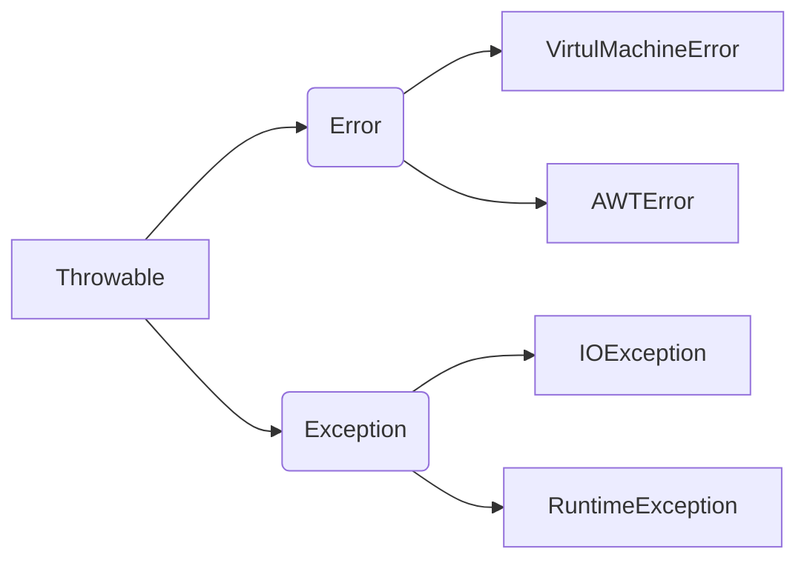

## 异常类

### 异常分类

```
编译时异常(受检异常)，必须显示处理

运行时异常(非受检异常)，所有的RuntimeException类及其子类被称为运行时异常，无须显示处理，修改错误代码即可

错误ERROR，错误不是异常, 而是脱离程序员控制的问题。错误在代码中通常被忽略。例如，当栈溢出时，一个错误就发生了,它们在编译也检查不到的。
```

### 异常体系结构

Java把异常当作对象来处理，并定义一个基类java.lang.Throwable作为所有异常的超类



**Error**

```
Error类对象由Java,虚拟机生成并抛出，大多数错误与代码编写者所执行的操作无关，如栈溢出

Error通常是灾难性的致命的错误，是程序无法控制和处理的，Java虚拟机(JVM) 一般会选择终止线程
```

**Exception**

```
RuntimeException
在编译期是不检测的，需要修改代码

非RuntimeException
编译器就必须处理，否则编译不能通过
```

### 异常处理

```java
class Family{
    int a = 1;
    int b = 0;
}
public  class demo {
    public static void main(String[] args) {
        Family f1 = new Family();
        // try监控区
        try {
            System.out.println(f1.a / f1.b);
        }catch (ArithmeticException e){ // catch捕获异常
            System.out.println(e);
        }finally {
            System.out.println("family");
        }
    }
}
```

**try-catch语句**

程序从try中执行代码，出现异常，自动生成一个异常类对象，该异常对象将被提交给Java运行时的系统

当Java运行时系统接收到异常对象时，会到catch中去找匹配的异常类，找到后进行异常的处理

执行完毕后，程序还可以继续往下执行

```java
try{
    可能出现异常的程序
}
catch(异常类型   异常对象){		//指定可能出现的异常类型，必须是Throwable的子类

    异常处理的代码
}
```

**finally语句**

可省略

不管是否会出现异常，finally都会执行，通常用于进行资源清除、关闭打开的文件等最后进行的处理

```java
try{      //指定可能出现异常的Java语句范围
    java语句
}
catch(异常类型1   异常对象1){    //指定可能出现的异常类型，必须是Throwable的子类
    异常处理                               //异常处理
}
catch(异常类型2   异常对象2){
    异常处理
}
……
finally{                          //可省略
    //不管是否会出现异常，finally都会执行，通常用于进行资源清除、关闭打开的文件等最后进行的处理
}

```


**throw**

try-catch-finally是由java虚拟机抛出异常并用catch捕获异常进行处理。Java系统还提供了throw关键字，由程序本身主动抛出类异常对象，并对此异常进行处理

```java
throw 异常类对象 (必须为Throwable子类对象)
```

例

```java
public class work {
    public static void main(String[] args) {
        int a=5,b=0;
        try{
        	if(b==0)
        	    throw new ArithmeticException();		//
        	else
        	    System.out.println(a/b);
        }
        catch(ArithmeticException e){
        	System.out.println("除数不能为零！");
        	e.printStackTrace();   //显示异常信息
        }
    }
}
```

**throws**

写在可能出现异常的方法声明之后，throws可以列出多个可能出现的系统异常，用逗号分隔。声明该方法可能会出现异常

```java
throws 异常类名;
```

例子

```java
public class TestThrows{
	public static void main(String[] args){
		try{
			test();
		}
		catch(Exception e)
		{
			System.out.println(e.getMessage());	
		}		
	}
	static void test() throws ArithmeticException{		//
		System.out.println(6/0);
	}
}
```

**throw和throws区别**

| throws                                           | throw                              |
| ------------------------------------------------ | ---------------------------------- |
| 用在方法声明后面，跟的是异常类名                 | 用在方法体内，跟的是异常对象名     |
| 表示抛出异常，由该方法的调用者来处理             | 表示抛出异常，由方法体内的语句处理 |
| 表示出现异常的一种可能性，并不一定会发生这些异常 | 执行throw一定抛出了某种异常        |

注意

```
编译时异常必须进行处理，可用try-catch或throws，若使用throws，将来谁调用谁处理
运行时异常可以不处理，出问题后修改代码 
```

### Throwable的成员方法

| 方法名                        | 说明                            |
| ----------------------------- | ------------------------------- |
| public String getMessage()    | 返回此throwable的详细消息字符串 |
| public String toString()      | 返回此可抛出的简短描述          |
| public void printStackTrace() | 把异常的错误信息输出在控制台    |

```java
try{
      test(1,2,5);
      System.out.println("end");
    }catch( AnswerWrongException e){
        e.printStackTrace();
    }
```


### 自定义异常

自定义继承Exception的异常类，并规定哪些方法产生这样异常

使用自定义的异常类创建对象，并抛出所创建的异常对象

```Java
public class 异常类名 extends Exception{
    无参构造
    带参构造
}
```

例

```java
import java.util.Scanner;

class ScoreException extends Exception{
    public ScoreException(){}

    public ScoreException(String message){
        super(message);
    }
}


class Check {
    public void checkScore(int score) throws ScoreException{
        if(score<0 || score>100){
            //throw new ScoreException();
            throw new ScoreException("分数异常，分数超范围");

        }else {
            System.out.println("分数正常");
        }
    }
}

class ScanScore{
    public static void main(String[] args) {
        Scanner sc = new Scanner(System.in);
        System.out.println("请输入分数");
        int score = sc.nextInt();

        Check t = new Check();
        try {
            t.checkScore(score);
        } catch (ScoreException e) {
            e.printStackTrace();
        }
    }
}
```

### 常见异常类

```
IOException：输入输出异常
ArithmeticException：数学异常
int a=12 / 0;  //抛出ArithmeticException
NullPointerException：空指针异常
Date d= null;
System.out.println(d.toString());  //NullPointerException
ArrayIndexOutOfBoundsException：下标越界异常
int[] array=new int[4];
array[7]=1;  //抛出ArrayIndexOutOfBoundsException
ClassCastException：类型转换异常:
Animal animal=new Dog();
Cat cat=(Animal)animal;
```

## 泛型