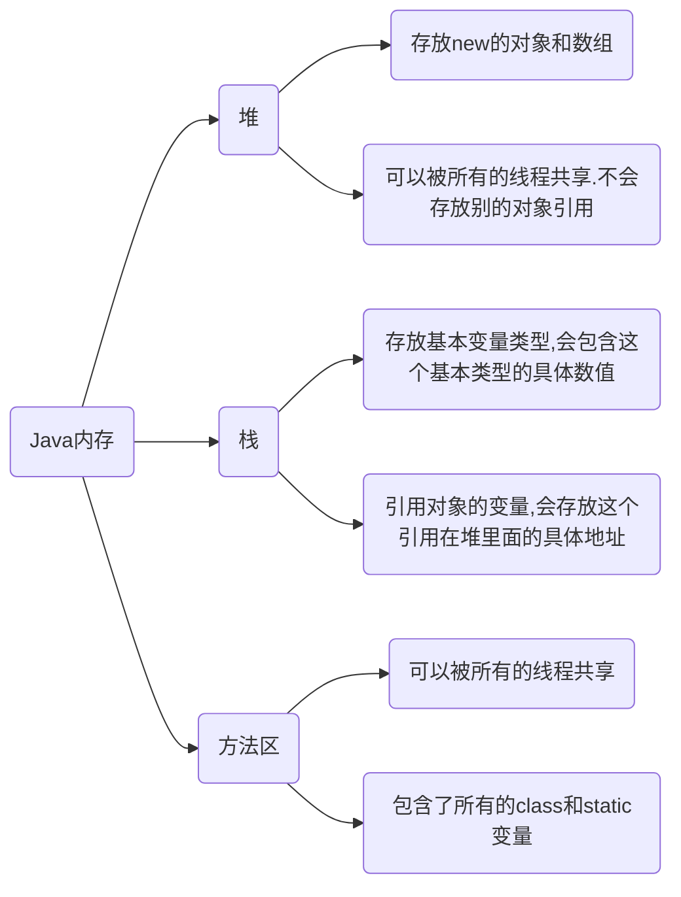

# 认识java

**JSE**

主要用于编写C/S项目和提供标准的JAVA类库，是所有基于Java语言开发的基础

**JME**

嵌入式开发，向手机里的软件、掌上电脑等等

**JEE**

用来构建大型网站和B/S系统 ，作为一个企业版本，主要是给出一个开发企业级应用架构的解决方案，同时给出了在这个架构中相关组件以供开发人员使用

**classpath**

操作系统利用classpath变量来寻找当前后缀为class的字节码文件所存放的路径，并以最先找到的为准

从JDK1.6开始，不需要手动设置

**JAVA_HOME**

JAVA_HOME是一个约定，通常它指的是JDK的目录。如果需要JDK的话，大部分程序会默认去环境变量中取JAVA_HOME这个变量。

**JVM**

JVM是Java Virtual Machine的缩写。它是一种基于计算设备的规范，是一台虚拟机，即虚构的计算机。

JVM屏蔽了具体操作系统平台的信息（显然，就像是我们在电脑上开了个虚拟机一样），当然，JVM执行字节码时实际上还是要解释成具体操作平台的机器指令的。

通过JVM，Java实现了平台无关性，Java语言在不同平台运行时不需要重新编译，只需要在该平台上部署JVM就可以了。因而能实现一次编译多处运行。(就像是你的虚拟机也可以在任何安了VMWare的系统上运行)

**JRE**

JRE是Java Runtime Environment的缩写，也就是JVM的运行平台，联系平时用的虚拟机，大概可以理解成JRE=虚拟机平台+虚拟机本体(JVM)。类似于你电脑上的VMWare+适用于VMWare的Ubuntu虚拟机。这样我们也就明白了JVM到底是个什么

**JDK**

Java Develop Kit，Java的开发工具包，JDK本体也是Java程序，因此运行依赖于JRE，由于需要保持JDK的独立性与完整性，JDK的安装目录下通常也附有JRE。目前Oracle提供的Windows下的JDK安装工具会同时安装一个正常的JRE和隶属于JDK目录下的JRE

**Java命令**

```
javac　编译源文件生成字节码文件

java      运行字节码文件

javadoc   由源文件中的文档注释生成html文档文件

-d 指定文档生成路径 
-encoding 设置文档编码
-charset 设置字符编码

javap   反编译显示类成员变量和成员函数首部

jar   把一些类的字节码文件压缩成一个jar文件
```

# Java基础

## 标准

```
区分大小写
强类型语言
文件名与类名(main()所在类)相同
一个Java文件中只能有一个public类
Java中字符和字符串都用Unicode编码表示
在Unicode编码中一个字符占两个字节
```

## Java文件命名

```
一个Java文件中只能有一个public类
如果文件中只有一个类，文件名必须与类名一致
如果文件中不止一个类，文件名必须与public类名一致
如果文件中不止一个类，而且没有public类，文件名可与任一类名一致
```

## 注释

```
注释一行
//
注释多行
/*  */
文档注释
/**
*
*
*/
```

## 关键字

关键字的字母全部小写 

## 标识符

包含：类名、变量名、常量名、方法名....

格式：以字母、下划线、`$`开始，后面可跟字母、下划线、`$`、数字

## 数据类型

### 基本数据类型

八大基本类型

**数值型**

```java
整数类型
// 整数默认是int类型，如果数字过大，则必须在末尾加 L 否则会出错
byte 
占一个字节，数字大小为 -2^7——2^7-1
short
占两个字节，数字大小为 -2^15——2^15-1
int
占四个字节，数字大小为 -2^31———2^31-1
long
占八个字节，数字大小为 -2^63——2^63-1


浮点型
// 实数默认是double类型，如果希望一个实数是float类型，可以在数字后加 F
float
占用四个字节
double
占八个字节
```

**字符型**

```java
// 单引号包裹
char
占两个字节，数字大小为0——2^16-1，是Unicode编码
```

**布尔型**

```java
boolean
占一个字节，只有两个值：true和false，且它们不能对应于任何整数值
if(3)  //if(3)不等价于if(true)
System.out.printf("123");
//是错误的
```

### 引用数据类型

引用类型其实就是C语言的指针类型

**类**

**接口**

**数组**

### 拓展

**特殊字符**

反斜线 `\\`、退格 `\b`、回车 `\r`、制表符 `\t`、换行 `\n`、单引号 `'`

**进制整数**

Java中二进制0b开头、八进制0开头、十六进制0x开头

**浮点数拓展**

BigDecimal类（金融计算常用）

## 类型转换

### 自动转换 

把小容量的类型转换为容量大的类型

```java
如
double a = 10;
```

### 强制转换

把大容量的类型转换为容量小的类型

```java
如
int a = (int)88.88;
```

注意

```
不能对boolean类型进行类型转换

把大容量的类型转换为容量小的类型时，容易缺失精度

整型、实型、字符型数据可混合运算，但要先转换为统一类型，转换从低级到高级（如：byte转int，因为byte占1字节，int占4字节，byte转int不丢失数据）
```

## 变量

程序运行过程中，值可以改变的量，实质是内存上的一块空间

```java
数据类型 变量名 = 变量值
如
int a = 3;
```

**类变量**

static修饰的变量

**实例变量**

实例变量，从属于对象，若不对变量进行初始化，则布尔值，默认false，除了基本类型默认值为0，其余的默认值都是null

**局部变量**

局部变量必须初始化即赋值后才可以使用，如果局部变量未赋值，编译无法通过。

例

```java
public class demo {

    // 类变量 static
    static int password;
    
    // 实例变量 ：从属于对象
    String name;
    int age;

    // main方法
    public static void main(String[] args) {

        //局部变量
        String $_a="asd";
        System.out.println($_a);
    }
    
    // 其他方法
    void func(){
        // 局部变量
    }
}
```

## 常量

初始化后不能再改变值，常量名一般全大写

```java
final 常量名 = 值;
例
final int MAX = 30;
```

final可以修饰成员方法，成员变量、类

```
修饰方法
表明方法是最终方法，不能被重写

修饰变量
表明变量是常量，不能再次被赋值

修饰类
表明类是最终类，不能被继承

修饰局部变量
变量是基本类型。表示基本数据类型的数据值不能发送改变
变量是引用类型。表示引用类型的地址值不能发生改变，但是地址里面的内容可以发生改变
```


## 运算符

**优先级问题**

使用括号`()`解决优先级问题

### 算术运算符

加`+` 、减`-`、乘`*`、除`/`

运算结果和运算对象的类型有关，若运算对象中有一个是浮点型，则结果也为浮点型，否则为整型

```java
public class AAA {
    public static void  main(String[] args){
        int a = 10;
        float b = 3;
        int c = 3;
        System.out.println(a/b); //结果为 3.3333333
        System.out.println(a/b); //结果为 3
    }

}
```

取余`%`

允许取余运算的被除数和除数是实数，所得的余数的正负只和被除数相同

```java
System.out.println(1%-0.3); //结果为0.10000000000000003
```

**字符的`+`操作**

拿字符的ASCII码来进行计算

当算术表达式包含多个基本数据类型的时候，整个算数表达式的类型会自动进行提升

```
byte类型，short类型和char类型都被提升到int类型
整个表达式自动提升到表达式中最高等级操作数同样的类型
```

**字符串的`+`操作**

当`+ `操作中出现字符串时，`+`表示字符串的连接

```java
"123" + "abc" 结果 "123abc"
```

当连续进行`+ `操作时，从左到右逐个执行(可以把非字符串转换成字符串)

```java
"x" + 32 + 1 结果 "x321"
    
32 + 1 + "x" 结果 "33x"

System.out.print('a' + 1); //结果为 98
System.out.print("" + 'a' + 1);  //结果为a1
```


### 关系运算符

`>`、`>=`、`<`、`<=`、`!=`、`==`

### 逻辑运算符

```
逻辑非！

结果取反

逻辑与&

两边的表达式只要有一个是假的，整个式子就为假，两边都会执行

逻辑或|

两边的表达式只要有一个是真的，整个式子就为真，两边都会执行
```

### 短路逻辑运算符

```
短路与&&

左边的表达式为假时，右边的表达式不执行

短路或||

左边的表达式为真时，右边的表达式不执行
```

### 赋值运算符

不推荐使用

`=`、`+=`、`*=`、`/=`、`%=`

扩展的赋值运算符，隐含了强制类型转换

### 自增自减运算符

不推荐使用

`++`、`--`

```java
如果放在变量前，就先执行自增或自减，然后变量才参与其他操作
++a，就先执行 a = a + 1，之后再执行其他操作

如果放在变量后，变量先参与其他操作，然后执行自增或自减
a++，就先执行操作，之后再执行 a = a + 1    
例
        int a=1;
        int b = ++a;
        System.out.println(b); //结果为2

	    int a=1;
        int b = a++;
        System.out.println(b); //结果为1
		
```

### 三元运算符

`关系表达式?表达式1:表达式2;`

```java
如：a > b ? a : b;

规则：
    首先计算表达式的值
    如果值为true，表达式1的值，为运算结果
    如果值为false，表达式2的值，为运算结果
```

### 位运算符

位运算效率高

按位与`&`：把两个数的二进制位相与

``` 
1 & 1 = 1
1 & 0 = 0
0 & 0 = 0
0 & 1 = 0
```

按位或`|`：把两个数的二进制位相或

```
1 | 1 = 1
1 | 0 = 1
0 | 0 = 0
0 | 1 = 1
```

按位取反`~`：把一个数字的二进制位取反

```
~1 = 0
~0 = 1
```

按位异或`^`：把两个数的二进制位异或

```
1 ^ 1 = 0
1 ^ 0 = 1
0 ^ 1 = 1
0 ^ 0 = 0
```

右移`>>`：右移运算符，num >> 1，相当于num除以2。当为正数时，前面补0，为负数时，前面补1

无符号右移`>>> `：忽略符号位，空位都以0补齐

左移`<<`：左移运算符，num << 1，相当于num乘以2。无论正负数，后面补0

### Math类

幂运算

```Java
// 计算2的3次方
Math.pow(2,3);
```

## Java包

package语句作为Java源文件的第一条语句，指明该源文件定义的类所在的包

本质就是文件夹，对类进行分类管理

```java
// 一般利用公司域名倒置作为包名
package 包名;
例
package sunrise;	//可以是合法标识符
package com.baidu.www;	//可以是若干标识符由`.`号分割
```

注意

```
类中的package命令不是非得放在类的第一行，其上可以写注释和空行，但是对于import、类、变量等命令，则一定不能放在package命令之上
```

**导包**

```java
import 包名;
引入包中所有类，用import 包名.*;
引入包中某个类，用import 包名.类名;
```

**权限**

| 修饰符    | 同包同类 | 同一个类中，子类无关类 | 不同包的子类 | 不同包的无关类 |
| --------- | -------- | ---------------------- | ------------ | -------------- |
| private   | 可以     |                        |              |                |
| 默认      | 可以     | 可以                   |              |                |
| protected | 可以     | 可以                   | 可以         |                |
| public    | 可以     | 可以                   | 可以         | 可以           |

## JavaDoc

javadoc命令使用源文件中的文档注释生成自己的api文档

```java
参数信息
@author 作者名
@version版本号
@since指明需要最早使用的jdk版本
@param参数名
@return返回值情况
@throws异常抛出情况
```

## Scanner类

```java
public class demo {
    public static void main(String[] args) {
        // 创建 Scanner 对象
        Scanner scanner = new Scanner(System.in);
        // 判断是否输入字符串
        if (scanner.hasNext()){
            // 使用next方法接收
            String str = scanner.next();
            System.out.println(str);
        }
        // 关闭io流
        scanner.close();
    }
}
```

### Scanner的方法

`nextByte()`方法用来读取用户输入的byte数据， `hasNextByte()`方法用来判断用户输入的数据类型是否为byte

这些方法执行时都会堵塞，等待输入回车确认

| 获取数据       | 判断数据          |
| -------------- | ----------------- |
| `nextByte()`   | `hasNextByte()`   |
| `nextDouble()` | `hasNextDouble()` |
| `nextFloat()`  | `hasNextFloat()`  |
| `nextInt()`    | `hasNextInt()`    |
| `nextLine()`   | `hasNextLine()`   |
| `nextLong`     | `hasNextLong()`   |
| `nextShort`    | `hasNextShort()`  |

```
next()不会吸取字符前/后的空格/Tab键，只吸取字符，开始吸取字符（字符前后不算）直到遇到空格/Tab键/回车截止吸取

nextLine()吸取字符前后的空格/Tab键，回车键截止
```

### 格式化输出

| 输出控制符       | 针对的数据类型                 |
| ---------------- | ------------------------------ |
| %d               | int，long int，short，byte     |
| %x，%X，%#x，%#X | int，long int                  |
| %c               | char                           |
| %f               | float，double                  |
| %m.nf            | 输出的数占m列，小数点后保留n位 |
| %s               | String                         |

注意

```
%x和%X的区别是显示十六进制数a-f的大小写

%x和%#x的区别是显示或不显示0x前缀

%n java中表示回行
```

三种输出

```java
System.out.print() //一般的标准输出，不换行
System.out.println() //一般的标准输出，换行    
System.out.printf() //格式化输出，不换行
```

## 流程控制

### 顺序

### 选择

if、else if、else、switch

equals方法 ：判断字符串是否相等

```java
public class demo {
    public static void main(String[] args) {
        Scanner scanner = new Scanner(System.in);
        if (scanner.hasNext()){
            String str = scanner.next();
            if (str.equals("aaa")) {
                System.out.println(str);
            }
        }
        scanner.close();
    }
}
```

### 循环

while、do while、for

**增强for循环**

```
简化数组和Collection集合的遍历
实现Iterable接口的类允许其对象成为增强型for语句的目标

for(元素类型 变量名 : 数组或Collection集合){
在此处使用变量即可，该变量就是元素
}
```

例

```java
class work{
    public static void main(String[] args) {

        List<String> c = new ArrayList<String>();
        c.add("hello");
        c.add("java");
        c.add("hello");

        for (String s:c){
            System.out.println(s);
        }
```

注意

```
continue，结束本次循环，开始下一次循环

break，停止循环

if、while、for中进行真假判断时，只能使用逻辑表达式
```

## 方法

具有独立功能的代码块

### 定义

```java
//方法头
修饰符 返回值类型 方法名(参数类型 参数名){
		//方法体
    return 参数;
}

如
    
public static void test(){
		...
         ...
}
```

注意

```
方法不能嵌套定义
```

### 方法调用

```java
方法名()
```

### 参数

形参、实参、可变参数

**可变参数**

```java
方法声明时，在指定参数类型后加一个省略号(...)
一个方法中只能指定一个可变参数，它必须是方法的最后一个参数。任何普通的参数必须在它
之前声明。
    
    例
    public void firstTest(char s,int ...i) { // i 就是可变参数
        if (i.length > 0) {
            System.out.println(i[0]);
        }
    }
```

### 方法重载

同一个类中的多个方法只有参数列表不同

```java
/*
多个方法在同一个类中
多个方法具有相同的方法名
多个方法的参数不同（参数类型不同或数量不同）
只与参数列表有关，与返回值无关
*/
import java.util.*;
class a{
    int jiafa(int c,int d){
        return c + d;
    }
    int jiafa(int c,int d,int e){
        return c + d + e;
    }
}
class test {
    public static void main(String[] args) {
        a A = new a();
        
        System.out.printf("%d\n",A.jiafa(1,2));
        System.out.printf("%d\n",A.jiafa(1,2,3));

    }
}
```

## 数组

### 声明&创建

```java
// 声明数组变量
int[] boys;			//推荐
或
int boys[];
// 使用new来创建数组
boys = new int[10];
```

### 初始化

**动态初始化**

初始化时，只指定数组长度，具体值由系统分配默认值

```Java
int[] boy = new int[3];
```

**静态初始化**

初始化时，只指定数组元素的具体值，无需指定数组的长度，由系统决定数组长度

```java
int[] boy = new int[]{1,2,3,4,5,6};
或
int[] boy = {1,2,3,4,5,6};
```

### 访问数组

使用索引访问数组中的元素，索引从0开始

### 内存分析




**栈内存**

声明数组变量后，数组变量进栈

**堆内存**

存储new出来的内容，new创建数组后，数组存在于堆中，栈中的数组变量指向堆中的数组

### 特点总结

```
数组中的元素可以是任何数据类型，包括基本类型和引用类型。

数组变量属引用类型，数组也可以看成是对象，数组中的每个元素相当于该对象的成员变量。

数组本身就是对象，Java中对象是在堆中的，因此数组无论保存原始类型还是其他对象类型,
数组对象本身是在堆中的。
```

### 数组的使用

获取数组的大小

```
数组名.length
```

数组作为返回值

```java
return 数组变量;
```

### Arrays类

打印数组元素，toString

```java
public class demo {
    public static void main(String[] args) {
        int[] boys;
        boys = new int[]{1,2,3};
        //打印数组元素
        System.out.println(Arrays.toString(boys));
    }
}
```

排序数组元素，sort

```java
public class demo {
    public static void main(String[] args) {
        int[] boys;
        boys = new int[]{1,20,3};
        // 按升序排序数组元素
        Arrays.sort(boys);
        System.out.println(Arrays.toString(boys));
    }
}
```

给数组赋值，fill

```

```

比较数组中元素的值，equals

```

```

查找数组元素，binarySearch

```java
// 通过binarySearch方法能对排序好的数组进行二分查找法操作
```

### 常见问题

索引越界

空指针异常

## 对象数组

使用基本数据类型的类创建数组，数组中的每个元素是对象

**声明**

```java
A m1,m2,m3;
//等价于
A [] m = new A[3];
```

**创建**

```java
package Test;

class A{
    A(int a){
        System.out.printf("%d\n",a);
    }
}
public class work {
    public static void main(String[] args) {

        A [] m = new A[3];

        m[0] = new A(2);
        m[1] = new A(3);
        m[2] = new A(4);

        for (int i=0;i<=2;i++){
            System.out.println(m[i]);
        }
    }
}
```

## Java类

### OOP思想

以类的方式组织代码，以对象的形式封装数据

### 三大特性

```
封装
继承
多态：操作多态、继承多态
```

### 类的构成

把一类事物的静态属性和动态可以执行的操作组合在一起所得到的这个概念就是类

```java
public class Car{
    //成员变量有默认值
    int high;
    int how_much;
    public void run(){
        // 局部变量必须先赋值，才能使用
        int speed = 80;
        System.out.println("hello world");
    }
}
```

**成员变量**

```
类中方法外的变量
位于堆内存
有默认的初始化值
伴随对象的产生和消亡
成员变量可以是Java允许的任何数据类型
```

**局部变量**

```
方法内或方法声明上
位于栈内存
没有默认的初始化值，必须先赋值，才能使用
伴随方法的产生和消亡
```

**方法**

静态方法（static修饰的）

非静态方法（不加static关键字的方法，在类定义时没有占用内存，只有在类被实例化成对象时，对象调用该方法才被分配内存）

注意：main方法，一个项目只能有一个main方法

### 类的访问控制

| 修饰符    | 同包同类 | 同一个类中，子类无关类 | 不同包的子类 | 不同包的无关类 |
| --------- | -------- | ---------------------- | ------------ | -------------- |
| private   | 可以     |                        |              |                |
| default   | 可以     | 可以                   |              |                |
| protected | 可以     | 可以                   | 可以         |                |
| public    | 可以     | 可以                   | 可以         | 可以           |

```java
default(默认)
类名前不加修饰，访问权限和protected一样

public
外部访问和内部访问都可以

protected
外部访问和内部访问都可以

private
只能内部访问
例
class A{
    private int i;
    public int j;
    protected int m;
    void b(){
        i = 4; 	//是正确的
    }
}
class test {
    public static void main(String[] args) {
        A a = new A();
        a.i = 4; 	//是错误的
        a.j = 3;
        a.m = 2;
    }
}
```

注意

```
在类的内部，所有成员可以互相访问，访问控制符是透明的。访问控制符是针对外部访问而言的

权限大小：私有< 默认< 保护< 公有
```

**外部访问**

```
通过类名
通过类对象名
通过子类访问
```

### 类的构造方法

类在创建时，该方法自动调用，用来给所创建的对象一个初始状态，IDEA右键 generate --> constructor快速生成构造方法

注意：类中有构造方法才能被实例化

```java
若不创建构造方法，则java会默认创建一个无参的构造方法
一旦定义了有参构造，无参构造就必须显示定义
构造方法名字必须与所在类的名字一样
构造方法没有返回值类型，也不能写void
一个类中可以有多个构造方法
构造方法可以有参也可以无参

例
class A{
        int i;
        int j;

        A() {}
        A(int c, int d){	//有参构造方法
            i = c;
            j = d;
        }
    }
```

### 一个标准的类

```Java
成员变量
使用private修饰

构造方法
提供一个无参构造方法
提供一个带多个参数的构造方法

成员方法
提供每一个成员变量对应的setXxx()、getXxx()
提供一个显示对象信息的show()

创建对象并为其成员变量赋值的两种方式
无参构造方法创建对象后使用setXxx()赋值
使用带参构造方法直接创建带有属性值的对象

例
class Student{
    // 成员变量
    private String name;
    private int age;
    //无参构造方法
    public Student(){};
    //有参构造方法
    public Student(String name,int age){
        this.name = name;
        this.age = age;
    }

    //成员方法
    public void setName(String name){
        this.name = name;
    }
    public String getName(){
        return name;
    }
    public void setAge(int age){
        this.age = age;
    }
    public int getAge(){
        return age;
    }
    public void show(){
        System.out.println(name + "," + age);
    }
}
```

### 对象

```
类的实例化结果，是一个具体的个体

生命周期是短暂的
```


**对象的引用**

用类创建一个对象时，对象中就存放着引用（指向对象实体的一个地址），如果两个对象有相同的实体就有相同的引用

**对象的实体**

用类创建一个对象时，成员变量被分配内存空间，，这些内存空间就是对象的实体

```java
class A{
int j;
int i;
}
class test{
public static void main(String[] args){
    A aa = new A(); //new A()，在堆中动态分配一块区域，被当作了A的对象实体
    				//aa本身的内存是在栈中分配的
    				//堆中内存的地址赋给了aa
    				//aa指向堆中的内存，aa代表了堆中的内存
    aa.j;    	     //aa.i代表aa这个静态指针变量所指向的动态内存中的A对象
    aa.i;
	}
}
```

### 对象的组合

一个类把对象作为自己的成员变量，那么创建对象时，该对象中就会有其他对象

```java
//该例子中，b类将a类对象作为自己的成员变量
class a{
    int aa = 11;
}

class b{
    int bb = 45;
    a group = new a();		// a类对象
}

public class work {
    public static void main(String[] args){
        b li = new b();
        System.out.println(li.group.aa);
    }
}
```

### this

代表所在类的对象引用，方法被哪个对象调用，this指的就是哪个对象。静态函数内部没有this指针

```java
class A{
    int x = 10;
    void num(int x){
        System.out.printf("%d\n",this.x);
        System.out.printf("%d\n",x);
    }

}

public class test{
    public static void main(String[] args){
        A a = new A();
        A b = new A();
        a.num(2);
        b.num(3);
    }
}
//结果
10
2
10
3
```

**用法**

```
this(参数列表)，访问本类构造方法(只能在构造方法中使用)
this.成员变量 ， 访问本类的成员变量
this.成员方法()，  访问本类成员方法
```

**注意**

当局部变量和成员变量同名的情况下必须使用this指定成员变量的变量名。如果二者名称不同，系统会自动隐含一个this，可以不写

```java
class A {
    int num = 0;

    public void normalNum(int num) {
        num = num;	//成员变量和局部变量重名
        System.out.println(num);
        System.out.println(this.num);
    }

}
public class test {
    public static void main(String[] args) {
        A a = new A();
        a.normalNum(10);
    }
}
//结果
10
0
```

### static

static是静态的意思

```
static声明了属性和方法是属于类本身的，不创建对象也可以直接访问(前提是非私有)

static 修饰的属性、方法和类一起加载

非静态方法可访问静态方法，而静态方法不能访问非静态
```

静态代码块

```java
// 最先执行，且只执行一次
static{

}
```

静态导入包

```java
import static java.lang.Math.random;
import static java.lang.Math.PI;
```

## 封装

高内聚，低耦合

将信息隐藏在类的内部，不允许外部程序直接访问，而是通过该类提供的方法来实现对隐藏信息的访问和操作成员变量private

如一个标准类的实现

```
private修饰 成员变量 

提供每一个成员变量对应的setXxx()、getXxx()

提供一个显示对象信息的show()
```

## 继承

```
JAVA中类只有单继承，没有多继承(单继承就是一个类只能有一个父类)
Java可以有多重继承，即一个类可以继承某一个类的子类
父类的私有不能被子类继承，其余都可以，但私有的数据或函数，可以通过可继承的函数set、get间接的去访问
一个新类从已有的类那里获得已有的属性和方法
子类(派生类)、父类(基类)
子类名的特点，子类名都应以其父类名作为子类名的后缀，如 FileOutputStream（子类）OutputStream（父类）
```

### Object类

Object类是Java`java.lang`包下的核心类，是所有类的父类，创建一个类的时候如果没有明确的继承一个父类的话，那么它就是Object的子类

```java
//二者等价
class Person { }

class Person extends Object { }
```

### extends

```java
子类名  extends 父类名
默认继承于Object，即 类名 extends Object
例
class family{
    int math = 1;
    String name = "张三";
}

class A extends family{	//继承于父类family
    int high = 180;
}

public  class  test {
    public static void main(String[] args) {
        A a = new A();
        System.out.printf("%d,%s\n",a.math,a.name);		//访问的是父类中的成员变量
    }
}    
```

### 变量访问的特点

在子类中访问一个变量，先在子类局部范围找，然后再到子类成员中找，最后到父类成员中找

```java
class family{
    int math = 1;
    int high = 170;
    String name = "张三";
}

class A extends family{	//继承于父类family
    int math = 2;
    String name = "赵四";
}
public  class work {
    public static void main(String[] args) {
        A a = new A();
        System.out.println(a.math  + a.name + a.high); //子类中找不到high变量，所以是父类中的high变量
    }
}
/*结果是
2赵四170
*/
```

### 构造方法的访问特点

```
子类不继承父类的构造方法

子类中的构造方法默认都会访问父类中的无参的构造方法。因为子类继承父类的数据，可能会使用父类的数据，所以在子类初始化前，一定先初始化父类

每个子类的构造方法的第一条默认语句都是super()，即父类的无参构造方法
```

### 成员方法的访问特点

通过子类对象访问一个方法，先在子类局部范围找，然后再到子类成员中找，最后到父类成员中找

```java
package Test;

class family{
    void mc(){
        System.out.println("这是父类");
    }
}

class A extends family{	//继承于父类family
    void mb(){
        System.out.println("这是子类");
    }
}
public  class work {
    public static void main(String[] args) {
        A a = new A();
        a.mc();
    }
}
/*
结果是
这是父类
*/
```

### 子类访问父类的方式

```
在子类内部访问父类成员
通过子类对象名访问父类成员
通过子类的类名访问父类成员
```

### super

代表父类对象引用

**用法**

子类使用super调用父类的构造方法或子类使用super调用被子类隐藏的成员变量和方法

```
super.成员变量，访问父类成员变量
super(参数)，访问父类的构造方法(只能在子类的构造方法里调用)
super.成员方法，访问父类成员方法
```

**注意**

```java
子类无法直接继承父类的构造方法，只能通过super语句
如果在子类的构造方法中，显示的写出了super语句，必须保证，该语句是第一条语句，否则出错
例
class family{
    public int i;
    public int j;
    family(int i,int j){
        this.i = i;
        this.j = j;
    }
}

class A extends family{
    public int c;
    A(int i,int j,int c){
        super(i,j);	//调用父类的构造方法
        //family(i,j);	//直接调用父类的构造方法是错的
        this.c = c;
    }
}
public  class  test {
    public static void main(String[] args) {
        A a = new A(1,2,3);
        System.out.printf("%d,%d\n",a.c,a.i);
    }
}
/*结果是
3,1
*/
```

### 成员变量隐藏

子类中定义的成员变量只要和父类中的成员变量同名（类型可以相同也可以不同），则子类会隐藏父类的同名变量。被隐藏的父类变量，在子类中可以使用`super`关键字引用

```java
class family{
    int math = 1;
    int high = 170;
}
class A extends family{	//继承于父类family
    String math = "2";		//隐藏了父类的 int math
    int high = 180;			// 隐藏了父类的 int high
    void show(){
        System.out.println(this.math + " " + this.high);    // 2 180
        System.out.println(super.math + " " + super.high);	//	1 170  通过super访问被隐藏的父类变量
    }
}
public  class work {
    public static void main(String[] args) {
        A a = new A();
        a.show();
    }
}
```

### 方法的重写

在子类中重新定义父类的方法

**条件**

```java
有子类、父类的继承关系
子类只能重写父类中的非静态方法
在子类中重写父类的方法时，子类方法的权限不能低于父类，父类的私有方法不能被重写，static、final修饰的方法也不能重写
子类方法抛出的异常范围必须低于父类方法
重写的方法，必须和被重写的方法具有相同的名称、参数列表、返回值类型（即除了方法体，其余必须相同）
例
class family{
    int math = 1;
    int high = 170;
    void pou(){
        System.out.println("这是被重写的方法");
    }
}
class A extends family{	//继承于父类family
    String math = "2";
    int high = 180;
    void pou(){		 //重写父类中的pou()方法
        System.out.println("这是重写后的方法");
    }
}
public  class work {
    public static void main(String[] args) {
        A a = new A();
        a.pou();
        // 父类的引用指向子类
        // // 对象能执行哪些方法，主要看对象左边的类型
        family f = new A(); //子类重写了父类的方法
        f.pou();
    }
}
```

## 多态

```java
一个对象的实际类型是确定的，但是可以指向的引用类型就不确定了
例
/*
new Student() 子类;
new Person() 父类;
*/
// 对象能执行哪些方法，主要看对象左边的类型
// 父类可以指向子类，但是不能调用子类独有的方法
Person s1 = new Student();
Object s2 = new Student();
Student s3 = new Student();
```

### 条件

```java
有继承关系
方法需要重写
父类引用指向子类对象 Father f1 = new Son();
```

注意

```
多态是方法的多态，属性没有多态
父类和子类，有联系类型转换异常 ClassCastException 
```

### 类型转换

**instanceof**

```java
// 当左面的对象是右面的类创建的对象时，该结果 true，否则为false
对象 instanceof 类
    
例
public class work {
    public static void main(String[] args) {

        A a = new A();
        System.out.println(a instanceof A); //结果为true
    }
}
```

**父转子**

强制转换

```java
Father f1 = new Son();
// 强制转换
Son f2 = (Son) f1;
```

注意：

```
强制转换后，可调用子类独有的方法
```

**子转父**

父类的引用指向子类

```java
Father f1 = new Son();//编译看左边，执行看右边
```

### 多态的形式

```
通过实现类对象实例化，叫接口多态

多态的形式：具体类多态，抽象类多态，接口多态

多态的前提：有继承或实现关系，有方法重写，有父(类/接口)引用指向(子/实现)类对象
```

## 抽象类

抽象类是对事物的抽象

抽象类和抽象方法必须使用 abstract 修饰

```java
public abstract class 类名{}	//抽象类
public abstract void 方法名();	//抽象方法
```

### 抽象方法

没有方法体的方法

```java
如
public abstract void show();
```

### 抽象类

不能new 抽象类，只能靠子类去实现它

类中若有抽象方法，则类必须定义为抽象类

抽象类中可以写普通的方法

抽象类的所有方法，必须由子类实现，若子类也是抽象类，则不必实现

```java
//重写抽象类中的方法，通过子类对象实例化来实现抽象类实例化

public abstract class Animal{
    public abstract void eat();
    public void sleep(){
        System.out.println("睡觉");
    }
}
class Cat extends Animal{	
    public void eat(){	//重写抽象类中的方法
        System.out.println("吃鱼");
    }
}

class demo{
    public static void main(String[] args){
	//  Animal a = new Animal();  //抽象类不能实例化
        Animal a = new Cat();		//多态实现实例化
        a.eat();
    }
}
```

```java
//子类是抽象类
public abstract class Animal{
    public abstract void eat();
    public void sleep(){
        System.out.println("睡觉");
    }
}
abstract class Cat extends Animal{	//子类定义为抽象类
}

class demo{
    public static void main(String[] args){
    }
}
```

### 抽象类的成员

```
成员变量
常量或变量

构造方法
有构造方法但是不能实例化，作用是用于子类访问父类数据的初始化

成员方法
可以有抽象方法，限定子类必须完整某些动作
也可以有非抽象方法，提高代码的复用性
```

### 抽象类名作为形参和返回值

方法的形参是抽象类名、方法的返回值是抽象类名，它们都对应该抽象类的子类对象

## 接口

java接口是对行为的抽象

### 接口特点

```java
public interface 接口名{}
```

接口用 interface 修饰

接口没有构造方法，所以接口不能实例化

接口中的所有定义其实都是抽象的 public abstract

### 接口实现类

用 implements 表示，通过类来实现接口

implements可以实现多个接口

接口实现类中需要重写接口中的所有方法，若该实现类是抽象类则不用

```Java
public class 类名 implements 接口1,接口2{}
```

例

```java
//重写接口中的抽象方法
public interface Jumpping {     //创建一个接口
    public abstract void jump();
}

class Cat implements Jumpping{    //用类实现一个接口
    public void jump() {    //重写接口中的抽象方法
        System.out.print("猫");
    }
}
class demo{
public static void main (String[] args){
    Jumpping j = new Cat();     //编译看左边，执行看右边
    j.jump();
    }
}
```

```java
//接口实现类是抽象类
public interface Jumpping {     //创建一个接口
    public abstract void jump();
}
abstract class Cat implements Jumpping{	//抽象类
}
class demo{
public static void main (String[] args){
    }
}
```

### 接口的成员

```java
成员变量
只能是常量
默认修饰符是public static final

构造方法
接口没有构造方法，因此接口不能实例化

成员方法
只能是抽象方法
默认修饰符是 public abstract
```

### 接口名作为形参和返回值

方法的形参是接口名，方法的返回值是接口名，它们都对应该接口的实现类对象

## 类&接口关系

```
类和类的关系
继承关系，只能单继承，但是可以多层继承

类和接口的关系
实现关系，可单实现，也可以多实现，还可以在继承一个类的同时实现多个接口

接口和接口的关系
继承关系，可以单继承，也可以多继承
```

## 抽象类&接口区别

|            | 成员区别                                     |
| ---------- | -------------------------------------------- |
| 抽象类     | 变量、常量、有构造方法、抽象方法、非抽象方法 |
| 接口       | 常量、抽象方法                               |
|            | **关系区别**                                 |
| 类与类     | 继承、单继承                                 |
| 类与接口   | 实现、单实现、多实现                         |
| 接口与接口 | 继承、单继承、多继承                         |
|            | **设计理念区别**                             |
| 抽象类     | 对类抽象，包括属性、行为                     |
| 接口       | 对行为抽象，主要是行为                       |

## 内部类

就是在一个类中定义一个类

## 匿名内部类

前提：存在一个类或接口，这里的类可以是具体的类，也可以是抽象类

本质：是一个继承了该类或实现了该接口的子类匿名对象

## 基本数据类型的类

| 数据类型 | 类包装    |
| -------- | --------- |
| byte     | Byte      |
| int      | Integer   |
| short    | Short     |
| long     | Long      |
| float    | Float     |
| double   | Double    |
| char     | Character |

### int和String转换

```java
int转String
返回int参数的字符串表示形式
public static String valueOf(int i)

String转int
将数字的字符串形式转为int类型，是Integer类中的方法
public static int parseInt(String s)
```

### Character类常用方法

```java
isDigit(char ch)//判断数字字符
isLetter(char ch)//判断字母字符
isLetterOrDigit(char ch)//判断数字字符或字母字符
isLowerCase(char ch)//判断小写字母字符   
isUpperCase(char ch)//判断大写字母字符    
toLowerCase(char ch)//转为小写形式    
toUpperCase(char ch)//转为大写字符    
isSpaceChar(char ch)//判断空格    
```

## String类

String类在java.lang包下，使用时不需要导包

String类代表字符串，Java程序中的所有双引号字符串，都是String类的对象

### 字符串的特点

```
字符串不可变，它们的值在创建后不能更改
字符串可被共享
字符串效果上相当于字符数组char[]，但底层原理是字节数组byte[]
```

### String构造方法

| 方法名                    | 说明                                 |
| ------------------------- | ------------------------------------ |
| public String()           | 创建一个空白字符串对象               |
| public String(char[] chs) | 根据字符数组的内容，来创建字符串对象 |
| public String(byte[] bys) | 根据字节数组的内容，来创建字符串对象 |
| String s = "abc"          | 直接赋值的方式创建字符串对象         |

例

```java
class Str{
    public static void main(String[] args) {

        String s1 = new String();
        System.out.println("s1:" + s1);

        char[] chs = {'a','b','c'};
        String s2 = new String(chs);
        System.out.println("s2:" + s2);

        byte[] bys = {97,98,99};    //a、b、c 在底层存储的值
        String s3 = new String(bys);
        System.out.println("s3:" + s3);

        String s4 = "abc";
        System.out.println("s4:" + s4);
    }
}
```

### String对象的特点

以new方法创建的字符串对象，每一次new都会申请一个内存空间，虽然内容相同，但是地址不同

```java
char[] chs = {'a','b','c'};
String s2 = new String(chs);
String s3 = new String(chs);
```

以`""`直接赋值的方式创建的字符串，只要字符串序列相同（顺序和大小写相同），无论在程序中出现几次，它们都属于同一个String对象

```java
String s2 = "123";
String s3 = "123";
```

### 字符串比较

字符串是对象，比较内容需要使用`equals()`

```java
class Str{
    public static void main(String[] args) {


        char[] chs = {'a','b','c'};
        String s2 = new String(chs);

        String s4 = "abc";

        String s5 = "abc";

        System.out.println(s5 == s4);   //true
        System.out.println(s5.equals(s4));  //true

        System.out.println(s5 == s2);   //false
        System.out.println(s5.equals(s2));  //true
    }
}
```

何时使用`==`做比较？

```
判断两个对象的引用是否一致

基本类型：比较的是数据值

引用类型：比较的是地址值
```

### 字符串遍历

获取字符串的长度`字符串对象.length()`

```java
for(int i=0;i<s5.length();i++){
    System.out.println(s5.charAt(i));       
    //指定索引处的字符值
}
```

### 总结

| 方法名                                 | 说明                             |
| -------------------------------------- | -------------------------------- |
| public boolean equals(Object anObject) | 比较字符串的内容，严格区分大小写 |
| public char charAt(int index)          | 返回字符串指定索引处的值         |
| public int length()                    | 返回此字符串的长度               |

## StringBuilder类

直接对字符串进行拼接，每次拼接，都会构建一个新的String对象，浪费内存

使用StringBuilder类可以解决这个问题，即所有操作都是对同一个String对象进行的

### StringBuilder构造方法

| 方法名                           | 说明                                   |
| -------------------------------- | -------------------------------------- |
| public StringBuilder()           | 创建一个空白可变字符串                 |
| public StringBuilder(String str) | 根据字符串的内容，来创建可变字符串对象 |

```java
class Str{
    public static void main(String[] args) {

        String s5 = "abc";
        
        StringBuffer sb = new StringBuffer(s5);
        System.out.println("ss" + sb);
    }
}
```

### StringBuilder的添加和反转

| 方法名                                | 说明                     |
| ------------------------------------- | ------------------------ |
| public StringBuilder append(任意类型) | 添加数据，并返回对象本身 |
| public StringBuilder reverse()        | 返回相反的字符序列       |

**添加**

```java
class Str{
    public static void main(String[] args) {

        //String s5 = "abc";

        StringBuffer sb = new StringBuffer();
        StringBuffer sb1 = sb.append("123");
        System.out.println("sb" + ":" + sb);	//sb的内容和sb1的内容一样
        System.out.println("sb1" + ":" + sb1);
        System.out.println(sb==sb1);			//地址相同
    }
}
//结果是
sb:123
sb1:123
true
```

**反转**

```java
class Str{
    public static void main(String[] args) {

        //String s5 = "abc";

        StringBuffer sb = new StringBuffer();
        StringBuffer sb1 = sb.append("123");

        System.out.println("sb" + ":" + sb);
        System.out.println("sb1" + ":" + sb1);

        sb1.reverse();

        System.out.println("sb" + ":" + sb);
        System.out.println("sb1" + ":" + sb1);
    }
}
//结果为
sb:123
sb1:123
sb:321
sb1:321

```

### StringBuilder的插入和删除

| 方法名                               | 说明                         |
| ------------------------------------ | ---------------------------- |
| public insert((int offset, 任意类型) | 在指定索引offset处插入值i    |
| public delete(int start, int end)    | 移除此序列的子字符串中的字符 |

```java
public class work {
    public static void main(String[] args) {
        StringBuffer sb = new StringBuffer();
        StringBuffer sb1 = sb.append("123456");
        sb1.insert(1,"abc");			// 1abc23456
        System.out.println(sb);
    }
}
```

### StringBuilder的替换

| 方法名                                         | 说明                                                   |
| ---------------------------------------------- | ------------------------------------------------------ |
| public replace(int start, int end, String str) | 使用给定 `String` 中的字符替换此序列的子字符串中的字符 |

```java
public class work {
    public static void main(String[] args) {
        StringBuffer sb = new StringBuffer();
        StringBuffer sb1 = sb.append("123456");
        sb1.replace(1,3,"abc");			// 1abc456
        System.out.println(sb);
    }
}
```

### String和StringBuilder的转换

**StringBuilder转为String**

通过toString()就可以实现把StringBuilder转换为String

```java
public String toString()
例
class Str{
    public static void main(String[] args) {

        StringBuffer sb = new StringBuffer();
        StringBuffer sb1 = sb.append("123");

        String s = sb.toString();	//实现转换
        System.out.println(s);
    }
}    
```

**String转为StringBuilder**

通过构造方法实现把String转换为StringBuilder

```java
public StringBuilder(String s)
例
class Str{
    public static void main(String[] args) {
        String s = "abc";
        StringBuilder sb = new StringBuilder(s);	//实现转换
        System.out.println(sb);
    }
}
```

## StringTokenizer类

将字符串分解成可被独立使用的单词

StringTokenizer一个对象称为字符串分析器

### 构造方法

| 方法名                                  | 说明                                                         |
| --------------------------------------- | ------------------------------------------------------------ |
| StringTokenizer(String s)               | 为字符串s构造一个分析器，使用默认的分隔符集合，即空格符（若干个空格被看做一个空格）、换行符、回车符、Tab符 |
| StringTokenizer(String s, String delim) | 为字符串s构造一个分析器，参数delim中的字符被作为分隔符       |

### 方法

| 方法名                  | 说明                                                         |
| ----------------------- | ------------------------------------------------------------ |
| String nextToken()      | 查找下一个标记，并返回当前单词                               |
| int countTokens()       | 获得可以调用此 tokenizer 的 nextToken 方法的次数，即计数变量的值 |
| boolean hasMoreTokens() | 测试此 tokenizer 的字符串中是否还有更多的可用标记。只要计数的变量的值大于0，该方法就返回true，否则返回false |

## 常用类

### Date类

Date类中只是对long数据的一种包装

| 方法                             | 说明                   |
| -------------------------------- | ---------------------- |
| 无参构造：public Date()          | 获取本地当前日期       |
| 有参构造：public Date(long time) | 将时间戳 long 转为日期 |
| public long getTime()            | 将日期转为long时间戳   |

```java
// System.currentTimeMillis()，返回当前时间与 1970 年 1 月 1 日0点（GMT）之间的时间差（以毫秒为单位测量）
Date now=new Date(System.currentTimeMillis());
```

**格式化时间**

使用DateFormat的子类SimpleDateFormat来实现日期的格式化

```java
先用构造方法:
public SimpleDateFormat（String pattern）
pattern 即日期格式:
年（yyyy）、月（MM）、日（dd）、时（HH）、分（mm）、秒（ss）、毫秒（SSS）

再用 DateFormat 将日期格式化:
public final String format(Date date);

例
Date now=new Date();
System.out.println("现在的时间:"+now);
//用构造方法
SimpleDateFormat matter=new SimpleDateFormat("yyyy-MM-dd-HH-mm");
//用 DateFormat 将日期格式化
System.out.println("现在的时间:"+matter.format(now));
```

注意：格式化的结果是字符串

```java
使用 DateFormat继承将字符串转为日期:
public Date parse(String source)throws ParseException
例
public  class demo {
    public static void main(String[] args) throws Exception {
        // 时间字符串
        String ss= "2023-02-13-18-56";
        Date nowTime=new Date();
        SimpleDateFormat matter=new SimpleDateFormat("yyyy-MM-dd-HH-mm");
        // 字符串转日期
        System.out.println(matter.parse(ss));
    }
}
```

### Calendar类

使用Calendar类的static方法创建对象

```java
public static Calendar getInstance() 
例
Calendar  calendar= Calendar.getInstance();			//初始化一个日历对象    
```

**设置时间**

```java
final void setTime( Date date) 
void setTimeZone( TimeZone value) 
final void set(int year,int month,int date)
final void set(int year,int month,int date,int hour,int minute)
final void set(int year,int month, int date, int hour, int minute,int second)
```

**获取时间**

| 方法名                        | 说明                                                         |
| ----------------------------- | ------------------------------------------------------------ |
| public int get(int field)     | 返回给定的日历字段的值，如年份、月份、小时、星期等信息。参数field的有效值由Calendar的静态常量指定(YEAR、MONTH、DAY_OF_MONTH、DAY_OF_WEEK、DAY_OF_YEAR、HOUR、MINUTE、SECOND、WEEK_OF_MONTH)，特别注意：1表示周日，7周六，0表示一月 |
| public long getTimeInMillis() | 可以将时间表示为毫秒                                         |

```java
   Calendar calendar= Calendar.getInstance();
   System.out.println(calendar.get(Calendar.YEAR));
```

### Math类

都是类方法（static修饰的），可通过Math直接调用

Math类里面提供的基本上都是基础的数学公式

### Random类

产生一个随机数。此外任何随机的操作都可以利用Random来处理

```java
Random random = new Random();
int t = random.nextInt(10);		//在范围 0 - 9 之间获取一个随机数
```

### System类

| 方法名                                 | 说明                     |
| -------------------------------------- | ------------------------ |
| public static void exit(int status)    | 终止当前运行的Java虚拟机 |
| public static long currentTimeMillis() | 返回当前时间，毫秒为单位 |

```java
class work{
    public static void main(String[] args) {

        System.exit(0);		// 直接退出虚拟机
        System.out.println("123");	//该语句不执行
    }
}
```

### Object类

Object类是类层次结构的根，每个类都可以将Object作为超类，所有类直接或间接继承自该类

构造方法

```java
public Object(){}
```

| 方法名                            | 说明                                                         |
| --------------------------------- | ------------------------------------------------------------ |
| public String toString()          | 建议重写该方法（按 Alt + insert，自动生成）                  |
| public boolean equals(Object obj) | 比较对象是否相等，默认比较地址，重写可比较内容（也可自动生成） |

### Arrays类

包含用于操作数组的各种方法

| 方法名                                 | 说明                           |
| -------------------------------------- | ------------------------------ |
| public static String toString(int[] a) | 返回数组的内容的字符串表示形式 |
| public static void sort(int[] a)       | 按数字顺序排列数组             |

```java
class work{
    public static void main(String[] args) {

       int a [] = {4,5,2,3,1};
        System.out.println(Arrays.toString(a));		//[4, 5, 2, 3, 1]
        Arrays.sort(a);
        System.out.println(Arrays.toString(a));		//[1, 2, 3, 4, 5]
    }
}
```

### Runtime类