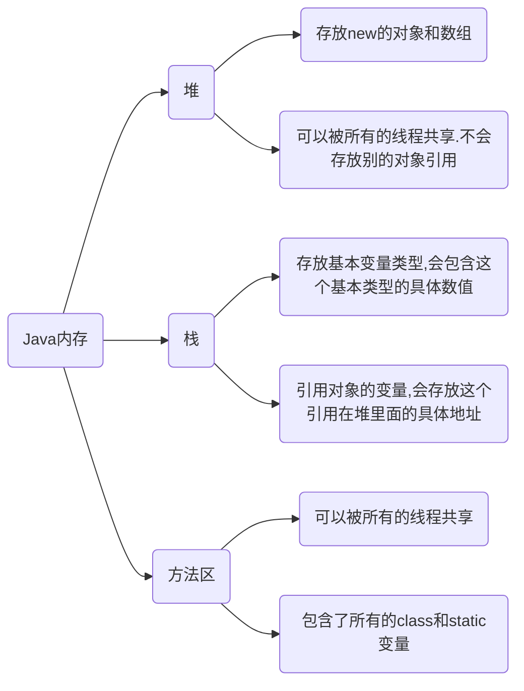

# 1. Annotation 注解

可以被其他程序（比如：编译器等）读取

注解是以 `@注解名` 在代码中存在的，还可以添加一些参数值

```java
@SuppressWarnings(value="unchecked")
```

可以附加在package、class、method、 field 等上面，相当于给他们添加了额外的辅助信息

可以通过反射机制编程实现对这些元数据的访问

## 1.1. 内置注解

**@Override**

**@Deprecated**

**@SuppressWarnings**

## 1.2. 元注解

负责注解其他注解

**@Target** 表示我们的注解可以用在哪些地方

**@Retention** 表示我们的注解在什么地方有效，runtime>class>sources

**@Documented** 表示是否将我们的注解生成在JAVAdoc中

**@Inherited** 说明子类可以继承父类中的该注解

## 1.3. 自定义注解

@interface用来声明一个注解

规定注解的参数格式：`参数类型 参数名()`

参数只能是基本类型 Class、String 、enum等 

可以通过 default 来声明参数的默认值，注解元素必须要有值，我们定义注解元素时，经常使用空字符串或0作为默认值

```java
// 使用自定义注解
// 注解可以显示赋值，如果没有默认值，我们就必须给注解赋值
@MyAnnotation(name = "嘿嘿")
public class annotate {
    public static void main(String[] args) {
        System.out.println("asd");
    }
}
// 自定义注解
@Target({ElementType.TYPE,ElementType.METHOD})
@Retention(RetentionPolicy.RUNTIME)
@ interface MyAnnotation{
    // 规定注解的参数：参数类型 + 参数名 + ()
    String name();
    // 通过 default 来声明参数的默认值
    int age() default 0;
}
```

# 2. Reflection 反射

反射机制允许程序在执行期借助于Reflection API取得任何类的内部信息，并能直接操作任意对象的内部属性及方法

**正常方式**


**反射方式**


## 2.1. 何为反射

加载完类之后，在堆内存的方法区中会产生一个Class类型的对象（一个类只有一个Class对象），这个对象就包含了完整的类的结构信息。可以通过这个对象看到类的结构。这个对象反射出了完整的类的结构信息，所以称为反射

反射对性能有影响

## 2.2. Reflection API

反射相关的主要API

Class  代表一个类

Method  代表类的方法

Field  代表类的成员变量

Constructor  代表类的构造器

# 3. Class类

一个类被加载后，class对象就会产生，并且类的整个结构都会被封装在Class对象中

在Object类中定义了以下的方法，此方法将被所有子类继承

```java
// 用于获取对象的运行时对象的类
public final Class getClass()
```

## 3.1. 特点

```
Class本身也是一个类
Class对象只能由系统建立，在堆中存放
一个加载的类在JVM中只会有一个Class实例
一个Class对象对应的是一个加载到JVM中的一个.class文件
每个类的实例都会记得自己是由哪个Class实例所生成
通过Class可以完整地得到一个类中的所有被加载的结构
Class类是Reflection的根源，针对任何你想动态加载、运行的类，唯有先获得相应的Class对象
```

## 3.2. 获取类的运行时结构

| 方法                                    | 功能                                                        |
| --------------------------------------- | ----------------------------------------------------------- |
| static ClassforName(String name)        | 返回指定类名的Class对象                                     |
| Object newInstance()                    | 调用缺省（即默认）构造函数，返回Class对象的一个实例         |
| getName()                               | 返回此Class对象所表示的实体（类，接口，数组类或void）的名称 |
| Class getSuperClass()                   | 返回当前Class对象的父类的Class对象                          |
| Class[] getinterfaces()                 | 获取当前Class对象的接口                                     |
| ClassLoader getClassLoader()            | 返回该类的类加载器                                          |
| Constructor[] getConstructors()         | 返回一个包含某些Constructor对象的数组                       |
| Method getMothed(String name,Class.. T) | 返回一个Method对象，此对象的形参类型为param Type            |
| Field[] getDeclaredFields()             | 返回类的所有属性                                            |

## 3.3. 获取Class类的实例

若已知具体的类，通过类的class属性获取，该方法最为安全可靠，程序性能最高

```java
Class cla = 类名.class
```

已知某个类的实例，调用该实例的getClass()方法获取Class对象

```java
Class cla = 对象名.getClass()
```

已知一个类的全类名，且该类在类路径下，可通过Class类的静态方法forName()获取，可能抛出ClassNotFoundException

```java
Class cla = Class.forName("com.baidu.www.类名");
```

基本数据类型的包装类可以直接用`类名.Type`

```java
Integer.TYPE
```

还可以利用ClassLoader

## 3.4. 哪些类型有Class对象

```
class：外部类，成员(成员内部类，静态内部类)，局部内部类，匿名内部类
interface：接口
[]：数组
enum：枚举
annotation：注解@interface
primitive type：基本数据类型
void
```

# 4. 类加载内存分析



**加载**

一个类被加载后，class对象就会产生

**链接**

链接的准备阶段，为static分配内存

**初始化**

执行类构造器`<clinit> ()`方法

## 4.1. 分析类初始化

**类的主动引用**

一定会发生类的初始化

当虚拟机启动，先初始化main方法所在的类

new一个类的对象

调用类的静态成员（除了final常量）和静态方法

使用java.lang.reflect包的方法对类进行反射调用

当初始化一个类，如果其父类没有被初始化，则先会初始化它的父类

```java
public class demo {
    static {
        System.out.println("Main类被加载");
    }
    public static void main(String[] args) throws Exception {
        Son s1 = new Son();
    }
}
class Father{
    static int b = 2;
    static {
        System.out.println("父类被加载");
    }
}
class Son extends Father{
    static {
        System.out.println("子类被加载");
    }
    static int m = 100;
    static final int M = 1;
}
```

**类的被动引用**

不会发生类的初始化

当访问一个静态域时，只有真正声明这个域的类才会被初始化。如：当通过子类引用父类的静态变量，不会导致子类初始化

通过数组定义类引用，不会触发此类的初始化

引用常量不会触发此类的初始化（常量在链接阶段就存入调用类的常量池中了）

## 4.2. 类加载器

类加载器作用是用来把类（class）装载进内存的

# 5. 动态创建对象

## 5.1. 创建类的对象

调用Class对象的newInstance()方法

```
类必须有一个无参数的构造器
类的构造器的访问权限需要足够
```

调用类中的构造器，传递参数，进行实例化

```
通过Class类的getDeclaredConstructor(Class .. parameterTypes)取得本类的指定形参类型的构造器
向构造器的形参中传递一个对象数组进去，里面包含了构造器中所需的各个参数
通过Constructor实例化对象
```

## 5.2. 调用类的方法

通过Class类的getMethod(String name,Class... parameterTypes)方法取得一个Method对象，并设置此方法操作时所需要的参数类型

之后使用Object invoke(Object obj, Object[] args)进行调用，并向方法中传递要设置的obj对象的参数信息

使用 Object invoke(Object obj, Object ... args) 激活

若原方法声明为private，则需要在调用此invoke()方法前，显式调用方法对象setAccessible(true)方法，取消Java语言访问检查

# 6. 获取泛型信息
...

# 7. 获取注解信息

```java
Annotation[] annotations = c1.getAnnotations()

```


