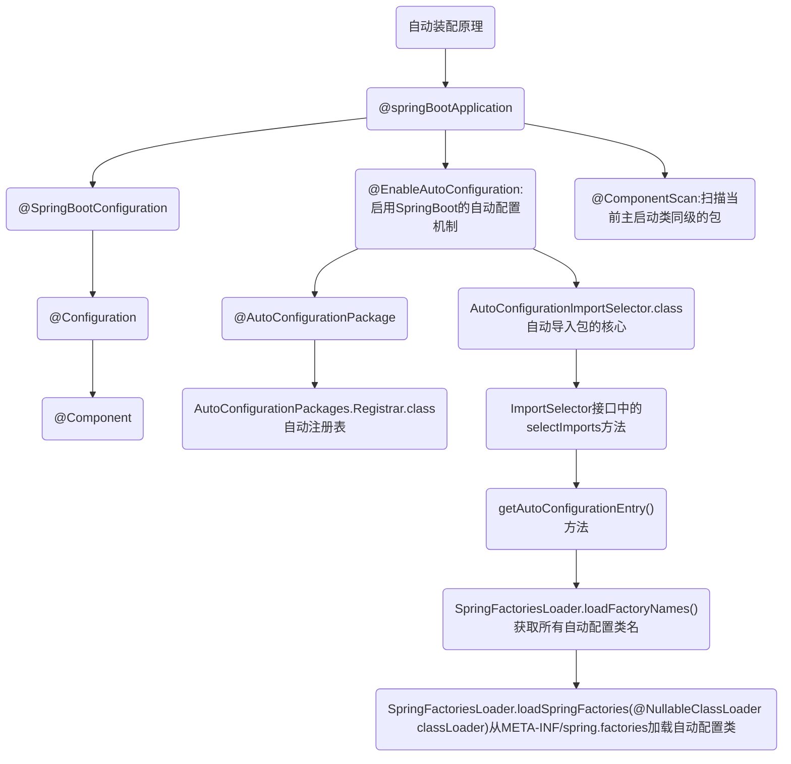

# 1. 什么是 SpringBoot 自动装配

SpringBoot的核心：自动装配

使用Spring时，在开启某些 Spring 特性或者引入第三方依赖的时候，还是需要用 XML 或 Java 进行显式配置

使用Spring Boot，通过 Spring Boot 的全局配置文件 application.properties 或 application.yml 即可对项目进行设置，比如更换端口号，配置 Mybatis 属性等

SpringBoot 定义了一套接口规范，规定：SpringBoot 在启动时会扫描外部引用 jar 包中的`META-INF/spring.factories`文件，将文件中配置的类型信息加载到 Spring 容器（此处涉及到 JVM 类加载机制与 Spring 的容器知识），并执行类中定义的各种操作。对于外部 jar 来说，只需要按照 SpringBoot 定义的标准，就能将自己的功能装置进 SpringBoot

Spring Boot中要引入第三方依赖，直接引入一个 starter 即可。引入 starter 之后，我们通过少量注解和一些简单的配置就能使用第三方组件提供的功能了

## 1.1. 自动装配原理

SpringBoot 的核心注解  @SpringBootApplication

**@SpringBootApplication** 看作是 @Configuration、@EnableAutoConfiguration、@ComponentScan 注解的集合。这三个注解的作用分别是：

- @EnableAutoConfiguration：启用 SpringBoot 的自动配置机制
- @Configuration：允许在上下文中注册额外的 bean 或导入其他配置类
- @ComponentScan： 扫描被@Component（@Service，@Controller）注解的 bean，注解默认会扫描启动类所在的包下所有的类 ，也可以自定义不扫描某些 bean

```java
// @SpringBootApplication的部分源码
@SpringBootConfiguration
@EnableAutoConfiguration
@ComponentScan(
    excludeFilters = {@Filter(
    type = FilterType.CUSTOM,
    classes = {TypeExcludeFilter.class}
), @Filter(
    type = FilterType.CUSTOM,
    classes = {AutoConfigurationExcludeFilter.class}
)}
)
```

**@EnableAutoConfiguration** 是实现自动装配的重要注解，自动装配核心功能的实现实际是通过 AutoConfigurationImportSelector类，即 @EnableAutoConfiguration 源码中的 @Import({AutoConfigurationImportSelector.class})

```java
// @EnableAutoConfiguration的部分源码
@AutoConfigurationPackage	// 作用：将main包下的所有组件注册到容器中
@Import({AutoConfigurationImportSelector.class})  //加载自动装配类 xxxAutoconfiguration
```

**AutoConfigurationImportSelector**实现加载自动装配类 `xxxAutoconfiguration`。AutoConfigurationImportSelector类的继承体系如下：可以看出 AutoConfigurationImportSelector 类实现了 ImportSelector接口中的 selectImports方法，该方法主要用于获取所有符合条件的类的全限定类名，这些类需要被加载到 IOC 容器中

```java
public class AutoConfigurationImportSelector implements DeferredImportSelector, BeanClassLoaderAware, ResourceLoaderAware, BeanFactoryAware, EnvironmentAware, Ordered {

}

public interface DeferredImportSelector extends ImportSelector {

}

public interface ImportSelector {
    String[] selectImports(AnnotationMetadata var1);
}
```

ImportSelector接口中的selectImports方法源码如下：

```java
public String[] selectImports(AnnotationMetadata annotationMetadata) {
    if (!this.isEnabled(annotationMetadata)) { // 判断自动装配开关是否打开
        return NO_IMPORTS;
    } else {	// 获取所有需要装配的bean
        AutoConfigurationImportSelector.AutoConfigurationEntry autoConfigurationEntry = this.getAutoConfigurationEntry(annotationMetadata);
        return StringUtils.toStringArray(autoConfigurationEntry.getConfigurations());
    }
}
```

**getAutoConfigurationEntry()**方法，AutoConfigurationImportSelector类调用这个方法，主要负责加载自动配置类

```java
// getAutoConfigurationEntry()方法的源码
protected AutoConfigurationImportSelector.AutoConfigurationEntry getAutoConfigurationEntry(AnnotationMetadata annotationMetadata) {
    if (!this.isEnabled(annotationMetadata)) {	// 1.判断自动装配开关是否打开。默认spring.boot.enableautoconfiguration=true，可在 application.properties 或 application.yml 中设置
        return EMPTY_ENTRY;
    } else {
        // 2.用于获取EnableAutoConfiguration注解中的 exclude 和 excludeName
        AnnotationAttributes attributes = this.getAttributes(annotationMetadata);
        List<String> configurations = this.getCandidateConfigurations(annotationMetadata, attributes);
        // 3.获取需要自动装配的所有配置类，读取META-INF/spring.factories
        configurations = this.removeDuplicates(configurations);
        Set<String> exclusions = this.getExclusions(annotationMetadata, attributes);
        this.checkExcludedClasses(configurations, exclusions);
        configurations.removeAll(exclusions);
        // 4.这一步会筛选，所以 spring.factories中这么多配置，不是每次启动都要全部加载。只有 @ConditionalOnXXX 中的所有条件都满足，该类才会生效
        configurations = this.getConfigurationClassFilter().filter(configurations);
        this.fireAutoConfigurationImportEvents(configurations, exclusions);
        return new AutoConfigurationImportSelector.AutoConfigurationEntry(configurations, exclusions);
    }
}
```

## 1.2. 实现一个 Starter

如：实现自定义线程池

手动实现一个 Spring Boot 启动器（Starter），需要完成以下步骤：

**创建一个 Maven 项目**

用于存储定制的 Starter

**添加依赖**

在项目的 pom.xml 文件中添加以下依赖：

```xml
<dependency>
    <groupId>org.springframework.boot</groupId>
    <artifactId>spring-boot-autoconfigure</artifactId>
    <version>2.6.3</version>
</dependency>
```

这个依赖包含了 Spring Boot 的自动配置模块，它允许你通过 Java 代码来自定义 Spring Boot 的自动配置

**创建自动配置类**

创建一个自动配置类，用于自定义 Spring Boot 的自动配置。这个类应该包含一个 `@Configuration` 注解和一个 `@ConditionalOnClass` 注解，用于指定自动配置类的条件，例如：

```java
@Configuration
@ConditionalOnClass(MyService.class)
public class MyAutoConfiguration {
    @Bean
    @ConditionalOnMissingBean
    public MyService myService() {
        return new MyService();
    }
}
```

这个自动配置类会在项目中存在 `MyService` 类时自动生效，它会创建一个名为 `myService` 的 Bean 并将它添加到 Spring 应用程序上下文中

**创建 Starter 类**

创建一个 Starter 类，用于提供自动配置类和其他必要的依赖。这个类应该包含一个 `@Configuration` 注解和一个 `@EnableConfigurationProperties` 注解，用于启用自动配置和配置属性的支持，例如：

```java
@Configuration
@EnableConfigurationProperties(MyProperties.class)
@AutoConfigureAfter(MyAutoConfiguration.class)
public class MyStarterAutoConfiguration {
    @Autowired
    private MyProperties properties;

    @Bean
    public MyService myService() {
        return new MyService(properties.getGreeting());
    }
}
```

这个 Starter 类会自动启用 `MyAutoConfiguration` 自动配置类，并创建一个名为 `myService` 的 Bean，它使用 `MyProperties` 配置类中的属性来初始化 `MyService` 类的实例

**创建配置属性类**

创建一个配置属性类，用于定义 Starter 的配置属性。这个类应该包含一个 `@ConfigurationProperties` 注解，用于指定配置属性的前缀和默认值，例如：

```java
@ConfigurationProperties("my.starter")
public class MyProperties {
    private String greeting = "Hello";

    public String getGreeting() {
        return greeting;
    }

    public void setGreeting(String greeting) {
        this.greeting = greeting;
    }
}
```

这个配置属性类定义了一个名为 `greeting` 的属性，它的默认值是 "Hello"。这个属性可以在 Starter 类中使用，用于初始化 `MyService` 类的实例。

**打包和安装 Starter**

在项目的根目录中运行以下命令，将 Starter 打包并安装到本地 Maven 仓库中：

```
mvn clean install
```

现在你已经手动实现了一个 Spring Boot Starter。要在其他项目中使用它，只需在项目的 pom.xml 文件中添加以下依赖：

```xml
<dependency>
    <groupId>com.example</groupId>
    <artifactId>my-starter</artifactId>
    <version>1.0.0</version>
</dependency>
```

这个依赖会自动引入 Starter 类和其他必要的依赖，使你可以在项目中使用 `MyService` 类和其他相关的组件

## 1.3. 总结

Spring Boot 通过@EnableAutoConfiguration开启自动装配，通过 SpringFactoriesLoader 最终加载META-INF/spring.factories中的自动配置类实现自动装配，自动配置类其实就是通过@Conditional按需加载的配置类，想要其生效必须引入`spring-boot-starter-xxx`包实现起步依赖

给容器中自动配置类添加组件的时候，会从properties类中获取默认属性。我们只需要在配置文件中指定这些属性的值即可

核心：xxxAutoConfiguration（SpringBoot自动装配）--> xxxxProperties封装配置文件中相关属性（可在配置文件中修改默认值）

结论：SpringBoot所有的自动配置都是在启动的时候描并加载，spring.factories所有的自动配置类都在这里，但是不一定生效，因为要判断条件是否成立，只要导入了对应的Starter，就有了启动器，自动装配就会生效，然后就配置成功




# 2. 主启动类的运行

SpringApplication类主要做了如下内容：

```
推断应用的类型是普通的项目还是Web项目

推断并设置main方法的定义类，找到运行的主类

找出所有的应用程序监听器，设置到listeners属性中

查找并加载所有可用初始化器，设置到 initializers 属性中
```

# 3. 搭建SpringBoot环境

初始化时，默认链接访问失败，就用国内的 https://start.springboot.io/

在 Spring Initializr 中创建一个新项目时，各个参数的含义

```xml
// 公司域名
<groupId>com.yatoil</groupId>  
//项目名称
<artifactId>yt-dorm</artifactId>  
```

## 3.1. SpringBoot 单模块项目构建（常规）

直接使用Spring Initializr按步骤走即可 

## 3.2. SpringBoot 多模块项目构建（父/子模块）

创建项目结构：使用Spring Initializr 创建一个父目录，只留下`pom.xml`文件，之后在父目录下创建子模块`new module`

```
demo-projectName（父）
	--> demo-moduleName1（子）
	--> demo-moduleName2（子）
	--> ...
pom.xml（父级）
```

各级项目建立关联：在父目录下的`pom.xml`中配置

```xml
<!-- 对于聚合模块来说，其打包方式必须为pom，否则无法构建 -->
<packaging>pom</packaging>
<!-- 指明聚合的模块 -->  
<modules> 
	<module>demo-moduleName1</module> 
	<module>demo-moduleName2</module> 
</modules>
```

子级继承父级的项目依赖：在子级项目的`pom.xml`中配置

```xml
<!-- 指定当前项目的父项目，用于自动继承父项目的依赖项、插件、资源等配置信息 -->
<parent>  
    <groupId>org.springframework.boot</groupId>  
    <artifactId>spring-boot-starter-parent</artifactId>  
    <version>2.7.14</version>  
    <relativePath/>
</parent>
```

# 4. SpringBoot配置文件

SpringBoot使用一个全局的配置文件，配置文件名称是固定的

**不同名称的配置文件的优先级**

```
application.properties > application.yml
```

## 4.1. application.properties

```
语法结构：key=value
server.port=8888
```

## 4.2. application.yml（推荐）

```
语法结构：key:空格value
server:
	port: 80
```

## 4.3. 读取配置文件的内容

假如application.yml配置文件中有如下内容
```yml
user:
	name: admin
	password: admin123
```

**方法一：@ConfigurationProperties**

如果专门编写了一个JavaBean来和配置文件进行映射，则推荐使用 `@ConfigurationProperties`

使用前需要先在pom.xml中引入一个依赖（否则会报`Spring Boot Configuration Annotation Processor not configured`）

```xml
<dependency>
    <groupId>org.springframework.boot</groupId>
    <artifactId>spring-boot-configuration-processor</artifactId>
</dependency>
```

先用 `@ConfigurationProperties(prefix = "配置文件中的类名")` 绑定配置文件

```java
// java 类
@Component
@ConfigurationProperties(prefix = "user")
public class User{
    private String name;
    private String password;

	public Person(){}
	/**
	get()
	set()
	*/
}
```

使用时注入该Java Bean后，即可使用

```java
@Autowired 
private User user;
```

**方法二：@Value**

如果获取的参数较少，则推荐直接使用`@Value("${...}")`获取即可

```java
@Value("${user.name}")
private String name;
```

**方法三：Environment Object**

使用时先注入Environment Object 

```java
@Autowired
private Environment env;
```

需要使用配置文件中的内容时
```java
String name = env.getProperty("user.name");
```


## 4.4. 多种环境的配置

application-dev.yml 开发环境、application-prod.yml 生产环境

在application.yml 中选择激活哪个环境

```yml
server: 
	port: 8081
spring:
	profiles :
		active: dev  # dev表示激活开发环境  prod表示激活生产环境
```

## 4.5. 代替xml配置文件

所有第三方组件的xml配置文件都可以被yml中的配置代替，如 `mybatis-config.xml`、`logback.xml`等，但是xml中配置项过多时，建议使用xml配置文件，之后在yml中引入

# 5. 参数校验

通常使用Spring自带的Validation校验参数

# 6. 使用Lombok库

可以实现使用注解代替实体Bean的getter and setter等，新手不建议使用

在pom.xml中导入依赖

```xml
<dependency>  
    <groupId>org.projectlombok</groupId>  
    <artifactId>lombok</artifactId>  
</dependency>
```

相关注解

```java
@Data
使用这个注解，就不用再去手写Getter,Setter,equals,canEqual,hasCode,toString等方法了，注解后在编译时会自动加进去
@AllArgsConstructor
使用后添加一个构造函数，该构造函数含有所有已声明字段属性参数
@NoArgsConstructor
使用后创建一个无参构造函数
```

eg：使用 @Data 注解来自动生成 User 类的 getter、setter、equals、hashCode 和 toString 方法。可以直接通过对象的属性来访问和修改属性值，不需要手动编写 getter 和 setter 方法

```java
@Data
public class User {
    private Long id;
    private String name;
}
```

# 7. 国际化

i18n 全称 Internationalization，也就是国际化的意思，因为单词太长，所以中间的 18 个字母被缩写为 18，再加上开头和结尾的字母，就组成了 i18n。

通常要实现的效果是，前端有个按钮可以切换语言，对于前后端分离的项目建议把国际化做在前端。

# 8. [Spring Data](https://spring.io/projects/spring-data)

对于数据访问，无论是SQL（关系型数据库）还是NoSQL（非关系型数据库），Spring Boot底层都是采用Spring Data的方式进行统一处理

Spring Boot2.X访问关系型数据库的三种主流姿势JDBC、MyBatis、JPA

**使用Java操作数据库必须先在pom.xml中导入对应的数据库驱动**

如：MySQL

```xml
<dependency>
    <groupId>mysql</groupId>
    <artifactId>mysql-connector-java</artifactId>
    <version>5.1.48</version>
</dependency>
```

**操作MongoDB**

在pom.xml中导入依赖
```xml
<dependency>
  <groupId>org.springframework.boot</groupId>
  <artifactId>spring-boot-starter-data-mongodb</artifactId>
</dependency>
```

yml 文件中添加以下配置项

```yml
spring:
	data:  
	  mongodb:  
	    host: 192.168.163.5  
	    username: "root"  
	    password: "root"  
	    port: 27017  
	    authentication-database: test  
	    database: dormitory  
	    auto-index-creation: true
```

**操作Redis**

在pom.xml中导入依赖

```xml
<dependency>  
    <groupId>org.springframework.boot</groupId>  
    <artifactId>spring-boot-starter-data-redis</artifactId>  
</dependency>
```

yml 文件中添加以下配置项

```yml
spring: 
	redis:  
	  host: 192.168.163.5  
	  port: 6379  
	  password: "root"  
	  database: 4  
	  pool:  
	      max-active: 10  
	      max-wait: -1  
	      max-idle: 8  
	      min-idle: 0  
	      timeout: 5000
```

## 8.1. JDBC操作数据

在pom.xml中导入依赖

```xml
<dependency> 
	<groupId>org.springframework.boot</groupId> 
	<artifactId>spring-boot-starter-jdbc</artifactId> 
</dependency>
```

**操作MySQL**

在pom.xml中导入依赖

```xml
<dependency>
    <groupId>mysql</groupId>
    <artifactId>mysql-connector-java</artifactId>
    <version>5.1.48</version>
</dependency>
```

yml 文件中添加以下配置项

```yml
spring:
  datasource:
    username: root
    password: root
    url: jdbc:mysql://localhost:3306/test?serverTimezone=UTC&useSSL=false&useUnicode=true&characterEncoding=UTF-8
    driver-class-name: com.mysql.jdbc.Driver
```

注意

```
com.mysql.cj.jdbc.Driver 适用于MySQL 8.x  

com.mysql.jdbc.Driver 适用于MySQL5.x 
```

## 8.2. Mybatis操作数据

在pom.xml中导入依赖，mybatis会自动引入jdbc部分依赖，所以不用手动添加jdbc依赖

```xml
<dependency>
    <groupId>org.mybatis.spring.boot</groupId>
    <artifactId>mybatis-spring-boot-starter</artifactId>
    <version>2.1.3</version>
</dependency>
```

yml 文件中添加以下配置项

```yml
# 整合mybatis
mybatis:
  # 搜索指定包别名
  type-aliases-package: com.exam.**.domain
  # 配置mapper的扫描，找到所有的mapper.xml映射文件
  mapper-locations: classpath:mapper/*.xml
  # 加载全局的配置文件  
  configLocation: classpath:mybatis/mybatis-config.xml
```

## 8.3. MyBatis-Plus操作数据

在pom.xml中导入依赖

```xml
<dependency>
    <groupId>com.baomidou</groupId>
    <artifactId>mybatis-plus-boot-starter</artifactId>
    <version>3.4.3.1</version>
</dependency>
```

yml 文件中添加以下配置项

```yml
mybatis-plus:
  mapper-locations: classpath:mapper/*.xml
```


## 8.4. 在SpringBoot中使用多个数据源

**方法一：使用 Spring Boot 自带的多数据源配置**

yml 文件中添加以下配置项

```xml
spring:
  datasource:
  # 主数据源
    primary:
      url: jdbc:mysql://localhost:3306/test1?useSSL=false&serverTimezone=UTC
      username: root
      password: root
      driver-class-name: com.mysql.cj.jdbc.Driver
   ＃二号数据源   
    secondary:
      url: jdbc:mysql://localhost:3306/test2?useSSL=false&serverTimezone=UTC
      username: root
      password: root
      driver-class-name: com.mysql.cj.jdbc.Driver
```

在代码中通过 `@Qualifier` 注解来指定使用哪个数据源

```java
@Service
public class UserService {
    @Autowired
    @Qualifier("primaryDataSource")
    private DataSource primaryDataSource;

    @Autowired
    @Qualifier("secondaryDataSource")
    private DataSource secondaryDataSource;

    // ...
}
```

**方法二：使用第三方工具**

如 MyBatis-Plus

# 9. SpringBoot数据库连接池

springboot2.x默认数据库连接池是HikariCP 

## 9.1. SpringBoot整合Druid

Druid是高性能的关系型数据库连接池，它是阿里巴巴的一个开源项目。支持所有JDBC兼容的数据库，包括Oracle、MySQL、Derby、PostgreSQL、SQL Server、H2等。提供了丰富的监控和统计功能，可以帮助开发者更好地管理数据库连接

在pom.xml中导入依赖

```xml
<dependency>
	<groupId>com.alibaba</groupId>  
	<artifactId>druid-spring-boot-starter</artifactId>
    <version>1.1.5</version>
</dependency>
```

yml 文件中添加以下配置项

```yml
spring:
  datasource:
    url: jdbc:mysql://localhost:3306/test?useSSL=false&serverTimezone=UTC
    username: root
    password: root
    driver-class-name: com.mysql.cj.jdbc.Driver
    # 指定使用 Druid 数据源
    type: com.alibaba.druid.pool.DruidDataSource
    # 配置 Druid 数据源相关属性
    druid:
      # 初始连接数
      initialSize: 5
      # 最小连接池数量
      minIdle: 10
      # 最大连接池数量
      maxActive: 20
      # 配置获取连接等待超时的时间
      maxWait: 60000
      # 配置连接超时时间
      connectTimeout: 30000
      # 配置网络超时时间
      socketTimeout: 60000
      # 配置间隔多久才进行一次检测，检测需要关闭的空闲连接，单位是毫秒
      timeBetweenEvictionRunsMillis: 60000
      # 配置一个连接在池中最小生存的时间，单位是毫秒
      minEvictableIdleTimeMillis: 300000
      # 配置一个连接在池中最大生存的时间，单位是毫秒
      maxEvictableIdleTimeMillis: 900000
      # 配置检测连接是否有效
      validationQuery: SELECT 1 FROM DUAL
      testWhileIdle: true
      testOnBorrow: false
      testOnReturn: false
      webStatFilter:
        enabled: true
      statViewServlet:
        enabled: true
        # 设置白名单，不填则允许所有访问
        allow:
        url-pattern: /druid/*
        # 控制台管理用户名和密码
        login-username: yatoil
        login-password: xxb-88809
      filter:
        stat:
          enabled: true
          # 慢SQL记录
          log-slow-sql: true
          slow-sql-millis: 1000
          merge-sql: true
        wall:
          config:
            multi-statement-allow: true
```

# 10. Spring Boot日志框架

在Spring Boot 中导入`spring-boot-starter-web`后，不需要单独引入SLF4J 和 Logback，可直接使用

# 11. Spring Boot全局异常处理（重点）

通常情况下我们用`try.....catch....`对异常进行捕捉处理，但是在实际项目中对业务模块进行异常捕捉，会造成代码重复和繁杂， 我们希望代码中只有业务相关的操作，所有的异常我们单独设立一个类来处理它

我们在可能发生异常的方法里`throw`抛给控制器。然后由全局异常处理器对异常进行统一处理

```java
@Controller
public class SysIndexController 
{
    /**
     * 首页方法
     */
    @GetMapping("/index")
    public String index(ModelMap mmap)
    {
        /**
         * 模拟用户未登录，抛出业务逻辑异常
         */
        SysUser user = ShiroUtils.getSysUser();
        if (StringUtils.isNull(user))
		{
            throw new LoginException("用户未登录，无法访问请求。");
        }
		mmap.put("user", user);
        return "index";
    }
}
```

## 11.1. 配置全局异常处理类

首先，我们需要新建一个类，在这个类上加上`@ControllerAdvice`或`@RestControllerAdvice`注解，这个类就配置成全局处理类了。（这个根据Controller层用的是`@Controller`还是`@RestController`来决定）

然后在类中新建方法，在方法上加上`@ExceptionHandler`注解并指定你想处理的异常类型，接着在方法内编写对该异常的操作逻辑，就完成了对该异常的全局处理

`@ExceptionHandler`注解用于捕获在Spring Boot的Controller 层抛出的异常（如果已经编写了 `try-catch` 且在 catch 模块中没有使用 throw 抛出异常， 则 `@RestControllerAdvice` 捕获不到异常）。


```java
@RestControllerAdvice
public class GlobalExceptionHandler {

    @ExceptionHandler(BaseException.class)
    public Result handleAppException(BaseException ex, HttpServletRequest request) {
      //......
      return Result.error(e.getMessage());
    }

    @ExceptionHandler(value = ResourceNotFoundException.class)
    public Result handleResourceNotFoundException(ResourceNotFoundException ex, HttpServletRequest request) {
      //......
      return Result.error(e.getMessage());
    }
}
```

这种异常处理方式下，会给所有或者指定的 Controller 织入异常处理的逻辑（AOP），当 Controller 中的方法抛出异常的时候，由被`@ExceptionHandler` 注解修饰的方法进行处理

`ExceptionHandlerMethodResolver` 中 `getMappedMethod` 方法决定了异常具体被哪个被 `@ExceptionHandler` 注解修饰的方法处理异常

## 11.2. 自定义异常

- 项目开发中经常是很多人负责不同的模块，使用自定义异常可以统一对外异常展示的方式。
- 自定义异常语义更加清晰明了，一看就知道是项目中手动抛出的异常

先写一个自定义异常类，需要继承`RuntimeException`类

```java
import lombok.Getter;  
  
@Getter //只要getter方法，无需setter  
public class APIException extends RuntimeException {  
    private int code;  
    private String msg;  
  
    public APIException() {  
        this(1001, "接口错误");  
    }  
  
    public APIException(String msg) {  
        this(1001, msg);  
    }  
  
    public APIException(int code, String msg) {  
        super(msg);  
        this.code = code;  
        this.msg = msg;  
    }  
}
```

然后在全局异常处理类中加入

```java
//自定义的全局异常  
  @ExceptionHandler(APIException.class)  
  public String APIExceptionHandler(APIException e) {  
      return e.getMsg();  
  }
```

当然还可以添加对`Exception`的处理，这样无论发生什么异常我们都能屏蔽掉然后响应数据给前端，不过建议最后项目上线时这样做，能够屏蔽掉错误信息暴露给前端，在开发中为了方便调试还是不要这样做

**无法捕获异常？**

可以从以下几个方面着手检查

- 异常是否已被处理，即抛出异常后被catch
- 打印了日志或抛出了其它异常 
- 异常是否非Controller抛出，即在拦截器或过滤器中出现的异常

# 12. 任务（必会）

## 12.1. 异步任务

在启动类上使用 `@EnableAsync` 开启异步功能

用`@Async`修饰方法，在执行时SpringBoot自动为其分配一个子线程实现异步执行

```java
@Service
public class AsynService {
    @Async
    public void test(){
        try {
            Thread.sleep(1000);
        } catch (Exception e){
            e.printStackTrace();
        }
        System.out.println("test");
    }
}
```

## 12.2. 定时任务

在启动类上使用`@EnableScheduling`（spring提供） 开启定时功能 

用`@Scheduled`（spring提供）修饰方法，`@Scheduled`注解提供有多个属性，精细化配置定时任务执行规则，常用的属性有cron（cron表达式，设置定时任务触发的时间）、zone（指定cron表达式将被解析的时区。默认情况下，该属性是空字符串即使用服务器的本地时区）

注：中国地区服务器的时区通常默认为Asia/Shanghai

```java
@Service
public class MyScheduledTask {
    @Scheduled(cron = "0 0/5 * * * ?")  // cron语法
    public void runTask() {
        System.out.println("time");
    }
}
```

## 12.3. 邮件任务

导入依赖 pom.xml

```xml
<dependency>
    <groupId>org.springframework.boot</groupId>
    <artifactId>spring-boot-starter-mail</artifactId>
    <version>2.4.0</version>
</dependency>
```

配置 application.yml

```yml
spring:
  mail:
    host: smtp.qq.com
    username: 邮箱
    password: 密钥
    # 开启加密验证
    properties.mail.smtl.ssl.enable: true
    #邮件服务超时时间配置
	properties.mail.smtp.connectiontime: 5000
	properties.mail.smtp.timeout: 3000
	properties.mail.smtp.writetimeout: 5000
```

实现纯文本邮件发送 SimpleMailMessage

```java
@Service
public class MailService {
    @Autowired
    JavaMailSenderImpl mailSender;
    public void sendSimpleMail(String to, String subject, String content) {
        SimpleMailMessage message = new SimpleMailMessage();
        message.setTo(to);
        message.setSubject(subject);
        message.setText(content);
        mailSender.send(message);
    }
}
```

实现带附件和图片邮件发送 MimeMessage

。。。

# 13. SpringBoot整合Quartz

## 13.1. 什么是 Quartz

任务调度框架。官网：http://www.quartz-scheduler.org/documentation/

某些场景，单靠 Spring 提供的 `@Schedule` 实现不了

比如我们需要对定时任务进行增删改查，`@Schedule` 就实现不了，你不可能每次新增一个定时任务都去手动改代码来添加吧。而 Quartz 就能够实现对任务的增删改查。

三个重要概念：`任务Job`、`触发器Trigger`、`调度器Scheduler`

## 13.2. Quartz 的特性

Quartz 适用于各种类型的应用程序。无论是简单的定时任务还是复杂的分布式调度，Quartz都是一个强大而可靠的选择 

**任务的调度（Job Scheduling）**

当一个**触发器**（Trigger）触发时，任务（Job） 就会被调度执行，触发器就是用来定义何时触发的。可以指定任务的执行时间，以及执行频率（例如，每天一次、每小时一次等）。

任务只需在调度器中添加一次，就可以有多个触发器进行注册

**任务的执行（Job Execution）**

实现了 Job 接口的 Java 类就是 Job，习惯称为**任务类**（Job class）。

当 Trigger 触发时，Scheduler 就会通知 0 个或多个实现了 JobListener 和 TriggerListener 接口的 Java 对象。当然，这些 Java 对象在 Job 执行后也会被通知到。

当 Job 执行完毕时，会返回一个码`JobCompletionCode`，这个 JobCompletionCode 能够表示 Job 执行成功还是失败，我们就能通过这个 Code 来判断后续该做什么操作，比如重新执行这个 Job。

**任务的持久化（Job Persistence）**

Quartz允许您将作业和触发器存储在数据库中，以便在应用程序重新启动后仍然保持调度状态。这样可以确保作业不会丢失，并且可以轻松地管理和监控调度任务。

Quartz 的设计包括了一个 JobStore 接口，该接口可以为存储 Job 提供各种机制。

通过 JDBCJobStore，可以将 Job 和 Trigger 持久化到关系型数据库中。

通过 RAMJobStore，可以将 Job 和 Trigger 存储到内存中（优点就是无须数据库，缺点就是这不是持久化的）。

**事务**

Quartz 可以通过使用 JobStoreCMT（JDBCJobStore的一个子类）参与 JTA 事务。

Quartz 可以围绕任务的执行来管理 JTA（Java Transaction API） 事务（开始并且提交它们），以便任务执行的工作自动发生在 JTA 事务中。

**错误恢复**

Quartz具有错误恢复机制，以确保在作业执行期间发生故障时能够进行恢复。您可以配置Quartz以重新执行失败的作业，并指定最大重试次数。

**集群和分布式**

故障转移、负载均衡

Quartz 的内置集群功能依赖于 JDBCJobStore 实现的数据库持久性。

Quartz 的 Terracotta 扩展提供了集群功能，而无需备份数据库。

**监听器和插件**

应用程序可以通过实现一个或多个监听器接口来捕获调度事件以监听或控制 Job / Trigger 的行为。

插件机制，我们可向 Quartz 添加功能，例如保存 Job 执行的历史记录，或从文件加载 Job 和 Trigger 的定义。

## 13.3. 使用Quartz

引入依赖
```xml
<dependency>
    <groupId>org.quartz-scheduler</groupId>
    <artifactId>quartz</artifactId>
    <version>2.3.2</version>
</dependency>
```
Quartz API 的关键接口如下：

- `Scheduler` ：最主要的 API，可以使我们与调度器进行交互，简单说就是让调度器做事。
- `Job` ：一个 Job 组件，你自定义的一个要执行的任务类就可以实现这个接口，实现这个接口的类的对象就可以被调度器进行调度执行。
- `JobDetail` ： `Job` 的详情，或者说是定义了一个 Job。
- `JobBuilder` ： 用来构建 `JobDetail` 实例的，然后这些实例又定义了 Job 实例。
- `Trigger` ： 触发器，定义 `Job` 的执行计划的组件。
- `TriggerBuilder` ： 用来构建 `Trigger` 实例。


# 14. SpringBoot项目部署

## 14.1. SpringBoot项目打包

对于使用 Maven 打包产生的项目产物，在不同的情况下会有不同需求，如：

1. 将所有代码相关文件打包为 jar 包，使用命令直接执行文件即可启动服务
2.  文件和依赖分开，分为 jar 包和 /lib 下的依赖包信息，避免 jar 过大传输速度太慢
3.  配置文件剥离，可以动态修改配置，分为 jar、/lib、.proerties 三个文件

### 14.1.1. 默认完整打包版

项目完整Jar包，包括相关依赖信息，可以直接执行

SpringBoot 项目使用 Maven 打包后的 Jar 包产物命名方式是由项目的 pom.xml 文件定义的，其中的项目 id 和版本信息共同组成打包文件名称 `${artifactId}-${version}.jar`

要自定义生成的文件名，可以在 pom.xml 的 build 标签中使用 finalName 标签自定义生成 jar 包名称

### 14.1.2. 依赖文件外置版

若项目的依赖 jar 包比较多但是改动较少，在打包项目时就需要将三方依赖和当前项目分离开来，代码改变时只需要重新打包项目内容即可

SpringBoot 默认的配置并不能实现依赖项外置，需要借助 Maven 的 `maven-jar-plugin` 插件和 `maven-dependency-plugin` 插件完成。

`maven-jar-plugin` 插件用来配置当前项目 jar 包的配置，如三方依赖引用的路径信息、启动类等。

`maven-dependency-plugin` 插件则用来配置将项目的三方依赖放置在指定目录下，并配合 `maven-jar-plugin` 完成项目启动时的依赖

在 pom.xml 中添加以下配置

```xml
<build>
    <plugins>
	    <!-- 将自己的项目代码打包成jar文件 -->
        <plugin>
            <groupId>org.apache.maven.plugins</groupId>
            <artifactId>maven-jar-plugin</artifactId>
            <configuration>
                <archive>
                    <manifest>
                        <addClasspath>true</addClasspath>
<!-- 指定包含的依赖文件位置 -->                        <classpathPrefix>lib/</classpathPrefix>
<!--指定启动类-->                        <mainClass>com.domoment.leaves.LeavesApplication</mainClass>
                    </manifest>
                </archive>
            </configuration>
        </plugin>
        <!-- 将依赖的jar文件全部放到lib目录下，会创建 lib 目录，将第三方依赖赋值到 lib 目录下 -->
        <plugin>
            <groupId>org.apache.maven.plugins</groupId>
            <artifactId>maven-dependency-plugin</artifactId>
            <executions>
                <execution>
                    <id>copy-dependencies</id>
                    <phase>prepare-package</phase>
                    <goals>
                        <goal>copy-dependencies</goal>
                    </goals>
                    <configuration>
                        <outputDirectory>${project.build.directory}/lib</outputDirectory>
                        <overWriteReleases>false</overWriteReleases>
                        <overWriteSnapshots>false</overWriteSnapshots>
                        <overWriteIfNewer>true</overWriteIfNewer>
                    </configuration>
                </execution>
            </executions>
        </plugin>
    </plugins>
</build>
```

### 14.1.3. 配置文件外置版

若只是需要改动配置文件，而不需要修改源代码，配置文件放在 jar 文件外，会更方便。

此时可以在打包时将配置文件等内容移出产物 jar 包，并采用资源配置将配置文件复制到产物指定路径下。

在 pom.xml 中添加以下配置

```xml
<build>
    <resources>
        <!-- 把配置文件放到根目录和 jar 在一起 -->
        <resource>
            <!-- 具体的脚本放置位置可以改，不一定是当前目录 . 代表当前目录-->
            <directory>src/main/resources</directory>
            <includes>
                <include>*.yml</include>
                <include>*.properties</include>
            </includes>
            <targetPath>${project.build.directory}</targetPath>
        </resource>
    </resources>
    <plugins>
        <plugin>
            <groupId>org.springframework.boot</groupId>
            <artifactId>spring-boot-maven-plugin</artifactId>
            <executions>
                <execution>
                    <id>repackage</id>
                    <configuration>
                        <classifier>exec</classifier>
                    </configuration>
                </execution>
            </executions>
        </plugin>
        <plugin>
            <groupId>org.apache.maven.plugins</groupId>
            <artifactId>maven-resources-plugin</artifactId>
            <version>3.1.0</version>
        </plugin>
        <!-- 用于生成jar包的plugin -->
        <plugin>
            <groupId>org.apache.maven.plugins</groupId>
            <artifactId>maven-jar-plugin</artifactId>
            <configuration>
                <!--将配置文件排除掉，不打包到jar文件内-->
                <excludes>
                    <exclude>*.properties</exclude>
                    <exclude>**/*.properties</exclude>
                    <exclude>*.yml</exclude>
                    <exclude>*.conf</exclude>
                </excludes>
            </configuration>
        </plugin>
    </plugins>
</build>
```

`<resources>` 标签配置指定资源操作

`spring-boot-maven-plugin` 配置打包同时输出 demo.jar 单文件和 demo-exec.jar 整合依赖的文件，可以选择使用

`maven-jar-plugin` 插件中可以设置打包时 jar 包中排除指定的配置文件类型

## 14.2. SpringBoot项目部署到服务器

```
nohup java -jar shop-0.0.1-SNAPSHOT.jar > logName.log 2>&1 &
```

注：nohup命令：不挂起，即关闭终端，程序继续运行

## 14.3. SpringBoot项目部署配置项

在yml 配置文件中

```
# 开发环境配置  
server:  
  # 服务器的HTTP端口，默认为8080  
  port: 8001  
  servlet:  
    # 应用的访问路径  
    context-path: /  
  tomcat:  
    # tomcat的URI编码  
    uri-encoding: UTF-8  
    # 连接数满后的排队数，默认为100  
    accept-count: 1000  
    threads:  
      # tomcat最大线程数，默认为200  
      max: 800  
      # Tomcat启动初始化的线程数，默认值10  
      min-spare: 100
```

## 14.4. SpringBoot项目定制banner

创建banner.txt 放在 resources目录下

# 15. 计算代码执行时间

Spring 或 Spring Boot 项目，可以在项目中直接使用 `StopWatch` 对象来统计代码执行时间

```java
StopWatch stopWatch = new StopWatch();
// 开始时间
stopWatch.start();

/*
代码块

*/

// 结束时间
stopWatch.stop();
// 统计执行时间（秒）
System.out.printf("执行时长：%d 秒.%n", stopWatch.getTotalTimeSeconds()); // %n 为换行
// 统计执行时间（毫秒）
System.out.printf("执行时长：%d 毫秒.%n", stopWatch.getTotalTimeMillis()); 
// 统计执行时间（纳秒）
System.out.printf("执行时长：%d 纳秒.%n", stopWatch.getTotalTimeNanos());
```

# 16. SpringBoot常用注解（重点）

- @SpringBootApplication：这是Spring Boot应用的主注解，它包含了@ComponentScan、@EnableAutoConfiguration和@Configuration三个注解，用于开启组件扫描、自动配置和配置类扫描等功能。

- @RestController：这个注解用于标记一个Controller类，它包含了@Controller和@ResponseBody注解的功能，用于处理HTTP请求并返回JSON、XML等格式的响应数据

- @RequestMapping：这个注解用于标记一个请求处理方法，指定处理的URL路径和HTTP请求方法。

- @GetMapping、@PostMapping、@PutMapping、@DeleteMapping：这些注解是对@RequestMapping注解的补充，分别表示处理GET、POST、PUT、DELETE请求的方法。

- @PathVariable：这个注解用于将URL路径中的变量映射到方法参数上。

- @RequestParam：这个注解用于将HTTP请求参数映射到方法参数上。
  
- @RequestBody：这个注解用于将HTTP请求体中的数据映射到方法参数上。

- @ResponseBody：表示方法的返回值将直接作为响应的内容返回给客户端，不会经过视图解析器进行视图渲染。可以将@ResponseBody注解应用在控制器类的方法上，也可以将其应用在方法的参数上

- @Autowired：这个注解用于自动装配一个Bean，可以用在构造方法、属性、方法上。

- @Component：这个注解用于标记一个组件，表示该组件可以被Spring容器扫描并管理。

- @Configuration：这个注解用于标记一个配置类，表示该类包含了一些配置信息，可以用@Bean注解定义一些Bean。

- @EnableAutoConfiguration：这个注解用于自动配置Spring应用，从classpath下的META-INF/spring.factories中读取自动配置类，根据配置自动装配Bean。

- @Value：这个注解用于注入配置文件中的属性值。

- @ConditionalOnProperty：这个注解用于根据配置文件中的属性值来判断是否需要启用某个配置。

- @Async：这个注解用于标记一个异步方法，表示该方法可以异步执行。

- @Cacheable、@CachePut、@CacheEvict：这些注解用于标记一个方法的返回值需要被缓存、更新缓存和删除缓存。

- @Transactional：这个注解用于标记一个方法需要被事务管理，可以用在方法上或类上。

- @Scheduled：这个注解用于标记一个方法需要定时执行，可以设置执行的时间间隔、固定延迟和固定时间等。

- @EnableScheduling：这个注解用于开启定时任务功能。

- @EnableCaching：这个注解用于开启缓存功能。

- @EnableAsync：这个注解用于开启异步执行功能。


