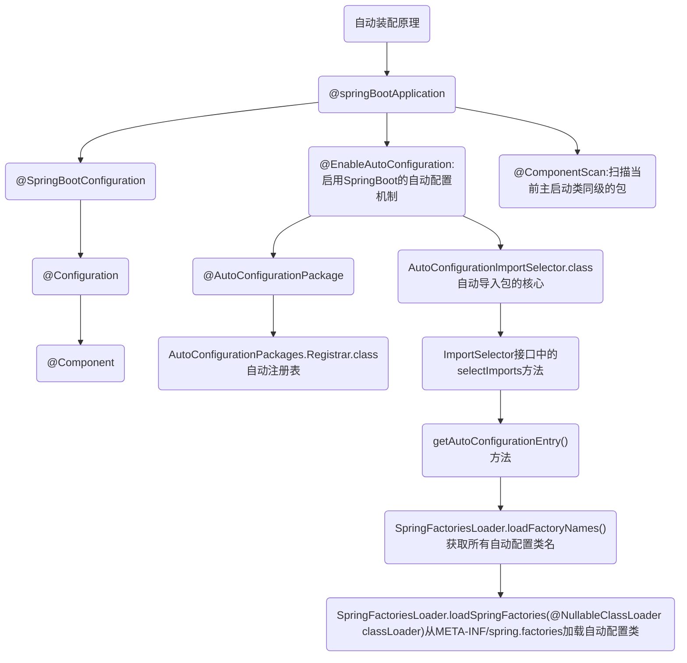
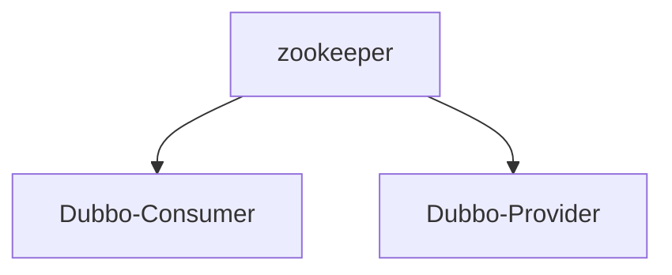

# 1.什么是 SpringBoot 自动装配

SpringBoot的核心：自动装配

使用Spring时，在开启某些 Spring 特性或者引入第三方依赖的时候，还是需要用 XML 或 Java 进行显式配置

使用Spring Boot，通过 Spring Boot 的全局配置文件 application.properties 或 application.yml 即可对项目进行设置，比如更换端口号，配置 JPA 属性等

SpringBoot 定义了一套接口规范，规定：SpringBoot 在启动时会扫描外部引用 jar 包中的`META-INF/spring.factories`文件，将文件中配置的类型信息加载到 Spring 容器（此处涉及到 JVM 类加载机制与 Spring 的容器知识），并执行类中定义的各种操作。对于外部 jar 来说，只需要按照 SpringBoot 定义的标准，就能将自己的功能装置进 SpringBoot

Spring Boot中要引入第三方依赖，直接引入一个 starter 即可。引入 starter 之后，我们通过少量注解和一些简单的配置就能使用第三方组件提供的功能了

## 1.1.自动装配原理

SpringBoot 的核心注解  @SpringBootApplication

**@SpringBootApplication** 看作是 @Configuration、@EnableAutoConfiguration、@ComponentScan 注解的集合。这三个注解的作用分别是：

- @EnableAutoConfiguration：启用 SpringBoot 的自动配置机制
- @Configuration：允许在上下文中注册额外的 bean 或导入其他配置类
- @ComponentScan： 扫描被@Component（@Service，@Controller）注解的 bean，注解默认会扫描启动类所在的包下所有的类 ，也可以自定义不扫描某些 bean

```java
// @SpringBootApplication的部分源码
@SpringBootConfiguration
@EnableAutoConfiguration
@ComponentScan(
    excludeFilters = {@Filter(
    type = FilterType.CUSTOM,
    classes = {TypeExcludeFilter.class}
), @Filter(
    type = FilterType.CUSTOM,
    classes = {AutoConfigurationExcludeFilter.class}
)}
)
```

**@EnableAutoConfiguration** 是实现自动装配的重要注解，自动装配核心功能的实现实际是通过 AutoConfigurationImportSelector类，即 @EnableAutoConfiguration 源码中的 @Import({AutoConfigurationImportSelector.class})

```java
// @EnableAutoConfiguration的部分源码
@AutoConfigurationPackage	// 作用：将main包下的所有组件注册到容器中
@Import({AutoConfigurationImportSelector.class})  //加载自动装配类 xxxAutoconfiguration
```

**AutoConfigurationImportSelector**实现加载自动装配类 `xxxAutoconfiguration`。AutoConfigurationImportSelector类的继承体系如下：可以看出 AutoConfigurationImportSelector 类实现了 ImportSelector接口中的 selectImports方法，该方法主要用于获取所有符合条件的类的全限定类名，这些类需要被加载到 IOC 容器中

```java
public class AutoConfigurationImportSelector implements DeferredImportSelector, BeanClassLoaderAware, ResourceLoaderAware, BeanFactoryAware, EnvironmentAware, Ordered {

}

public interface DeferredImportSelector extends ImportSelector {

}

public interface ImportSelector {
    String[] selectImports(AnnotationMetadata var1);
}
```

ImportSelector接口中的selectImports方法源码如下：

```java
public String[] selectImports(AnnotationMetadata annotationMetadata) {
    if (!this.isEnabled(annotationMetadata)) { // 判断自动装配开关是否打开
        return NO_IMPORTS;
    } else {	// 获取所有需要装配的bean
        AutoConfigurationImportSelector.AutoConfigurationEntry autoConfigurationEntry = this.getAutoConfigurationEntry(annotationMetadata);
        return StringUtils.toStringArray(autoConfigurationEntry.getConfigurations());
    }
}
```

**getAutoConfigurationEntry()**方法，AutoConfigurationImportSelector类调用这个方法，主要负责加载自动配置类

```java
// getAutoConfigurationEntry()方法的源码
protected AutoConfigurationImportSelector.AutoConfigurationEntry getAutoConfigurationEntry(AnnotationMetadata annotationMetadata) {
    if (!this.isEnabled(annotationMetadata)) {	// 1.判断自动装配开关是否打开。默认spring.boot.enableautoconfiguration=true，可在 application.properties 或 application.yml 中设置
        return EMPTY_ENTRY;
    } else {
        // 2.用于获取EnableAutoConfiguration注解中的 exclude 和 excludeName
        AnnotationAttributes attributes = this.getAttributes(annotationMetadata);
        List<String> configurations = this.getCandidateConfigurations(annotationMetadata, attributes);
        // 3.获取需要自动装配的所有配置类，读取META-INF/spring.factories
        configurations = this.removeDuplicates(configurations);
        Set<String> exclusions = this.getExclusions(annotationMetadata, attributes);
        this.checkExcludedClasses(configurations, exclusions);
        configurations.removeAll(exclusions);
        // 4.这一步会筛选，所以 spring.factories中这么多配置，不是每次启动都要全部加载。只有 @ConditionalOnXXX 中的所有条件都满足，该类才会生效
        configurations = this.getConfigurationClassFilter().filter(configurations);
        this.fireAutoConfigurationImportEvents(configurations, exclusions);
        return new AutoConfigurationImportSelector.AutoConfigurationEntry(configurations, exclusions);
    }
}
```

## 1.2.实现一个 Starter

实现自定义线程池

## 1.3.总结

Spring Boot 通过@EnableAutoConfiguration开启自动装配，通过 SpringFactoriesLoader 最终加载META-INF/spring.factories中的自动配置类实现自动装配，自动配置类其实就是通过@Conditional按需加载的配置类，想要其生效必须引入`spring-boot-starter-xxx`包实现起步依赖

给容器中自动配置类添加组件的时候，会从properties类中获取默认属性。我们只需要在配置文件中指定这些属性的值即可

核心：xxxAutoConfiguration（springboot自动装配）--> xxxxProperties封装配置文件中相关属性（可在配置文件中修改默认值）

结论：springboot所有的自动配置都是在启动的时候描并加载，spring.factories所有的自动配置类都在这里，但是不一定生效，因为要判断条件是否成立，只要导入了对应的Starter，就有了启动器，自动装配就会生效，然后就配置成功




# 2.主启动类的运行

SpringApplication类主要做了如下内容：

```
推断应用的类型是普通的项目还是Web项目

推断并设置main方法的定义类，找到运行的主类

找出所有的应用程序监听器，设置到listeners属性中

查找并加载所有可用初始化器，设置到 initializers 属性中
```

# 3.SpringBoot配置文件

SpringBoot使用一个全局的配置文件，配置文件名称是固定的

## 3.1.application.properties

```
语法结构：key=value
如
server.port=8888
```

## 3.2.application.yml

推荐使用

```
语法结构：key:空格value
如
server:
	port: 80
```

## 3.3.yaml语法

支持数组等

## 3.4.类与yml配置文件绑定

在类中用 @ConfigurationProperties(prefix = "类名") 绑定配置文件

在配置文件中对类的属性赋值即可

```java
// java 类
@ConfigurationProperties(prefix = "person")
public class Person{
    private String name;
    private Integer age;

	public Person(){}
}
// yml配置文件
person:
 name: asdasd
 age: 3
```

如果在某个业务中，只需要获取配置文件中的某个值，可以使用@value

如果专编写了一个JavaBean来和配置文件进行映射，就直接使用 @configurationProperties

加载指定的配置文件：@PropertySource

## 3.5.多环境配置及配置文件位置

不同位置配置文件的优先级

```
优先级1:项目路径下的config文件夹配置文件
优先级2:项目路径下配置文件
优先级3:资源路径下的config文件夹配置文件
优先级4:资源路径下配置文件
```

多环境配置，application.yml 、application-dev.yml 开发环境、application-pro.yml 生产环境

在application.yml 中选择激活哪个环境

```yml
使用 --- 分割不同环境配置
如
server: 
	port: 8081
spring:
	profiles :
		active: dev  # active表示激活环境
---
server: 
	port: 8082
spring:
	profiles :
		active: pro
---
server: 
	port: 8083
spring:
	profiles :
		active: test
```

## 3.6.JSR-303校验

```java
@Validated // 开启数据校验
public class Person{
    @Email() // 校验是否为email格式
    private String name;
    private Integer age;

	public Person(){}
}
```

# 4.SpringBoot Web开发

## 4.1.静态资源导入

分析配置类 WebMvcAutoConfiguration 

不同位置静态资源的优先级

```
优先级1:resources/resources
优先级2:resources/static
优先级3:resources/public
访问：localhost:80/
```

修改静态资源目录（不建议改）

```
spring.mvc.static-path-pattern=/image/**
```

在 templates 目录下的所有页面，只能通过controller来跳转（需要模板引擎的支持）

## 4.2.thymeleaf模板引擎

**使用thymeleaf**

要使用thymeleaf，只需要导入对应的依赖就可以了，之后将html放在 src/main/resources/templates 目录下即可通过controller访问html

添加依赖 pom.xml

```xml
<!--Thymeleaf-->
<dependency>
    <groupId>org.thymeleaf</groupId>
    <artifactId>thymeleaf-spring5</artifactId>
</dependency>
<dependency>
    <groupId>org.thymeleaf.extras</groupId>
    <artifactId>thymeleaf-extras-java8time</artifactId>
</dependency>
```

controller层，使用Model向前端传递数据

**thymeleaf语法**

在html文件中添加引用

```html
<html lang="en" xmlns:th="http://www.thymeleaf.org">
```

基础模板

```html
<!DOCTYPE html>
<html lang="en" xmlns:th="http://www.thymeleaf.org">
<head>
<meta charset="UTF-8">
<title>Title</title>
</head>
<body>
<!--所有的html元素都可以被thymeleaf 替换接管: th:元素名-->
<div th:text="${msg}"></div>
</body>
</html>
```

所有的html元索都可以被thymeleaf替换接管

```html
th:元素名
```

## 4.3.扩展SpringMVC（重点）

SpringBoot 提供了自动配置SpringMVC的功能，即 WebMvcAutoConfiguration.java。我们可以使用 JavaConfig，即用配置类手动接管这些配置并且扩展这些配置

实现手动配置，编写一个 @Configuration注解类，并且实现 WebMvcConfigurer接口

```java
@Configuration
// @EnableWebMvc
public class MyMvcConfig implements WebMvcConfigurer {
    // 导入自定义的视图解析器
    @Bean
    public ViewResolver myView(){
        return new MyViewConfig();
    }
}
```

注意：@EnableWebMvc  // 实际就是导入了一个类: DelegatingWebMvcConfiguration，该类从容器中获取所有的webmvcconfig，加了这个注解SpringBoot的所有自动配置全部失效

**自定义视图解析器**

ViewResolver 实现了视图解析器接口的类，我们可以把它看做视图解析器

创建 MyViewConfig.class，之后在MyMvcConfig中导入即可

```java
// 手动接管SpringMVC配置
@Configuration
public class MyViewConfig implements ViewResolver {
    // 自定义视图解析器
    @Override
    public View resolveViewName(String viewName, Locale locale) throws Exception {
        return null;
    }
}
```

**自定义拦截器**

## 4.4.国际化

创建 src/main/resources/i18n 文件夹

创建 src/main/resources/i18n/login.properties 文件

创建 src/main/resources/i18n/login_zh_CN.properties 文件

创建 src/main/resources/i18n/login_en_US.properties 文件

MessageSourceAutoConfiguration 类提供配置国际化

编写 login.properties

```properties
login.btn=登录
login.password=密码
login.remember=记住我
login.tip=请登录
login.username=用户名
```

thymeleaf中引用

```html
<button class="btn btn-lg btn-primary btn-block" type="submit">[[#{login.btn}]]</button>
```

LocaleResolver 实现地区解析，使用配置类自己配置，之后在MyMvcConfig中导入即可

```java
public class MyLocaleResolver implements LocaleResolver {
    // 解析请求
    @Override
    public Locale resolveLocale(HttpServletRequest request){
        String language = request.getParameter("language");
        // 默认地区
        Locale locale = Locale.getDefault();
        // 如果请求携带了地区化的参数
        if(language!= null){
            locale = new Locale(language);
        }
        return locale;
    }

    @Override
    public void setLocale(HttpServletRequest request, HttpServletResponse response, Locale locale) {

    }
}
```

thymeleaf中设置请求

```html
<a class="btn btn-sm" th:href="@{/index.html(language='zh_CN')}">中文</a>
<a class="btn btn-sm" th:href="@{/index.html(language='en_US')}">English</a>
```

# 5.Spring Data

对于数据访问层，无论是SQL（关系型数据库）还是NoSQL（非关系型数据库），Spring Boot底层都是采用Spring Data的方式进行统一处理。

## 5.1.整合JDBC

pom.xml中导入依赖

```xml
<dependency>
    <groupId>mysql</groupId>
    <artifactId>mysql-connector-java</artifactId>
    <version>5.1.48</version>
</dependency>
```

application.yml中

```yml
spring:
  datasource:
    username: root
    password: root
    url: jdbc:mysql://localhost:3306/test?serverTimezone=UTC&useSSL=false&useUnicode=true&characterEncoding=UTF-8
    driver-class-name: com.mysql.jdbc.Driver
```

## 5.2.整合Druid数据源

导入依赖 pom.xml

```xml
<dependency>
    <groupId>com.alibaba</groupId>
    <artifactId>druid</artifactId>
    <version>1.1.5</version>
</dependency>
```

application.yml中  spring.datasource.type 属性设为 Druid 即可切换数据源

使用私有化 filters 属性 开启日志等功能，需要创建config包，在包中创建相应的配置类，在配置类中绑定配置文件

## 5.3.整合Mybatis框架（重点）

建立连接，application.yml中

```yml
spring:
  datasource:
    username: root
    password: root
    url: jdbc:mysql://localhost:3306/test?serverTimezone=UTC&useSSL=false&useUnicode=true&characterEncoding=UTF-8
    driver-class-name: com.mysql.jdbc.Driver
```

pom.xml导入依赖

```xml
<dependency>
    <groupId>org.mybatis.spring.boot</groupId>
    <artifactId>mybatis-spring-boot-starter</artifactId>
    <version>2.1.3</version>
</dependency>
```

创建标准的实体类，可以引入Lombok，使用注解开发，但前期不建议使用

```java
@Data
使用这个注解，就不用再去手写Getter,Setter,equals,canEqual,hasCode,toString等方法了，注解后在编译时会自动加进去
@AllArgsConstructor
使用后添加一个构造函数，该构造函数含有所有已声明字段属性参数
@NoArgsConstructor
使用后创建一个无参构造函数
```

在 src/main/java/com/hy/mapper中定义接口

```java
@Mapper // 表示这是一个mybatis的mapper类 或者 在启动类上添加 @MapperScan("")，推荐使用 @Mapper
public interface UserMapper {
    List<User> queryUserList();
    User queryUserById(int id);
}
```

在 src/main/resources/mybatis/mapper中写xml配置文件，实现SQL操作

```xml
<?xml version="1.0" encoding="UTF-8" ?>
<!DOCTYPE mapper PUBLIC "-//mybatis.org//DTD Mapper 3.0//EN" "http://mybatis.org/dtd/mybatis-3-mapper.dtd">

<mapper namespace="com.hy.mapper.UserMapper">
    <!--id表示接口当中定义的方法. resultType,表示数据库查询的结果.-->
    <select id="queryUserList" resultType="com.hy.entity.User">
        select first_name,score from user100w;
    </select>
</mapper>
```

在 application.yml中，整合mybatis

```yml
# 整合mybatis
mybatis:
	# 别名
  type-aliases-package: com.hy.entity
   # 导入SQL语句配置文件的位置
  mapper-locations: classpath:mybatis/mapper/*.xml
```

controller层实现数据调用

```java
@RestController
public class UserController {
    @Autowired
    private UserMapper userMapper;
    @RequestMapping(value = "/query",method = RequestMethod.GET)
    public List<User> queryUserList(){
        List<User> userList = userMapper.queryUserList();
        for (User user : userList){
            System.out.println(user);
        }
        return userList;
    }
}
```

# 6.Spring Security（简单）

官网：https://docs.spring.io/spring-security/site/docs/5.3.13.RELEASE/reference/html5/#jc

实现对Java应用程序的身份验证和授权（安全思想在规划网站时就要考虑好）

利用AOP思想

Spring Security中重要的类：

1. WebSecurityConfigurerAdapter：自定义Security策略（自己编写配置类要继承该类）
2. AuthenticationManagerBuilder：自定义认证策略
3. @EnableWebSecurity：开启WebSecurity模式 （@Enablexxx 开启某个功能）

导入依赖pom.xml

```xml
<dependency>
    <groupId>org.springframework.boot</groupId>
    <artifactId>spring-boot-starter-security</artifactId>
</dependency>
```

## 6.1.认证及授权

编写 WebSecurityConfig配置类

```java
@EnableWebSecurity
public class WebSecurityConfig extends WebSecurityConfigurerAdapter {
    // 授权：访问控制，哪些用户可以访问哪些页面，哪些不可以访问
    @Override
    protected void configure(HttpSecurity http) throws Exception {
        http.authorizeRequests()
                .antMatchers("/").permitAll()
                .antMatchers("/student/**").hasRole("student")
                .antMatchers("/teacher/**").hasRole("teacher")
                ;
       // 登录页设置
        http.formLogin();
    }
    // 认证：可以从内存中认证，可以从数据库中认证
    @Override
    protected void configure(AuthenticationManagerBuilder auth) throws Exception {
        auth.inMemoryAuthentication()
                .withUser("hy").password("root").roles("student");
    }
}
```

## 6.2.注销及权限控制

权限控制：即不同身份的人登陆，看到的页面是不一样的

```java
@EnableWebSecurity
public class WebSecurityConfig extends WebSecurityConfigurerAdapter {
    @Override
    protected void configure(HttpSecurity http) throws Exception {
        // 注销，logoutSuccessUrl 注销成功后跳转的页面
        http.logout().logoutSuccessUrl("/");
    }
}
```

## 6.3.记住我功能的实现

本质是Cookie的保存

```java
@EnableWebSecurity
public class WebSecurityConfig extends WebSecurityConfigurerAdapter {
    @Override
    protected void configure(HttpSecurity http) throws Exception {
        // 记住我功能的实现
        http.rememberMe();
    }
}
```

# 7.Shiro（难）

官网：https://shiro.apache.org/get-started.html

Shiro架构（三大对象）：

1. Subject：当前用户
2. SecurityManage：管理所有用户
3. Realm：连接数据

Subject对象的核心方法

```java
// 获取当前的用户对象
Subject currentUser = SecurityUtils.getSubject();
// 获取当前用户对象的session
Session session = currentUser.getSession();
// 判断当前用户是否被认证
currentUser.isAuthenticated()
// 获取当前用户的认证    
currentUser.getPrincipal()
// 判断当前用户拥有的角色
currentUser.hasRole("RoleName")
// 获取当前用户的权限
currentUser.isPermitted("lightsaber:wield")
// 注销
currentUser.logout();
```

导入依赖pom.xml

```xml
<dependency>
    <groupId>org.apache.shiro</groupId>
    <artifactId>shiro-spring-boot-web-starter</artifactId>
</dependency>
```

ShiroConfig配置类

```java
@Configuration
public class ShiroConfig {
    // 创建 Realm对象，需要自定义类并继承AuthorizingRealm
    @Bean
    public UserRealm userRealm(){
        return new UserRealm();
    }
    // 创建 DefaultWebSecurityManager
    @Bean
    public DefaultWebSecurityManager getDefaultWebSecurityManager(){
        DefaultWebSecurityManager securityManager = new DefaultWebSecurityManager();
        // 关联 Realm
        securityManager.setRealm(userRealm());
        return securityManager;
    }
    // 创建 ShiroFilterFactoryBean
    @Bean(name = "shiroFilterFactoryBean") //必须起该别名，否则报错
    public ShiroFilterFactoryBean getShiroFilterFactoryBean(){
        ShiroFilterFactoryBean bean = new ShiroFilterFactoryBean();
        // 设置安全管理器
        bean.setSecurityManager(getDefaultWebSecurityManager());
        return bean;
    }
}
```

自定义Realm类

```java
public class UserRealm extends AuthorizingRealm {
    // 授权
    @Override
    protected AuthorizationInfo doGetAuthorizationInfo(PrincipalCollection principalCollection) {
        System.out.println("执行授权");
        return null;
    }
    // 认证
    @Override
    protected AuthenticationInfo doGetAuthenticationInfo(AuthenticationToken authenticationToken) throws AuthenticationException {
        System.out.println("执行认证");
        return null;
    }
}
```

## 7.1.登录拦截

在ShiroConfig配置类中添加Shiro内置过滤器

```java
// 创建 ShiroFilterFactoryBean
@Bean(name = "shiroFilterFactoryBean") //必须起该别名，否则报错
public ShiroFilterFactoryBean getShiroFilterFactoryBean(){
    ShiroFilterFactoryBean bean = new ShiroFilterFactoryBean();
    // 设置安全管理器
    bean.setSecurityManager(getDefaultWebSecurityManager());
    /*
    	anon：无需认证随意访问
    	authc：必须认证才能访问
    	user：必须拥有记住我的功能才能用
    	perms：拥有对某个资源的权限才能访问
    	role：拥有某个角色权限才能访问
    */
    Map<String,String> filterMap = new LinkedHashMap<String, String>();
    filterMap.put("/login", "anon");
    // 添加Shiro内置过滤器
    bean.setFilterChainDefinitionMap(filterMap);
    return bean;
}
```

## 7.2.用户认证

在自定义Realm类中实现用户认证

```java
// 认证
@Override
protected AuthenticationInfo doGetAuthenticationInfo(AuthenticationToken authenticationToken) throws AuthenticationException {
    System.out.println("执行认证");
    // 应从数据库获取
    String userName = "root";
    String password = "root";
    UsernamePasswordToken token = (UsernamePasswordToken) authenticationToken;
    if (!token.getUsername().equals(userName)){
        // 抛异常
        return null;
    }
    // 密码认证 Shiro自动实现
    return new SimpleAuthenticationInfo("",password,"");
}
```

在controller中封装用户登录信息

```java
@RestController
public class UserController {
    @RequestMapping(value = "/login",method = RequestMethod.GET)
    public String login(@RequestParam("name") String username,@RequestParam("pwd") String password){
        // 获取当前的用户对象
        Subject currentUser = SecurityUtils.getSubject();
        // 封装用户的登录数据
        UsernamePasswordToken token = new UsernamePasswordToken(username,password);
        return "login";
    }
}
```

## 7.3.请求授权

```java
// 创建 ShiroFilterFactoryBean
@Bean(name = "shiroFilterFactoryBean") //必须起该别名，否则报错
public ShiroFilterFactoryBean getShiroFilterFactoryBean(){
    ShiroFilterFactoryBean bean = new ShiroFilterFactoryBean();
    // 设置安全管理器
    bean.setSecurityManager(getDefaultWebSecurityManager());
    /*
    	anon：无需认证随意访问
    	authc：必须认证才能访问
    	user：必须拥有记住我的功能才能用
    	perms：拥有对某个资源的权限才能访问
    	role：拥有某个角色权限才能访问
    */
    Map<String,String> filterMap = new LinkedHashMap<String, String>();
    // 请求授权
    filterMap.put("/user", "perms");
    // 添加Shiro内置过滤器
    bean.setFilterChainDefinitionMap(filterMap);
    return bean;
}
```

# 8.Swagger

Swagger能自动生成完善的RESTful API文档，同时根据后台代码的修改同步更新，同时提供完整的测试页面           调试API

官网：https://swagger.io/

添加依赖 pom.xml，在项目中引入springfox-swagger2和springfox.swagger-ui依赖

springframework  2.x版本与 swagger2 的版本匹配

```xml
<dependency>
<groupId> io.springfox</groupId>
<artifactId>springfox-swagger2</artifactId>
<version>2.9.2</version>
</dependency>
<dependency>
<groupId>io.springfox</groupId>
<artifactId>springfox-swagger-ui</artifactId>
<version>2.9.2</version>
</dependency>
```

添加Swagger配置类

```java
@Configuration //告诉Spring 容器，这个类是一个配置类
@EnableSwagger2 //启用Swagger2 功能
public class SwaggerConfig {
    @Bean
    public Docket docket() {
        return new Docket(DocumentationType.SWAGGER_2)
                //apiInfo()是自定义方法
                .apiInfo(apiInfo())
            	// 是否使用Swagger
            	.enable(true)
                .select()
                .apis(RequestHandlerSelectors.basePackage("com"))
                // 过滤什么路径
                .paths(PathSelectors.any())
                .build();
    }
    // API 文档页面显示信息
    private ApiInfo apiInfo() {
        return new ApiInfoBuilder()
                .title("演示项目API") //标题
                .description("学习Swagger2的演示项目") //描述
                .build();
    }
}
```

打开自动生成的可视化测试页面

```
http://127.0.0.1:8080/swagger-ui.html
```

注意：Spring Boot 2.6.X后与Swagger有版本冲突问题会报错，需要在application.yml中加入以下配置：

```
spring.mvc.pathmatch.matching-strategy=ant_path_ matcher
```

## 8.1.配置扫描接口及Swagger开关

实现在开发环境下启用Swagger，生产环境不启用。思路：SpringBoot使用多环境配置文件，之后获取当前所处环境，最后再判断

```java
@Configuration //告诉Spring 容器，这个类是一个配置类
@EnableSwagger2 //启用Swagger2 功能
public class SwaggerConfig {
    @Bean
    public Docket docket(Environment environment) {
        // 设置要使用Swagger的环境
        Profiles profile = Profiles.of("dev");
        // 判断当前所处环境是否等于设定环境
        boolean flag = environment.acceptsProfiles(profile);

        return new Docket(DocumentationType.SWAGGER_2)
                // flag标识
                .enable(flag)
                .select()
                /* RequestHandlerSelectors 配置要扫描接口的方式
                        basePackage 指定要扫描的包
                        any 扫描全部
                        none 不扫描
                        withClassAnnotation 扫描类上的注解，参数是一个注解的反射对象
                        withMethodAnnotation 扫描方法上的注解
                */
                .apis(RequestHandlerSelectors.basePackage("com"))
                // 过滤什么路径
                .paths(PathSelectors.any())
                .build();
    }
}
```

## 8.2.分组和接口注释

实现分组，return多个Docket实例即可

```java
@Configuration //告诉Spring 容器，这个类是一个配置类
@EnableSwagger2 //启用Swagger2 功能
public class SwaggerConfig {
    // 实现分组 
    @Bean
    public Docket docket1(){
        return new Docket(DocumentationType.SWAGGER_2).groupName("分组1")
              .apiInfo(apiInfo())
              .select()
              .apis(RequestHandlerSelectors.basePackage("com.hy.controller"))
              .paths(PathSelectors.any())
              .build();
    }
    @Bean
    public Docket docket2(){
        return new Docket(DocumentationType.SWAGGER_2).groupName("分组2")
                .apiInfo(apiInfo())
                .select()
                .apis(RequestHandlerSelectors.basePackage("com.hy.controller"))
                .build();
    }
    @Bean
    public Docket docket(Environment environment) {
        return new Docket(DocumentationType.SWAGGER_2).groupName("默认分组")
                .enable(flag)
                .select()
                .apis(RequestHandlerSelectors.basePackage("com"))
                .paths(PathSelectors.any())
                .build();
    }
}
```

只要API接口中的返回值里存在实体类，该实体类就会被扫描到lswagger中

```java
@RestController
public class HelloSwagger {
    @RequestMapping(value = "/swagger",method = RequestMethod.GET)
    public User swagger(){
        return new User();
    }
}
```

实现注释，以 @Api开头的注释，给复杂接口注释帮助理解

```java
@ApiModel("实体类")
public class User implements Serializable {
    @ApiModelProperty("用户名")
    private String name;
    @ApiModelProperty("密码")
    private String password;
}
```

# 9.任务（必会）

## 9.1.异步任务

在启动类中使用 @EnableAsync 开启异步功能

用@Async修饰方法，在执行时SpringBoot自动为其分配一个子线程实现异步执行

```java
@Service
public class AsynService {
    @Async
    public void test(){
        try {
            Thread.sleep(1000);
        } catch (Exception e){
            e.printStackTrace();
        }
        System.out.println("test");
    }
}
```

## 9.2.定时任务

在启动类上开启定时功能 @EnableScheduling

用@Scheduled修饰方法，需要使用cron语法

```java
@Service
public class MyScheduledTask {
    @Scheduled(cron = "0 0/5 * * * ?")  // cron语法
    public void runTask() {
        System.out.println("time");
    }
}
```

## 9.3.邮件发送

导入依赖 pom.xml

```xml
<dependency>
    <groupId>org.springframework.boot</groupId>
    <artifactId>spring-boot-starter-mail</artifactId>
    <version>2.4.0</version>
</dependency>
```

配置 application.yml

```yml
spring:
  mail:
    host: smtp.qq.com
    username: 邮箱
    password: 密钥
    # 开启加密验证
    properties.mail.smtl.ssl.enable: true
```

实现简单邮件发送 SimpleMailMessage

```java
@Service
public class MailService {
    @Autowired
    JavaMailSenderImpl mailSender;
    public void sendSimpleMail(String to, String subject, String content) {
        SimpleMailMessage message = new SimpleMailMessage();
        message.setTo(to);
        message.setSubject(subject);
        message.setText(content);
        mailSender.send(message);
    }
}
```

实现复杂邮件发送 MimeMessage

# 10.集成Redis

导入依赖 pom.xml

```xml
<dependency>
    <groupId>org.springframework.boot</groupId>
    <artifactId>spring-boot-starter-data-redis</artifactId>
    <version>2.4.0</version>
</dependency>
```

# 11.分布式

单台主机性能难以满足服务，需要多台主机共同服务

## 11.1.RPC

Remote Procedure Call 远程过程调用

RPC两大核心：序列化、通讯

原理：Netty

## 11.2.Dubbo

RPC 分布式服务框架



**消费端是怎么找到服务端的**

启动一个 Zookeeper 的注册中心，服务提供者会向注册中心中写入自己的地址，供服务消费者获取

**消费端是如何发起请求的**

在 Dubbo 的调用模型中，接口是连接服务消费者和服务提供者的桥梁

服务提供者对指定接口进行实现，服务消费者通过 Dubbo 去订阅这个接口。服务消费者调用接口的过程中 Dubbo 会将请求封装成网络请求，然后发送给服务提供者进行实际的调用。**得益于 Dubbo 的动态代理机制，这一切都像本地调用一样**


**SpringBoot整合Dubbo**

运行起 Dubbo 应用的一个大前提是先部署一个注册中心

两个项目Dubbo-provider、Dubbo-consumer

两个项目添加依赖 pom.xml，导入Dubbo和ZooKeeper

```xml
<!-- 导入dubbo -->
<dependency>
    <groupId>org.apache.dubbo</groupId>
    <artifactId>dubbo-spring-boot-starter</artifactId>
    <version>2.7.8</version>
</dependency>
<!--导入zookeeper客户端-->
<dependency>
    <groupId>com.github.sgroschupf</groupId>
    <artifactId>zkclient</artifactId>
    <version>0.1</version>
</dependency>
```

Dubbo-provider中 配置application.yml

```yml
dubbo:
  application:
    # 应用服务名
    name: provider-server
  # 注册中心地址
  registry:
    address: zookeeper://localhost:2181
  scan:
  # 哪些服务要被注册
    base-packages: com.hy.service
```

Dubbo-consumer中 配置application.yml

```yml
# 消费者从哪里获取服务（需要暴露自己的名字）
server:
  port: 8002
dubbo:
  application:
    name: consumer-server
  # 注册中心的地址
  registry:
    address: zookeeper://localhost:2181
```

## 11.3.ZooKeeper

分布式协调服务，注册中心

下载地址：http://archive.apache.org/dist/zookeeper/

进入bin目录，直接双击运行zkServer.cmd，启动zookeeper

# 12.部署spring boot

## 12.1打包jar

打开idea，点击右上角 maven，再点击Lifecycle，再点击package即可打包

## 12.2.可能的报错

解决spring-boot-maven-plugin爆红，添加version，版本要与spring-boot-starter-parent的version一致

```xml
				<artifactId>spring-boot-maven-plugin</artifactId>
				<version>2.7.7</version>
```

若报错如下

```
Failed to execute goal org.apache.maven.plugins:maven-resources-plugin:3.2.0
```

则先禁用 maven 中 的test

再pom.xml中添加如下（引入 maven-resources-plugin）

```xml
<plugin>
				<groupId>org.apache.maven.plugins</groupId>
				<artifactId>maven-resources-plugin</artifactId>
				<version>3.1.0</version>
			</plugin>
```

## 12.3.部署到服务器

```
nohup java -jar shop-0.0.1-SNAPSHOT.jar > logName.log 2>&1 &
```

注：nohup命令：不挂起，即关闭终端，程序继续运行

## 12.4.修改端口

application开头的配置文件中

```
server.port=8088
```

## 12.5.banner.txt

创建banner.txt 放在 resources目录下


