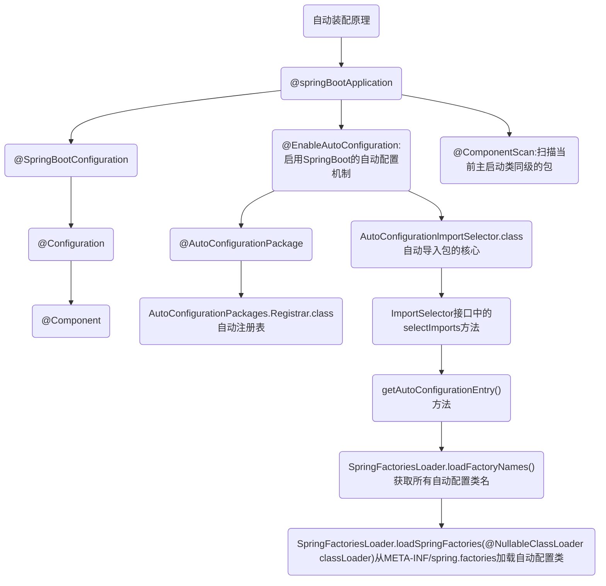

# 1. 什么是 SpringBoot 自动装配

SpringBoot的核心：自动装配

使用Spring时，在开启某些 Spring 特性或者引入第三方依赖的时候，还是需要用 XML 或 Java 进行显式配置

使用Spring Boot，通过 Spring Boot 的全局配置文件 application.properties 或 application.yml 即可对项目进行设置，比如更换端口号，配置 Mybatis 属性等

SpringBoot 定义了一套接口规范，规定：SpringBoot 在启动时会扫描外部引用 jar 包中的`META-INF/spring.factories`文件，将文件中配置的类型信息加载到 Spring 容器（此处涉及到 JVM 类加载机制与 Spring 的容器知识），并执行类中定义的各种操作。对于外部 jar 来说，只需要按照 SpringBoot 定义的标准，就能将自己的功能装置进 SpringBoot

Spring Boot中要引入第三方依赖，直接引入一个 starter 即可。引入 starter 之后，我们通过少量注解和一些简单的配置就能使用第三方组件提供的功能了

## 1.1. 自动装配原理

SpringBoot 的核心注解  @SpringBootApplication

**@SpringBootApplication** 看作是 @Configuration、@EnableAutoConfiguration、@ComponentScan 注解的集合。这三个注解的作用分别是：

- @EnableAutoConfiguration：启用 SpringBoot 的自动配置机制
- @Configuration：允许在上下文中注册额外的 bean 或导入其他配置类
- @ComponentScan： 扫描被@Component（@Service，@Controller）注解的 bean，注解默认会扫描启动类所在的包下所有的类 ，也可以自定义不扫描某些 bean

```java
// @SpringBootApplication的部分源码
@SpringBootConfiguration
@EnableAutoConfiguration
@ComponentScan(
    excludeFilters = {@Filter(
    type = FilterType.CUSTOM,
    classes = {TypeExcludeFilter.class}
), @Filter(
    type = FilterType.CUSTOM,
    classes = {AutoConfigurationExcludeFilter.class}
)}
)
```

**@EnableAutoConfiguration** 是实现自动装配的重要注解，自动装配核心功能的实现实际是通过 AutoConfigurationImportSelector类，即 @EnableAutoConfiguration 源码中的 @Import({AutoConfigurationImportSelector.class})

```java
// @EnableAutoConfiguration的部分源码
@AutoConfigurationPackage	// 作用：将main包下的所有组件注册到容器中
@Import({AutoConfigurationImportSelector.class})  //加载自动装配类 xxxAutoconfiguration
```

**AutoConfigurationImportSelector**实现加载自动装配类 `xxxAutoconfiguration`。AutoConfigurationImportSelector类的继承体系如下：可以看出 AutoConfigurationImportSelector 类实现了 ImportSelector接口中的 selectImports方法，该方法主要用于获取所有符合条件的类的全限定类名，这些类需要被加载到 IOC 容器中

```java
public class AutoConfigurationImportSelector implements DeferredImportSelector, BeanClassLoaderAware, ResourceLoaderAware, BeanFactoryAware, EnvironmentAware, Ordered {

}

public interface DeferredImportSelector extends ImportSelector {

}

public interface ImportSelector {
    String[] selectImports(AnnotationMetadata var1);
}
```

ImportSelector接口中的selectImports方法源码如下：

```java
public String[] selectImports(AnnotationMetadata annotationMetadata) {
    if (!this.isEnabled(annotationMetadata)) { // 判断自动装配开关是否打开
        return NO_IMPORTS;
    } else {	// 获取所有需要装配的bean
        AutoConfigurationImportSelector.AutoConfigurationEntry autoConfigurationEntry = this.getAutoConfigurationEntry(annotationMetadata);
        return StringUtils.toStringArray(autoConfigurationEntry.getConfigurations());
    }
}
```

**getAutoConfigurationEntry()**方法，AutoConfigurationImportSelector类调用这个方法，主要负责加载自动配置类

```java
// getAutoConfigurationEntry()方法的源码
protected AutoConfigurationImportSelector.AutoConfigurationEntry getAutoConfigurationEntry(AnnotationMetadata annotationMetadata) {
    if (!this.isEnabled(annotationMetadata)) {	// 1.判断自动装配开关是否打开。默认spring.boot.enableautoconfiguration=true，可在 application.properties 或 application.yml 中设置
        return EMPTY_ENTRY;
    } else {
        // 2.用于获取EnableAutoConfiguration注解中的 exclude 和 excludeName
        AnnotationAttributes attributes = this.getAttributes(annotationMetadata);
        List<String> configurations = this.getCandidateConfigurations(annotationMetadata, attributes);
        // 3.获取需要自动装配的所有配置类，读取META-INF/spring.factories
        configurations = this.removeDuplicates(configurations);
        Set<String> exclusions = this.getExclusions(annotationMetadata, attributes);
        this.checkExcludedClasses(configurations, exclusions);
        configurations.removeAll(exclusions);
        // 4.这一步会筛选，所以 spring.factories中这么多配置，不是每次启动都要全部加载。只有 @ConditionalOnXXX 中的所有条件都满足，该类才会生效
        configurations = this.getConfigurationClassFilter().filter(configurations);
        this.fireAutoConfigurationImportEvents(configurations, exclusions);
        return new AutoConfigurationImportSelector.AutoConfigurationEntry(configurations, exclusions);
    }
}
```

## 1.2. 实现一个 Starter

如：实现自定义线程池

手动实现一个 Spring Boot 启动器（Starter），需要完成以下步骤：

**创建一个 Maven 项目**

用于存储定制的 Starter

**添加依赖**

在项目的 pom.xml 文件中添加以下依赖：

```xml
<dependency>
    <groupId>org.springframework.boot</groupId>
    <artifactId>spring-boot-autoconfigure</artifactId>
    <version>2.6.3</version>
</dependency>
```

这个依赖包含了 Spring Boot 的自动配置模块，它允许你通过 Java 代码来自定义 Spring Boot 的自动配置

**创建自动配置类**

创建一个自动配置类，用于自定义 Spring Boot 的自动配置。这个类应该包含一个 `@Configuration` 注解和一个 `@ConditionalOnClass` 注解，用于指定自动配置类的条件，例如：

```java
@Configuration
@ConditionalOnClass(MyService.class)
public class MyAutoConfiguration {
    @Bean
    @ConditionalOnMissingBean
    public MyService myService() {
        return new MyService();
    }
}
```

这个自动配置类会在项目中存在 `MyService` 类时自动生效，它会创建一个名为 `myService` 的 Bean 并将它添加到 Spring 应用程序上下文中

**创建 Starter 类**

创建一个 Starter 类，用于提供自动配置类和其他必要的依赖。这个类应该包含一个 `@Configuration` 注解和一个 `@EnableConfigurationProperties` 注解，用于启用自动配置和配置属性的支持，例如：

```java
@Configuration
@EnableConfigurationProperties(MyProperties.class)
@AutoConfigureAfter(MyAutoConfiguration.class)
public class MyStarterAutoConfiguration {
    @Autowired
    private MyProperties properties;

    @Bean
    public MyService myService() {
        return new MyService(properties.getGreeting());
    }
}
```

这个 Starter 类会自动启用 `MyAutoConfiguration` 自动配置类，并创建一个名为 `myService` 的 Bean，它使用 `MyProperties` 配置类中的属性来初始化 `MyService` 类的实例

**创建配置属性类**

创建一个配置属性类，用于定义 Starter 的配置属性。这个类应该包含一个 `@ConfigurationProperties` 注解，用于指定配置属性的前缀和默认值，例如：

```java
@ConfigurationProperties("my.starter")
public class MyProperties {
    private String greeting = "Hello";

    public String getGreeting() {
        return greeting;
    }

    public void setGreeting(String greeting) {
        this.greeting = greeting;
    }
}
```

这个配置属性类定义了一个名为 `greeting` 的属性，它的默认值是 "Hello"。这个属性可以在 Starter 类中使用，用于初始化 `MyService` 类的实例。

**打包和安装 Starter**

在项目的根目录中运行以下命令，将 Starter 打包并安装到本地 Maven 仓库中：

```
mvn clean install
```

现在你已经手动实现了一个 Spring Boot Starter。要在其他项目中使用它，只需在项目的 pom.xml 文件中添加以下依赖：

```xml
<dependency>
    <groupId>com.example</groupId>
    <artifactId>my-starter</artifactId>
    <version>1.0.0</version>
</dependency>
```

这个依赖会自动引入 Starter 类和其他必要的依赖，使你可以在项目中使用 `MyService` 类和其他相关的组件

## 1.3. 总结

Spring Boot 通过@EnableAutoConfiguration开启自动装配，通过 SpringFactoriesLoader 最终加载META-INF/spring.factories中的自动配置类实现自动装配，自动配置类其实就是通过@Conditional按需加载的配置类，想要其生效必须引入`spring-boot-starter-xxx`包实现起步依赖

给容器中自动配置类添加组件的时候，会从properties类中获取默认属性。我们只需要在配置文件中指定这些属性的值即可

核心：xxxAutoConfiguration（SpringBoot自动装配）--> xxxxProperties封装配置文件中相关属性（可在配置文件中修改默认值）

结论：SpringBoot所有的自动配置都是在启动的时候描并加载，spring.factories所有的自动配置类都在这里，但是不一定生效，因为要判断条件是否成立，只要导入了对应的Starter，就有了启动器，自动装配就会生效，然后就配置成功




# 2. 主启动类的运行

SpringApplication类主要做了如下内容：

```
推断应用的类型是普通的项目还是Web项目

推断并设置main方法的定义类，找到运行的主类

找出所有的应用程序监听器，设置到listeners属性中

查找并加载所有可用初始化器，设置到 initializers 属性中
```

# 3. 搭建SpringBoot环境

初始化时，默认链接访问失败，就用国内的 https://start.springboot.io/

在 Spring Initializr 中创建一个新项目时，各个参数的含义

```xml
// 公司域名
<groupId>com.yatoil</groupId>  
//项目名称
<artifactId>yt-dorm</artifactId>  
```

## 3.1. SpringBoot 单模块项目构建（常规）

直接使用Spring Initializr按步骤走即可 

## 3.2. SpringBoot 多模块项目构建（父/子模块）

创建项目结构：使用Spring Initializr 创建一个父目录，只留下`pom.xml`文件，之后在父目录下创建子模块`new module`

```
demo-projectName（父）
	--> demo-moduleName1（子）
	--> demo-moduleName2（子）
	--> ...
pom.xml（父级）
```

各级项目建立关联：在父目录下的`pom.xml`中配置

```xml
<!-- 对于聚合模块来说，其打包方式必须为pom，否则无法构建 -->
<packaging>pom</packaging>
<!-- 指明聚合的模块 -->  
<modules> 
	<module>demo-moduleName1</module> 
	<module>demo-moduleName2</module> 
</modules>
```

子级继承父级的项目依赖：在子级项目的`pom.xml`中配置

```xml
<!-- 指定当前项目的父项目，用于自动继承父项目的依赖项、插件、资源等配置信息 -->
<parent>  
    <groupId>org.springframework.boot</groupId>  
    <artifactId>spring-boot-starter-parent</artifactId>  
    <version>2.7.14</version>  
    <relativePath/>
</parent>
```

# 4. SpringBoot配置文件

SpringBoot使用一个全局的配置文件，配置文件名称是固定的

## 4.1. application.properties

```
语法结构：key=value
如
server.port=8888
```

## 4.2. application.yml（推荐）


```
语法结构：key:空格value
如
server:
	port: 80
```

## 4.3. 类与yml配置文件绑定

在类中用 `@ConfigurationProperties(prefix = "类名")` 绑定配置文件

效果：在配置文件中即可实现对类属性的赋值

```java
// java 类
@ConfigurationProperties(prefix = "person")
public class Person{
    private String name;
    private Integer age;

	public Person(){}
}
// yml配置文件
person:
 name: asdasd
 age: 3
```

如果在某个业务中，只需要获取配置文件中的某个值，可以使用`@value`

如果专门编写了一个JavaBean来和配置文件进行映射，就直接使用 `@configurationProperties`

加载指定的配置文件：`@PropertySource`

## 4.4. 多环境配置及配置文件位置

不同位置下配置文件的优先级

```
优先级1:项目路径下的config文件夹配置文件
优先级2:项目路径下配置文件
优先级3:资源路径下的config文件夹配置文件
优先级4:资源路径下配置文件
```

多环境配置：application.yml 、application-dev.yml 开发环境、application-pro.yml 生产环境

在application.yml 中选择激活哪个环境

```yml
使用 --- 分割不同环境配置
如
server: 
	port: 8081
spring:
	profiles :
		active: dev  # active表示激活环境
---
server: 
	port: 8082
spring:
	profiles :
		active: pro
---
server: 
	port: 8083
spring:
	profiles :
		active: test
```

# 5. JSR-303校验

用于对Java Bean的属性值进行校验

使用JSR-303规范进行校验的步骤：

- 在Java Bean的属性上添加校验注解

```
加在类上：
	@Validated // 开启数据校验
加在类属性上：
	@NotNull：用于检查一个对象是否为null。
	    
	@Min、@Max：用于检查一个数字的最小值和最大值。
	    
	@Size：用于检查一个对象的长度是否在指定范围内。
	
	@Pattern：用于检查一个字符串是否匹配指定的正则表达式。
	    
	@Email：用于检查一个字符串是否是邮件地址格式。
	    
	@AssertTrue、@AssertFalse：用于检查一个布尔值是否为true或false。
```

eg：
```java
@Validated // 开启数据校验
public class User {
 
    @NotNull(message = "用户名不能为空")
    private String username;
 
    @Size(min = 6, max = 16, message = "密码长度必须在6-16位之间")
    private String password;
 
    @Email(message = "邮箱格式不正确")
    private String email;
 
    // getter和setter方法省略
}
```

- 在Controller方法中添加`@Valid`注解，表示对请求参数进行校验

- 在Controller方法的参数中添加`BindingResult`或`Errors`参数，用于接收校验结果

```java
@PostMapping("/user")
public String addUser(@Valid User user, BindingResult result) {
    if (result.hasErrors()) {
        // 校验失败，返回错误信息
        return result.getAllErrors().toString();
    } else {
        // 校验成功，保存用户信息
        userService.save(user);
        return "success";
    }
}
```


# 6. SpringBoot管理静态资源


分析配置类 `WebMvcAutoConfiguration` ，得到不同位置的静态资源的优先级

```
优先级1:resources/resources
优先级2:resources/static
优先级3:resources/public

访问：localhost:80/res_name
```

yml 配置文件中修改静态资源目录（不建议改）

```
spring:
	mvc:
		static-path-pattern=
```

注：在 templates 目录下的所有页面，只能通过controller来跳转，且需要模板引擎的支持

# 7. SpringBoot整合Thymeleaf

使用Thymeleaf作为视图解析器

**SpringBoot默认不支持 JSP，需要引入第三方模板引擎技术实现页面渲染**

导入依赖，之后将html放在 `src/main/resources/templates` 目录下，即可通过controller访问html

添加依赖 pom.xml

```xml
<!--Thymeleaf-->
<dependency>
    <groupId>org.thymeleaf</groupId>
    <artifactId>thymeleaf-spring5</artifactId>
</dependency>
<dependency>
    <groupId>org.thymeleaf.extras</groupId>
    <artifactId>thymeleaf-extras-java8time</artifactId>
</dependency>
```

配置类中设置，把thymeleaf 添加到 Spring Boot 上下文

```java
@Configuration
public class WebConfig implements WebMvcConfigurer {
    @Bean
    public ClassLoaderTemplateResolver templateResolver() {
        ClassLoaderTemplateResolver templateResolver =
                new ClassLoaderTemplateResolver();
        templateResolver.setPrefix("/templates/");
        templateResolver.setSuffix(".html");
        templateResolver.setCharacterEncoding("UTF-8");

        return templateResolver;
    }

    @Bean
    public SpringTemplateEngine templateEngine() {
        SpringTemplateEngine templateEngine = new SpringTemplateEngine();
        templateEngine.setTemplateResolver(templateResolver());
        return templateEngine;
    }
}
```

controller层，使用Model 向前端传递数据

```java
@RequestMapping(value = "/index")
public String index(Model model){  //这里不仅仅可以是Model，还可以是Map、ModelMap
    model.addAttribute("name", "yyds");
    return "index";
}
```

在yml配置文件中关闭 SpringBoot 静态文件缓存，默认为true

当为true时，修改静态文件（html、css、js）需要重启服务器才可以有效，当为false时，修改静态文件（html、css、js）只要在浏览器端刷新就可以了

```yml
spring.thymeleaf.cache = false
```

**补充：thymeleaf语法**

在html文件中添加引用

```html
<html lang="en" xmlns:th="http://www.thymeleaf.org">
```

基础模板

```html
<!DOCTYPE html>
<html lang="en" xmlns:th="http://www.thymeleaf.org">
<head>
<meta charset="UTF-8">
<title>Title</title>
</head>
<body>
<!--所有的html元素都可以被thymeleaf 替换接管: th:元素名-->
<div th:text="${msg}"></div>
</body>
</html>
```

所有的html元素都可以被thymeleaf替换接管

```html
th:元素名
```

# 8. 引入Lombok库

创建标准的实体类时，可以引入Lombok，使用注解开发，新手不建议使用

在pom.xml中导入依赖

```xml
<dependency>  
    <groupId>org.projectlombok</groupId>  
    <artifactId>lombok</artifactId>  
</dependency>
```

相关注解

```java
@Data
使用这个注解，就不用再去手写Getter,Setter,equals,canEqual,hasCode,toString等方法了，注解后在编译时会自动加进去
@AllArgsConstructor
使用后添加一个构造函数，该构造函数含有所有已声明字段属性参数
@NoArgsConstructor
使用后创建一个无参构造函数
```

eg：使用 @Data 注解来自动生成 User 类的 getter、setter、equals、hashCode 和 toString 方法。可以直接通过对象的属性来访问和修改属性值，不需要手动编写 getter 和 setter 方法

```java
@Data
public class User {
    private Long id;
    private String name;
}
```

# 9. 项目国际化

i18n 全称 Internationalization，也就是国际化的意思，因为单词太长，所以中间的 18 个字母被缩写为 18，再加上开头和结尾的字母，就组成了 i18n

eg：实现登录界面的国际化

`MessageSourceAutoConfiguration` 类提供配置国际化

创建 `src/main/resources/i18n` 文件夹

创建 `src/main/resources/i18n/login.properties` 文件

创建 `src/main/resources/i18n/login_zh_CN.properties` 文件

创建 `src/main/resources/i18n/login_en_US.properties` 文件

编写 `login.properties`

```properties
login.btn=登录
login.password=密码
login.remember=记住我
login.tip=请登录
login.username=用户名
```

`LocaleResolver` 实现地区解析，使用配置类自己配置，之后在MyMvcConfig中导入即可

```java
public class MyLocaleResolver implements LocaleResolver {
    // 解析请求
    @Override
    public Locale resolveLocale(HttpServletRequest request){
        String language = request.getParameter("language");
        // 默认地区
        Locale locale = Locale.getDefault();
        // 如果请求携带了地区化的参数
        if(language!= null){
            locale = new Locale(language);
        }
        return locale;
    }

    @Override
    public void setLocale(HttpServletRequest request, HttpServletResponse response, Locale locale) {

    }
}
```


# 10. 扩展SpringMVC（重点）

SpringBoot 提供了自动配置SpringMVC的功能，即 `WebMvcAutoConfiguration.java`。但是我们可以使用 JavaConfig，即用配置类手动接管这些配置并且扩展这些配置

实现手动配置，编写一个 `@Configuration`注解类，并且实现 `WebMvcConfigurer`接口

注意：`@EnableWebMvc` 实际就是导入了一个类：`DelegatingWebMvcConfiguration`，该类从容器中获取所有的`webmvcconfig`，加上这个注解后 SpringBoot 的所有自动配置将全部失效

```java
@Configuration	// 表明这是一个配置类
// @EnableWebMvc
public class MyMvcConfig implements WebMvcConfigurer {
    // 导入自定义的视图解析器
    @Bean
    public ViewResolver myView(){
        return new MyViewConfig();
    }
}
```

其他：自定义视图解析器、自定义拦截器...


# 11. Spring Data

https://spring.io/projects/spring-data

对于数据访问层，无论是SQL（关系型数据库）还是NoSQL（非关系型数据库），Spring Boot底层都是采用Spring Data的方式进行统一处理

**使用Java操作数据库必须先导入对应的数据库驱动**

**Spring Data JDBC vs Spring Data JPA**

Spring Data JDBC aims at being conceptually easy. In order to achieve this it does NOT offer caching, lazy loading, write behind or many other features of JPA. This makes Spring Data JDBC a simple, limited, opinionated ORM.

Spring Data JDBC （不推荐）

## 11.1. 操作MySQL

在pom.xml中导入依赖

```xml
<dependency> 
	<groupId>org.springframework.boot</groupId> 
	<artifactId>spring-boot-starter-jdbc</artifactId> 
</dependency>
<dependency>
    <groupId>mysql</groupId>
    <artifactId>mysql-connector-java</artifactId>
    <version>5.1.48</version>
</dependency>
```

yml 文件中添加以下配置项

```yml
spring:
  datasource:
    username: root
    password: root
    url: jdbc:mysql://localhost:3306/test?serverTimezone=UTC&useSSL=false&useUnicode=true&characterEncoding=UTF-8
    driver-class-name: com.mysql.jdbc.Driver
```

**补充**

`com.mysql.cj.jdbc.Driver`适用于MySQL 8.x  

`com.mysql.jdbc.Driver`适用于MySQL5.x 

## 11.2. 操作MongoDB

在pom.xml中导入依赖
```xml
<dependency>
  <groupId>org.springframework.boot</groupId>
  <artifactId>spring-boot-starter-data-mongodb</artifactId>
</dependency>
```

yml 文件中添加以下配置项

```yml
spring:
	data:  
	  mongodb:  
	    host: 192.168.163.5  
	    username: "root"  
	    password: "root"  
	    port: 27017  
	    authentication-database: test  
	    database: dormitory  
	    auto-index-creation: true
```

## 11.3. 操作Redis

在pom.xml中导入依赖

```xml
<dependency>  
    <groupId>org.springframework.boot</groupId>  
    <artifactId>spring-boot-starter-data-redis</artifactId>  
</dependency>
```

yml 文件中添加以下配置项

```yml
spring: 
	redis:  
	  host: 192.168.163.5  
	  port: 6379  
	  password: "root"  
	  database: 4  
	  pool:  
	      max-active: 10  
	      max-wait: -1  
	      max-idle: 8  
	      min-idle: 0  
	      timeout: 5000
```

## 11.4. 在SpringBoot中使用多个数据源

**方法一：使用 Spring Boot 自带的多数据源配置**

yml 文件中添加以下配置项

```xml
spring:
  datasource:
  # 主数据源
    primary:
      url: jdbc:mysql://localhost:3306/test1?useSSL=false&serverTimezone=UTC
      username: root
      password: root
      driver-class-name: com.mysql.cj.jdbc.Driver
   ＃二号数据源   
    secondary:
      url: jdbc:mysql://localhost:3306/test2?useSSL=false&serverTimezone=UTC
      username: root
      password: root
      driver-class-name: com.mysql.cj.jdbc.Driver
```

在代码中通过 `@Qualifier` 注解来指定使用哪个数据源

```java
@Service
public class UserService {
    @Autowired
    @Qualifier("primaryDataSource")
    private DataSource primaryDataSource;

    @Autowired
    @Qualifier("secondaryDataSource")
    private DataSource secondaryDataSource;

    // ...
}
```

**方法二：使用第三方工具**

如 MyBatis-Plus

# 12. SpringBoot整合Druid

Druid是高性能的关系型数据库连接池，它是阿里巴巴的一个开源项目。支持所有JDBC兼容的数据库，包括Oracle、MySQL、Derby、PostgreSQL、SQL Server、H2等。提供了丰富的监控和统计功能，可以帮助开发者更好地管理数据库连接

在pom.xml中导入依赖

```xml
<dependency>
	<groupId>com.alibaba</groupId>  
	<artifactId>druid-spring-boot-starter</artifactId>
    <version>1.1.5</version>
</dependency>
```

yml 文件中添加以下配置项

```yml
spring:
  datasource:
    url: jdbc:mysql://localhost:3306/test?useSSL=false&serverTimezone=UTC
    username: root
    password: root
    driver-class-name: com.mysql.cj.jdbc.Driver
    # 指定使用 Druid 数据源
    type: com.alibaba.druid.pool.DruidDataSource
    # 配置 Druid 数据源相关属性
    druid:
      # 初始连接数
      initialSize: 5
      # 最小连接池数量
      minIdle: 10
      # 最大连接池数量
      maxActive: 20
      # 配置获取连接等待超时的时间
      maxWait: 60000
      # 配置连接超时时间
      connectTimeout: 30000
      # 配置网络超时时间
      socketTimeout: 60000
      # 配置间隔多久才进行一次检测，检测需要关闭的空闲连接，单位是毫秒
      timeBetweenEvictionRunsMillis: 60000
      # 配置一个连接在池中最小生存的时间，单位是毫秒
      minEvictableIdleTimeMillis: 300000
      # 配置一个连接在池中最大生存的时间，单位是毫秒
      maxEvictableIdleTimeMillis: 900000
      # 配置检测连接是否有效
      validationQuery: SELECT 1 FROM DUAL
      testWhileIdle: true
      testOnBorrow: false
      testOnReturn: false
      webStatFilter:
        enabled: true
      statViewServlet:
        enabled: true
        # 设置白名单，不填则允许所有访问
        allow:
        url-pattern: /druid/*
        # 控制台管理用户名和密码
        login-username: yatoil
        login-password: xxb-88809
      filter:
        stat:
          enabled: true
          # 慢SQL记录
          log-slow-sql: true
          slow-sql-millis: 1000
          merge-sql: true
        wall:
          config:
            multi-statement-allow: true
```

配置 Druid 监控

在 Spring Boot 应用程序中，可以通过配置 `ServletRegistrationBean` 和 `FilterRegistrationBean` 来启用 Druid 监控。在配置类中添加以下代码：

在这个例子中，`druidStatViewServlet` 方法返回一个 `ServletRegistrationBean` 实例，用于注册 `StatViewServlet`，`druidWebStatFilter` 方法返回一个 `FilterRegistrationBean` 实例，用于注册 `WebStatFilter`。

可以通过访问 `http://localhost:8080/druid` 来查看 Druid 监控信息

```java
@Configuration
public class DruidConfig {
    @Bean
    public ServletRegistrationBean<StatViewServlet> druidStatViewServlet() {
        ServletRegistrationBean<StatViewServlet> registrationBean = new ServletRegistrationBean<>(new StatViewServlet(), "/druid/*");
        registrationBean.addInitParameter("loginUsername", "admin");
        registrationBean.addInitParameter("loginPassword", "admin");
        registrationBean.addInitParameter("resetEnable", "true");
        return registrationBean;
    }

    @Bean
    public FilterRegistrationBean<WebStatFilter> druidWebStatFilter() {
        FilterRegistrationBean<WebStatFilter> registrationBean = new FilterRegistrationBean<>(new WebStatFilter());
        registrationBean.addUrlPatterns("/*");
        registrationBean.addInitParameter("exclusions", "*.js,*.gif,*.jpg,*.png,*.css,*.ico,/druid/*");
        return registrationBean;
    }
}
```

# 13. SpringBoot整合Mybatis

在pom.xml中导入依赖

```xml
<dependency>
    <groupId>org.mybatis.spring.boot</groupId>
    <artifactId>mybatis-spring-boot-starter</artifactId>
    <version>2.1.3</version>
</dependency>
```

yml 文件中添加以下配置项

```yml
# 整合mybatis
mybatis:
	# 别名
  type-aliases-package: com.hy.entity
   # 导入SQL语句配置文件的位置
  mapper-locations: classpath:mapper/*.xml
```

编写 Mapper 接口和对应的 XML 映射文件

# 14. SpringBoot整合MyBatis-Plus

在pom.xml中导入依赖
```xml
<dependency>
    <groupId>com.baomidou</groupId>
    <artifactId>mybatis-plus-boot-starter</artifactId>
    <version>3.4.3.1</version>
</dependency>
```
yml 文件中添加以下配置项

```yml
mybatis-plus:
  mapper-locations: classpath:mapper/*.xml
```
# 15. SpringBoot整合SpringSecurity


Spring Security中重要的类：

- `WebSecurityConfigurerAdapter`：自定义Security策略（自己编写配置类要继承该类）
- `AuthenticationManagerBuilder`：自定义认证策略
- `@EnableWebSecurity`：开启WebSecurity模式 （@Enablexxx 开启某个功能）

在pom.xml中导入依赖

```xml
<dependency><groupId>org.springframework.boot</groupId>
    <artifactId>spring-boot-starter-security</artifactId>
</dependency>
```

yml 文件中添加以下配置项

```yml
spring:
  security:
    user:
      name: admin
      password: admin
    # 允许所有用户访问 /hello 路径
    ignore: /hello
    # 排除路径  
	excludes:  
```

编写安全配置类

# 16. SpringBoot整合Swagger

https://swagger.io/

Swagger能自动生成完善的RESTful API文档，同时根据后台代码的修改同步更新，同时提供完整的测试页面调试API

在pom.xml中导入依赖

```xml
<dependency>
	<groupId> io.springfox</groupId>
	<artifactId>springfox-swagger2</artifactId>
	<version>2.9.2</version>
</dependency>
<dependency>
	<groupId>io.springfox</groupId>
	<artifactId>springfox-swagger-ui</artifactId>
	<version>2.9.2</version>
</dependency>
```

yml 文件中添加以下配置项

```yml
swagger:  
  # 是否开启swagger  
  enabled: true  
  # 请求前缀  
  pathMapping:  
  # 标题  
  title: '标题：${yatoil.name}后台管理系统_接口文档'  
  # 描述  
  description: '${yatoil.name}后台管理系统管理'  
  # 版本  
  version: '版本号: ${yatoil.version}'  
  # 作者信息  
  contact:  
    name: yatoil  
    email: dyyatongshihua@163.com  
  groups:  
    - name: 1.自动建表模块  
      basePackage: com.yatoil.generator.controller  
    - name: 2.项目管理模块  
      basePackage: com.yatoil.system.controller
```

注：springframework  2.x版本与 swagger2 的版本匹配

Spring Boot 2.6.X后与Swagger有版本冲突问题会报错，需要在application.yml中加入以下配置：

```yml
spring:  
  mvc:  
    pathmatch:  
      matching-strategy: ant_path_matcher
```

创建Swagger配置类

```java
@Configuration //告诉Spring 容器，这个类是一个配置类
@EnableSwagger2 //启用Swagger2 功能
public class SwaggerConfig {
    @Bean
    public Docket docket() {
        return new Docket(DocumentationType.SWAGGER_2)
                //apiInfo()是自定义方法
                .apiInfo(apiInfo())
            	// 是否使用Swagger
            	.enable(true)
                .select()
                .apis(RequestHandlerSelectors.basePackage("com"))
                // 过滤什么路径
                .paths(PathSelectors.any())
                .build();
    }
    // API 文档页面显示信息
    private ApiInfo apiInfo() {
        return new ApiInfoBuilder()
                .title("演示项目API") //标题
                .description("学习Swagger2的演示项目") //描述
                .build();
    }
}
```

在控制器类上使用 `@Api` 注解来描述API 的标签名称，以便在 Swagger UI 中显示。在具体的方法上使用 `@ApiOperation` 注解来描述方法的作用，以及使用 `@ApiImplicitParam` 注解来描述方法的参数。这些注解可以让 Swagger 自动生成 API 文档

```java
@RestController
@Api(tags = "用户管理")
@RequestMapping("/users")
public class UserController {
    @GetMapping("/{id}")
    @ApiOperation(value = "根据 ID 获取用户信息")
    @ApiImplicitParam(name = "id", value = "用户 ID", required = true, dataTypeClass = Long.class)
    public User getUserById(@PathVariable Long id) {
        // TODO: 根据 ID 获取用户信息
    }

    @PostMapping("/")
    @ApiOperation(value = "创建用户")
    public User createUser(@RequestBody User user) {
        // TODO: 创建用户
    }
}
```

打开自动生成的可视化API测试页面

```
http://127.0.0.1:8080/swagger-ui.html
```


## 16.1. 配置扫描接口及Swagger开关

实现在开发环境下启用Swagger，生产环境不启用。

思路：SpringBoot使用多环境配置文件，之后获取当前所处环境，最后再判断

```java
@Configuration //告诉Spring 容器，这个类是一个配置类
@EnableSwagger2 //启用Swagger2 功能
public class SwaggerConfig {
    @Bean
    public Docket docket(Environment environment) {
        // 设置要使用Swagger的环境
        Profiles profile = Profiles.of("dev");
        // 判断当前所处环境是否等于设定环境
        boolean flag = environment.acceptsProfiles(profile);

        return new Docket(DocumentationType.SWAGGER_2)
                // flag标识
                .enable(flag)
                .select()
                /* RequestHandlerSelectors 配置要扫描接口的方式
                        basePackage 指定要扫描的包
                        any 扫描全部
                        none 不扫描
                        withClassAnnotation 扫描类上的注解，参数是一个注解的反射对象
                        withMethodAnnotation 扫描方法上的注解
                */
                .apis(RequestHandlerSelectors.basePackage("com"))
                // 过滤什么路径
                .paths(PathSelectors.any())
                .build();
    }
}
```

## 16.2. 分组和接口注释

实现分组，return多个Docket实例即可

```java
@Configuration //告诉Spring 容器，这个类是一个配置类
@EnableSwagger2 //启用Swagger2 功能
public class SwaggerConfig {
    // 实现分组 
    @Bean
    public Docket docket1(){
        return new Docket(DocumentationType.SWAGGER_2).groupName("分组1")
              .apiInfo(apiInfo())
              .select()
              .apis(RequestHandlerSelectors.basePackage("com.hy.controller"))
              .paths(PathSelectors.any())
              .build();
    }
    @Bean
    public Docket docket2(){
        return new Docket(DocumentationType.SWAGGER_2).groupName("分组2")
                .apiInfo(apiInfo())
                .select()
                .apis(RequestHandlerSelectors.basePackage("com.hy.controller"))
                .build();
    }
    @Bean
    public Docket docket(Environment environment) {
        return new Docket(DocumentationType.SWAGGER_2).groupName("默认分组")
                .enable(flag)
                .select()
                .apis(RequestHandlerSelectors.basePackage("com"))
                .paths(PathSelectors.any())
                .build();
    }
}
```

只要API接口中的返回值里存在实体类，该实体类就会被扫描到lswagger中

```java
@RestController
public class HelloSwagger {
    @RequestMapping(value = "/swagger",method = RequestMethod.GET)
    public User swagger(){
        return new User();
    }
}
```

实现注释，以 @Api开头的注释，给复杂接口注释帮助理解

```java
@ApiModel("实体类")
public class User implements Serializable {
    @ApiModelProperty("用户名")
    private String name;
    @ApiModelProperty("密码")
    private String password;
}
```

# 17. SpringBoot整合日志框架

在 Spring Boot 项目中引入日志框架，一般有两种选择：Log4j2 和 Logback。Spring Boot 默认使用 Logback 作为日志框架

## 17.1. 整合Logback

在Spring Boot 的web项目中，默认是不需要在pom.xml中单独配置 logback 依赖的

在yml配置文件中配置日志输出的格式和级别，例如：

```yml
logging:
  #level 日志等级 指定命名空间的日志输出
  level:
    com.fishpro.log: debug
  #file 指定输出文件的存储路径
  file: logs/app.log
  #pattern 指定输出场景的日志输出格式
  pattern:
    console: "%d %-5level %logger : %msg%n"
    file: "%d %-5level [%thread] %logger : %msg%n"
```

如果需要更为详细的自定义 logback 日志，需要使用 xml 配置文件来配置。在 resource 文件夹下新建文件 `logback-spring.xml` 

```xml
<?xml version="1.0" encoding="UTF-8"?>
<configuration scan="true" scanPeriod="60 seconds" debug="false">
   <contextName>logback</contextName>
   <!--输出到控制台-->
   <appender name="console" class="ch.qos.logback.core.ConsoleAppender">
       <encoder>
           <!--格式化输出：%d表示日期，%thread表示线程名，%-5level：级别从左显示5个字符宽度%msg：日志消息，%n是换行符-->
           <pattern>%d{HH:mm:ss} [%thread] %-5level %logger{36} - %msg%n</pattern>
           <charset>UTF-8</charset>
       </encoder>
   </appender>

   <!--按天生成日志-->
   <appender name="logFile" class="ch.qos.logback.core.rolling.RollingFileAppender">
       <Prudent>true</Prudent>
       <!-- 过滤器，只打印ERROR级别的日志 -->
       <rollingPolicy class="ch.qos.logback.core.rolling.TimeBasedRollingPolicy">
           <!--日志文件输出的文件名-->
           <FileNamePattern>
               applog/%d{yyyy-MM-dd}/%d{yyyy-MM-dd}.log
           </FileNamePattern>
           <!--日志文件保留天数-->
           <MaxHistory>15</MaxHistory>
       </rollingPolicy>
       <layout class="ch.qos.logback.classic.PatternLayout">
           <Pattern>
               %d{yyyy-MM-dd HH:mm:ss} -%msg%n
           </Pattern>
       </layout>
   </appender>

   <logger name="com.fishpro.log" additivity="false">
       <appender-ref ref="console"/>
       <appender-ref ref="logFile"/>
   </logger>
   
   <!-- 设置Spring&Hibernate日志输出级别 -->
   <logger name="org.springframework" level="WARN"/>
   <logger name="org.mybatis" level="WARN"/> 
   <logger name="com.ibatis" level="DEBUG"/> 
   <logger name="com.ibatis.common.jdbc.SimpleDataSource" level="DEBUG"/> 
   <logger name="com.ibatis.common.jdbc.ScriptRunner" level="DEBUG"/> 
   <logger name="com.ibatis.sqlmap.engine.impl.SqlMapClientDelegate" level="DEBUG"/>
   <logger name="java.sql.Connection" level="DEBUG"/>  
   <logger name="java.sql.Statement" level="DEBUG"/> 
   <logger name="java.sql.PreparedStatement" level="DEBUG"/> 
   <logger name="com.ruidou.baoqian.mapper" level="DEBUG"/>

   <!-- 开发环境下的日志配置 -->
   <root level="error">
       <appender-ref ref="console"/>
       <appender-ref ref="logFile"/>
   </root>
</configuration>
```

打印日志

```java
private final Logger log = LoggerFactory.getLogger(this.getClass());
log.info("打印日志");
```

## 17.2. 整合Log4j2

在pom.xml中导入依赖

```xml
<dependency> 
	<groupId>org.springframework.boot</groupId> 
	<artifactId>spring-boot-starter-log4j2</artifactId> 
</dependency>
```

在 `src/main/resources` 目录下创建 `log4j2.xml` 文件，并配置日志输出的格式和级别

```xml
<?xml version="1.0" encoding="UTF-8"?>
<Configuration>
  <Appenders>
    <Console name="Console" target="SYSTEM_OUT">
      <PatternLayout pattern="%d{yyyy-MM-dd HH:mm:ss.SSS} [%t] %-5level %logger{36} - %msg%n" />
    </Console>
  </Appenders>
  <Loggers>
    <Root level="info">
      <AppenderRef ref="Console" />
    </Root>
  </Loggers>
</Configuration>
```

上面的配置将日志输出到控制台，格式为时间戳、线程名、日志级别、日志类名、日志内容。日志级别为 INFO

# 18. Spring Boot全局异常处理

## 18.1. @RestControllerAdvice

**在 Web 项目中通过 `@ControllerAdvice` `@RestControllerAdvice` 实现全局异常处理**  
`@ControllerAdvice` 和 `@RestControllerAdvice` 的区别 相当于 `Controller` 和 `RestController` 的区别

`@RestControllerAdvice` 注解是 Spring Boot 用于捕获 `@Controller` 和 `@RestController` 层系统抛出的异常（如果已经编写了 `try-catch` 且在 catch 模块中没有使用 throw 抛出异常， 则 `@RestControllerAdvice` 捕获不到异常）。

`@ExceptionHandler` 注解用于指定方法处理的 Exception 的类型

## 18.2. 注解方式实现统一异常处理

具体会使用到 @ControllerAdvice + @ExceptionHandler 这两个注解 

```java
@ControllerAdvice
@ResponseBody
public class GlobalExceptionHandler {

    @ExceptionHandler(BaseException.class)
    public ResponseEntity<?> handleAppException(BaseException ex, HttpServletRequest request) {
      //......
    }

    @ExceptionHandler(value = ResourceNotFoundException.class)
    public ResponseEntity<ErrorReponse> handleResourceNotFoundException(ResourceNotFoundException ex, HttpServletRequest request) {
      //......
    }
}
```

这种异常处理方式下，会给所有或者指定的 Controller 织入异常处理的逻辑（AOP），当 Controller 中的方法抛出异常的时候，由被@ExceptionHandler 注解修饰的方法进行处理

ExceptionHandlerMethodResolver 中 getMappedMethod 方法决定了异常具体被哪个被 @ExceptionHandler 注解修饰的方法处理异常

# 19. 任务（必会）

## 19.1. 异步任务

在启动类中使用 @EnableAsync 开启异步功能

用@Async修饰方法，在执行时SpringBoot自动为其分配一个子线程实现异步执行

```java
@Service
public class AsynService {
    @Async
    public void test(){
        try {
            Thread.sleep(1000);
        } catch (Exception e){
            e.printStackTrace();
        }
        System.out.println("test");
    }
}
```

## 19.2. 定时任务

在启动类上开启定时功能 @EnableScheduling

用@Scheduled修饰方法，需要使用cron语法

```java
@Service
public class MyScheduledTask {
    @Scheduled(cron = "0 0/5 * * * ?")  // cron语法
    public void runTask() {
        System.out.println("time");
    }
}
```

## 19.3. 邮件发送

导入依赖 pom.xml

```xml
<dependency>
    <groupId>org.springframework.boot</groupId>
    <artifactId>spring-boot-starter-mail</artifactId>
    <version>2.4.0</version>
</dependency>
```

配置 application.yml

```yml
spring:
  mail:
    host: smtp.qq.com
    username: 邮箱
    password: 密钥
    # 开启加密验证
    properties.mail.smtl.ssl.enable: true
```

实现简单邮件发送 SimpleMailMessage

```java
@Service
public class MailService {
    @Autowired
    JavaMailSenderImpl mailSender;
    public void sendSimpleMail(String to, String subject, String content) {
        SimpleMailMessage message = new SimpleMailMessage();
        message.setTo(to);
        message.setSubject(subject);
        message.setText(content);
        mailSender.send(message);
    }
}
```

实现复杂邮件发送 MimeMessage

# 20. SpringBoot整合Dubbo

运行起 Dubbo 应用的一个大前提是先部署一个注册中心，如 ZooKeeper

两个项目Dubbo-provider、Dubbo-consumer

两个项目添加依赖 pom.xml，导入Dubbo和ZooKeeper

```xml
<!-- 导入dubbo -->
<dependency>
    <groupId>org.apache.dubbo</groupId>
    <artifactId>dubbo-spring-boot-starter</artifactId>
    <version>2.7.8</version>
</dependency>
<!--导入zookeeper客户端-->
<dependency>
    <groupId>com.github.sgroschupf</groupId>
    <artifactId>zkclient</artifactId>
    <version>0.1</version>
</dependency>
```

Dubbo-provider中 配置application.yml

```yml
dubbo:
  application:
    # 应用服务名
    name: provider-server
  # 注册中心地址
  registry:
    address: zookeeper://localhost:2181
  scan:
  # 哪些服务要被注册
    base-packages: com.hy.service
```

Dubbo-consumer中 配置application.yml

```yml
# 消费者从哪里获取服务（需要暴露自己的名字）
server:
  port: 8002
dubbo:
  application:
    name: consumer-server
  # 注册中心的地址
  registry:
    address: zookeeper://localhost:2181
```

# 21. SpringBoot项目部署

## 21.1. SpringBoot项目打包

对于使用 Maven 打包产生的项目产物，在不同的情况下会有不同需求，如：

1. 将所有代码相关文件打包为 jar 包，使用命令直接执行文件即可启动服务
2.  文件和依赖分开，分为 jar 包和 /lib 下的依赖包信息，避免 jar 过大传输速度太慢
3.  配置文件剥离，可以动态修改配置，分为 jar、/lib、.proerties 三个文件

### 21.1.1. 默认完整打包版

项目完整Jar包，包括相关依赖信息，可以直接执行

SpringBoot 项目使用 Maven 打包后的 Jar 包产物命名方式是由项目的 pom.xml 文件定义的，其中的项目 id 和版本信息共同组成打包文件名称 `${artifactId}-${version}.jar`

要自定义生成的文件名，可以在 pom.xml 的 build 标签中使用 finalName 标签自定义生成 jar 包名称

### 21.1.2. 依赖文件外置版

若项目的依赖 jar 包比较多但是改动较少，在打包项目时就需要将三方依赖和当前项目分离开来，代码改变时只需要重新打包项目内容即可

SpringBoot 默认的配置并不能实现依赖项外置，需要借助 Maven 的 `maven-jar-plugin` 插件和 `maven-dependency-plugin` 插件完成。

`maven-jar-plugin` 插件用来配置当前项目 jar 包的配置，如三方依赖引用的路径信息、启动类等。

`maven-dependency-plugin` 插件则用来配置将项目的三方依赖放置在指定目录下，并配合 `maven-jar-plugin` 完成项目启动时的依赖

在 pom.xml 中添加以下配置

```xml
<build>
    <plugins>
	    <!-- 将自己的项目代码打包成jar文件 -->
        <plugin>
            <groupId>org.apache.maven.plugins</groupId>
            <artifactId>maven-jar-plugin</artifactId>
            <configuration>
                <archive>
                    <manifest>
                        <addClasspath>true</addClasspath>
<!-- 指定包含的依赖文件位置 -->                        <classpathPrefix>lib/</classpathPrefix>
<!--指定启动类-->                        <mainClass>com.domoment.leaves.LeavesApplication</mainClass>
                    </manifest>
                </archive>
            </configuration>
        </plugin>
        <!-- 将依赖的jar文件全部放到lib目录下，会创建 lib 目录，将第三方依赖赋值到 lib 目录下 -->
        <plugin>
            <groupId>org.apache.maven.plugins</groupId>
            <artifactId>maven-dependency-plugin</artifactId>
            <executions>
                <execution>
                    <id>copy-dependencies</id>
                    <phase>prepare-package</phase>
                    <goals>
                        <goal>copy-dependencies</goal>
                    </goals>
                    <configuration>
                        <outputDirectory>${project.build.directory}/lib</outputDirectory>
                        <overWriteReleases>false</overWriteReleases>
                        <overWriteSnapshots>false</overWriteSnapshots>
                        <overWriteIfNewer>true</overWriteIfNewer>
                    </configuration>
                </execution>
            </executions>
        </plugin>
    </plugins>
</build>
```

### 21.1.3. 配置文件外置版

若只是需要改动配置文件，而不需要修改源代码，配置文件放在 jar 文件外，会更方便。

此时可以在打包时将配置文件等内容移出产物 jar 包，并采用资源配置将配置文件复制到产物指定路径下。

在 pom.xml 中添加以下配置

```xml
<build>
    <resources>
        <!-- 把配置文件放到根目录和 jar 在一起 -->
        <resource>
            <!-- 具体的脚本放置位置可以改，不一定是当前目录 . 代表当前目录-->
            <directory>src/main/resources</directory>
            <includes>
                <include>*.yml</include>
                <include>*.properties</include>
            </includes>
            <targetPath>${project.build.directory}</targetPath>
        </resource>
    </resources>
    <plugins>
        <plugin>
            <groupId>org.springframework.boot</groupId>
            <artifactId>spring-boot-maven-plugin</artifactId>
            <executions>
                <execution>
                    <id>repackage</id>
                    <configuration>
                        <classifier>exec</classifier>
                    </configuration>
                </execution>
            </executions>
        </plugin>
        <plugin>
            <groupId>org.apache.maven.plugins</groupId>
            <artifactId>maven-resources-plugin</artifactId>
            <version>3.1.0</version>
        </plugin>
        <!-- 用于生成jar包的plugin -->
        <plugin>
            <groupId>org.apache.maven.plugins</groupId>
            <artifactId>maven-jar-plugin</artifactId>
            <configuration>
                <!--将配置文件排除掉，不打包到jar文件内-->
                <excludes>
                    <exclude>*.properties</exclude>
                    <exclude>**/*.properties</exclude>
                    <exclude>*.yml</exclude>
                    <exclude>*.conf</exclude>
                </excludes>
            </configuration>
        </plugin>
    </plugins>
</build>
```

`<resources>` 标签配置指定资源操作
 
`spring-boot-maven-plugin` 配置打包同时输出 demo.jar 单文件和 demo-exec.jar 整合依赖的文件，可以选择使用
  
`maven-jar-plugin` 插件中可以设置打包时 jar 包中排除指定的配置文件类型

## 21.2. SpringBoot项目部署到服务器

```
nohup java -jar shop-0.0.1-SNAPSHOT.jar > logName.log 2>&1 &
```

注：nohup命令：不挂起，即关闭终端，程序继续运行

## 21.3. SpringBoot项目部署配置项

在yml 配置文件中

```
# 开发环境配置  
server:  
  # 服务器的HTTP端口，默认为8080  
  port: 8001  
  servlet:  
    # 应用的访问路径  
    context-path: /  
  tomcat:  
    # tomcat的URI编码  
    uri-encoding: UTF-8  
    # 连接数满后的排队数，默认为100  
    accept-count: 1000  
    threads:  
      # tomcat最大线程数，默认为200  
      max: 800  
      # Tomcat启动初始化的线程数，默认值10  
      min-spare: 100
```

## 21.4. SpringBoot项目定制banner

创建banner.txt 放在 resources目录下

# 22. 报错情况

解决spring-boot-maven-plugin爆红，添加version，版本要与spring-boot-starter-parent的version一致

```xml
	<artifactId>spring-boot-maven-plugin</artifactId>
	<version>2.7.7</version>
```

若报错如下

```
Failed to execute goal org.apache.maven.plugins:maven-resources-plugin:3.2.0
```

则先禁用 maven 中 的test

再pom.xml中添加如下（引入 maven-resources-plugin）

```xml
<plugin>
				<groupId>org.apache.maven.plugins</groupId>
				<artifactId>maven-resources-plugin</artifactId>
				<version>3.1.0</version>
			</plugin>
```

# 23. SpringBoot常用注解

- @SpringBootApplication：这是Spring Boot应用的主注解，它包含了@ComponentScan、@EnableAutoConfiguration和@Configuration三个注解，用于开启组件扫描、自动配置和配置类扫描等功能。

- @RestController：这个注解用于标记一个Controller类，表示该类的所有方法都是以RESTful方式提供服务的。

- @RequestMapping：这个注解用于标记一个请求处理方法，指定处理的URL路径和HTTP请求方法。

- @GetMapping、@PostMapping、@PutMapping、@DeleteMapping：这些注解是对@RequestMapping注解的补充，分别表示处理GET、POST、PUT、DELETE请求的方法。

- @PathVariable：这个注解用于将URL路径中的变量映射到方法参数上。

- @RequestParam：这个注解用于将HTTP请求参数映射到方法参数上。
  
- @RequestBody：这个注解用于将HTTP请求体中的数据映射到方法参数上。

- @ResponseBody：这个注解用于将方法返回值转换为HTTP响应体。

- @Autowired：这个注解用于自动装配一个Bean，可以用在构造方法、属性、方法上。

- @Component：这个注解用于标记一个组件，表示该组件可以被Spring容器扫描并管理。

- @Configuration：这个注解用于标记一个配置类，表示该类包含了一些配置信息，可以用@Bean注解定义一些Bean。

- @EnableAutoConfiguration：这个注解用于自动配置Spring应用，从classpath下的META-INF/spring.factories中读取自动配置类，根据配置自动装配Bean。

- @Value：这个注解用于注入配置文件中的属性值。

- @ConditionalOnProperty：这个注解用于根据配置文件中的属性值来判断是否需要启用某个配置。

- @Async：这个注解用于标记一个异步方法，表示该方法可以异步执行。

- @Cacheable、@CachePut、@CacheEvict：这些注解用于标记一个方法的返回值需要被缓存、更新缓存和删除缓存。

- @Transactional：这个注解用于标记一个方法需要被事务管理，可以用在方法上或类上。

- @Scheduled：这个注解用于标记一个方法需要定时执行，可以设置执行的时间间隔、固定延迟和固定时间等。

- @EnableScheduling：这个注解用于开启定时任务功能。

- @EnableCaching：这个注解用于开启缓存功能。

- @EnableAsync：这个注解用于开启异步执行功能。


