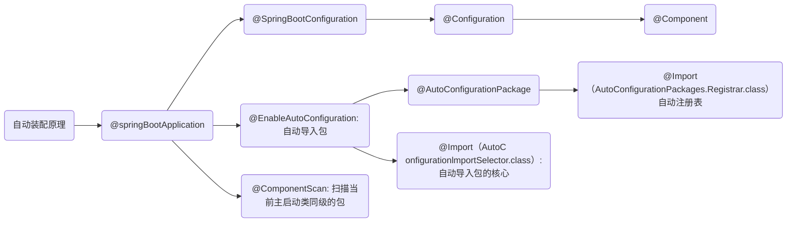

## 对springboot的认识

最大特点：自动装配

SpringApplication类的run方法

```java
@SpringBootApplication // 标注这个类是springboot的应用：启动类下的所有资源被导入
public class MybatisplusDemoApplication {
    public static void main(String[] args) {
        // 启动springboot应用启动
        SpringApplication.run(MybatisplusDemoApplication.class, args);
    }
}
```

## 自动装配原理

SpringBoot启动会加载大量的自动配置类（所有的自动配置类都在 spring.factories）

我们看我们需要的功能有没有在SpringBoot默认写好的自动配置类当中

```
可以通过debug=true查看，哪些自动配置类生效，哪些没有
```

我们再看这个自动配置类中到底配置了哪些组件（只要我们要用的组件存在在其中，我们
就不需要再手动配置了）

给容器中自动配置类添加组件的时候，会从properties类中获取默认属性。我们只需要在配置文件中指定这些属性的值即可

核心：xxxAutoConfiguration（springboot自动装配）--> xxxxProperties封装配置文件中相关属性（可在配置文件中修改默认值）

结论：springboot所有的自动配置都是在启动的时候描并加载，spring.factories所有的自动配置类都在这里，但是不一定生效，因为要判断条件是否成立，只要导入了对应的start，就有对应的启动器了，有了启动器，自动装配就会生效，然后就配置成功




## 主启动类的运行

SpringApplication类主要做了如下内容：

```
推断应用的类型是普通的项目还是Web项目

推断并设置main方法的定义类，找到运行的主类

找出所有的应用程序监听器，设置到listeners属性中

查找并加载所有可用初始化器，设置到 initializers 属性中
```

## SpringBoot配置文件

SpringBoot使用一个全局的配置文件，配置文件名称是固定的

### application.properties

```
语法结构：key=value
如
server.port=8888
```

### application.yml

推荐使用

```
语法结构：key:空格value
如
server:
	port: 80
```

### yaml语法

支持数组等

### 类与yml配置文件绑定

在类中用 @ConfigurationProperties(prefix = "类名") 绑定配置文件

在配置文件中对类的属性赋值即可

```java
// java 类
@ConfigurationProperties(prefix = "person")
public class Person{
    private String name;
    private Integer age;

	public Person(){}
}
// yml配置文件
person:
 name: asdasd
 age: 3
```

如果在某个业务中，只需要获取配置文件中的某个值，可以使用@value

如果专编写了一个JavaBean来和配置文件进行映射，就直接使用 @configurationProperties

加载指定的配置文件：@PropertySource

### 多环境配置及配置文件位置

不同位置配置文件的优先级

```
优先级1:项目路径下的config文件夹配置文件
优先级2:项目路径下配罩文件
优先级3:资源路径下的config文件夹配置文件
优先级4:资源路径下配置文件
```

多环境配置

```yml
使用 --- 分割不同环境配置
active: dev，表示使用dev环境下的配置
如
server: 
	port: 8081
spring:
	profiles :
		active: dev
---
server: 
	port: 8082
spring:
	profiles: dev
---
server: 
	port: 8083
spring: 
	profiles: test
```

### JSR-303校验

```java
@Validated // 开启数据校验
public class Person{
    @Email() // 校验是否为email格式
    private String name;
    private Integer age;

	public Person(){}
}
```

## 静态资源导入

分析配置类 WebMvcAutoConfiguration 

不同位置静态资源的优先级

```
优先级1:resources/resources
优先级2:resources/static
优先级3:resources/public
访问：localhost:80/
```

修改静态资源目录（不建议改）

```
spring.mvc.static-path-pattern=/image/**
```

在 templates 目录下的所有页面，只能通过controller来跳转（需要模板引擎的支持）

## 业务逻辑实现


## Spring Data

对于数据访问层，无论是SQL（关系型数据库）还是NoSQL（非关系型数据库），Spring Boot底层都是采用Spring Data的方式进行统一处理。

## 整合Druid数据源

在配置文件中 type 属性设为 Druid 即可切换数据源

使用私有化 filters 属性 开启日志等功能，需要创建config包，在包中创建相应的配置类，在配置类中绑定配置文件

## 整合Mybatis框架


## 分布式开发Dubbo + zookeeper

## Swagger

## 任务调度

## SpringSecurity : Shiro

## 消息队列


