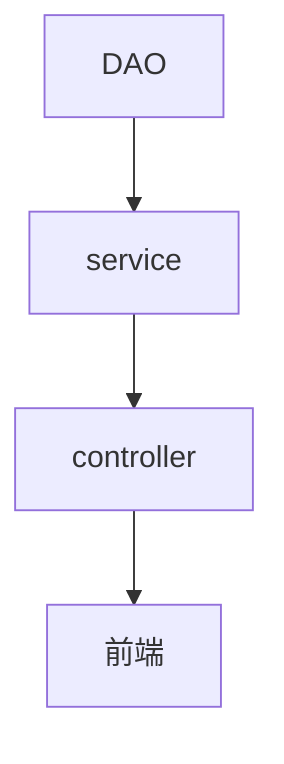

# 1. Spring

## 1.1. 核心

Spring 的设计思路，**永远都是作为 Bean 的容器，去管理好 Bean** ，这是它永恒不变的地方。

官网：https://spring.io/projects/spring-framework#overview

## 1.2. 两大特性

**IOC 控制反转**

Inversion of Control。当一个类中想要调用另外一个类的对象时，不需要再通过new 关键字来创建，而是由Spring框架来负责：创建、分配和管理，从而降低了程序中的耦合性

**AOP**

Aspect Oriented Programming。可以用来做一些日志的打印和输出，用于提示程序执行过程中的一些具体信息等

## 1.3. 包含的模块

### 1.3.1. Spring Core

Spring 核心模块提供了依赖注入（DI）和面向切面编程（AOP）等基础功能，这些功能是 Spring 框架的核心，也是 Spring 其他模块的基础。

### 1.3.2. Spring Web

Spring Web 模块包括 Spring MVC 和 Spring WebFlux 两个子模块，提供了开发 Web 应用程序所需的基本功能，如控制器、视图解析器、表单处理、文件上传等。

### 1.3.3. Spring Data

Spring Data 模块为各种数据访问技术（如关系型数据库、NoSQL 数据库、搜索引擎等）提供了统一的 API，简化了数据访问层的开发。

### 1.3.4. Spring Security

Spring Security 模块提供了一套完整的安全性解决方案，包括认证、授权、加密、访问控制等功能，可以帮助开发人员轻松地实现应用程序的安全性管理。

### 1.3.5. Spring Integration

Spring Integration 模块提供了一套基于消息的集成框架，可以帮助开发人员轻松地实现不同系统之间的协作和集成。

### 1.3.6. Spring Testing

Spring 框架提供了一套完整的测试框架，包括单元测试、集成测试和端到端测试等，可以帮助开发人员实现高质量的测试覆盖。

# 2. IOC思想

从前对象的创建与对象间的依赖关系完全写死在程序中，对象的创建由程序自己控制，控制反转后将对象的创建转移给第三方使用者

测试代码的逻辑：

1. UserServiceImpl调用 UserMapper（接口）

2. UserMapper（接口）有两种实现UserMapperMysqlImpl()和UserMapperOracleImpl()

即在service层使用了set注入后，程序不再具有主动性，而是变成了被动的接受对象

```java
public class UserServiceImpl implements UserService {

    private UserMapper userMapper;

    //利川set进行动态实现值的注入!
    public void setUserMapper(UserMapper userMapper) {
        this.userMapper = userMapper;
    }

    public void getUser() {
        userMapper.getUser();
    }
}
```

在main方法中调用时，由使用者决定传入的对象

```java
    public static void main(String[] args) {
        UserServiceImpl userService = new UserServiceImpl();
        // 实现反转
        userService.setUserMapper(new UserMapperOracleImpl());
        或
        userService.setUserMapper(new UserMapperMysqlImpl());
        //
        userService.getUser();
    }
```

# 3. 搭建Spring

用IDEA创建Spring项目

在src/main/resources目录下新建 applicationContext.xml 配置文件

```xml
<?xml version="1.0" encoding="UTF-8"?>
<beans xmlns="http://www.springframework.org/schema/beans"
       xmlns:xsi="http://www.w3.org/2001/XMLSchema-instance"
       xsi:schemaLocation="http://www.springframework.org/schema/beans
    http://www.springframework.org/schema/beans/spring-beans-4.3.xsd">
    <!--相当于new了一个 UserMapperMysqlImpl -->
    <bean id="mysqlImpl" class="com.hy.mapper.UserMapperMysqlImpl"/>
    <bean id="oracle" class="com.hy.mapper.UserMapperOracleImpl"/>
    <!--
    ref：引用类型数据的注入
    value：基本数据类型数据的注入
    -->
    <bean id="UserServiceImpl" class="com.hy.service.UserServiceImpl">
        <property name="userMapper" ref="mysqlImpl"/>
    </bean>
</beans>
```

在main方法中，使用 **ClassPathXmlApplicationContext("applicationContext.xml")**获取Spring容器

```java
    public static void main(String[] args) {
        // 获取ApplicationContext，拿到Spring的容器
        ApplicationContext context = new ClassPathXmlApplicationContext("beans.xml");

        UserServiceImpl userServiceImpl = (UserServiceImpl) context.getBean("UserServiceImpl");

        userServiceImpl.getUser();
    }
```

## 3.1. Spring IOC

控制反转：就是将原本在程序中手动创建对象的控制权，交由 Spring 框架来管理

控制：使用Spring后，对象是由Spring来创建的

反转：控制权交给外部环境（Spring 框架、IoC 容器）

在Spring中实现控制反转的是IOC容器，其实现方法是依赖注入（Dependency Injection，DI）

依赖注入：利用set方法、有参构造来进行注入

从代码上讲：一个Spring的IOC容器就是某个实现了**ApplicationContext**接口的类的实例

在 Spring 中， IOC 容器是 Spring 用来实现 IOC 的载体， IOC 容器实际上就是个 Map（key，value），Map 中存放的是各种对象

可以通过**ClassPathXmlApplicationContext**去浏览底层源码

## 3.2. Spring Bean

Bean 代指的就是那些被 IOC 容器所管理的对象

我们需要告诉 IOC 容器帮助我们管理哪些对象，这个是通过配置元数据来定义的。配置元数据可以是 XML 文件、注解或者 Java 配置类

## 3.3. Spring配置说明

可以有多个xml文件，但是只能有一个被命名为applicationContext.xml，可以在applicationContext.xml中import导入其他xml文件

```xml
<import resource="引入其他bean xml配置文件" />
<bean id="bean标识" class="类型名称"/>
    id : bean的唯一标识符，也就是相当于对象名
    class : bean 对象所对应的全限定名，即包名+类型
    <property name="userMapper" ref="mysqlImpl"/>
        ref：引用类型数据的注入
        value：基本数据类型数据的注入
<alias name="bean标识" alias="别名" />
	name :是别名，而且name可以同时取多个别名
```

# 4. Spring IOC创建对象

默认使用无参构造

有参构造：创建的同时，进行注入

* 下标赋值

```xml
<bean id="user" class="com.hy.entity.User">
    <constructor-arg index="0" value="我是参数1"/>
    <constructor-arg index="1" value="我是参数2"/>
</bean>
```

* 通过类型创建

```xml
<!--不建议使用-->
<bean id="user" class="com.hy.entity.User">
    <constructor-arg type="int" value="7500000"/>
    <constructor-arg type="java.lang.String" value="42"/>
</bean>
```

* 直接使用参数名设置

```xml
<!--推荐使用-->
<bean id="user" class="com.hy.entity.User">
    <constructor-arg name="name" value="我是名字"/>
    <constructor-arg name="age" value="42"/>
</bean>
```

注意：在 xml中配置Bean的时候，容器中管理的对象就已经初始化了

# 5. 依赖注入

依赖：bean对象的创建依赖于容器（IOC容器）

注入：就是让属性有值

## 5.1. 构造器注入

通过有参构造方法实现注入

## 5.2. Set方式注入（重点）

由容器来注入

```xml
    <!--
    ref：引用类型数据的注入
    value：基本数据类型数据的注入
    -->
<bean id="user" class="com.hy.entity.User">
    <!--基本数据类型的注入-->
    <property name="name" value="我是名字"/>
    <!--引用数据类型的注入-->
    <property name="student" ref="student"/>
    <!--数组的注入-->
    <property name="books">
        <array>
            <value>三国演义</value>
            <value>红楼梦</value>
        </array>
    </property>
    <!--List的注入-->
    <property name="friends">
        <list>
            <value>张三</value>
            <value>赵四</value>
        </list>
    </property>
    <!--Map的注入-->
    <property name="card">
        <map>
            <entry key="身份证" value="213654456" />
            <entry key="学生证" value="2454545454" />
        </map>
    </property>
    <!--Set的注入-->
    <property name="games">
        <set>
            <value>LOL</value>
            <value>CF</value>
            <value>PUBG</value>
        </set>
    </property>
    <!--null的注入-->
    <property name="couple">
        <null/>
    </property>
    <!--Properties的注入-->
    <property name="info">
        <props>
            <prop key="username">admin</prop>
            <prop key="password">123456</prop>
        </props>
    </property>
</bean>    
```

## 5.3. 其他注入方式

c命名和p命名空间注入

```xml
beans中需要引入xml约束
<beans 
       xmlns:p="http://www.springframework.org/schema/p"
       xmlns:c="http://www.springframework.org/schema/c"
       >
```

c（constructor）命名，原理是通过构造器注入

```xml
<bean id="user" class="com.hy.entity.User" c:age="18" c:name="名字">
```

p（property）命名，原理是通过set注入

```xml
<bean id="user" class="com.hy.entity.User" p:age="18" c:name="名字">
```

# 6. Bean的自动装配（重点）

在Spring中有三种装配的方式

1. 在xml中显式装配（即set方法注入和构造方法注入）
2. 在Java中显式装配（Java config）
3. 隐式bean的自动装配和发现机制（重要）

一般在注入内容较为简单时，可使用注解直接进行开发，当注入内容比较复杂，如map、list等时，仍然使用xml配置文件开发

## 6.1. 什么是装配

将一个bean中所关联的其他bean装配进去

```xml
// 有以下两个实体类，Teacher类，Student类，分别代表老师、学生，其中Teacher类的属性中包含Student类
<?xml version="1.0" encoding="UTF-8"?>   
<beans xmlns="http://www.springframework.org/schema/beans"           xmlns:xsi="http://www.w3.org/2001/XMLSchema-instance"           xsi:schemaLocation="http://www.springframework.org/schema/beans        https://www.springframework.org/schema/beans/spring-beans.xsd">
    <!--创建了2个实体类，并给teacher Bean手动装配了与之关联的student Bean，这就是装配-->
    <bean id="student" class="com.hy.entity.Student"/>
    <bean id="teacher" class="com.hy.entity.Teacher">
        <property name="name" value="张三"/>
        <property name="student" ref="student"/>
    </bean>
</beans>
```

## 6.2. 通过xml文件实现自动装配

用autowire属性实现自动装配bean

```xml
<!--两种方式-->
<bean id="user" class="com.hy.entity.User" autowire="byName">
<bean id="user" class="com.hy.entity.User" autowire="byType">
```

设置autowire属性为byName，则Spring会根据class属性的值找到实体类，然后查询实体类中所有setter方法的名字，根据setter方法后面的名字（例如SetStudent，则setter方法后面的名字为student）再到xml配置文件中寻找一个与该名字相同id的bean，注入进来，所以需要保证所有bean的id唯一

设置autowire属性为byType，则Spring会自动寻找一个与class属性的类型相同的bean，注入进来，必须保证配置文件中所有bean的class属性的值是唯一的，否则就会报错

## 6.3. 通过注解实现自动装配

用@Autowired 注解实现自动装配

先导入约束

```xml
<?xml version="1.0" encoding="UTF-8"?>
<beans xmlns="http://www.springframework.org/schema/beans"
    xmlns:xsi="http://www.w3.org/2001/XMLSchema-instance"
    xmlns:context="http://www.springframework.org/schema/context"
    xsi:schemaLocation="http://www.springframework.org/schema/beans
        https://www.springframework.org/schema/beans/spring-beans.xsd
        http://www.springframework.org/schema/context
        https://www.springframework.org/schema/context/spring-context.xsd">
	<!--开启注解功能-->
    <context:annotation-config/>
</beans>
```

然后在实体类的对应属性上添加@Autowired注解（也可以把注解放到对应属性的setter上），如 Teacher类中依赖Student类。所以在Teacher类中的student属性上要加上@Autowired，实现自动装配

```java
public class Teacher {
    @Autowired
    private Student student;
    private String name;
	//...
    public void setStudent(Student student) {
        this.student = student;
    }
  //...
}
```

**注意：**

@Autowired 注解方法装配属性的过程：Spring会默认优先根据（被注解修饰的）属性类型去容器中找对应的组件（bean），找到就赋值。若找到多个相同类型的组件，再将属性的名称作为组件（bean）的id去容器中查找

@Qualifier(value="xx" ) 用来指定需要装配的bean的id，配合@Autowired的使用

```java
@Autowired()
@Qualifier(value="student1")
private Student student;
```

在默认情况下使用 @Autowired 注释进行自动注入时，Spring 容器中匹配的候选 bean 数目必须有且仅有一个。当找不到一个匹配的 bean 时，Spring 容器将抛出 BeanCreationException 异常，这时可以显式定义Autowired的required属性为false，告诉 Spring在找不到匹配 bean 时也不报错

```java
@Autowired(required = false)
```

## 6.4. 总结：可以注入 Bean 的注解

@Resource、@Autowired

Java自带的@Resource和Spring的@Autowired的区别：

1. 都是用来自动装配的，都可以放在属性字段上
2. @Autowired默认通过byType，如果查找失败，则通过byName的方式实现
3. @Resource默认通过byName的方式实现，如果找不到名字，则通过byType实现
4. 当一个接口存在多个实现类的情况下，@Autowired 和@Resource 都需要通过名称才能正确匹配到对应的 Bean。Autowired 可以通过 @Qualifier 注解来显式指定名称，@Resource 可以通过 name 属性来显式指定名称


# 7. 隐式bean的发现机制（重点）

在xml配置文件中开启自动扫描注解功能

```xml
<!--指定要扫描的包，这个包下的注解就会生效-->
<context:component-scan base-package="com.hy.entity"/>
<!--开启注解功能-->
<context:annotation-config/>
```

或者在JavaConfig中使用@ComponentScan 注解定义要扫描的路径，从中找出被@Component注解的 bean，自动装配到 Spring 的 bean 容器中

```java
@Configuration
@ComponentScan("com.hy.entity")
public class UserConfig {
    @Bean
    public Student student(){
        return new Student();
    }
}
```

## 7.1. @Component

注册该组件到Spring IOC容器中

```java
@Component
public class Student {
    ...
        ...
}
```

相当于

```xml
<bean id="student" class="com.hy.entity.Student">
</bean>
```

属性注入 @Value

```java
@Component
public class Student {
    @Value("我是学生")
    private name;
        ...
}
```

相当于property

```xml
<bean id="student" class="com.hy.entity.Student">
    <property name="name" value="我是学生"/>
</bean>
```

## 7.2. 总结：可以将一个类声明为 Bean 的注解

@Component以及@Component衍生的注解

以下注解功能一致，只是命名不同

在web开发中，按照MVC三层架构分层

1. DAO（Mapper）层使用 @Repository
2. service层使用 @Service
3. controller层使用  @Controller

## 7.3. @Component 和 @Bean 的区别

@Component注解作用于类，而@Bean注解作用于方法

@Component 一般是通过类路径扫描来自动侦测、自动装配到 Spring 容器中（可以使用 @ComponentScan 注解定义要扫描的路径，从中找出被@Component注解的 bean，自动装配到 Spring 的 bean 容器中）

@Bean 作用在方法上，表示将这个方法的返回值装配到 lOC容器中

下面这个例子是通过 @Component 无法实现的

```java
@Bean
public OneService getService(status) {
    case (status)  {
        when 1:
                return new serviceImpl1();
        when 2:
                return new serviceImpl2();
        when 3:
                return new serviceImpl3();
    }
}
```

# 8. Bean的作用域

## 8.1. xml文件实现

单例模式：Spring默认机制，每次从容器中get的时候，共享同一个对象

```xml
<!--scope-->
<bean id="UserServiceImpl" class="com.hy.service.UserServiceImpl" scope="singleton">
```

原型模式：每次从容器中get的时候，都会产生一个新对象

```xml
<!--scope-->
<bean id="UserServiceImpl" class="com.hy.service.UserServiceImpl" scope="prototype">
```

其余的request、session、application这些作用域只能在web开发中使用

## 8.2. 注解实现

@Scope

```java
@Bean
@Scope(value = ConfigurableBeanFactory.SCOPE_PROTOTYPE)
public Person personPrototype() {
    return new Person();
}
```

# 9. Bean 的生命周期

## 9.1. 完整版

Bean 容器找到配置文件中 Spring Bean 的定义

Bean 容器利用 Java Reflection API 创建一个 Bean 的实例

如果涉及到一些属性值 利用 set()方法设置一些属性值

如果 Bean 实现了 BeanNameAware 接口，调用 setBeanName()方法，传入 Bean 的名字

如果 Bean 实现了 BeanClassLoaderAware接口，调用 setBeanClassLoader()方法，传入 ClassLoader对象的实例

如果 Bean 实现了 BeanFactoryAware 接口，调用 setBeanFactory()方法，传入 BeanFactory对象的实例

与上面的类似，如果实现了其他 `*.Aware`接口，就调用相应的方法

如果有和加载这个 Bean 的 Spring 容器相关的 BeanPostProcessor 对象，执行postProcessBeforeInitialization() 方法

如果 Bean 实现了InitializingBean接口，执行afterPropertiesSet()方法

如果 Bean 在配置文件中的定义包含 init-method 属性，执行指定的方法

如果有和加载这个 Bean 的 Spring 容器相关的 BeanPostProcessor 对象，执行postProcessAfterInitialization()方法

当要销毁 Bean 的时候，如果 Bean 实现了 DisposableBean 接口，执行 destroy() 方法

当要销毁 Bean 的时候，如果 Bean 在配置文件中的定义包含 destroy-method 属性，执行指定的方法


## 9.2. 乞丐版

实例化：当Spring容器接收到创建Bean的请求时，会根据配置文件或注解等方式创建Bean的实例

属性赋值：在Bean实例化后，Spring容器会将配置文件或注解中的属性值注入到Bean实例中

初始化：在属性赋值完成后，Spring容器会调用Bean的初始化方法，可以通过实现InitializingBean接口或在配置文件中指定init-method方法来实现

使用：初始化完成后，Bean实例可以被应用程序使用

销毁：当应用程序关闭时，Spring容器会调用Bean的销毁方法，可以通过实现DisposableBean接口或在配置文件中指定destroy-method方法来实现

# 10. JavaConfig 实现装配

不使用xml来配置，由Java全权实现配置功能即配置类

在配置类中

```java
@Configuration	// @Configuration代表这是一个配置类
@ComponentScan("com.hy.entity")	// 扫描该包下的被@Component注解的bean
public class UserConfig {
    @Bean	// 注册一个bean，相当于 xml文件中的bean标签
    public Student student(){	//方法名相当于bean标签中的id属性
        return new Student();	//方法的返回值相当于bean标签中的class属性
    }
}
```

在main方法中使用  AnnotationConfig 获取容器，通过配置类的class对象加载

```java
    public static void main(String[] args) {
        // 获取ApplicationContext，拿到Spring的容器
        ApplicationContext context = new AnnotationConfigApplicationContext(UserConfig.class);

        Student student = (Student) context.getBean("student");
        System.out.println(student.getName());
    }
```

# 11. 代理模式

角色分析：

经典场景：房源（某种功能）、房东（被代理的角色）、中介（代理真实角色的人）、我（客户）

* 抽象角色：某种功能，一般会使用接口或者抽象类来解决

```java
// 出租房子的接口
public interface Rent {
    void rent();
}
```

* 真实角色：被代理的角色，被代理类，实现接口或抽象类

```java
// 房东实现出租房子的接口
public class Host implements Rent {
    public void rent(){
        System.out.println("房东出租房子");
    }
}
```

* 代理角色：代理真实角色的，代理类，代理真实角色后，一般会做一些附属操作

```java
// 中介调用出租房子的接口，同时可以实现其他附加功能
public class Proxy implements Rent{
    private Host host;
    public Proxy(){
    }
    public Proxy(Host host){
        this.host = host;
    }
    public void rent(){
        host.rent();
    }
}
```

* 客户：访问代理角色的人

```java
public static void main(String[] args) {
    // 真实角色
    Host host = new Host();
    // 中介
    Proxy proxy = new Proxy(host);
    proxy.rent();
}
```

代理模式的优点：

1. 可以使真实角色的操作更加纯粹，不用去关注一些公共的业务
2. 公共业务交给代理角色，实现了业务的分工
3. 公共业务发生扩展的时候，方便集中管理

缺点：一个真实角色就会产生一个代理角色，代码量会翻倍，开发效率会变低

## 11.1. 静态代理

静态代理，代理类和被代理的类实现了同样的接口，代理类同时持有被代理类的引用，这样，当我们需要调用被代理类的方法时，可以通过调用代理类的方法来做到

常规开发是纵向开发，业务拓展则是横向开发，这时需要用到代理的思想



## 11.2. 动态代理

底层原理：反射

动态代理的代理类是动态生成的，不是直接写好的

动态代理分为两大类：基于接口的动态代理（JDK动态代理）、基于类的动态代理（cglib）

JDK 动态代理：利用反射机制生成一个实现代理接口的类，在调用具体方法前调用InvokeHandler来处理

CGlib 动态代理：利用ASM（开源的Java字节码编辑库，操作字节码）开源包，将代理对象类的class文件加载进来，通过修改其字节码生成子类来处理

区别：JDK代理只能对实现接口的类生成代理；CGlib是针对类实现代理，对指定的类生成一个子类，并覆盖其中的方法，这种通过继承类的实现方式，不能代理final修饰的类

**InvocationHandler**

需要了解两个类：Proxy 生成动态代理实例、InvocationHandler  调用处理程序并返回结果

```java
// 定义一个代理类实现 InvocationHandler 接口，并实现 invoke 方法
public class ProxyInvocationHandler implements InvocationHandler{
    // 被代理的接口
    private Object target;

    public void setTarget(Object object) {
        this.target = object;
    }
    // 通过 Proxy.newProxyInstance() 方法创建代理对象
    public Object getProxy(){
        return Proxy.newProxyInstance(this.getClass().getClassLoader(),target.getClass().getInterfaces(), this);
    }
    // 处理代理实例，并返回结果
    public Object invoke(Object proxy, Method method, Object[] args) throws Throwable {
        // 动态代理的本质，就是使用反射机制实现
        /*
        拓展功能可在此处调用
        */
        Object result = method.invoke(target,args);
        return result;
    }
    public void functions(){
        //拓展功能的实现
    }
}
```

客户代码中

```java
public class Client {
    public static void main(String[] args) {
        // 真实角色
        Host host = new Host();
        // 代理角色
        ProxyInvocationHandler pih = new ProxyInvocationHandler();
        // 设置要代理的真实对象
        pih.setTarget(host);
        // 动态生成代理类
        Rent proxy = (Rent) pih.getProxy();
        proxy.rent();
    }
}
```

总结：一个动态代理类代理的是一个接口，一般就是对应的一类业务

# 12. AOP 面向切面编程

## 12.1. 为什么需要AOP

AOP 能够将那些与主要业务无关，却被各业务模块所共同调用的逻辑或责任（例如事务处理、日志管理、权限控制等）封装起来，便于减少系统的重复代码，降低模块间的耦合度，并有利于未来的可拓展性和可维护性

**AOP 的本质是由 AOP 框架修改业务组件的多个方法的源代码**，AOP是代理模式的典型应用

横切关注点：与我们主线业务逻辑无关的，但是我们需要关注的部分，就是横切关注点。如日志、安全、缓存、事务等

## 12.2. AOP实现方式

静态 AOP 实现， AOP 框架在编译阶段对程序源代码进行修改，生成了静态的 AOP 代理类（生成的 *.class 文件已经被改掉了，需要使用特定的编译器），比如 AspectJ

动态 AOP 实现， AOP 框架在运行阶段对动态生成代理对象（在内存中以 JDK 动态代理，或 CGlib 动态地生成 AOP 代理类），如 SpringAOP。如果要代理的对象，实现了某个接口，那么 Spring AOP 会使用 JDK Proxy，去创建代理对象，而对于没有实现接口的对象，就无法使用 JDK Proxy 去进行代理了，这时候 Spring AOP 会使用 Cglib 生成一个被代理对象的子类来作为代理

## 12.3. AOP术语

切面（ASPECT）：横切关注点的实现类

通知（Advice）：切面必须要完成的工作。通常是切面实现类中的一个方法

目标（Target）：被通知对象

代理（Proxy）：向目标对象应用通知之后创建的对象

切入点（PointCut）：切面通知执行的地点的定义，通常是一个方法

连接点（JointPoint）：与切入点匹配的执行点，这个点可以是方法的调用、异常的抛出。在 Spring AOP 中，连接点总是方法的调用

## 12.4. Spring AOP 和 AspectJ AOP 的区别

**Spring AOP 属于运行时增强，而 AspectJ 是编译时增强。** Spring AOP 基于代理(Proxying)，而 AspectJ 基于字节码操作(Bytecode Manipulation)。

Spring AOP 已经集成了 AspectJ 。AspectJ 相比于 Spring AOP 功能更加强大，但是 Spring AOP 相对来说更简单，

如果我们的切面比较少，那么两者性能差异不大。但是，当切面太多的话，最好选择 AspectJ ，它比 Spring AOP 快很多

## 12.5. AspectJ 定义的几种通知类型

Before（前置通知）：目标对象的方法调用之前触发

After （后置通知）：目标对象的方法调用之后触发

AfterReturning（返回通知）：目标对象的方法调用完成，在返回结果值之后触发

AfterThrowing（异常通知） ：目标对象的方法运行中抛出 / 触发异常后触发

AfterReturning 和 AfterThrowing 两者互斥。如果方法调用成功无异常，则会有返回值；如果方法抛出了异常，则不会有返回值

Around （环绕通知）：通知方法会将目标方法封装起来

## 12.6. 如何控制多个切面的执行顺序

用@Order 注解直接定义切面顺序

```java
// 值越小优先级越高
@Order(3)
@Component
@Aspect
public class LoggingAspect implements Ordered {
}
```

## 12.7. SpringAOP的注解实现（重点）

Spring AOP 不能拦截对对象字段的修改，也不支持构造器连接点，我们无法在 Bean 创建时应用通知

在pom.xml中导入依赖包

```xml
<dependency>
    <groupId>org.aspectj</groupId>
    <artifactId>aspectjweaver</artifactId>
    <version>1.9.5</version>
</dependency>
```

在application.xml配置文件中

```xml
<?xml version="1.0" encoding="UTF-8"?>
<beans xmlns="http://www.springframework.org/schema/beans"
       xmlns:xsi="http://www.w3.org/2001/XMLSchema-instance"
       xmlns:context="http://www.springframework.org/schema/context"
       xmlns:aop="http://www.springframework.org/schema/aop"
       xsi:schemaLocation="http://www.springframework.org/schema/beans http://www.springframework.org/schema/beans/spring-beans.xsd
        http://www.springframework.org/schema/aop http://www.springframework.org/schema/aop/spring-aop-4.3.xsd
        http://www.springframework.org/schema/context http://www.springframework.org/schema/context/spring-context-4.3.xsd">
    <!-- 开启注解扫描 -->
    <context:component-scan base-package="com.hy"/>
    <!-- 开启aop注解方式,这样java类中的aop注解才会生效 -->
    <aop:aspectj-autoproxy/>
</beans>
```

定义一个切面类

使用注解 @Aspect 表示它是一个切面。类中的方法分别可以使用 @Before、@After、@Around 注解

参数 ("execution(* com.hy.service.UserServiceImpl.*(..))")  声明了切点，表明在该切面的切点是 com.hy.service.UserServiceImpl这个接口实现类中的所有方法。注：execution是指示器

注意： @Around修饰的环绕通知类型，是将整个目标方法封装起来了，在使用时，我们需要传入 ProceedingJoinPoint类型的参数，这个对象是必须要有的，并且需要调用 ProceedingJoinPoint的 proceed() 方法。 如果没有调用该方法，则原目标方法将被阻塞而不调用

```java
@Component //表明它将作为一个Spring Bean 被装配
@Aspect //标注这个类是一个切面
public class Cut {
    // 方法执行前的切入点
    @Before("execution(* com.hy.service.UserServiceImpl.*(..))")
    public void before(){
        System.out.println("before");
    }
    // 方法执行后的切入点
    @After("execution(* com.hy.service.UserServiceImpl.*(..))")
    public void after(){
        System.out.println("after");
    }
    // 环绕（将目标方法封装）
    @Around("execution(* com.hy.service.UserServiceImpl.*(..))")
    public void around(ProceedingJoinPoint pj) {
    try {
        System.out.println("Around aaa ...");
        // 调用proceed()
        pj.proceed();
        System.out.println("Around bbb ...");
    } catch (Throwable throwable) {
        throwable.printStackTrace();
    }
   }
}
```

在配置文件中启用AOP切面功能

@EnableAspectJAutoProxy注解，启用了 AOP 功能，参数proxyTargetClass的值设为了 true ，默认值是 false。proxyTargetClass 参数决定了代理的机制。当这个参数为 false 时，通过jdk的基于接口的方式进行织入，这时候代理生成的是一个接口对象，将这个接口对象强制转换为实现该接口的一个类。反之，proxyTargetClass为 true，则会使用 cglib 的动态代理方式。这种方式的缺点是拓展类的方法被final修饰时，无法进行织入

```java
@Configuration
@ComponentScan(basePackageClasses = {com.hy.service.UserService.class})
@EnableAspectJAutoProxy(proxyTargetClass = true)
public class AppConfig {
}
```

测试类中测试

```java
public class AopTest {
    public static void main(String[] args) {
        ApplicationContext ac = new ClassPathXmlApplicationContext("application.xml");
        UserService userservice = ac.getBean("UserServiceImpl",UserServiceImpl.class);
        userservice.AopTest();
    }
}
```

**通过注解声明切点表达式**

多个通知使用了相同的切点表达式，对于像这样频繁出现的相同的表达式，我们可以使用 @Pointcut注解声明切点表达式，然后使用表达式

```java
@Aspect //标注这个类是一个切面
@Component //表明它将作为一个Spring Bean 被装配
public class Log {
    // 声明切点表达式
    @Pointcut("execution(* com.hy.service.UserServiceImpl.*(..))")
    public void point(){}
    // 方法执行前的切入点
    @Before("point()")
    public void before(){
        System.out.println("before");
    }
    // 方法执行后的切入点
    @After("point()")
    public void after(){
        System.out.println("after");
    }
}
```

## 12.8. SpringAOP的xml实现

**方法一：使用原生Spring API接口**

com.hy.log.Log

```java
    // method：要执行的目标对象的方法
    // args：参数
    // target：目标对象
    public void before(Method method, Object[] args, Object target) throws Exception{
        System.out.println(target.getClass().getName() + "的"+method.getName()+"被执行了");
    }
```

实现切入

```xml
<!--注册bean-->
<bean id="userService" class="com.hy.service.UserServiceImpl"/>
<bean id="log" class="com.hy.log.Log"/>
<bean id="afterLog" class="com.hy.log.AfterLog"/>

<!--配置aop-->
<aop:config>
    <!--
  切入点 pointcut
  expression：execution（要切入的位置）
  -->
    <aop:pointcut id="pointcut" expression="execution(* com.hy.service.UserServiceImpl.*(..))"/>
    <!--执行环绕增强 advisor-->
    <aop:advisor advice-ref="log" pointcut-ref="pointcut"/>
    <aop:advisor advice-ref="afterLog" pointcut-ref="pointcut"/>
</aop:config>
```

main方法中

```java
public static void main(String[] args) {
    ApplicationContext context = new ClassPathXmlApplicationContext("applicationContext.xml");
    // 动态代理代理的是接口
    UserService userService = (UserService) context.getBean("userService");
    userService.delete();
}
```

**方法二：自定义类实现AOP（主要是切面定义）**

推荐使用

com.hy.log.PointCut

```java
public class PointCut {
    public void before(){
        System.out.println("方法执行前");
    }
    public void after(){
        System.out.println("方法执行后");
    }
}
```

xml中

```xml
<bean id="cut" class="com.hy.log.PointCut"/>
<aop:config>
    <!--自定义切面 ref要引用的类，即实现功能拓展的类-->
    <aop:aspect ref="cut">
        <!--切入点，即要为哪个业务类拓展功能-->
        <aop:pointcut id="point" expression="execution(* com.hy.log.PointCut.*(..))"/>
        <!--通知，具体拓展的是拓展类中的哪个方法，以及拓展位置是方法前还是方法后-->
        <aop:before method="before" pointcut-ref="point"/>
        <aop:after method="after" pointcut-ref="point"/>
    </aop:aspect>
</aop:config>
```

# 13. Spring 事务

事务在项目开发中，十分的重要，涉及到数据的一致性问题

**事务能否生效数据库引擎是否支持事务是关键。**比如常用的 MySQL 数据库默认使用支持事务的 innodb引擎。但是如果把数据库引擎变为 myisam，那么程序也就不再支持事务了

## 13.1. 事务的属性

**隔离级别**

**传播行为**：指在一个事务方法内部调用另一个事务方法时，这两个方法之间事务的传播方式。在使用事务时，可能会遇到多个事务方法相互调用的情况，此时就需要考虑事务的传播行为，以确保事务的一致性和可靠性。

**回滚规则**

**是否只读**：指的是事务在执行期间是否会修改数据库中的数据。如果事务只读，则事务期间只能进行查询操作，不能进行插入、更新、删除等修改操作

**事务超时**

## 13.2. Spring 中事务实现的方式

### 13.2.1. 声明式事务管理（推荐使用）

-   一种是在配置文件（xml）中做相关的事务规则声明
-   另一种是基于@Transactional 注解的方式

通过 AOP 实现的基于 `@Transactional` 的全注解方式使用最多，AOP 又是使用动态代理实现的

如果目标对象实现了接口，默认情况下会采用 JDK 的动态代理，如果目标对象没有实现了接口，会使用 CGLIB 动态代理

使用 @Transactional 注解进行事务管理的示例代码如下：

```java
@Transactional(propagation = Propagation.REQUIRED)
public void aMethod {
  //do something
  B b = new B();
  C c = new C();
  b.bMethod();
  c.cMethod();
}
```

**注意：**@Transactional 只能被应用到 public方法上，对于其它非public的方法，如果标记了@Transactional 也不会报错，但方法没有事务功能

如果不在Spring中去配置声明式事务，我们就需要在配置文件中手动配置事务，spring-dao.xml

```xml
<!--配置声明式事务-->
<bean id="transactionManager" class="org.springframework.jdbc.datasource.DataSourceTransactionManager">
<property name="dataSource" ref="dataSource"/>
</bean>
<!--结合AOP实现事务的织入-->
<!--配置事务通知; -->
<tx:advice id="txAdvice" transaction-manager= "transactionManager">
<!--给那些方法配置事务-->
<!--配置事务的传播特性: new propagation= -->
    <tx:attributes>
        <tx:method name=" add" propagation= "REQUIRED"/>
        <tx:method name="delete" propagation="REQUIRED"/>
        <tx:method name="update" propagation="REQUIRED"/>
        <tx:method name= "query" read-only="true"/>
        <tx:method name="*" propagation= "REQUIRED"/>
    </tx:attributes>
</tx:advice>
<!--配置事务切入-->
<aop:config>
<aop:pointcut id="txPointCut" expression="execution(* com.hy.mapper.*.*(..))"/>
<aop:advisor advice-ref="txAdvice" pointcut-ref="txPointCut"/>
</aop:config>

```

### 13.2.2. 编程式事务管理（不建议使用）

需要在代码中，进行事务的管理。通过 TransactionTemplate、TransactionManager手动管理事务

TransactionTemplate实现

```java
@Autowired
private TransactionTemplate transactionTemplate;
public void testTransaction() {

        transactionTemplate.execute(new TransactionCallbackWithoutResult() {
            @Override
            protected void doInTransactionWithoutResult(TransactionStatus transactionStatus) {
                try {
                    // ....  业务代码
                } catch (Exception e){
                    //回滚
                    transactionStatus.setRollbackOnly();
                }
            }
        });
}
```

TransactionManager实现

```java
@Autowired
private PlatformTransactionManager transactionManager;

public void testTransaction() {

  TransactionStatus status = transactionManager.getTransaction(new DefaultTransactionDefinition());
          try {
               // ....  业务代码
              transactionManager.commit(status);
          } catch (Exception e) {
              transactionManager.rollback(status);
          }
}
```

## 13.3. Spring 事务管理的接口

PlatformTransactionManager： （平台）事务管理器，Spring 事务策略的核心，通过这个接口，Spring为各个平台如：JDBC、JPA、Hibernate都提供了对应的事务管理器

TransactionDefinition： 事务定义信息（事务隔离级别、传播行为、超时、只读、回滚规则）

TransactionStatus： 事务运行状态

PlatformTransactionManager会根据 TransactionDefinition的定义，比如事务超时时间、隔离级别、传播行为等，来进行事务管理 ，而 TransactionStatus接口则提供了一些方法来获取事务相应的状态，比如是否新事务、是否可以回滚等等


## 13.4. Spring 事务的传播行为

```java
@Transactional(propagation=Propagation.REQUIRED)
public void doSomething() {
    // ...
}
```

REQUIRED：默认的传播行为，当前方法必须在一个事务内执行，如果当前没有事务，则开启一个新的事务。

SUPPORTS：当前方法支持在一个事务内执行，如果当前没有事务，则以非事务方式执行。

MANDATORY：当前方法必须在一个事务内执行，如果当前没有事务，则抛出异常。

REQUIRES_NEW：当前方法必须开启一个新的事务执行，如果当前存在事务，则将当前事务挂起。

NOT_SUPPORTED：当前方法以非事务方式执行，如果当前存在事务，则将当前事务挂起。

NEVER：当前方法以非事务方式执行，如果当前存在事务，则抛出异常。

NESTED：当前方法必须在一个已存在的事务中执行，如果当前没有事务，则开启一个新的事务。当前事务可以被嵌套事务所使用，嵌套事务可以独立于外部事务进行提交或回滚

## 13.5. Spring 事务的隔离级别

```java
@Transactional(isolation = Isolation.READ_COMMITTED)
public void doSomething() {
    // ...
}
```

DEFAULT：默认的隔离级别，由底层数据库自行决定隔离级别。

READ_UNCOMMITTED：最低的隔离级别，事务可以读取到未提交的数据，可能会出现脏读、不可重复读、幻读等问题。
 
READ_COMMITTED：事务只能读取已经提交的数据，避免了脏读问题，但可能会出现不可重复读和幻读问题。

REPEATABLE_READ：事务可以重复读取相同的数据，避免了不可重复读问题，但可能会出现幻读问题。

SERIALIZABLE：最高的隔离级别，事务串行执行，避免了所有并发问题，但会对性能产生影响。

MYSQL：默认为REPEATABLE_READ

SQLSERVER：默认为READ_COMMITTED

ORACLE：默认为READ COMMITTED

## 13.6. Spring 事务的超时

```java
@Transactional(timeout=30) //默认是30秒
```

## 13.7. Spring 事务的回滚规则

默认情况下，Spring 只会对 unchecked 异常（继承 RuntimeException）进行回滚，而对 checked 异常不会回滚。可以通过在 @Transactional 注解上设置 `rollbackFor` 属性来指定需要回滚的异常类型

在 @Transactional 注解中如果不配置rollbackFor 属性，那么事务只会在遇到RuntimeException的时候才会回滚，加上 rollbackFor=Exception.class，可以让事务在遇到非运行时异常时也回滚

```java
@Transactional(rollbackFor = Exception.class)
```

如果在事务方法中捕获了异常，但没有将异常抛出，则事务不会回滚。

在声明式事务中，当事务方法调用其他事务方法时，如果其中一个方法出现异常并回滚了事务，其他方法也会回滚事务，除非其他方法使用了 REQUIRES_NEW 传播行为。

在编程式事务中，通过调用 `TransactionStatus.setRollbackOnly() `方法来设置事务回滚标志，从而回滚事务

# 14. Spring Session

Spring Session 是一个用于管理分布式 Web 应用程序会话的框架，可以让开发人员在多个 Servlet 容器之间共享会话状态，支持多种会话存储后端，如 Redis、MongoDB 等。Spring Session 提供了一套 API，可以简化会话管理的开发流程，提高应用程序的可扩展性和可靠性。

Spring Session 的主要功能包括：

1.  会话创建和销毁：Spring Session 可以自动创建和销毁会话，无需开发人员手动管理会话生命周期。
    
2.  会话存储：Spring Session 支持多种会话存储后端，如 Redis、MongoDB 等，开发人员可以根据实际情况选择合适的会话存储方式。
    
3.  会话访问：Spring Session 可以通过一套统一的 API 来访问会话数据，使得开发人员能够更加方便地管理会话状态。
    
4.  会话共享：Spring Session 可以将会话状态共享到多个 Servlet 容器之间，使得用户可以在多个应用程序之间无缝切换，提高了应用程序的可扩展性和可靠性。
    
5.  集成 Spring Security：Spring Session 可以与 Spring Security 集成，提供了一套完整的会话管理和安全性解决方案。
    
6.  扩展性：Spring Session 是可扩展的，开发人员可以自定义会话存储后端、会话 ID 生成方式等，以满足自己的需求。


