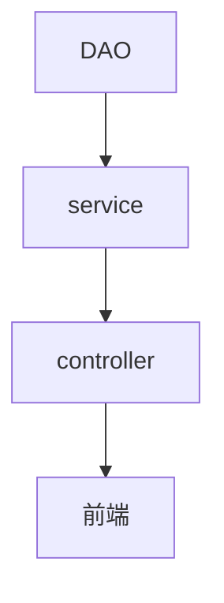

# Spring

## 简介

Spring 的设计思路，**永远都是作为 Bean 的容器，去管理好 Bean** ，这是它永恒不变的地方。

官网：https://spring.io/projects/spring-framework#overview

## 两大特性

**IOC 控制反转**

Inversion of Control

**AOP**

Aspect Oriented Programming

## 事务

支持事务的处理，对框架整合的支持

# IOC思想

从前对象的创建与对象间的依赖关系完全写死在程序中，对象的创建由程序自己控制，控制反转后将对象的创建转移给第三方使用者

测试代码的逻辑：

1. UserServiceImpl调用 UserMapper（接口）

2. UserMapper（接口）有两种实现UserMapperMysqlImpl()和UserMapperOracleImpl()

即在service层使用了set注入后，程序不再具有主动性，而是变成了被动的接受对象

```java
public class UserServiceImpl implements UserService {

    private UserMapper userMapper;

    //利川set进行动态实现值的注入!
    public void setUserMapper(UserMapper userMapper) {
        this.userMapper = userMapper;
    }

    public void getUser() {
        userMapper.getUser();
    }
}
```

在main方法中调用时，由使用者决定传入的对象

```java
    public static void main(String[] args) {
        UserServiceImpl userService = new UserServiceImpl();
        // 实现反转
        userService.setUserMapper(new UserMapperOracleImpl());
        或
        userService.setUserMapper(new UserMapperMysqlImpl());
        //
        userService.getUser();
    }
```

# 搭建Spring

用IDEA创建Spring项目

在src/main/resources目录下新建 applicationContext.xml 配置文件

```xml
<?xml version="1.0" encoding="UTF-8"?>
<beans xmlns="http://www.springframework.org/schema/beans"
       xmlns:xsi="http://www.w3.org/2001/XMLSchema-instance"
       xsi:schemaLocation="http://www.springframework.org/schema/beans
    http://www.springframework.org/schema/beans/spring-beans-4.3.xsd">
    <!--相当于new了一个 UserMapperMysqlImpl -->
    <bean id="mysqlImpl" class="com.hy.mapper.UserMapperMysqlImpl"/>
    <bean id="oracle" class="com.hy.mapper.UserMapperOracleImpl"/>
    <!--
    ref：引用类型数据的注入
    value：基本数据类型数据的注入
    -->
    <bean id="UserServiceImpl" class="com.hy.service.UserServiceImpl">
        <property name="userMapper" ref="mysqlImpl"/>
    </bean>
</beans>
```

在main方法中，使用 ClassPathXmlApplicationContext("applicationContext.xml")获取Spring容器

```java
    public static void main(String[] args) {
        // 获取ApplicationContext，拿到Spring的容器
        ApplicationContext context = new ClassPathXmlApplicationContext("beans.xml");

        UserServiceImpl userServiceImpl = (UserServiceImpl) context.getBean("UserServiceImpl");

        userServiceImpl.getUser();
    }
```

## Spring中IOC的实现

控制反转是一种通过描述（XML或注解）并通过第三方去生产或获取特定对象的方式

在Spring中实现控制反转的是IOC容器，其实现方法是依赖注入（Dependency Injection，DI）

从代码上讲：一个Spring容器就是某个实现了ApplicationContext接口的类的实例

控制：使用Spring后，对象是由Spring来创建的

反转：程序本身不创建对象，而变成被动的接收对象

依赖注入：就是利用set方法来进行注入的

IOC是一种编程思想，由主动的编程变成被动的接收

可以通过new ClassPathXmlApplicationContext去浏览一下底层源码

要实现不同的操作，只需要在xmI配置文件中进行修改

## Spring配置说明

```xml
<import resource="引入其他bean xml配置文件" />
<bean id="bean标识" class="类型名称"/>
    id : bean的唯一标识符，也就是相当于对象名
    class : bean 对象所对应的全限定名，即包名+类型
    name :是别名，而且name可以同时取多个别名
    <property name="userMapper" ref="mysqlImpl"/>
        ref：引用类型数据的注入
        value：基本数据类型数据的注入
<alias name="bean标识" alias="别名" />
```

可以有多个xml文件，但是只能有一个被命名为applicationContext.xml，可以在applicationContext.xml中import导入其他xml文件

# IOC创建对象方式

默认使用无参构造

有参构造

1. 下标赋值

```xml
<bean id="user" class="com.hy.entity.User">
    <constructor-arg index="0" value="我是参数1"/>
    <constructor-arg index="1" value="我是参数2"/>
</bean>
```

2. 通过类型创建

```xml
<!--不建议使用-->
<bean id="user" class="com.hy.entity.User">
    <constructor-arg type="int" value="7500000"/>
    <constructor-arg type="java.lang.String" value="42"/>
</bean>
```

3. 直接使用参数名设置

```xml
<!--推荐使用-->
<bean id="user" class="com.hy.entity.User">
    <constructor-arg name="name" value="我是名字"/>
    <constructor-arg name="age" value="42"/>
</bean>
```

注意：在 xml中配置Bean的时候，容器中管理的对象就已经初始化了

# 依赖注入

依赖：bean对象的创建依赖于容器（IOC容器）

注入：就是让属性有值

## 构造器注入

通过无参、有参构造方法实现注入

## Set方式注入（重点）

由容器来注入

```xml
    <!--
    ref：引用类型数据的注入
    value：基本数据类型数据的注入
    -->
<bean id="user" class="com.hy.entity.User">
    <!--基本数据类型的注入-->
    <property name="name" value="我是名字"/>
    <!--引用数据类型的注入-->
    <property name="student" ref="student"/>
    <!--数组的注入-->
    <property name="books">
        <array>
            <value>三国演义</value>
            <value>红楼梦</value>
        </array>
    </property>
    <!--List的注入-->
    <property name="friends">
        <list>
            <value>张三</value>
            <value>赵四</value>
        </list>
    </property>
    <!--Map的注入-->
    <property name="card">
        <map>
            <entry key="身份证" value="213654456" />
            <entry key="学生证" value="2454545454" />
        </map>
    </property>
    <!--Set的注入-->
    <property name="games">
        <set>
            <value>LOL</value>
            <value>CF</value>
            <value>PUBG</value>
        </set>
    </property>
    <!--null的注入-->
    <property name="couple">
        <null/>
    </property>
    <!--Properties的注入-->
    <property name="info">
        <props>
            <prop key="username">admin</prop>
            <prop key="password">123456</prop>
        </props>
    </property>
</bean>    
```

## 拓展方式注入

c命名和p命名空间注入

```xml
beans中需要引入xml约束
<beans 
       xmlns:p="http://www.springframework.org/schema/p"
       xmlns:c="http://www.springframework.org/schema/c"
       >
```

c（constructor）命名，原理是通过构造器注入

```xml
<bean id="user" class="com.hy.entity.User" c:age="18" c:name="名字">
```

p（property）命名，原理是通过set注入

```xml
<bean id="user" class="com.hy.entity.User" p:age="18" c:name="名字">
```

## Bean的作用域

单例模式：Spring默认机制，每次从容器中get的时候，共享同一个对象

```xml
<!--scope-->
<bean id="UserServiceImpl" class="com.hy.service.UserServiceImpl" scope="singleton">
```

原型模式：每次从容器中get的时候，都会产生一个新对象

```xml
<!--scope-->
<bean id="UserServiceImpl" class="com.hy.service.UserServiceImpl" scope="prototype">
```

其余的request、session、application这些作用域只能在web开发中使用

# Bean的自动装配

Spring会在上下文中自动寻找，并自动给bean装配属性

在Spring中有三种装配的方式

1. 在xml中显式配置
2. 在java中显式配置
3. 隐式的自动装配bean（重要）

## autowire 隐式的自动装配bean

```xml
<!--
autowire="byType"  会自动在容器上下文中查找和自己对象属性类型相同的bean
autowire="byName"  会自动在容器上下文中查找和自己对象set方法后面的值对应的bean id
-->
<bean id="user" class="com.hy.entity.User" autowire="byName">
```

总结：

byName的时候，需要保证所有bean的id唯一，并且这个bean需要和自动注入的属性的set方法的值一致

byType的时候，需要保证所有bean的class唯一，并且这个bean需要和自动注入的属性的类型一致

## @Autowired 注解实现自动装配

导入约束

```xml
<?xml version="1.0" encoding="UTF-8"?>
<beans xmlns="http://www.springframework.org/schema/beans"
    xmlns:xsi="http://www.w3.org/2001/XMLSchema-instance"
    xmlns:context="http://www.springframework.org/schema/context"
    xsi:schemaLocation="http://www.springframework.org/schema/beans
        https://www.springframework.org/schema/beans/spring-beans.xsd
        http://www.springframework.org/schema/context
        https://www.springframework.org/schema/context/spring-context.xsd">

    <context:annotation-config/>

</beans>
```

直接在属性上使用即可，也可以在set方法上使用

使用 @Autowired 后可以不用编写Set方法了，前提是你这个自动装配的属性在IOC容器中存在，且名字符合byName的规范

补充：

如果显式定义了Autowired的required属性为false，说明这个对象可以为null，否则不允许为空

```java
@Autowired(required = false)
```

如果@Autowired自动装配的环境比较复杂，自动装配无法通过一个注解@Autowired完成的时候，我们可以使用@Qualifier(value="xx" )来配合@Autowired的使用

```java
@Autowired()
@Qualifier(value="student1")
private Student student;
```

Java自带 @Resource注解也可实现自动装配

@Resource和@ Autowired的区别：

1. 都是用来自动装配的，都可以放在属性字段上
2. @Autowired通过byName的方式实现
3. @Resource默认通过byName的方式实现，如果找不到名字，则通过byType实现

# 使用注解开发

一般在注入内容较为简单时，可使用注解直接进行开发，当注入内容比较复杂，如map、list等时，仍然使用xml配置文件开发

在xml配置文件中开启自动扫描注解

```xml
<!--指定要扫描的包，这个包下的注解就会生效-->
<context:component-scan base-package="com.hy.entity"/>
<!--开启注解功能-->
<context:annotation-config/>
```

## @Component

注册该组件到Spring IOC容器中

```java
@Component
public class Student {
    ...
        ...
}
```

相当于

```xml
<bean id="student" class="com.hy.entity.Student">
</bean>
```

属性注入 @Value

```java
@Component
public class Student {
    @Value("我是学生")
    private name;
        ...
}
```

相当于property

```xml
<bean id="student" class="com.hy.entity.Student">
    <property name="name" value="我是学生"/>
</bean>
```

**@Component衍生的注解**

以下注解功能一致，只是命名不同

在web开发中，按照MVC三层架构分层

1. DAO（Mapper）@Repository
2. service  @Service
3. controller  @Controller

## @Scope

作用域，相当于

```xml
<bean id="user" class="com.hy.service.User" scope="prototype">
```


**xml与注解最佳实践**

xml用来管理bean

注解只负责完成属性的注入

# JavaConfig 实现配置

不使用xml来配置，由Java全权实现配置功能即配置类

在配置类中

```java
@Configuration	// @Configuration代表这是一个配置类
@ComponentScan("com.hy.entity")	// 扫描包下的注解
public class UserConfig {
    @Bean	// 注册一个bean，相当于 xml文件中的bean标签
    public Student student(){	//方法名相当于bean标签中的id属性
        return new Student();	//方法的返回值相当于bean标签中的class属性
    }
}
```

在main方法中使用  AnnotationConfig 获取容器，通过配置类的class对象加载

```java
    public static void main(String[] args) {
        // 获取ApplicationContext，拿到Spring的容器
        ApplicationContext context = new AnnotationConfigApplicationContext(UserConfig.class);

        Student student = (Student) context.getBean("student");
        System.out.println(student.getName());
    }
```

# 代理模式

角色分析：

经典场景：房源（某种功能）、房东（被代理的角色）、中介（代理真实角色的人）、我（客户）

1. 抽象角色：某种功能，一般会使用接口或者抽象类来解决

```java
// 出租房子的接口
public interface Rent {
    void rent();
}
```

2. 真实角色：被代理的角色，实现接口或抽象类

```java
// 房东实现出租房子的接口
public class Host implements Rent {
    public void rent(){
        System.out.println("房东出租房子");
    }
}
```

3. 代理角色：代理真实角色的人，代理真实角色后，一般会做一些附属操作

```java
// 中介调用出租房子的接口，同时可以实现其他附加功能
public class Proxy implements Rent{
    private Host host;
    public Proxy(){
    }
    public  Proxy(Host host){
        this.host = host;
    }
    public void rent(){
        host.rent();
    }
}
```

4. 客户：访问代理角色的人

```java
public static void main(String[] args) {
    // 真实角色
    Host host = new Host();
    // 中介
    Proxy proxy = new Proxy(host);
    proxy.rent();
}
```

代理模式的优点：

1. 可以使真实角色的操作更加纯粹，不用去关注一些公共的业务
2. 公共业务交给代理角色，实现了业务的分工
3. 公共业务发生扩展的时候，方便集中管理

缺点：

1. 一个真实角色就会产生一个代理角色，代码量会翻倍，开发效率会变低

## 静态代理

常规开发是纵向开发，业务拓展则是横向开发，这时需要用到代理的思想



## 动态代理

底层原理：反射

动态代理和静态代理角色一样

动态代理的代理类是动态生成的，不是直接写好的

动态代理分为两大类：基于接口的动态代理（JDK动态代理）、基于类的动态代理（cglib）

需要了解两个类：Proxy 生成动态代理实例、InvocationHandler  调用处理程序并返回结果

**InvocationHandler**

```java
// 使用这个类，自动生成代理类
public class ProxyInvocationHandler implements InvocationHandler{
    // 被代理的接口
    private Object target;

    public void setTarget(Object object) {
        this.target = object;
    }
    // 生成得到代理类
    public Object getProxy(){
        return Proxy.newProxyInstance(this.getClass().getClassLoader(),target.getClass().getInterfaces(), this);
    }
    // 处理代理实例，并返回结果
    public Object invoke(Object proxy, Method method, Object[] args) throws Throwable {
        // 动态代理的本质，就是使用反射机制实现
        /*
        拓展功能可在此处调用
        */
        Object result = method.invoke(target,args);
        return result;
    }
    public void functions(){
        //拓展功能的实现
    }
}
```

客户代码中

```java
public class Client {
    public static void main(String[] args) {
        // 真实角色
        Host host = new Host();
        // 代理角色
        ProxyInvocationHandler pih = new ProxyInvocationHandler();
        // 设置要代理的真实对象
        pih.setTarget(host);
        // 动态生成代理类
        Rent proxy = (Rent) pih.getProxy();
        proxy.rent();
    }
}
```

总结：一个动态代理类代理的是一个接口，一般就是对应的一类业务

# AOP

AOP面向切面编程，通过预编译方式和运行期动态代理实现程序功能的统一维护的一种技术。AOP是OOP的延续，是Spring框架中的一个重要内容

像是一种以spring方式实现的动态代理

提供声明式事务，允许用户自定义切面

横切关注点：跨越应用程序多个模块的方法或功能。即与我们业务逻辑无关的，但是我们需要关注的部分，就是横切关注点。如日志、安全、缓存、事务等

切面（ASPECT）：横切关注点的实现类

通知（Advice）：切面必须要完成的工作。即，它是类中的一个方法

目标（Target）：被通知对象

代理（Proxy）：向目标对象应用通知之后创建的对象

切入点（PointCut）：切面通知执行的地点的定义

连接点（JointPoint）：与切入点匹配的执行点

## SpringAOP的实现

在pom.xml中导入依赖包

```xml
<dependency>
    <groupId>org.aspectj</groupId>
    <artifactId>aspectjweaver</artifactId>
    <version>1.9.5</version>
</dependency>
```

在xml文件中，添加约束

```xml
xmlns:aop="http://www.springframework.org/schema/aop"
xsi:schemaLocation=
       http://www.springframework.org/schema/aop 
       https://www.springframework.org/schema/aop/spring-aop.xsd"
```

**方法一：使用原生Spring API接口**

com.hy.log.Log

```java
    // method：要执行的目标对象的方法
    // args：参数
    // target：目标对象
    public void before(Method method, Object[] args, Object target) throws Exception{
        System.out.println(target.getClass().getName() + "的"+method.getName()+"被执行了");
    }
```

实现切入

```xml
<!--注册bean-->
<bean id="userService" class="com.hy.service.UserServiceImpl"/>
<bean id="log" class="com.hy.log.Log"/>
<bean id="afterLog" class="com.hy.log.AfterLog"/>

<!--配置aop-->
<aop:config>
    <!--
  切入点 pointcut
  expression：execution（要切入的位置）
  -->
    <aop:pointcut id="pointcut" expression="execution(* com.hy.service.UserServiceImpl.*(..))"/>
    <!--执行环绕增强 advisor-->
    <aop:advisor advice-ref="log" pointcut-ref="pointcut"/>
    <aop:advisor advice-ref="afterLog" pointcut-ref="pointcut"/>
</aop:config>
```

main方法中

```java
public static void main(String[] args) {
    ApplicationContext context = new ClassPathXmlApplicationContext("applicationContext.xml");
    // 动态代理代理的是接口
    UserService userService = (UserService) context.getBean("userService");
    userService.delete();
}
```

**方法二：自定义类实现AOP（主要是切面定义）**

推荐使用

com.hy.log.PointCut

```java
public class PointCut {
    public void before(){
        System.out.println("方法执行前");
    }
    public void after(){
        System.out.println("方法执行后");
    }
}
```

xml中

```xml
<bean id="cut" class="com.hy.log.PointCut"/>
<aop:config>
    <!--自定义切面 ref要引用的类，即实现功能拓展的类-->
    <aop:aspect ref="cut">
        <!--切入点，即要为哪个业务类拓展功能-->
        <aop:pointcut id="point" expression="execution(* com.hy.log.PointCut.*(..))"/>
        <!--通知，具体拓展的是拓展类中的哪个方法，以及拓展位置是方法前还是方法后-->
        <aop:before method="before" pointcut-ref="point"/>
        <aop:after method="after" pointcut-ref="point"/>
    </aop:aspect>
</aop:config>
```

**方法三：使用注解实现AOP**

```java
@Aspect //标注这个类是一个切面
public class Cut {
    // 方法执行前的切入点
    @Before("execution(* com.hy.service.UserServiceImpl.*(..))")
    public void before(){
        System.out.println("before");
    }
    // 方法执行后的切入点
    @After("execution(* com.hy.service.UserServiceImpl.*(..))")
    public void after(){
        System.out.println("after");
    }
    // 环绕增强
    @Around("execution(* com.hy.service.UserServiceImpl.*(..))")
    public void around(){
        System.out.println("around");
    }
}
```

# Spring中的事务管理

事务：原子操作，一组业务一起执行，不允许打断

事务在项目开发中，十分的重要，涉及到数据的一致性问题

**事务ACID原则**

Spring中的事务管理配合Spring整合MyBatis使用

## 声明式事务

推荐使用

官网：http://mybatis.org/spring/zh/

AOP实现

如果不在Spring中去配置声明式事务，我们就需要在代码中手动配置事务

spring-dao.xml

```xml
<!--配置声明式事务-->
<bean id="transactionManager" class="org.springframework.jdbc.datasource.DataSourceTransactionManager">
<property name="dataSource" ref="dataSource"/>
</bean>
<!--结合AOP实现事务的织入-->
<!--配置事务通知; -->
<tx:advice id="txAdvice" transaction-manager= "transactionManager">
<!--给那些方法配置事务-->
<!--配置事务的传播特性: new propagation= -->
    <tx:attributes>
        <tx:method name=" add" propagation= "REQUIRED"/>
        <tx:method name="delete" propagation="REQUIRED"/>
        <tx:method name="update" propagation="REQUIRED"/>
        <tx:method name= "query" read-only="true"/>
        <tx:method name="*" propagation= "REQUIRED"/>
    </tx:attributes>
</tx:advice>
<!--配置事务切入-->
<aop:config>
<aop:pointcut id="txPointCut" expression="execution(* com.hy.mapper.*.*(..))"/>
<aop:advisor advice-ref="txAdvice" pointcut-ref="txPointCut"/>
</aop:config>

```

## 编程式事务

需要在代码中，进行事务的管理


