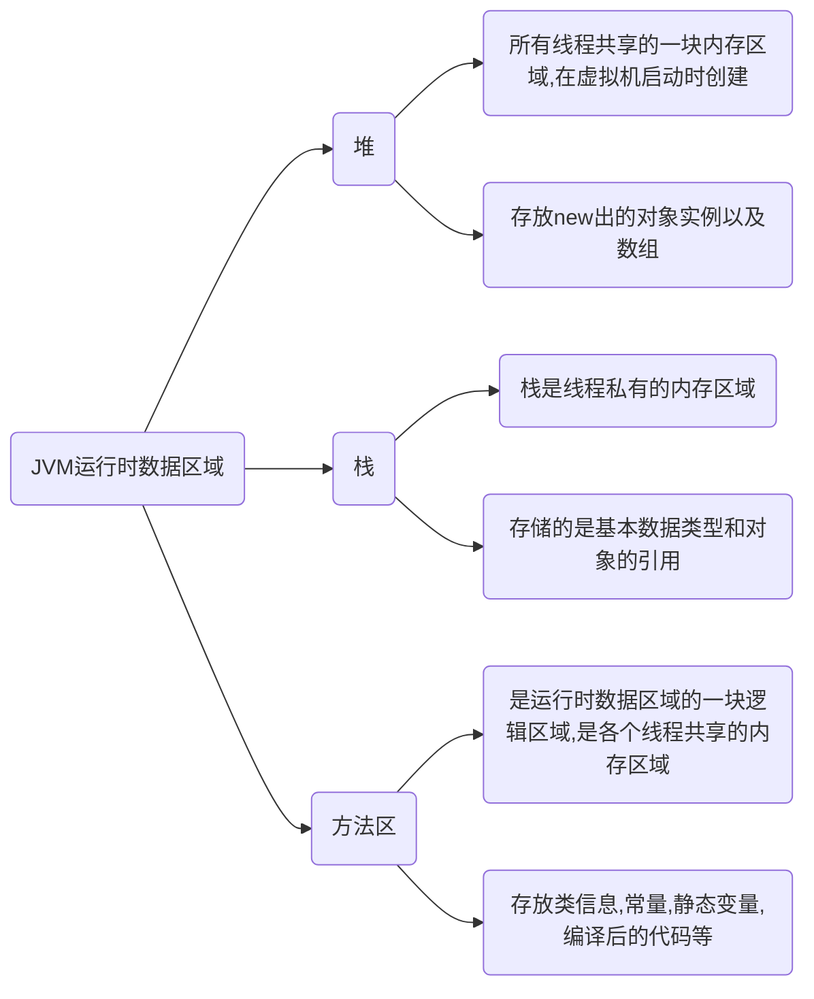

# 1. 运行时数据区域

Java 虚拟机在执行 Java 程序的过程中会把它管理的内存划分成若干个不同的数据区域。JDK 1.8 和之前的版本略有不同，下面仅学习JDK 1.8的

## 1.1. Java 文件是如何被运行的

Java 文件经过编译后变成 .class 字节码文件

（虚拟机主要的 5 大块）

**类加载器**

字节码文件通过 类加载器 被搬运到 JVM 虚拟机中

**方法区**

类加载器将 .class 文件搬过来先丢到这一块上

对象实例初始化时会去方法区中找类信息，完成后再到栈那里去运行方法

**堆**

主要放一些存储的数据，比如对象实例，数组···等

**栈**

是代码运行空间，每一个方法都会放到 栈 里面运行

栈存储的是基本数据类型和对象的引用。当一个方法被调用时，Java会在栈上为该方法分配一块内存区域，称为栈帧。栈帧包含方法的参数、局部变量和返回值。当方法返回时，栈帧被弹出，栈上的内存被释放

**计数器**

主要就是完成一个加载工作，类似于一个指针一样的，指向下一行我们需要执行的代码

 JVM 的调优主要就是围绕堆，栈两大块进行

## 1.2. Java内存管理




## 1.3. 运行时常量池（是方法区的一部分）

存放编译期生成的各种字面量（Literal）和符号引用（Symbolic Reference）的 **常量池表(Constant Pool Table)** 

字面量是源代码中的固定值的表示法。字面量包括整数、浮点数和字符串字面量

常见的符号引用包括类符号引用、字段符号引用、方法符号引用、接口方法符号

## 1.4. 字符串常量池

**字符串常量池** 是 JVM 为了提升性能和减少内存消耗针对字符串（String 类）专门开辟的一块区域，主要目的是为了避免字符串的重复创建

HotSpot 虚拟机中字符串常量池的实现是 StringTable，StringTable 本质上就是一个`HashSet<String>`，StringTable 中保存的是字符串对象的引用，字符串对象的引用指向堆中的字符串对象


# 2. HotSpot 虚拟机对象

## 2.1. 对象的创建


## 2.2. 分析

 **String s1 = new String("abc") 这句话创建了几个字符串对象？**

```java
Java中的字符串是不可变的，这意味着每次对字符串进行更改时，都会创建一个新的字符串对象。
因此，String s1 = new String("abc")创建了两个字符串对象。

第一个字符串对象是字面值"abc"，它存储在字符串常量池中。第二个字符串对象是通过new关键字创建的，它存储在堆中。s1是对第二个字符串对象的引用。

需要注意的是，如果使用字面值创建字符串对象，只会创建一个字符串对象。例如，String s2 = "abc"只会创建一个字符串对象，因为"abc"已经存在于字符串常量池中。
```


