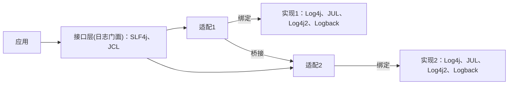
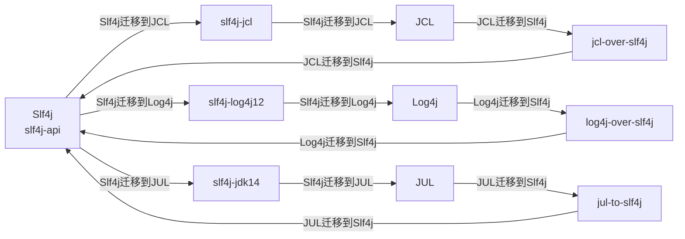
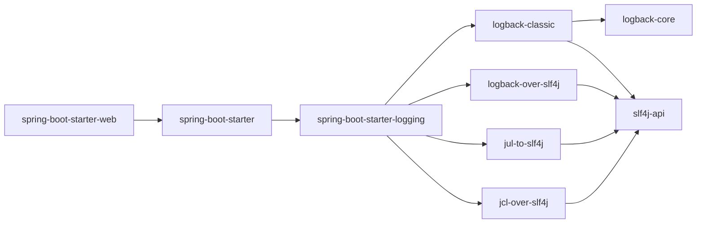

# 1. 为什么要使用日志框架

使用 `System.out.println()`来打印信息耗费系统资源，不方便排查问题

# 2. 日志的发展

**日志发展到今天，被抽象成了三层：接口层、实现层、适配层**

接口层：或者叫日志门面（facade），只定义接口，等着别人实现

实现层：真正干活的、能够把日志内容记录下来的工具。但请注意它不是上边接口实现，因为它不感知也不直接实现接口，仅仅是独立的实现

适配层：它才是上边接口的implements。因为接口层和实现层并非都出自一家之手，它们之间无法直接匹配。但是可以通过增加一个中间层来解决，所以就有了适配层

适配层又可以分为绑定（Binding）和桥接（Bridging）两种能力：

- 绑定：将接口层绑定到某个实现层（实现一个接口层，并调用实现层的方法）
- 桥接：将接口层桥接到另一个接口层（实现一个接口层，并调用另一个接口层的接口），主要作用是方便用户低成本的在各接口层和适配层之间迁移





| 日志门面（日志的抽象层）      | 日志实现                    |
| ----------------------------- | --------------------------- |
| JCL（Jakarta Commons Logging）、SLF4j | Log4j、JUL（java.util.logging）、Log4j2、Logback |

推荐搭配：SLF4j + Logback

Spring框架默认是用JCL

SpringBoot默认是SLF4j搭配Logback

# 3. Slf4j

Slf4j的两种桥接层：一种是让在使用Slf4j的用户迁移到别的接口层上，如 slf4j-jcl：让在使用Slf4j的用户方便的迁移到JCL上、。另一种是让使用其他接口层的用户方便的迁移到Slf4j 上来，如 jcl-over-slf4j：作用是让已经在使用JCL的用户方便的迁移到Slf4j 上来

Slf4j通过推出各种适配层，基本满足了用户的所有场景，我们来看一下它的全家桶：


**工厂函数**

```java
// 传 Class，一般都是传当前的 Class
private static final Logger log = LoggerFactory.getLogger(ExampleService.class);
```

**@Slf4j注解**

Lombok也提供了针对各种日志系统的支持，比如你只需要`@lombok.extern.slf4j.Slf4j`注解就可以得到一个静态的log字段，不用再手动调用工厂函数。默认的LoggerName 即是被注解的Class；同时也支持字符串格式的topic字段指定LoggerName

# 4. Logback

Logback主要由三部分组成：

- logback-core：记录/输出日志的核心实现
- logback-classic：适配层，完整实现了Slf4j接口
- logback-access：用于将Logback集成到Servlet容器（Tomcat、Jetty）中，让这些容器的HTTP访问日志也可以经由强大的Logback输出

# 5. Slf4j+Logback 整合及排包

## 5.1. 基础依赖项

以下三个包是必须的：

-  Slf4j是基本的日志门面，它的核心API在`org.slf4j:slf4j-api`中；
-  Logback的核心实现层在`ch.qos.logback:logback-core`中；
-  Logback针对Slf4j的适配层在`ch.qos.logback:logback-classic`中；

其中logback-classic会直接依赖另外两项，而且它依赖的一定是它能够支持的最合适版本，所以为了避免歧义，我们可以在项目中仅显式依赖logback-classic即可

**兼容性**

Slf4j和Logback的版本并不完全向前兼容，它们之间也有对应关系

| Slf4j 版本  | JDK 版本         | 备注                      |
| ----------- | ---------------- | ------------------------- |
| Slf4j 1.7.x | >= JDK 1.5       |                           |
| Slf4j 2.0.x | >= JDK 8         |                           |
| Slf4j 2.1.x | 很可能 >= JDK 11 | Ceki正在征求大家的意见[5] |

| Logback 版本  | Slf4j 版本     | JDK 版本   | 备注                 |
| ------------- | -------------- | ---------- | -------------------- |
| Logback 1.2.x | Slf4j 1.7.x    | >= JDK 1.5 |                      |
| Logback 1.3.x | Slf4j 2.0.x    | >= JDK 8   |                      |
| Logback 1.4.x | Slf4j 2.0.x    | >= JDK 11  |                      |
| Logback 1.5.x | >=Slf4j 2.0.12 | >= JDK 11  | 1.5.x 用于替代 1.4.x |

**总结**

- 如果使用JDK 8，建议选择Slf4j 2.0 + Logback 1.3；
- 如果使用JDK 11及以上，建议选择Slf4j 2.0 + Logback 1.5；

但还没完，Spring Boot的日志系统对Slf4j和Logback又有额外的版本要求

## 5.2. 适配 Spring Boot



Spring Boot通过spring-boot-starter-logging包直接依赖了Logback（然后再间接依赖了 Slf4j），它通过`org.springframework.boot.logging.LoggingSystem[10]`查找日志接口并自动适配，**所以我们使用Spring Boot时一般并不需要关心日志依赖，只管使用即可**。但因为Slf4j 2.0.x与Slf4j 1.7.x实现不一致，导致Spring Boot也会挑版本：

| Spring Boot 版本 | Slf4j 版本  | Logback 版本  | JDK 版本  |
| ---------------- | ----------- | ------------- | --------- |
| Spring Boot 1.5  | Slf4j 1.7.x | Logback 1.1.x | >= JDK 7  |
| Spring Boot 2.x  | Slf4j 1.7.x | Logback 1.2.x | >= JDK 8  |
| Spring Boot 3.x  | Slf4j 2.0.x | Logback 1.4.x | >= JDK 17 |


根据这个表格，以及前一节总结的版本兼容关系，最终可以得到以下结论：

- 如果使用Spring Boot 2及以下，建议选择Slf4j 1.7.x + Logback 1.2.x；
- 如果使用Spring Boot 3，建议选择Slf4j 2.0.x + Logback 1.4.x

## 5.3. 桥接其他实现层

我们还要保证项目中依赖的二方、三方包能够正常打印出日志，而它们可能依赖的是 JCL/Log4j/Log4j2/JUL，我们可以统一引入适配层做好桥接

- 通过`org.slf4j:jcl-over-slf4j` 将JCL桥接到Slf4j 上；
- 通过`org.slf4j:log4j-over-slf4j` 将Log4j桥接到Slf4j 上；
- 通过`org.slf4j:jul-to-slf4j` 将JUL桥接到Slf4j上；
- 通过`org.apache.logging.log4j:log4j-to-slf4j` 将Log4j 2桥接到Slf4j上；

注意，所有`org.slf4j`的包版本要完全一致，所以如果引入这些桥接包，要保证它们的版本与前边选择的slf4j-api版本对应。为此Slf4j从2.0.8开始提供了bom包，省去了维护每个包版本的烦恼

```xml
<dependencyManagement>
    <dependency>
        <groupId>org.slf4j</groupId>
        <artifactId>slf4j-bom</artifactId>
        <version>2.0.9</version>
        <type>pom</type>
    </dependency>
</dependencyManagement>
```

## 5.4. 去除无用依赖

桥接层使用与被桥接包一样的包结构，再暗渡陈仓将调用转到另一个接口上。所以如果同时引入桥接层以及被桥接的包，大概率会引起包冲突。

由于很多工具会在不经意间引入日志接口层/实现层，所以我们有必要从整个应用级别着眼，把那些无用的接口层/实现层排除掉，包括JCL、Log4j和Log4j 2：

- 排掉JCL：`commons-logging:commons-logging`
- 排掉Log4j：`log4j:log4j`
- 排掉Log4j 2：`org.apache.logging.log4j:log4j-core`

以及，如果项目间接引入了其他的桥接包，也可能会引起冲突，需要排掉

**Maven 统一排包方案**

使用maven-enforcer-plugin插件标识哪些包是要被排掉的，它只是一个校验，实际上你仍然需要在每个引入了错误包的依赖中进行排除

## 5.5. 最终依赖

**JDK 8/11 + Spring Boot 1.5/2**

- 基础
	- `org.slf4j:slf4j-api:1.7.36`
	- `ch.qos.logback:logback-core:1.2.13`
	- `ch.qos.logback:logback-classic:1.2.13`

- 桥接包
	- `org.slf4j:jcl-over-slf4j:1.7.36`
	- `org.slf4j:log4j-over-slf4j:1.7.36`
	- `org.slf4j:jul-to-slf4j:1.7.36`
	- `org.apache.logging.log4j:log4j-to-slf4j:2.23.1`
- 排包
	- `commons-logging:commons-logging:99.0-does-not-exist`
	- `log4j:log4j:99.0-does-not-exist`
	- `org.apache.logging.log4j:log4j-core:99.0-does-not-exist`

**JDK 17/21 + Spring Boot 3**

- 基础
	- `org.slf4j:slf4j-bom:2.0.12` 通过 BOM 包统一管理依赖
	- `ch.qos.logback:logback-core:1.4.14`
	- `ch.qos.logback:logback-classic:1.4.14`

-   桥接包
	-   `org.slf4j:jcl-over-slf4j` 
	-   `org.slf4j:log4j-over-slf4j` 
	-   `org.slf4j:jul-to-slf4j` 
	-   `org.apache.logging.log4j:log4j-to-slf4j:2.23.1`
    
-   排包
	-   `commons-logging:commons-logging:99.0-does-not-exist`
	-   `log4j:log4j:99.0-does-not-exist`
	-   `org.apache.logging.log4j:log4j-core:99.0-does-not-exist`

## 5.6. 注意事项

根据前边的介绍，我们在实际项目中将主要做两类事情：

-   引入期望的包，并指定版本；
-   排除一些包（指定空版本）；

# 6. SpringBoot中日志的具体配置

## 6.1. 日志级别

SpringBoot默认的日志级别是info

可以使用`logging.level` 调整某个包、类输出的日志级别

一共有五个等级，按优先级从低到高依次为：

-   TRACE：一般用于记录调用链路，比如方法进入时打印xxx start；
    
-   DEBUG：个人觉得它和 trace 等级可以合并，如果一定要区分，可以用来打印方法的出入参；
    
-   INFO：默认级别，一般用于记录代码执行时的关键信息；
    
-   WARN：当代码执行遇到预期外场景，但它不影响后续执行时，可以使用；
    
-   ERROR：出现异常，以及代码无法兜底时使用；

```java
@Slf4j
public class ExampleService {
    @Resource
    private RpcService rpcService;

    public String querySomething(String request) {
        // 使用 trace 标识这个方法调用情况
        log.trace("querySomething start");
        // 使用 debug 记录出入参
        log.debug("querySomething request={}", request);

        String response = null;
        try {
            RpcResult rpcResult = rpcService.call(a);
            if (rpcResult.isSuccess()) {
                response = rpcResult.getData();

                // 使用 info 标识重要节点
                log.info("querySomething rpcService.call succeed, request={}, rpcResult={}", request, rpcResult);
            } else {
                // 使用 warn 标识程序调用有预期外错误，但这个错误在可控范围内
                log.warn("querySomething rpcService.call failed, request={}, rpcResult={}", request, rpcResult);
            }
        } catch (Exception e) {
            // 使用 error 记录程序的异常信息
            log.error("querySomething rpcService.call abnormal, request={}, exception={}", request, e.getMessage(), e);
        }

        // 使用 debug 记录出入参
        log.debug("querySomething response={}", response);
        // 使用 trace 标识这个方法调用情况
        log.trace("querySomething end");

        return response;
    }
}
```

## 6.2. Logback配置文件

每一个日志的实现框架都有自己的配置文件。使用SLF4J以后，日志配置文件还是日志实现框架的配置文件

将Logback配置文件`logback.xml`或`logback-spring.xml`放在resource目录下，`logback.xml` 会直接被日志框架解析，而`logback-spring.xml`是由SpringBoot解析

推荐使用`logback-spring.xml`配置，这样可以使用SpringBoot中的特性`springProfile`标签（指定某段配置只在某个环境下生效）

```xml
<springProfile name="staging" >
<!-- configuration to be enabled when the "staging" profile is active -->
</springProfile>
```

具体配置
```xml
<?xml version="1.0" encoding="UTF-8"?>
<configuration>

    <property name="LOGS" value="./logs" />

    <appender name="Console"
        class="ch.qos.logback.core.ConsoleAppender">
        <layout class="ch.qos.logback.classic.PatternLayout">
            <Pattern>
                %black(%d{ISO8601})==%highlight(%-5level)==[%blue(%t)]==%yellow(%C{1.}): %msg%n%throwable
            </Pattern>
        </layout>
    </appender>

    <appender name="RollingFile"
        class="ch.qos.logback.core.rolling.RollingFileAppender">
        <file>${LOGS}/spring-boot-logger.log</file>
        <encoder
            class="ch.qos.logback.classic.encoder.PatternLayoutEncoder">
            <Pattern>%d==%p==%C{1.}==[%t]==%m%n</Pattern>
        </encoder>

        <rollingPolicy
            class="ch.qos.logback.core.rolling.TimeBasedRollingPolicy">
            <!-- rollover daily and when the file reaches 10 MegaBytes -->
            <fileNamePattern>${LOGS}/archived/spring-boot-logger-%d{yyyy-MM-dd}.%i.log
            </fileNamePattern>
            <timeBasedFileNamingAndTriggeringPolicy
                class="ch.qos.logback.core.rolling.SizeAndTimeBasedFNATP">
                <maxFileSize>10MB</maxFileSize>
            </timeBasedFileNamingAndTriggeringPolicy>
        </rollingPolicy>
    </appender>
    
    <!-- LOG everything at INFO level -->
    <root level="info">
        <appender-ref ref="RollingFile" />
        <appender-ref ref="Console" />
    </root>

    <!-- LOG "com.baeldung*" at TRACE level -->
    <logger name="com.baeldung" level="trace" additivity="false">
        <appender-ref ref="RollingFile" />
        <appender-ref ref="Console" />
    </logger>

</configuration>
```

## 6.3. 打印哪些日志

可以使用 `<logger>` 元素为特定的包或类定义日志记录规则，以控制它们的日志输出行为，`name` 属性值可以是一个包的名称，也可以是一个具体类的全限定名

```xml
<configuration>
    <!-- 其他配置项... -->

    <logger name="com.example.package1" level="DEBUG" />
    <logger name="com.example.package2" level="INFO" />

    <!-- 其他配置项... -->
</configuration>
```

对于 `com.example.package1`，我们将日志级别设置为 DEBUG，这意味着日志记录器将输出 DEBUG 及以上级别的日志。

**Myibatis log**

```xml
<!-- mybatis log configure -->  
<logger name="com.apache.ibatis" level="TRACE" />  
  
<!-- JDBC日志 -->  
<logger name="java.sql.Connection" level="DEBUG" />  
<logger name="java.sql.Statement" level="DEBUG" />  
<logger name="java.sql.PreparedStatement" level="DEBUG" />
```

