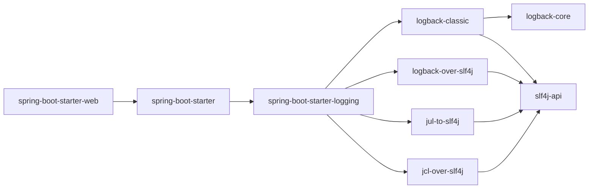

# 1. 为什么要使用日志框架

使用 `System.out.println()`来打印信息耗费系统资源，不方便排查问题

# 2. 常见的日志框架

| 日志门面（日志的抽象层）      | 日志实现                    |
| ----------------------------- | --------------------------- |
| JCL（Jakarta Commons Logging）、SLF4j、jboss-logging | Log4j、JUL（java.util.logging）、Log4j2、Logback |

常用搭配：SLF4j + Logback

Spring框架默认是用JCL

SpringBoot默认是SLF4j搭配Logback

# 3. [SLF4J](http://www.slf4j.org/)

## 3.1. SLF4J的定义

SLF4J ，即简单日志门面（Simple Logging Facade for Java），不是具体的日志解决方案，它只服务于各种各样的日志系统。SLF4J是一个用于日志系统的日志抽象层，允许开发人员灵活的切换所需的日志框架，实现Log4j、Logback等多种日志框架的切换。将应用系统和具体的日志框架解耦合

## 3.2. SLF4J的使用

日志记录方法的调用，不应该来直接调用日志的实现类，而是调用日志抽象层里面的方法

每一个日志的实现框架都有自己的配置文件。使用SLF4J以后，日志配置文件还是日志实现框架的配置文件

SLF4J的唯一强制依赖项是slf4j-api

```xml
<dependency>
	<groupId>org.slf4j</groupId>
	<artifactId>slf4j-api</artifactId>
</dependency>
```


# 4. SpringBoot中的日志实现



## 4.1. SpringBoot中的日志关系

历史遗留问题：在项目中虽然使用了SLF4j + Logback来实现日志，但是Spring项目中引入的其他框架如Mybatis等却使用的是别的日志框架，怎么把系统中不同的日志实现框架统一

SpringBoot能自动适配所有的日志框架，而且底层使用SLF4j+logback的方式记录日志，引入其他框架的时候，只需要把这个框架依赖的日志框架排除掉即可

**实现原理：如何将系统中的所有日志都统一到SLF4j**

- 将系统中其他日志框架先排除出去
- 用中间包来替换原有的日志框架
- 导入SLF4j其他的实现

## 4.2. SpringBoot中日志的默认配置

**日志级别**

SpringBoot默认的日志级别是info

可以使用`logging.level` 调整某个包、类输出的日志级别

## 4.3. SpringBoot中指定日志框架

**Logback**

将Logback配置文件`logback.xml`或`logback-spring.xml`放在resource目录下，`logback.xml` 会直接被日志框架解析，而`logback-spring.xml`是由SpringBoot解析

推荐使用`logback-spring.xml`配置，这样可以使用SpringBoot中的特性`springProfile`标签（指定某段配置只在某个环境下生效）

```xml
<springProfile name="staging" >
<!-- configuration to be enabled when the "staging" profile is active -->
</springProfile>
```

**Log4j2**

如果对日志框架的性能有要求，则使用Log4j2，否则使用默认的Logback即可

如果要使用Log4j2，要在引入SpringBoot时排除Logback

```xml
<dependency>
    <groupId>org.springframework.boot</groupId>
    <artifactId>spring-boot-starter-web</artifactId>
    <exclusions>
        <exclusion>
            <groupId>org.springframework.boot</groupId>
            <artifactId>spring-boot-starter-logging</artifactId>
        </exclusion>
    </exclusions>
</dependency>
<dependency>
    <groupId>org.springframework.boot</groupId>
    <artifactId>spring-boot-starter-log4j2</artifactId>
</dependency>
```

将Log4j2配置文件`log4j2.xml`或`log4j2-spring.xml`放在resource目录下

# 5. 配置文件模板

## 5.1. Logback

```xml
<?xml version="1.0" encoding="UTF-8"?>
<configuration>

    <property name="LOGS" value="./logs" />

    <appender name="Console"
        class="ch.qos.logback.core.ConsoleAppender">
        <layout class="ch.qos.logback.classic.PatternLayout">
            <Pattern>
                %black(%d{ISO8601})==%highlight(%-5level)==[%blue(%t)]==%yellow(%C{1.}): %msg%n%throwable
            </Pattern>
        </layout>
    </appender>

    <appender name="RollingFile"
        class="ch.qos.logback.core.rolling.RollingFileAppender">
        <file>${LOGS}/spring-boot-logger.log</file>
        <encoder
            class="ch.qos.logback.classic.encoder.PatternLayoutEncoder">
            <Pattern>%d==%p==%C{1.}==[%t]==%m%n</Pattern>
        </encoder>

        <rollingPolicy
            class="ch.qos.logback.core.rolling.TimeBasedRollingPolicy">
            <!-- rollover daily and when the file reaches 10 MegaBytes -->
            <fileNamePattern>${LOGS}/archived/spring-boot-logger-%d{yyyy-MM-dd}.%i.log
            </fileNamePattern>
            <timeBasedFileNamingAndTriggeringPolicy
                class="ch.qos.logback.core.rolling.SizeAndTimeBasedFNATP">
                <maxFileSize>10MB</maxFileSize>
            </timeBasedFileNamingAndTriggeringPolicy>
        </rollingPolicy>
    </appender>
    
    <!-- LOG everything at INFO level -->
    <root level="info">
        <appender-ref ref="RollingFile" />
        <appender-ref ref="Console" />
    </root>

    <!-- LOG "com.baeldung*" at TRACE level -->
    <logger name="com.baeldung" level="trace" additivity="false">
        <appender-ref ref="RollingFile" />
        <appender-ref ref="Console" />
    </logger>

</configuration>
```

## 5.2. Log4j2


# 6. 打印哪些日志

可以使用 `<logger>` 元素为特定的包或类定义日志记录规则，以控制它们的日志输出行为，`name` 属性值可以是一个包的名称，也可以是一个具体类的全限定名

```xml
<configuration>
    <!-- 其他配置项... -->

    <logger name="com.example.package1" level="DEBUG" />
    <logger name="com.example.package2" level="INFO" />

    <!-- 其他配置项... -->
</configuration>
```

对于 `com.example.package1`，我们将日志级别设置为 DEBUG，这意味着日志记录器将输出 DEBUG 及以上级别的日志。

**Myibatis log**

```xml
<!-- mybatis log configure -->  
<logger name="com.apache.ibatis" level="TRACE" />  
  
<!-- JDBC日志 -->  
<logger name="java.sql.Connection" level="DEBUG" />  
<logger name="java.sql.Statement" level="DEBUG" />  
<logger name="java.sql.PreparedStatement" level="DEBUG" />
```