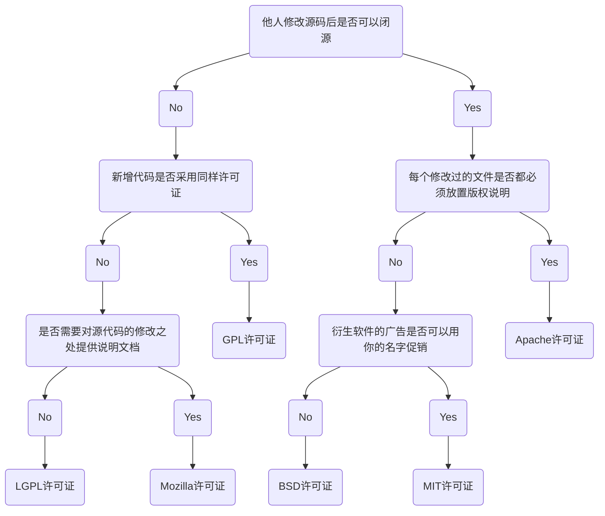

# 协议

```mermaid
graph TD
a(他人修改源码后是否可以闭源)
a-->a.1(No)
a-->a.2(Yes)
a.1-->a.1.1(新增代码是否采用同样许可证)
a.2-->a.2.1(每个修改过的文件是否都必须放置版权说明)
a.1.1-->a.1.1.1(No)
a.1.1.1-->a.1.1.1.1(是否需要对源代码的修改之处提供说明文档)
a.1.1.1.1-->a.1.1.1.1.1(No)
a.1.1.1.1.1-->a.1.1.1.1.1.1(LGPL许可证)
a.1.1.1.1-->a.1.1.1.1.2(Yes)
a.1.1.1.1.2-->a.1.1.1.1.1.2(Mozilla许可证)
a.1.1-->a.1.1.2(Yes)
a.1.1.2-->a.1.1.2.1(GPL许可证)
a.2.1-->a.2.1.1(No)
a.2.1-->a.2.1.2(Yes)
a.2.1.1-->a.2.1.1.1(衍生软件的广告是否可以用你的名字促销)
a.2.1.1.1-->a.2.1.1.1.1(No)
a.2.1.1.1-->a.2.1.1.1.2(Yes)
a.2.1.1.1.1-->a.2.1.1.1.1.1(BSD许可证)
a.2.1.1.1.2-->a.2.1.1.1.1.2(MIT许可证)
a.2.1.2-->a.2.1.2.1(Apache许可证)
```

