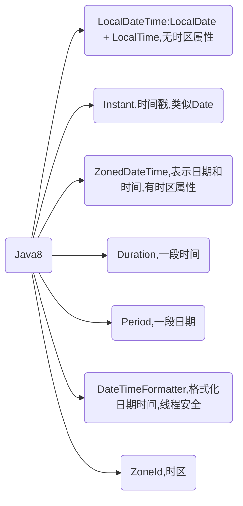

# 日期时间类型

日期时间的初始化、时区、格式化、解析和计算




# 初始化日期时间

处理好时间和时区问题首先就是要正确保存日期时间

以 UTC 保存，保存的时间没有时区属性，是不涉及时区时间差问题的世界统一时间。我们通常说的时间戳就是用的这种方式

```java
LocalDateTime localDateTime = LocalDateTime.now();
```

# 时区问题

全球有 24 个时区，同一个时刻不同时区（比如中国上海和美国纽约）的时间是不一样的。对于需要全球化的项目，如果初始化时间时没有提供时区，那就不是一个真正意义上的时间，只能认为是我看到的当前时间的一个表示

要正确处理时区，在于存进去和读出来两方面：存的时候，需要使用正确的当前时区来保存，这样 UTC 时间才会正确；读的时候，也只有正确设置本地时区，才能把 UTC 时间转换为正确的当地时间。

Java 8 推出了新的时间日期类 ZoneId、ZoneOffset、LocalDateTime、ZonedDateTime 和 DateTimeFormatter，处理时区问题更简单清晰。

首先初始化上海、纽约和东京三个时区。我们可以使用 ZoneId.of 来初始化一个标准的时区，也可以使用 ZoneOffset.ofHours 通过一个 offset，来初始化一个具有指定时间差的自定义时区。

对于日期时间表示，推荐使用 LocalDateTime 是不涉及时区时间差问题的世界统一时间；而 ZonedDateTime=LocalDateTime+ZoneId，具有时区属性。ZonedDateTime 才是一个有效的时间。

使用 DateTimeFormatter 格式化时间的时候，可以直接通过 withZone 方法直接设置格式化使用的时区。

要正确处理国际化时间问题，推荐使用 Java 8 的日期时间类，即使用 ZonedDateTime 保存时间，然后使用设置了 ZoneId 的 DateTimeFormatter 配合 ZonedDateTime 进行时间格式化得到本地时间表示。这样的划分十分清晰、细化，也不容易出错

```java
// 获取当前时间
LocalDateTime localDateTime = LocalDateTime.now();

// 初始化一个时区
ZoneId timeZoneSH = ZoneId.of("Asia/Shanghai");
ZoneId timeZoneNY = ZoneId.of("America/New_York");

// 格式化日期时间
DateTimeFormatter dateTimeFormatter = DateTimeFormatter.ofPattern("yyyy-MM-dd HH:mm:ss");
String formattedDateTime = localDateTime.format(dateTimeFormatter);

// 加上时区信息
ZonedDateTime date = ZonedDateTime.of(LocalDateTime.parse(formattedDateTime,dateTimeFormatter), timeZoneNY);

System.out.println(date);
```

# 日期时间格式化和解析

dateTimeFormatter VS SimpleDateFormat 

使用 DateTimeFormatterBuilder 来定义格式化字符串，DateTimeFormatter 是线程安全的，可以定义为 static 使用。最后，DateTimeFormatter 的解析比较严格，需要解析的字符串和格式不匹配时，会直接报错

```java
DateTimeFormatter dateTimeFormatter = new DateTimeFormatterBuilder()
```

# 日期时间的计算

```java
LocalDateTime localDateTime = LocalDateTime.now();
System.out.println(localDateTime.plusDays(30));
```

计算两个日期差时可能会踩坑：Java 8 中有一个专门的类 Period 定义了日期间隔，通过 Period.between 得到了两个 LocalDate 的差，返回的是两个日期差几年零几月零几天。如果希望得知两个日期之间差几天，直接调用 Period 的 getDays() 方法得到的只是最后的“零几天”，而不是算总的间隔天数。

比如，计算 2019 年 12 月 12 日和 2019 年 10 月 1 日的日期间隔，很明显日期差是 2 个月零 11 天，但获取 getDays 方法得到的结果只是 11 天，而不是 72 天，可以使用 ChronoUnit.DAYS.between 解决这个问题：

```java
System.out.println("//计算日期差");
LocalDate today = LocalDate.of(2019, 12, 12);
LocalDate specifyDate = LocalDate.of(2019, 10, 1);
System.out.println(Period.between(specifyDate, today).getDays());
System.out.println(Period.between(specifyDate, today));
System.out.println(ChronoUnit.DAYS.between(specifyDate, today));
```


