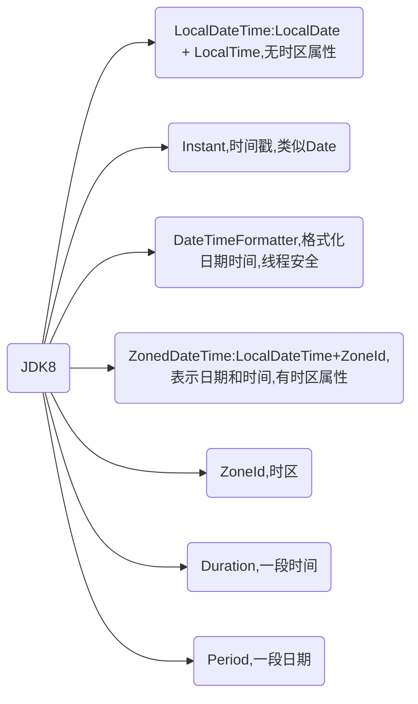

# 1. Java日期发展

## 1.1. 第一代Date

**Date** 
注意是`java.util.Date`包下的，不是`java.sql`包下的
精确到秒，代表特定的瞬间

```java
// 获取当前系统时间
Date d1 = new Date()

// 通过指定毫秒数得到时间
Date d2 = new Date(54646)
```

**SimpleDateFormat** 
格式化（日期-->文本）和解析日期（文本-->日期）的类

```java
SimpleDateFormat sdf = new SimpleDateFormat("yyyy年MM月dd日 hh:mm:ss E");
// Date日期转字符串
String format = sdf.format(Date日期);
// 字符串转Date日期
String s = "2000年01月01日 10：20：30 星期一"
Date parse = sdf.parse(s)
```

## 1.2. 第二代Calendar

Calendar类是一个抽象类，它为操作日历字段，如`YEAR、MONTH、DAY_OF _MONTH、HOUR`等提供了一些方法

Calendar类是一个抽象类，不能通过new来实例化

```java
// 创建日历类对象
Calendar c = Calendar.getInstance()
// 获取日历对象的某个日历字段
c.get(Calendar.YEAR)
// Calendar返回月的时候，是从0开始编号
c.get(Calendar.MONTH) +1)
```

Calender 没有专门的格式化方法，所以需要程序员自己来组合显示
```java
System.out.println(c.get(Calendar.YEAR)+"年"+(c.get(Calendar.MONTH)+1)+"月"+c.get(Calendar.DAY_OF_MONTH)+"日");
```

## 1.3. 第三代LocalDateTime（推荐）

**前两代**
- 不能处理闰秒
- 线程不安全

**JDK8加入的**
该类不存储或表示时区
- LocalDate只包含日期，可以获取日期字段
- LocalTime只包含时间，可以获取时间字段
- LocalDateTime包含日期+时间，可以获取日期和时间字段

```java
// now获取当前日期时间对象
LocalDateTime localDateTime = LocalDateTime.now();
// 获取年
System.out.println("年=" + ldt.getYear());
// 获取英文月
System.out.println("年=" + ldt.getMonth());
// 获取数字月
	System.out.println("年=" + ldt.getMonthValue());
```
还可以对日期时间进行加减

```java
// 获取当前时间  
LocalDateTime localDateTime = LocalDateTime.now();
// 当前时间减2年
System.out.println(localDateTime.minusYears(2));  
// 当前时间加2年
System.out.println(localDateTime.plusYears(2));|
```

**DateTimeFormatter格式日期类**

```java
DateTimeFormat dtf = DateTimeFormatter.ofPattern(格式)
String str = dtf.format(日期对象);
```

**lnstant时间戳**

类似于Date，提供了和Date类转换的方式
```java
// 获取当前时间戳的对象
Instant now = Instant.now()
// 把lnstant时间戳转为Date
Date date = Date.from(now)
// 把Date转为lnstant时间戳
Instant instant = date.toInstant
```





# 2. 时区问题

日期时间的初始化、时区、格式化、解析和计算

**初始化日期时间**

处理好时间和时区问题首先就是要正确保存日期时间

以 UTC（Universal Time Coordinated）保存，保存的时间没有时区属性，是不涉及时区时间差问题的世界统一时间。我们通常说的时间戳就是用的这种方式

```java
LocalDateTime localDateTime = LocalDateTime.now();
```

**时区问题（重点）**

全球有 24 个时区，同一个时刻不同时区（比如中国上海和美国纽约）的时间是不一样的。对于需要全球化的项目，如果初始化时间时没有提供时区，那就不是一个真正意义上的时间

要正确处理时区，在于存进去和读出来两方面：存的时候，需要使用正确的当前时区来保存，这样 UTC 时间才会正确；读的时候，也只有正确设置本地时区，才能把 UTC 时间转换为正确的当地时间。

使用 ZoneId.of 来初始化一个标准的时区，也可以使用 ZoneOffset.ofHours 通过一个 offset，来初始化一个具有指定时间差的自定义时区。

```java
// 初始化一个时区  
// 上海时区
ZoneId timeZoneSH = ZoneId.of("Asia/Shanghai");  
// 纽约时区
ZoneId timeZoneNY = ZoneId.of("America/New_York");
```

**获得一个带有时区属性的时间（有效时间）**

```java
// 初始化一个时间  
LocalDateTime localDateTime = LocalDateTime.now();
// 指定一个时区
ZoneId timeZoneNY = ZoneId.of("America/New_York");
// 获得带有时区的有效时间
ZonedDateTime zonedDateTime = ZonedDateTime.of(localDateTime, timeZoneNY);

```
**使用 DateTimeFormatter 格式化时间**

`yyyy-MM-dd HH:mm:ss z` z 是带时区的，`yyyy-MM-dd HH:mm:ss` 是不带时区的
```java
// 格式化日期时间  
DateTimeFormatter dateTimeFormatter = DateTimeFormatter.ofPattern("yyyy-MM-dd HH:mm:ss z");  
String formattedDateTime = zonedDateTime.format(dateTimeFormatter);
```

完整代码

```java
// 获取当前时间  
LocalDateTime localDateTime = LocalDateTime.now();  
// 初始化一个时区  
ZoneId timeZoneSH = ZoneId.of("Asia/Shanghai");  
ZoneId timeZoneNY = ZoneId.of("America/New_York");  
// 解析格式化后的日期时间，并添加时区信息  
ZonedDateTime zonedDateTime = ZonedDateTime.of(localDateTime, timeZoneNY);  
// 格式化日期时间  
DateTimeFormatter dateTimeFormatter = DateTimeFormatter.ofPattern("yyyy-MM-dd HH:mm:ss z");  
String formattedDateTime = zonedDateTime.format(dateTimeFormatter);  
// 输出结果  
System.out.println(formattedDateTime);
```

# 3. 日期时间的计算

```java
LocalDateTime localDateTime = LocalDateTime.now();
System.out.println(localDateTime.plusDays(30));
```

计算两个日期差时可能会踩坑：Java 8 中有一个专门的类 Period 定义了日期间隔，通过 Period.between 得到了两个 LocalDate 的差，返回的是两个日期差几年零几月零几天。如果希望得知两个日期之间差几天，直接调用 Period 的 getDays() 方法得到的只是最后的“零几天”，而不是算总的间隔天数。

比如，计算 2019 年 12 月 12 日和 2019 年 10 月 1 日的日期间隔，很明显日期差是 2 个月零 11 天，但获取 getDays 方法得到的结果只是 11 天，而不是 72 天，可以使用 ChronoUnit.DAYS.between 解决这个问题：

```java
System.out.println("//计算日期差");
LocalDate today = LocalDate.of(2019, 12, 12);
LocalDate specifyDate = LocalDate.of(2019, 10, 1);
System.out.println(Period.between(specifyDate, today).getDays());
System.out.println(Period.between(specifyDate, today));
System.out.println(ChronoUnit.DAYS.between(specifyDate, today));
```


