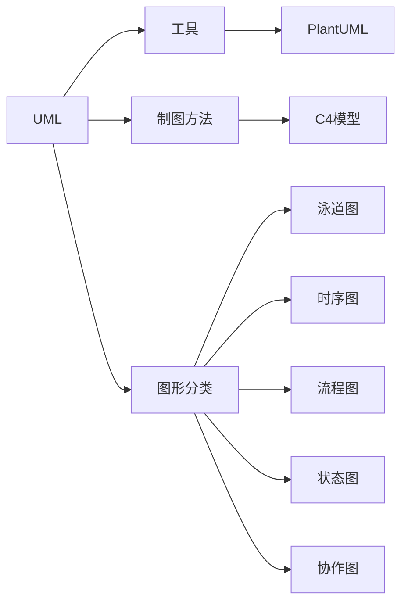

# 1. 概要

# 2. UML

## 2.1. UML简介

UML（Unified Modeling Language）为面向对象软件设计提供统一的、标准的、可视化的建模语言。适用于描述以用例为驱动，以体系结构为中心的软件设计的全过程。

UML的定义包括UML语义和UML表示法两个部分
- **UML语义**：UML对语义的描述使开发者能在语义上取得一致认识，消除了因人而异的表达方法所造成的影响。
- **UML表示法**：UML表示法定义UML符号的表示法，为开发者或开发工具使用这些图形符号和文本语法为系统建模提供了标准。

## 2.2. UML模型图的构成

- 事物（Things）：UML模型中最基本的构成元素，是具有代表性的成分的抽象
- 关系（Relationships）：关系把事物紧密联系在一起
- 图（Diagrams）：图是事物和关系的可视化表示

# 3. PlantUML

PlantUML 是一个快速创建 UML 图形的组件或者可以说是语言，通过简单和直观的语言来定义图形。其在学习成本、效率、团队协同以及维护成本上都有比较大的优势，所以推荐使用 PlantUML 来画图。除了 UML 之外，PlantUML 还支持一系列其他图表

# 4. 画图方法

基于C4模型来绘制软件架构图。

C4模型是Simon Brown提出的一种软件架构的可视化模型，简单来说，就是如何描述软件架构，如何画架构图。

C4 模型使用容器（应用程序、数据存储、微服务等）、组件和代码来描述一个软件系统的静态结构。

# 5. 图的分类

## 5.1. 泳道图

每个泳道代表一个参与者，可以是个人、团队、部门或组织

主要重点：泳道图的重点在于显示不同参与者之间的关系和协作，强调流程中各个参与者的角色和职责。

使用场景：

- 流程优化和改进：通过可视化不同参与者之间的关系和职责，识别和解决流程中的问题
- 项目管理：展示项目中不同团队或部门之间的协作和依赖关系，帮助协调和分配任务
- 组织架构和角色定义：展示组织中不同团队、部门或个人之间的关系和职责，帮助澄清工作职责和沟通渠道。

## 5.2. 时序图

时序图是一种用于描述对象之间交互的图表，强调交互的时间顺序和消息传递

主要重点：时序图的重点在于显示对象之间的交互顺序和时序，以及它们之间传递的消息。

使用场景：
- 软件系统设计和分析：展示系统中不同对象之间的交互和消息传递，帮助分析系统的行为和设计系统架构。
- 软件调试和故障排除：跟踪和分析对象之间的交互，帮助定位和解决软件中的问题。
- 通信协议设计：描述通信协议中不同实体之间的消息传递和交互顺序。

## 5.3. 流程图

流程图是一种用于展示流程或系统中各个步骤、决策和操作的图表。它使用不同的图形符号表示不同类型的步骤和操作，并使用箭头表示流程的方向。

主要重点：流程图的重点在于展示流程中的步骤、决策和操作，以及它们之间的顺序和关系。

使用场景：
- 流程分析和优化：帮助识别和改进流程中的瓶颈、冗余和错误。
- 项目管理和计划：展示项目的执行流程和关键步骤，帮助协调和管理项目。
- 程序设计和算法描述：描述算法或程序中的操作步骤和逻辑流程。

## 5.4. 状态图

状态图是一种描述对象或系统在不同状态之间转换的图表。它展示了对象的不同状态以及在特定条件下状态之间的转换。

主要重点：状态图的重点在于显示对象或系统的不同状态以及状态之间的转换条件和动作。

使用场景：
- 软件系统建模：描述系统中的对象或组件的状态和状态转换，帮助分析系统行为和设计系统。
- 用户界面设计：展示用户界面的不同状态以及用户操作之间的转换和交互。
- 系统控制和逻辑描述：描述系统或控制器的不同工作状态和状态转换规则。

## 5.5. 协作图

协作图，也称为通信图（Communication Diagram）或合作图，用于展示对象之间的交互和消息传递。它强调对象之间的通信和合作关系。

主要重点：协作图的重点在于显示对象之间的交互消息和合作关系，强调对象之间的通信和协作。

使用场景：

- 软件系统设计和分析：描述系统中不同对象之间的通信和合作，帮助分析系统架构和设计系统组件间的交互。
- 系统集成和接口设计：展示不同系统或组件之间的通信和接口，帮助定义和设计系统集成。
- 分布式系统和网络通信：描述分布式系统中不同节点之间的通信和消息传递。

以上所述的图表类型并不是互相排斥的，而是可以结合使用，根据需求选择适合的图表类型来展示信息和解决问题