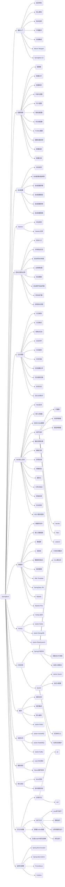

```mermaid
graph LR
A(SpringBoot)-->A.1(基础入门)
A.1 --> A.1.1(基本特性)
A.1 --> A.1.2(核心模块)
A.1 --> A.1.3(版本选择)
A.1 --> A.1.4(环境要求)
A.1 --> A.1.5(安装集成)
A.1 --> A.1.6(Maven Wrapper)
A.1 --> A.1.7(SpringBoot Cli)
A(SpringBoot)-->A.2(配置管理)
A.2 --> A.2.1(配置类)
A.2 --> A.2.2(配置文件)
A.2 --> A.2.3(配置绑定)
A.2 --> A.2.4(外部化配置)
A.2 --> A.2.5(导入配置)
A.2 --> A.2.6(随机值配置)
A.2 --> A.2.7(多文档配置)
A.2 --> A.2.8(Profiles配置)
A.2 --> A.2.9(配置加载机制)
A.2 --> A.2.10(配置加密)
A.2 --> A.2.11(配置迁移)
A(SpringBoot)-->A.3(自动配置)
A.3 --> A.3.1(命名规范)
A.3 --> A.3.2(自动配置加载原理)
A.3 --> A.3.3(自动配置原理)
A.3 --> A.3.4(自动配置报告)
A.3 --> A.3.5(自动配置排除)
A.3 --> A.3.6(自动配置替换)
A(SpringBoot)-->A.4(Starters)
A.4 --> A.4.1(命名规范)
A.4 --> A.4.2(Starters分类)
A(SpringBoot)-->A.5(启动过程及应用)
A.5 --> A.5.1(启动入口)
A.5 --> A.5.2(关闭启动日志)
A.5 --> A.5.3(启动失败分析器)
A.5 --> A.5.4(全局懒加载)
A.5 --> A.5.5(启动图案)
A.5 --> A.5.6(启动事件及监听器)
A.5 --> A.5.7(启动运行器)
A.5 --> A.5.8(应用启动流程)
A(SpringBoot)-->A.6(日志管理)
A.6 --> A.6.1(日志框架)
A.6 --> A.6.2(日志格式)
A.6 --> A.6.3(控制台日志)
A.6 --> A.6.4(日志文件)
A.6 --> A.6.5(日志级别)
A.6 --> A.6.6(日志归档)
A.6 --> A.6.7(日志配置文件)
A.6 --> A.6.8(日志框架切换)
A.6 --> A.6.9(彩色日志)
A.6 --> A.6.10(日志关闭钩子)
A(SpringBoot)-->A.7(Web核心应用)
A.7 --> A.7.1(Web支持)
A.7 --> A.7.2(嵌入式容器)
A.7 --> A.7.3(自定义Web配置)
A.7 --> A.7.4(组件注册)
A.7.4 --> A.7.4.1(拦截器)
A.7.4 --> A.7.4.2(消息转换器)
A.7.4 --> A.7.4.3(类型转换器)
A.7.4 --> A.7.4.4(Servlet)
A.7.4 --> A.7.4.5(Filter)
A.7.4 --> A.7.4.6(Listener)
A.7 --> A.7.5(静态资源处理)
A.7 --> A.7.6(模板引擎)
A.7 --> A.7.7(异常处理)
A.7 --> A.7.8(参数校验)
A.7 --> A.7.9(国际化)
A.7 --> A.7.10(分布式会话)
A.7 --> A.7.11(跨域处理)
A.7 --> A.7.12(安全机制)
A.7 --> A.7.13(REST服务调用)
A(SpringBoot)-->A.8(数据库)
A.8 --> A.8.1(数据库支持)
A.8 --> A.8.2(嵌入式数据库)
A.8 --> A.8.3(数据源)
A.8 --> A.8.4(连接池)
A.8 --> A.8.5(数据库初始化)
A.8 --> A.8.6(事务管理)
A.8 --> A.8.7(Jbdc Template)
A.8 --> A.8.8(SpringData JPA)
A.8 --> A.8.9(Mybatis)
A.8 --> A.8.10(Mybatis-Plus)
A(SpringBoot)-->A.9(NoSQL)
A.9 --> A.9.1(NoSQL支持)
A.9 --> A.9.2(starter-Redis)
A.9 --> A.9.3(starter-MongoDB)
A.9 --> A.9.4(starter-Elasticsearch)
A(SpringBoot)-->A.10(计划任务)
A.10 --> A.10.1(Spring计划任务)
A.10.1 --> A.10.1.1(计划任务集成)
A.10.1 --> A.10.1.2(Cron表达式)
A.10.1 --> A.10.1.3(线程池工作流程)
A.10.1 --> A.10.1.4(自定义线程池)
A.10 --> A.10.2(Quartz)
A.10.2 --> A.10.2.1(starter-Quartz)
A.10.2 --> A.10.2.2(自定义配置)
A.10.2 --> A.10.2.3(任务持久化)
A.10.2 --> A.10.2.4(任务动态维护)
A(SpringBoot)-->A.11(缓存)
A.11 --> A.11.1(缓存支持)
A.11 --> A.11.2(缓存集成)
A.11 --> A.11.3(默认缓存)
A.11 --> A.11.4(starter-Redis)
A(SpringBoot)-->A.12(消息队列)
A.12 --> A.12.1(starter-ActiveMQ)
A.12 --> A.12.2(starter-RabbitMQ)
A.12 --> A.12.3(starter-Kafka)
A(SpringBoot)-->A.13(跟踪调试)
A.13 --> A.13.1(main方法调试)
A.13 --> A.13.2(Maven插件调试)
A(SpringBoot)-->A.14(单元测试)
A.14 --> A.14.1(Mock测试)
A.14 --> A.14.2(技术框架测试)
A(SpringBoot)-->A.15(打包与部署)
A.15 --> A.15.1(应用打包)
A.15.1 --> A.15.1.1(jar)
A.15.1 --> A.15.1.2(war)
A.15 --> A.15.2(运行方式)
A.15.2 --> A.15.2.1(java命令运行)
A.15.2 --> A.15.2.2(直接运行)
A.15.2 --> A.15.2.3(以系统服务运行)
A.15.2 --> A.15.2.4(拆包运行)
A.15 --> A.15.3(部署Docker容器)
A.15 --> A.15.4(生成GraalVM原生镜像)
A(SpringBoot)-->A.16(监管与报警)
A.16 --> A.16.1(Spring Boot Actuator)
A.16 --> A.16.2(Spring Boot Admin)
A.16 --> A.16.3(Prometheus)
A.16 --> A.16.4(Grafana)
```

