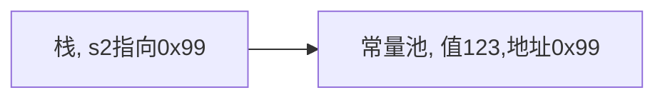
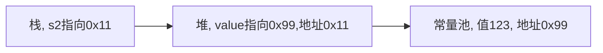
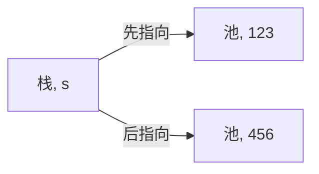

# 1. String类

字符串常量是用双引号括起的字符序列

字符串的字符使用Unicode字符编码，一个字符（不区分字母还是汉字）占两个字节

```java
// sss是字符串常量，而str是String类对象
String str = "sss";
```

String类实现了接口`Serializable`，意味着String对象可以串行化，支持在网络中传输

String类实现了接口`Comparable`，意味着String对象可以比较

String类是final类，不能被其他类继承 

String类有属性`private final char value[];` 用于存放字符串内容，并且该value是final类型，不能修改（是value不能指向新的地址而不是value的值不能修改）

## 1.1. String常用构造方法

| 方法名                    | 说明                                 |
| ------------------------- | ------------------------------------ |
| public String()           | 创建一个空白字符串对象               |
| public String(char[] chs) | 根据字符数组的内容，来创建字符串对象 |
| public String(byte[] bys) | 根据字节数组的内容，来创建字符串对象 |


## 1.2. String对象的创建

**直接赋值**

```java
String s2 = "123";
```

先从常量池查看是否有`"123"`数据空间，如果有，直接指向。如果没有则重新创建，然后指向。s2最终指向的是常量池的空间地址



**调用构造器**

```java
String s2 = new String("123");
```

先在堆中创建空间，里面维护了value属性，指向常量池的`"123"`空间。如果常量池没有`"123"`，重新创建。如果有，直接通过value指向。最终指向的是堆中的空间地址。



## 1.3. 字符串的特点

**字符串对象一旦被分配，其内容不可变**

```java
String s = "123";
s = "456";
```
上面语句创建了两个对象，s对象发生了改变

**重要规则：常量相加，看的是池。变量相加，是在堆中**

一共有几个对象：1个
```java
String c = "123" + "456"; 
```

编译器会做一个优化，判断创建的常量池对象是否有引用指向 `String a = "hello" +"abc"` 等价于 `String a = "helloabc"`

一共有几个对象：3个
```java
String a = "123";
String b = "456";
String c = a + b; 
```

## 1.4. String类的常见方法

用的时候查手册就行

| 方法名                                 | 说明                             |
| -------------------------------------- | -------------------------------- |
| public boolean equals(Object anObject) | 比较字符串的内容，严格区分大小写 |
| public char charAt(int index)          | 返回字符串指定索引处的值         |
| public int length()                    | 返回此字符串的长度               |

# 2. StringBuffer类

StringBuffer代表可变的字符序列，可以通过某些方法调用来更改序列的长度和内容

StringBuffer是个容器

StringBuffer的直接父类是AbstractStringBuilder

StringBuffer实现了SerializabLe，即StringBuffer的对象可以串行化

在父类中AbstractStringBuilder有属性`char[ ] value`，不是final，该value 数组存放字符串的内容，因此是存放在堆中的

StringBuffer是一个final类， 不能被继承

**String VS StringBuffer**

String保存的是字符串常量，里面的值不能更改，每次String类的更新实际上就是更改地址，效率较低，核心原因：`private final char value[]`

StringBuffer保存的是字符串变量，里面的值可以更改，每次StringBuffer的更新实际上可以更新内容，不用每次更新地址，效率较高，核心原因：`char[] value`

`StringBuffer` 对方法加了同步锁或者对调用的方法加了同步锁，所以是线程安全的

## 2.1. 构造方法

| 方法名                          | 功能                                                         |
| ------------------------------- | ------------------------------------------------------------ |
| public StringBuffer()           | 构造一个没有字符的字符串缓冲区，初始容量为16个字符           |
| public StringBuffer(String str) | 构造一个初始化为指定字符串内容的字符串缓冲区。字符串缓冲区的初始容量为`16`加上字符串参数的长度 |

## 2.2. String与StringBuffer互转

### 2.2.1. String转StringBuffer

**方式1 使用构造器**
```java
str = "";
StringBuffer stringBuffer = new StringBuffer(str);
```

**方式2 使用的是append方法**
```java
str = "";
StringBuffer stringBuffer1 = new StringBuffer();
stringBuffer1 = stringBuffer1.append(str);
```

### 2.2.2. StringBuffer转String

**方式1 使用StringBuffer提供的 toString方法**
```java
StringBuffer stringBuffer3 = new StringBuffer("123");
String s = stringBuffer3.toString();
```

**方式2 使用构造器来搞定**

```java
StringBuffer stringBuffer3 = new StringBuffer("123");
String s = new String(stringBuffer3);
```

## 2.3. StringBuffer常见方法

| 方法名                    | 说明                                                  |
| ------------------------- | ----------------------------------------------------- |
| append                    | 增                                                    |
| delete(start,end)         | 删，将start到end间的内容删除掉，不含end                 |
| replace(start,end,string) | 改，将start到end间的内容替换掉，不含end               |
| indexOf                   | 查，查找子串在字符串第1次出现的索引，如果找不到返回-1 |
| insert                    | 插                                                    |
| length                    | 获取长度（字符数）                                    |

```java
String str = null;
StringBuffer sb = new StringBuffer();  
sb.append(str);  
System.out.println(sb);
```

最后输出的是null（字符串）

# 3. StringBuilder类

一个可变的字符序列。此类提供一个与`StringBuffer`兼容的API，但不保证同步。此类被设计用作`StringBuffer`的简易替换，用在字符串缓冲区被单个线程使用的地方。 在可能的情况下，建议使用这个类别优先于`StringBuffer` ，因为它在大多数实现中将更快

在StringBuilder 上的主要操作是append和insert方法，可重载这些方法，以接受任意类型的数据

StringBuilder继承AbstractStringBuilder类

StringBuilder实现了Serializable，说明StringBuilder对象是可以串行化的

StringBuilder是final类，不能被继承

StringBuilder对象字符序列仍然是存放在其父类 AbstractStringBuilder的 `char[] value`，因此，字符序列在堆中

StringBuilder的方法，没有做互斥的处理，即没有synchronized关键字，因此仅可在单线程的情况下使用StringBuilder

`StringBuilder` 并没有对方法进行加同步锁，所以是非线程安全的

StringBuilder的方法使用和StringBuffer一样

# 4. 总结

- 如果字符串存在大量的修改操作，一般使用StringBuffer 或StringBuilder
- 如果字符串存在大量的修改操作，并在单线程的情况,使用StringBuilder
- 如果字符串存在大量的修改操作，并在多线程的情况,使用StringBuffer
- 如果我们字符串很少修改，被多个对象引用，使用String，比如配置信息等
