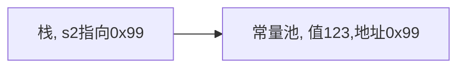
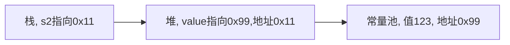
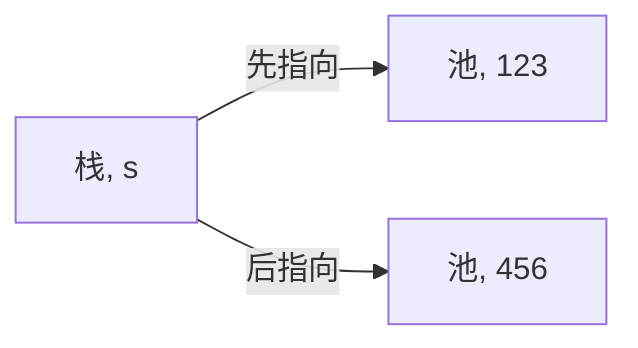

# 1. String类

字符串常量是用双引号括起的字符序列

字符串的字符使用Unicode字符编码，一个字符（不区分字母还是汉字）占两个字节

```java
// sss是字符串常量，而str是String类对象
String str = "sss";
```

String类实现了接口`Serializable`，意味着String对象可以串行化，支持在网络中传输

String类实现了接口`Comparable`，意味着String对象可以比较

String类是final类，不能被其他类继承 

String类有属性`private final char value[];` 用于存放字符串内容，并且该value是final类型，不能修改（是value不能指向新的地址而不是value的值不能修改）

## 1.1. String常用构造方法

| 方法名                    | 说明                                 |
| ------------------------- | ------------------------------------ |
| public String()           | 创建一个空白字符串对象               |
| public String(char[] chs) | 根据字符数组的内容，来创建字符串对象 |
| public String(byte[] bys) | 根据字节数组的内容，来创建字符串对象 |


## 1.2. String对象的创建

**直接赋值**

```java
String s2 = "123";
```

先从常量池查看是否有`"123"`数据空间，如果有，直接指向。如果没有则重新创建，然后指向。s2最终指向的是常量池的空间地址



**调用构造器**

```java
String s2 = new String("123");
```

先在堆中创建空间，里面维护了value属性，指向常量池的`"123"`空间。如果常量池没有`"123"`，重新创建。如果有，直接通过value指向。最终指向的是堆中的空间地址。



## 1.3. 字符串的特点

**字符串对象一旦被分配，其内容不可变**

```java
String s = "123";
s = "456";
```
上面语句创建了两个对象，s对象发生了改变

**重要规则：常量相加，看的是池。变量相加，是在堆中**

一共有几个对象：1个
```java
String c = "123" + "456"; 
```

编译器会做一个优化，判断创建的常量池对象是否有引用指向 `String a = "hello" +"abc"` 等价于 `String a = "helloabc"`

一共有几个对象：3个
```java
String a = "123";
String b = "456";
String c = a + b; 
```

## 1.4. String类的常见方法

用的时候查手册就行

| 方法名                                 | 说明                             |
| -------------------------------------- | -------------------------------- |
| public boolean equals(Object anObject) | 比较字符串的内容，严格区分大小写 |
| public char charAt(int index)          | 返回字符串指定索引处的值         |
| public int length()                    | 返回此字符串的长度               |

# 2. StringBuilder类

因为每次对 String 对象进行改变的时候，都会生成一个新的 String 对象，然后将指针指向新的 String 对象，很浪费内存。使用StringBuilder类可以解决这个问题，即所有操作都是对同一个String对象进行的

`StringBuilder` 并没有对方法进行加同步锁，所以是非线程安全的

## 2.1. StringBuilder构造方法

| 方法名                           | 说明                                   |
| -------------------------------- | -------------------------------------- |
| public StringBuilder()           | 创建一个空白可变字符串                 |
| public StringBuilder(String str) | 根据字符串的内容，来创建可变字符串对象 |

```java
class Str{
    public static void main(String[] args) {

        String s5 = "abc";
        
        StringBuffer sb = new StringBuffer(s5);
        System.out.println("ss" + sb);
    }
}
```

## 2.2. StringBuilder的添加和反转

| 方法名                                | 说明                     |
| ------------------------------------- | ------------------------ |
| public StringBuilder append(任意类型) | 添加数据，并返回对象本身 |
| public StringBuilder reverse()        | 返回相反的字符序列       |

**添加**

```java
class Str{
    public static void main(String[] args) {

        //String s5 = "abc";

        StringBuffer sb = new StringBuffer();
        StringBuffer sb1 = sb.append("123");
        System.out.println("sb" + ":" + sb);	//sb的内容和sb1的内容一样
        System.out.println("sb1" + ":" + sb1);
        System.out.println(sb==sb1);			//地址相同
    }
}
//结果是
sb:123
sb1:123
true
```

**反转**

```java
class Str{
    public static void main(String[] args) {

        //String s5 = "abc";

        StringBuffer sb = new StringBuffer();
        StringBuffer sb1 = sb.append("123");

        System.out.println("sb" + ":" + sb);
        System.out.println("sb1" + ":" + sb1);

        sb1.reverse();

        System.out.println("sb" + ":" + sb);
        System.out.println("sb1" + ":" + sb1);
    }
}
//结果为
sb:123
sb1:123
sb:321
sb1:321

```

## 2.3. StringBuilder的插入和删除

| 方法名                               | 说明                         |
| ------------------------------------ | ---------------------------- |
| public insert((int offset, 任意类型) | 在指定索引offset处插入值i    |
| public delete(int start, int end)    | 移除此序列的子字符串中的字符 |

```java
public class work {
    public static void main(String[] args) {
        StringBuffer sb = new StringBuffer();
        StringBuffer sb1 = sb.append("123456");
        sb1.insert(1,"abc");			// 1abc23456
        System.out.println(sb);
    }
}
```

## 2.4. StringBuilder的替换

| 方法名                                         | 说明                                                   |
| ---------------------------------------------- | ------------------------------------------------------ |
| public replace(int start, int end, String str) | 使用给定 `String` 中的字符替换此序列的子字符串中的字符 |

```java
public class work {
    public static void main(String[] args) {
        StringBuffer sb = new StringBuffer();
        StringBuffer sb1 = sb.append("123456");
        sb1.replace(1,3,"abc");			// 1abc456
        System.out.println(sb);
    }
}
```

## 2.5. String和StringBuilder的转换

**StringBuilder转为String**

通过toString()就可以实现把StringBuilder转换为String

```java
public String toString()
例
class Str{
    public static void main(String[] args) {

        StringBuffer sb = new StringBuffer();
        StringBuffer sb1 = sb.append("123");

        String s = sb.toString();	//实现转换
        System.out.println(s);
    }
}    
```

**String转为StringBuilder**

通过构造方法实现把String转换为StringBuilder

```java
public StringBuilder(String s)
例
class Str{
    public static void main(String[] args) {
        String s = "abc";
        StringBuilder sb = new StringBuilder(s);	//实现转换
        System.out.println(sb);
    }
}
```

# 3. StringBuffer类

StringBuffer代表可变的字符序列，可以通过某些方法调用来更改序列的长度和内容。

StringBuffer是个容器

`StringBuffer` 每次都会对 `StringBuffer` 对象本身进行操作，而不是生成新的对象并改变对象引用

`StringBuffer` 对方法加了同步锁或者对调用的方法加了同步锁，所以是线程安全的


# 4. StringTokenizer类

将字符串分解成可被独立使用的单词

StringTokenizer一个对象称为字符串分析器

## 4.1. 构造方法

| 方法名                                  | 说明                                                         |
| --------------------------------------- | ------------------------------------------------------------ |
| StringTokenizer(String s)               | 为字符串s构造一个分析器，使用默认的分隔符集合，即空格符（若干个空格被看做一个空格）、换行符、回车符、Tab符 |
| StringTokenizer(String s, String delim) | 为字符串s构造一个分析器，参数delim中的字符被作为分隔符       |

## 4.2. 方法

| 方法名                  | 说明                                                         |
| ----------------------- | ------------------------------------------------------------ |
| String nextToken()      | 查找下一个标记，并返回当前单词                               |
| int countTokens()       | 获得可以调用此 tokenizer 的 nextToken 方法的次数，即计数变量的值 |
| boolean hasMoreTokens() | 测试此 tokenizer 的字符串中是否还有更多的可用标记。只要计数的变量的值大于0，该方法就返回true，否则返回false |

# 5. 总结

1. 操作少量的数据：适用 `String`
2. 单线程操作字符串缓冲区下操作大量数据：适用 `StringBuilder`
3. 多线程操作字符串缓冲区下操作大量数据：适用 `StringBuffer`
