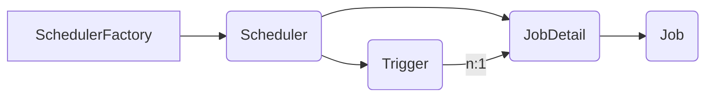

# 1. 使用场景

定时任务是指调度程序在指定的时间或周期触发执行的任务  

使用场景：发送邮件、统计、状态修改、消息推送、活动开启、增量索引

# 2. 定时任务实现方式

**Timer**：是java自带的java.util.Timer类，这个类允许你调度一个java.util.TimerTask任务。使用这种方式可以让你的程序按照某一个频度执行，但不能在指定时间运行。一般用的较少。

**ScheduledExecutorService**：也是jdk自带的一个类，是基于线程池设计的定时任务类，每个调度任务都会分配到线程池中的一个线程去执行，也就是说任务是并发执行，互不影响。

**Spring Task**：Spring3.0以后自带的task，可以将它看成一个轻量级的Quartz，而且使用起来比Quartz简单许多。除spring相关的包外不需要额外的包，支持注解和配置文件两种形式。

**Quartz**：这是一个功能比较强大的的任务调度框架，可以让你的程序在指定时间执行，也可以按照某一个频度执行，配置起来稍显复杂。

# 3. SpringBoot整合[Quartz](http://www.quartz-scheduler.org/documentation/)

## 3.1. 为什么使用Quartz

某些场景，单靠 Spring 提供的 `@Schedule` 实现不了。比如我们需要对定时任务进行增删改查，`@Schedule` 就实现不了，你不可能每次新增一个定时任务都去手动改代码来添加吧。而 Quartz 就能够实现对任务的增删改查

## 3.2. Quartz基本原理

### 3.2.1. 核心元素

Quartz核心要素有Scheduler、Trigger、Job、JobDetail，其中trigger和job、jobDetail为元数据，而Scheduler为实际进行调度的控制器。

-   Trigger

Trigger用于定义调度任务的时间规则，在Quartz中主要有四种类型的Trigger：SimpleTrigger、CronTrigger、DataIntervalTrigger和NthIncludedTrigger。

-   Job&JobDetail

Quartz将任务分为Job、JobDetail两部分，其中Job用来定义任务的执行逻辑，而JobDetail用来描述Job的定义（例如Job接口的实现类以及其他相关的静态信息）。对Quartz而言，主要有两种类型的Job，StateLessJob、StateFulJob

-   Scheduler

实际执行调度逻辑的控制器，Quartz提供了DirectSchedulerFactory和StdSchedulerFactory等工厂类，用于支持Scheduler相关对象的产生

### 3.2.2. 核心元素间关系


## 3.3. Quartz主要流程

编写Job实现类（实现Job接口），执行具体的任务逻辑

编写一个类，实现Scheduler任务调度器和Trigger任务触发器

最后

```java
// 将任务和触发器添加到调度器  
scheduler.scheduleJob(job, trigger);  
// 启动调度器  
scheduler.start();
```

**传递参数**

在创建Scheduler任务调度器时给Job实现类传递参数

```java
// 创建调度器  
Scheduler scheduler = new StdSchedulerFactory().getScheduler();  
// 创建一个JobDataMap，用于传递参数  
JobDataMap jobDataMap = new JobDataMap();  
jobDataMap.put("examId", (Integer) map.get("examId"));  
// 创建任务  
JobDetail job = JobBuilder.newJob(ExamEndTimeJob.class)  
        .withIdentity("ExamEndTimeJob", "group1")  
        // 将examId 参数传递给Job任务  
        .usingJobData(jobDataMap)  
        .build();
```

Job实现类中接收

```java
JobDataMap dataMap = context.getJobDetail().getJobDataMap();  
Integer examId = dataMap.getInt("examId");
```

## 3.4. Quartz的特性

Quartz 适用于各种类型的应用程序。无论是简单的定时任务还是复杂的分布式调度，Quartz都是一个强大而可靠的选择 

**任务的调度（Job Scheduling）**

当一个**触发器**（Trigger）触发时，任务（Job） 就会被调度执行，触发器就是用来定义何时触发的。可以指定任务的执行时间，以及执行频率（例如，每天一次、每小时一次等）。

任务只需在调度器中添加一次，就可以有多个触发器进行注册

**任务的执行（Job Execution）**

实现了 Job 接口的 Java 类就是 Job，习惯称为**任务类**（Job class）。

当 Trigger 触发时，Scheduler 就会通知实现了 JobListener 和 TriggerListener 接口的 Java 对象。当然，这些 Java 对象在 Job 执行后也会被通知到。

当 Job 执行完毕时，会返回一个码`JobCompletionCode`，这个 JobCompletionCode 能够表示 Job 执行成功还是失败，我们就能通过这个 Code 来判断后续该做什么操作，比如重新执行这个 Job。

**任务的持久化（Job Persistence）**

Quartz允许您将作业和触发器存储在数据库中，以便在应用程序重新启动后仍然保持调度状态。这样可以确保作业不会丢失，并且可以轻松地管理和监控调度任务。

Quartz 的设计包括了一个 JobStore 接口，该接口可以为存储 Job 提供各种机制。

通过 JDBCJobStore，可以将 Job 和 Trigger 持久化到关系型数据库中。

通过 RAMJobStore，可以将 Job 和 Trigger 存储到内存中（优点就是无须数据库，缺点就是这不是持久化的）。

**事务**

Quartz 可以通过使用 JobStoreCMT（JDBCJobStore的一个子类）参与 JTA 事务。

Quartz 可以围绕任务的执行来管理 JTA（Java Transaction API） 事务（开始并且提交它们），以便任务执行的工作自动发生在 JTA 事务中。

**错误恢复**

Quartz具有错误恢复机制，以确保在作业执行期间发生故障时能够进行恢复。您可以配置Quartz以重新执行失败的作业，并指定最大重试次数。

**集群和分布式**

故障转移、负载均衡

Quartz 的内置集群功能依赖于 JDBCJobStore 实现的数据库持久性。

Quartz 的 Terracotta 扩展提供了集群功能，而无需备份数据库。

**监听器和插件**

应用程序可以通过实现一个或多个监听器接口来捕获调度事件以监听或控制 Job / Trigger 的行为。

插件机制，我们可向 Quartz 添加功能，例如保存 Job 执行的历史记录，或从文件加载 Job 和 Trigger 的定义。

## 3.5. 使用Quartz

引入依赖
```xml
<dependency>
    <groupId>org.springframework.boot</groupId>
    <artifactId>spring-boot-starter-quartz</artifactId>
</dependency>
```

Quartz API 的关键接口如下：

- `Scheduler` ：最主要的 API，可以使我们与调度器进行交互，简单说就是让调度器做事。
- `Job` ：一个 Job 组件，你自定义的一个要执行的任务类就可以实现这个接口，实现这个接口的类的对象就可以被调度器进行调度执行。
- `JobDetail` ： `Job` 的详情，或者说是定义了一个 Job。
- `JobBuilder` ： 用来构建 `JobDetail` 实例的，然后这些实例又定义了 Job 实例。
- `Trigger` ： 触发器，定义 `Job` 的执行计划的组件。
- `TriggerBuilder` ： 用来构建 `Trigger` 实例。

## 3.6. Quartz使用问题

Scheduler调度器，应该由Spring注册，而不是new，这样Spring才会管理到Scheduler调度器

```java
@Component  
public class ExamScheduler {  
    @Autowired  
    private Scheduler scheduler;  
  
    public void scheduleExam(Map<String, Object> map) throws SchedulerException {  
  
        // 不能通过new来创建调度器  
//        Scheduler scheduler = new StdSchedulerFactory().getScheduler();  
        // 创建一个JobDataMap，用于传递参数  
        JobDataMap jobDataMap = new JobDataMap();  
        jobDataMap.put("examId", (Integer) map.get("examId"));  
        // 创建任务  
        JobDetail job = JobBuilder.newJob(ExamEndTimeJob.class)  
                .withIdentity("ExamEndTimeJob", "group1")  
                // 将examId 参数传递给Job任务  
                .usingJobData(jobDataMap)  
                .build();  
  
        // 时间格式转化  
        LocalDateTime endTime = (LocalDateTime) map.get("endTime");  
        Date date = Date.from(endTime.atZone(ZoneId.systemDefault()).toInstant());  
        // 创建触发器  
        Trigger trigger = TriggerBuilder.newTrigger()  
                .withIdentity("examTrigger", "group1")  
                .startAt(date)  // 在指定时间执行任务  
                .build();  
  
        // 将任务和触发器添加到调度器  
        scheduler.scheduleJob(job, trigger);  
  
        // 启动调度器  
        scheduler.start();  
        log.info("任务调度器创建完成，将在:" + endTime.toString() + "执行");  
  
    }}
```

