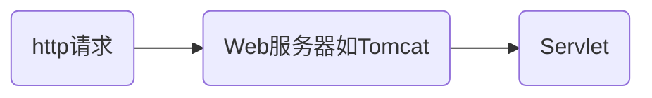

# 1. Servlet

## 1.1. 基本概念

Servlet 就是处理http请求的类，它接收http请求，并给出响应
 
## 1.2. Servlet和Servlet容器

**Servlet的运行**
 
Servlet 在 Servlet容器的管理下运行，Servlet 需要先在Servlet Container 中注册才能运行 

Servlet在Servlet Container 中的生命周期，init-service-destroy

Servlet Container接收到HTTP请求时，它会根据请求的URL映射到相应的Servlet，并调用Servlet的相应方法（如doGet、doPost等）来处理请求

**Servlet Container**

常见的Servlet Container，Apache Tomcat、Jetty

Servlet Container 会创建一个ServletContext对象，ServletContext用作服务器或容器的内存并且记住与web应用程序关联的所有servlets，filters和listeners，通常被描述为 `web.xml`，在我们终止容器之前，ServletContext一直在容器中

Servlet的load-on-startup参数起着重要的作用。如果此参数的值大于零，则只有在启动时服务器才初始化它。如果未指定此参数，则在请求第一次到达Servlet的init()时调用它

## 1.3. Request,Response,Session

在Servlet中请求用HttpServletRequest表示，响应用HttpServletResponse表示。这些对象的生命周期是短暂的。当客户端获得响应返回时，Servlet Container 将为此次的请求和响应对象做垃圾收集标记。

HttpSession是维护客户端与服务器之间请求状态的，这是将对象绑定到用户会话，以便特定用户相关的信息可以跨多个请求持久化。我们可以在`web.xml`中为会话指定超时时间，这个时间就是它的生命周期

## 1.4. Servlets间共享数据

根据所需的作用域，Servlet可以有多种方式共享数据。因为不同的对象有不同的生存期

## 1.5. 处理多线程

多个HttpServletRequest对象彼此共享Servlet，这样每个请求都使用Servlet实例自己的线程进行操作

为了线程安全，我们不应该将请求或会话作用域的数据分配为Servlet的实例变量
# 2. Filter

Filter是一种用于在Servlet之前或之后执行预处理或后处理任务的组件

Filter可以用于对请求进行过滤、验证和修改，也可以对响应进行处理，例如添加额外的头信息或修改响应内容

Filter可以按照配置的顺序链接在一起，形成一个过滤器链，每个过滤器都可以对请求和响应进行处理
# 3. Listener

Listener是一种用于监听Web应用程序中事件和生命周期的组件

Listener可以监听Web应用程序的启动和关闭事件，以及会话的创建和销毁事件

Listener可以在特定事件发生时执行自定义的逻辑，例如初始化资源、加载配置、记录日志等
# 4. JSP

Java Server Pages，JSP页面在服务器端被编译为Servlet，并在客户端请求时动态生成HTML响应

# 5. JSTL

JavaServer Pages Standard Tag Library，JSTL是一组基于JSP的自定义标签，用于简化JSP页面的开发
