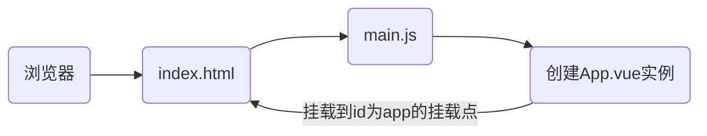

# 1. Vue的开发环境

需要先安装好node.js

**安装Vue**

使用管理员cmd运行 `npm install vue -g`

**安装Vue-cli**

Vue 构建工具，Vue CLI 使用了Webpack作为构建工具，Vue CLI = Vue + 一堆的js插件

使用管理员权限运行  `npm install vue-cli -g` 或者 `npm install -g @vue/cli` （安装的是最新版）

Vue.js 的版本和 Vue CLI 的版本是两个不同的概念，它们之间并没有直接的关系，使用 Vue CLI 来创建和管理项目。Vue CLI 会自动安装与当前项目兼容的 Vue.js 版本。如果您在使用 Vue CLI 创建项目时指定了要使用的 Vue.js 版本，那么 Vue CLI 会自动安装指定版本的 Vue.js.

**使用VsCode**

* 格式化，ctrl + shift +p ，输入format document，点击设置的图标，进行键盘监听绑定

- Vue插件：Vuter（Vue2）、Vue - Official（Vue3）、ESLint、prettier Code formatter

# 2. 用Vue-cli 构建Vue项目

创建项目文件夹，切换到该文件夹下，构建vue项目，使用管理员权限运行 `vue create vue01`

```
 (*) Babel
 ( ) TypeScript
 ( ) Progressive Web App (PWA) Support
 (*) Router
 (*) Vuex
 (*) CSS Pre-processors
 ( ) Linter / Formatter
 ( ) Unit Testing
 ( ) E2E Testing
```

若下载依赖速度慢可以`npm config set registry https://registry.npm.taobao.org
`

```
? Vue build standalone
? Install vue-router? Yes
? Use ESLint to lint your code? No
? Set up unit tests No
? Setup e2e tests with Nightwatch? No
? Should we run `npm install` for you after the project has been created? (recommended) npm
```

启动项目，使用管理员权限运行`npm run serve`

安装依赖，使用管理员权限运行 `npm install name`

## 2.1. 项目结构

以 vue-admin-template 为例

```
api 前端的所有请求
assets 主题、字体等静态资源
components 全局公用组件
icons  项目所有 svg icons
mock  项目mock 模拟数据
router 管理前端路由
App.vue 是根组件
main.js  相当于main方法，是整个项目的入口js
store 全局store管理
utils  全局公用方法
styles  全局样式
views 视图，存放各个页面的自定义组件
layout 布局
permission.js  权限管理，根据用户的不同权限可以实现动态路由
项目中 @指的是src目录
```

## 2.2. package.json

方便快捷的管理项目依赖的资源，避免资源间的版本冲突等问题

构建一个vue项目时，只需用package.json即可。执行 `npm install`，npm会自动从package.json中读取依赖，进行下载

## 2.3. Vue CLI 多种环境

.env.development：本地

.env.staging：测试环境

.env.production：正式环境

## 2.4. 版本问题

vue版本查看：`vue -V`

Vue CLI 4.5以下，对应的是Vue2

Vue CLI 4.5及以上，对应的是Vue3，当然，创建项目的时候可以选择Vue2

-   `^` 符号表示兼容的更新，例如 `^5.0.0` 表示可以安装 `5.x.x` 版本系列的最新版本，但不包括 `6.0.0` 或更高版本。
-   `~` 符号表示只安装修订版本的更新，例如 `~5.0.0` 表示可以安装 `5.0.x` 版本系列的最新版本，但不包括 `5.1.0` 或更高版本。
-   `>` 和 `<` 符号分别表示大于和小于某个特定版本，例如 `>4.0.0` 表示可以安装大于 `4.0.0` 的任何版本。
-   `>=` 和 `<=` 符号分别表示大于等于和小于等于某个特定版本，例如 `>=4.0.0` 表示可以安装大于等于 `4.0.0` 的任何版本，包括 `4.0.0` 本身。

# 3. Vue项目运行流程

**执行 npm run dev 命令后，发生了什么**

1. npm 解析并执行在 package.json 文件中定义的 dev 脚本
2. 在 dev 脚本中，一般会执行 vue-cli-service 命令，用于启动开发服务器和构建项目。
3. vue-cli-service 命令会加载 Vue CLI 的配置文件，并根据配置进行相应的操作。
4. 根据配置，vue-cli-service 会启动一个开发服务器，监听指定的端口（通常是8080）。
5. 在启动开发服务器时，vue-cli-service 会读取项目配置文件（如 vue.config.js），并执行其中的配置选项。
6. 在项目构建过程中，vue-cli-service 会根据配置进行一系列操作，如编译 Vue 单文件组件、处理样式文件、打包 JavaScript 文件等。
7. 构建完成后，开发服务器会将构建后的文件提供给浏览器进行访问。
8. 浏览器发送HTTP请求到开发服务器，并接收响应。
9. 开发服务器将构建后的文件提供给浏览器，浏览器解析并渲染页面。
10. 当文件发生变化时，开发服务器会自动重新构建项目，并通知浏览器刷新页面，以便实时预览更改
11. 浏览器加载`index.html`作为初始页面，并解析其中的HTML、CSS和JavaScript代码。
12. 在`index.html`中，浏览器加载并执行`main.js`文件。
13. 在`main.js`中，首先引入Vue库和其他依赖项。
14. 创建Vue实例，并将其挂载到`index.html`中的根DOM元素上。
15. 随后就被实例中的组件中的模板中的内容所取代




# 4. 部署Vue项目

## 4.1. 打包

打包应用时应读取生产环境下的配置 `.env.production`

```
npm run build:prod
```

## 4.2. 配置nginx

进入nginx/conf.d 目录，创建 vue.conf文件

```
server {
listen	80;
server_name locahost;
location / {
root /usr/app/dist;
index index.html;
	}
}
```


