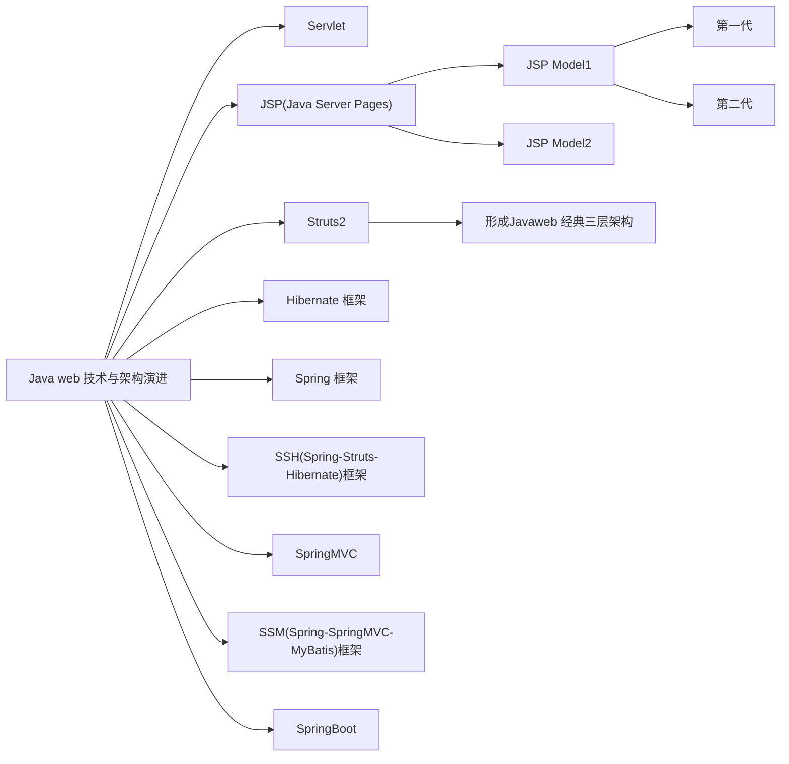

# 1. Servlet

- Servlet 技术诞生用于使 web 服务器能够提供静态资源之外的动态内容，是扩展了 Web 服务器能力的 Java 软件组件。
○ Servlet 的运行依赖于 Servlet 容器（如 Tomcat、Jetty）。
○ Servlet 容器提供了遵循 Servlet 规范的接口，开发者实现自 Servlet 接口的 Java 类就称为一个 Servlet，在 Servlet 中定义用于响应请求的具体动态内容。
○ 在 Servlet 容器的配置中指定请求 URL 与处理请求的 Servlet 的映射关系，如 Tomcat 配置文件位于”/WEB-INF/web.xml”，映射关系内容示例：

```
<?xml version="1.0" ...>
<web-app ...>
    ...
    <servlet>
        <servlet-name>servlet1</servlet-name>
        <servlet-class>servletClass1</servlet-class>
    </servlet>

    <servlet>
        <servlet-name>servlet2</servlet-name>
        <servlet-class>servletClass2</servlet-class>
    </servlet>
    ...
    <servlet-mapping>
        <servlet-name>servlet1</servlet-name>
        <url-pattern>/url1</url-pattern>
    </servlet-mapping>
    <servlet-mapping>
        <servlet-name>servlet2</servlet-name>
        <url-pattern>/url2</url-pattern>
    </servlet-mapping>
    ...
</web-app>
```

○ Servlet 处理客户端请求流程：
（1）客户端请求到达 Servlet 容器，Servlet 容器解析请求信息创建相应的”HttpServletRequest”和”HttpServletResponse”对象。
（2）Servlet 容器根据请求 URL 映射配置创建或找到对应的 Servlet 实例，创建一个线程并传入“HttpServletRequest”与“HttpServletResponse”对象，再调用 Servlet 实例的 service()方法。
（3）Servlet 对象的 doGet()、doPost()等方法处理请求，返回内容交由 Servlet 容器组装成 HTTP 格式返回给客户端。
○demo 地址：[servlet_maven_demo](https://github.com/congzhou09/servlet_maven_demo)

# 2. JSP(Java Server Pages)

○ 由于 Servlet 编写前端内容太繁琐，sun 公司又推出了 JSP。
○ JSP 文件放到 Servlet 容器的 web 目录下。
○ 客户端可直接请求 JSP 文件，得到的内容不是 JSP 原文件而是其中 Java 代码被执行后的内容。
○ Servlet 处理请求的返回内容也可以是一个 JSP 文件。
○ demo 地址同上：[servlet_maven_demo](https://github.com/congzhou09/servlet_maven_demo)

# 3. JSP Model1 第一代

○ JavaWeb 早期的模型，它适合小型 Web 项目，开发成本低。服务器端只有 JSP 页面，所有的操作都在 JSP 页面中，连访问数据库的 API 也在 JSP 页面中完成。


# 4. JSP Model1 第二代

○ 将业务逻辑内容放到 JavaBean，JSP 页面负责显示以及请求调度。虽然第二代比第一代好了些，但 JSP 仍然做了过多的工作，它耦合了视图工作和请求调度（控制器）的工作。


# 5. JSP Model2

○ Servlet 与 JSP 之间可以共享数据，JSP Model2 模式将 Servlet 与 JSP 结合使用，做了初级的 MVC 分层：
（1）JSP：视图层，用来与用户打交道。负责接收用户的数据，以及显示数据给用户。
（2）Servlet：控制层，负责找到合适的模型对象来处理业务逻辑，根据处理结果找到合适的 JSP 页面对用户进行响应。
（3）JavaBean：模型层，完成具体的业务数据处理工作。


# 6. Struts 框架（以 Struts2 为准）

◇ Struts 目的是使视图和业务逻辑清晰的分离，提高开发效率，显著特点如下：
（1）提供 Action 机制来处理业务逻辑。
（2）提供了一套可在 JSP 中使用的标签，方便在 Action 与 JSP 之间共享数据。
◇ Struts 提供的 action 机制的实现基于 Servlet 的 Filter，相当于扩展了的 Filter，也就是 Filter 是 Struts 框架的入口，Struts 根据客户端请求及映射配置(struts-config.xml)实例化对应的 action 和调用其方法处理业务与数据，根据方法返回值及映射配置跳转到对应 JSP 页面或其他网络资源或另一个 action。


◇ action 相对于 Servlet 的优点：
（1）action 不再继承于 Servlet 从而使业务处理与 Servlet API 解耦更易于测试。
（2）每个请求对应一个 action 实例，相比 Servlet 的同一个 URL 的多个请求共用一个 Servlet 对象是线程安全的。
◇ 互联网曾经出现很多*.do 网址的 JSP 网站而不是*.jsp，这通常由于每个.do 对应一个 action，当 action 处理完一系列的业务逻辑后，即使 forward 到 JSP 页面返回给浏览器，浏览器的地址栏中显示的仍然是最初请求的*.do 的 action 地址。
◇ demo 地址：[struts2_maven_demo](https://github.com/congzhou09/struts2_maven_demo)

# 7. Javaweb 经典三层架构

◇ Struts 项目中为避免所有的运算逻辑都放在 Action 导致 Action 类复用度低和逻辑混乱，通常让 action（仍属于 Servlet 范畴）只负责显示，与 JSP 共同组成表现层（web 层），独立出一层业务层（service 层）负责具体业务运算逻辑供 Action 调用，然后通过 JDBC 调用持久层完成数据库的读写的部分独立成数据访问层（dao 层）供业务层使用，由此形成了经典三层架构。
○ 业务层中不包含 JavaWeb API 而只关心业务逻辑，数据层只关心对数据库的访问细节而不涉及具体业务逻辑，提高了代码的可重用性。
○ MVC 定位为表现层的设计模式。


# 8. Hibernate 框架

◆ Hibernate 是个 ORM（Object Relational Mapping，即对象关系映射）框架，通过创建持久化类来对应数据库中表属性及关联关系，然后通过操作持久化对象就能达到操作数据库的目的，而不需要与 SQL 语句打交道，大大降低了原 JDBC 方式的编程量。
◆ Hibernate 原理是对 JDBC 进行了封装，并能自动生成 SQL 语句。

# 9. Spring 框架

■ Spring 框架（Spring framwork，简称 Spring）是一个 JavaSE/EE 全栈开源框架，它从设计上就是分层分模块的架构，可以将对应模块功能的子框架整合到体系中。
■ Spring 带来的最显著改变：在 Spring 之前，web 层调用业务层、业务层调用持久层都是通过调用者 new 出被调用者的方式，之间强耦合、复用率低，Spring 通过其核心特性 IoC 实现强依赖的解耦，由 Spring 完成被调用者的 new 实例化并将其注入给依赖者。
● demo 地址：[spring_maven_demo](https://github.com/congzhou09/spring_maven_demo)
# 10. SSH(Spring-Struts-Hibernate)框架

● Spring 框架整合了 Struts 和 Hibernate，形成了 SSH 这个合成框架。
● SSH 框架中，Struts 负责表示层，Hibernate 负责持久层，Spring 通过 IoC 特性实现对业务层 JavaBean 的管理，以及对表示层与持久层的黏合。

# 11. SpringMVC

● Spring 开发者逐渐发现 Struts 存在设计缺陷，会导致性能、安全、减少配置复杂度、开发效率等方面的不足，遂开发了自己的 MVC 框架：SpringMVC。
● SpringMVC 接受请求的入口是 DispatcherServlet ，不同于 Struts 基于 Servlet 的 Filter，它是派生自 HttpServlet 的一个 Servlet，请求会交付给对应的 Controller 做处理。
● SpringMVC 的因其更清晰的层级分离、更强大直接的配置等优势逐渐成为 Spring Web 模块的主流子框架。
● demo 地址：[spring_maven_demo](https://github.com/congzhou09/spring_maven_demo)

# 12. SSM(Spring-SpringMVC-MyBatis)框架

△ SSM 框架分别用 SpringMVC 和 MyBatis 替代 SSH 框架中的 Struts 和 Hibernate，MyBatis 适用于数据源复杂度较低的场景。
# 13. SpringBoot

● Spring Boot 是对 Spring 工作流层面的演进，实现基于 Spring 的更便捷的生产级别应用。
● Spring Boot 的优点：
（1）内嵌 Servlet 容器，独立运行的 Spring 项目，Spring Boot 可以内嵌 Tomcat，以 java -jar xx.jar 包的形式来运行一个 Spring Boot 应用，省略了 war 包部署的繁琐。
（2）提供 starter 机制简化 Maven 依赖管理与 Spring 配置，如仅需要引入“spring-boot-starter-web”就可以包含 Spring 和 SpringMVC 相关的依赖和配置。
● demo 地址：[springboot_maven_demo](https://github.com/congzhou09/springboot_maven_demo)


[参考文章](https://congzhou09.github.io/knowledge/Java-web-%E6%8A%80%E6%9C%AF%E4%B8%8E%E6%9E%B6%E6%9E%84%E6%BC%94%E8%BF%9B%E5%8E%86%E5%8F%B2.html#Javaweb-%E7%BB%8F%E5%85%B8%E4%B8%89%E5%B1%82%E6%9E%B6%E6%9E%84)