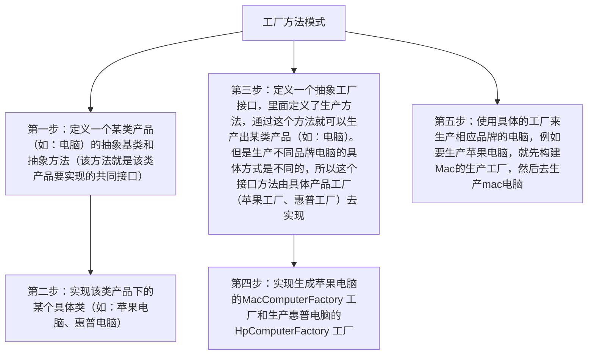

本文主要罗列GOF的面向对象的23种设计模式
# 1. 分类

设计模式按照其要解决的问题被分为3类：

**创建型（creational）**

主要解决如何灵活创建对象或者类的问题，共**5**个

**结构型（structural）**

主要用于将类或对象进行组合从而构建灵活而高效的结构，共**7**个

**行为型（behavioral）**

行为型设计模式主要解决类或者对象之间互相通信的问题，共**11**个

# 2. 创建型（creational）

## 2.1. 工厂方法模式（Factory Method）



工厂方法模式讨论的是如何构建**同一类**型产品（都实现同一个接口）的问题，只不过是通过为每一种要生产的产品配备一个工厂，就是说每个工厂只生产一种特定的产品。这样做的好处就是当以后需要增加新的产品时，直接新增加一个对应的工厂就可以了，而不是去修改原有的工厂，符合编程原则的**开闭原则**

### 2.1.1. 解决的问题

首先当然是在你需要**new**一个类的对象的时候，此时各种状况出现啦：

1. 你不想直接**new**这个类的对象，怕以后这个类改变的时候你需要回来改代码，而此时依赖这个类的地方已经到处都是了。
2. 这个类的对象构建过程非常复杂，你不愿意将这么复杂的构建过程一遍又一遍的写在需要用到此对象的地方。
3. 这个类的对象在构建过程中依赖了很多其他的类，而你无法在调用的地方提供。

工厂方法模式是简单工厂方法模式的升级版本，为了克服简单工厂方法模式的缺点而生，作用和简单工厂方法完全一样

### 2.1.2. 优缺点

**优点**

不直接在客户端创建具体产品的实例，降低了耦合性。

**缺点**

每增加一种产品就要相应的增加一个工厂类，类增多了。
### 2.1.3. 总结

- 构建的都是同一类型的对象，即实现相同的接口
- 每一类对象对应一个工厂

## 2.2. `*`抽象工厂模式（Abstract Factory Pattern）


抽象工厂模式其关键在于**品牌家族**的概念，这里的一个工厂要生产某一个品牌家族里面的系列产品。
### 2.2.1. 解决的问题

如果你的业务中出现了要依据不同的**产品家族**来生产其旗下的一系列产品的时候，抽象工厂模式就配上用场了。

例如小米公司和苹果公司就是两个不同产品家族，而他们两家都生产笔记本电脑和手机，那么小米的笔记本电脑和苹果的笔记本电脑肯定不一样，手机情况也是如此。这就构成了两个产品家族的系列产品之间比较的关系。

再比如麦当劳和肯德基是两个不同的产品家族，他们都生产汉堡和果汁

## 2.3. 构造者模式（Builder pattern）

### 2.3.1. 解决的问题

**当一个类的构造函数参数个数超过4个，而且这些参数有些是可选的参数，考虑使用构造者模式**

```java
public class Computer {
    private String cpu;//必须
    private String ram;//必须
    private int usbCount;//可选
    private String keyboard;//可选
    private String display;//可选
}
```

在Java开发中，Lombok的`@Builder`注解可以轻松实现构造者模式创建对象
### 2.3.2. 如何实现

```java
public class Computer {
    private final String cpu;//必须
    private final String ram;//必须
    private final int usbCount;//可选
    private final String keyboard;//可选
    private final String display;//可选

    private Computer(Builder builder){
        this.cpu=builder.cpu;
        this.ram=builder.ram;
        this.usbCount=builder.usbCount;
        this.keyboard=builder.keyboard;
        this.display=builder.display;
    }
    //省略getter
    ...
    public static class Builder{
        private String cpu;//必须
        private String ram;//必须
        private int usbCount;//可选
        private String keyboard;//可选
        private String display;//可选

        public Builder(String cup,String ram){
            this.cpu=cup;
            this.ram=ram;
        }

        public Builder setUsbCount(int usbCount) {
            this.usbCount = usbCount;
            return this;
        }
        public Builder setKeyboard(String keyboard) {
            this.keyboard = keyboard;
            return this;
        }
        public Builder setDisplay(String display) {
            this.display = display;
            return this;
        }        
        public Computer build(){
            return new Computer(this);
        }
    }
}
```

### 2.3.3. 如何使用

使用链式调用，一步一步的把对象构建出来

```java
Computer computer=new Computer.Builder("因特尔","三星")
        .setDisplay("三星24寸")
        .setKeyboard("罗技")
        .setUsbCount(2)
        .build();
```

## 2.4. 单例模式（Singleton Pattern）

### 2.4.1. 解决的问题

当你希望整个系统运行期间某个类只有一个实例时候就使用单例模式
### 2.4.2. 单例模式两个核心

**如何保证单例**

多线程环境下如何保证系统中只有一个实例？类实现序列化时如何保证？如何保证不能通过反射创建新的实例？

**如何创建单例**

这块又分为**懒汉模式**与**饿汉模式**。

其实也很好理解，懒汉的意思就是这个类很懒，只要别人不找它要实例，它都懒得创建。饿汉模式正好相反，这个类很着急，非常饥渴的要得到自己的实例，所以一有机会他就创建了自己的实例，不管别人要不要
### 2.4.3. 单例模式的5种写法

**静态常量**

**单null检查**

**双重null检查**

**静态内部类**

这种方式其实很棒，既是线程安全的，也是懒汉式的，那个实例只有在你首次访问时候才会生成

```java
public class Singleton5 {
    private Singleton5() {
    }

    private static class SingletonInstance {
        private final static Singleton5 INSTANCE = new Singleton5();
    }

    public static Singleton5 getInstance() {
        return SingletonInstance.INSTANCE;
    }
}
```

**枚举**

## 2.5. 原型模式（Prototype Pattern）

### 2.5.1. 解决的问题

- 当一个对象的构建代价过高时。例如某个对象里面的数据需要访问数据库才能拿到，而我们却要多次构建这样的对象。
- 当构建的多个对象，均需要处于某种原始状态时，就可以先构建一个拥有此状态的原型对象，其他对象基于原型对象来修改。

# 3. 结构型（structural）

## 3.1. 适配器模式（Adapter Pattern）

适配器模式还有个别名叫：Wrapper（包装器），顾名思义就是将目标类用一个新类包装一下，相当于在客户端与目标类之间加了一层。IT世界有句俗语：没有什么问题是加一层不能解决的
### 3.1.1. 解决的问题

- 当需要使用一个现存的类，但它提供的接口与我们系统的接口不兼容，而我们还不能修改它时
- 当多个团队独立开发一个系统中的各个功能模块，最后组合在一起，但由于某些原因事先不能确定接口时。（别和我说这不可能，这太tm可能了）
### 3.1.2. 优缺点

**优点**

极大的增强了程序的可扩展性，通过此模式，你可以随意扩展程序的功能，但却不需要修改接口

**缺点**

其实在我看来这个模式真没啥缺点，唯一可以称的上的缺点是多了一层，但是这也是没有办法的事情。
