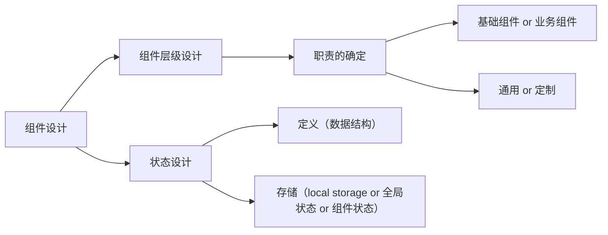

# 1. 设计

# 2. 基础组件 / 业务组件

如何区分基础组件和业务组件的差别，通用性是我们区分基础组件和业务组件的边界。

# 3. 通用特性 / 定制特性

通用特性归于基础组件中，定制特性在业务组件中封装

看一个复杂些的例子，各大厂都在推的工作流类应用，我们来思考如果是我们来做这些节点，我们应该如何来做？我们可以从以下几点来思考：

1. **节点的通用特性是什么？**

2. **节点的定制特性是什么？**

3. **如何封装？**

# 4. 状态定义

[React 官方的这篇文章值得反复阅读](https://react.dev/learn/thinking-in-react)
# 5. 状态的存储

状态的存储方式是一个跟实际业务挂钩的东西

**唯一要注意的就是区分好「 全局状态 」和 「 组件状态 」**

- **操作方式**:
    - **DOM**: 直接通过 JavaScript 操作。
    - **React**: 声明式，通过组件状态和属性管理。
- **性能**:
    - **DOM**: 直接操作可能影响性能。
    - **React**: 通过虚拟 DOM 优化更新。
- **结构**:
    - **DOM**: 静态树状结构。
    - **React**: 组件树，动态且可组合。

**应该始终以一个消费者的视角来开发组件。**

综上所述，组件的设计应该包含以下的路径：

1. 根据「 通用特性/定制特性 」确定组件的通用级别。
    
2. 将特性区分为 「 UI 特性 / 业务特性 」来确定组件层级和封装。
    
3. 结合一些技巧来优化组件层级和状态存储的位置，优化性能表现。
    
4. 还有许多的细节需要处理（Typescript 定义、props 定义、样式等）...