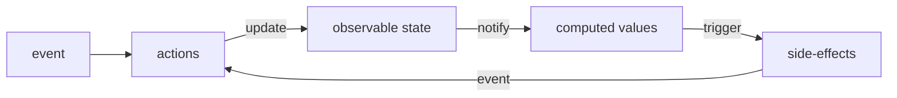
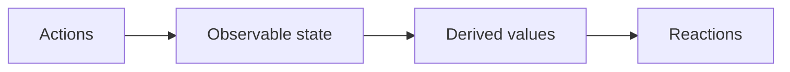

# 1. 使用MobX

Mobx 6 是目前最新版本，为了与标准 javaScript 的最大兼容，默认情况下放弃了装饰器语法。（本文主要介绍 Mobx6）
## 1.1. MobX的例子

实现一个计时器的功能

**使用MobX**

```
import React from "react";
import ReactDOM from "react-dom";
import { makeAutoObservable } from "mobx";
import { observer } from "mobx-react-lite";

// Model the application state.
const createTimer = () => {
    return makeAutoObservable({
        secondsPassed: 0,
        increase() {
            this.secondsPassed += 1;
        },
        reset() {
            this.secondsPassed = 0;
        },
    });
};

const myTimer = createTimer();

// Build a "user interface" that uses the observable state.
const TimerView = observer(({ timer }) => (
    <button onClick={() => timer.reset()}>
        Seconds passed: {timer.secondsPassed}
    </button>
));

ReactDOM.render(<TimerView timer={myTimer} />, document.body);

// Update the 'Seconds passed: X' text every second.
setInterval(() => {
    myTimer.increase();
}, 1000);

```

`makeAutoObservable` 是MobX库中的一个函数，用于自动将对象属性转换为可观察的

`observer` 是MobX-react-lite库中的一个高阶组件，用于将React组件与MobX的可观察状态连接起来



**使用React hook**

```
import React, { useState, useEffect } from "react";

// Build a "user interface" that uses the observable state.
const Timer = () => {
    const initSecondsPassed = 0;
    const [secondsPassed, setSecondsPassed] = useState(initSecondsPassed);

    const reset = () => setSecondsPassed(initSecondsPassed);

    useEffect(() => {
        const increase = () => setSecondsPassed(secondsPassed + 1);
        const intervalId = setInterval(increase, 1000);
        return () => clearInterval(intervalId); // 清理函数，在组件卸载时清除定时器
    }, [secondsPassed]); // 将secondsPassed添加到依赖数组中

    return (
        <button onClick={() => reset()}>Seconds passed: {secondsPassed}</button>
    );
};

export default Timer;
```
## 1.2. 有了hooks 为什么还需要mobx

通过上面的例子可以看出，mobx能实现的，使用react的hook也能达到同样的效果，那为什么还要使用mobx呢

1. 自动依赖追踪
MobX 使用响应式编程模型，能够自动追踪状态的依赖关系。当状态变化时，相关的组件会自动重新渲染，而不需要手动管理依赖关系。
2. 更少的样板代码
相比于使用多个 useState 和 useEffect 钩子，MobX 可以通过简单的状态树和观察者模式来减少样板代码，使得代码更加简洁。
3. 性能优化
MobX 的细粒度更新机制可以提高性能，避免不必要的重新渲染。只有依赖于变化状态的组件才会更新。
4. 更好的组织结构
使用 MobX 可以将状态和行为逻辑集中在一起，便于管理和维护，尤其是在大型项目中。
5. 与类组件的兼容性
在某些情况下，仍然需要使用类组件。MobX 可以与类组件很好地集成，而 Hooks 主要适用于函数组件。
6. 跨组件的状态共享
MobX 提供了一种简单的方式来在不同的组件之间共享状态，特别适合于需要在多个地方访问同一状态的场景。
# 2. 概念

[官网](https://mobx.js.org/README.html)

MobX在应用程序中区分了以下三个概念

1. State
2. Actions
3. Derivations

MobX是一个基于信号的状态管理库
## 2.1. 定义可observable的state

state通常用来保存视图的状态、待办的事项等

MobX并不关心存储state所使用的数据结构（对象、数组、引用等），只要确保你想随时间改变的所有属性都被标记为可观察的`observable`，这样MobX就可以跟踪它们

state就像保存值的电子表格，使用observable就像把一个对象的属性变成一个电子表格的单元格

方法一（推荐）：通过`makeAutoObservale`自动地给方法中的每个属性和方法标记上`observale`和`action`

```
import { makeAutoObservable } from "mobx";
const createTimer = () => {
    return makeAutoObservable({
        secondsPassed: 0,
        increase() {
            this.secondsPassed += 1;
        },
        reset() {
            this.secondsPassed = 0;
        },
    });
};
```

方法二：显式地标记observable和action

```
import { makeObservable, observable, action } from "mobx"

class Todo {
    id = Math.random()
    title = ""
    finished = false

    constructor(title) {
        makeObservable(this, {
            title: observable,
            finished: observable,
            toggle: action
        })
        this.title = title
    }
    
    toggle() {
        this.finished = !this.finished
    }
}
```

可以通过类的方式去定义state，也可以通过方法去定义，更推荐使用方法的方式
## 2.2. 使用Actions更新状态

Actions是任何一段改变状态的代码，Actions就像用户在电子表格的单元格中输入一个新值。

在MobX中任何改变可观察对象的代码都可标记为动作
## 2.3. 创建自动响应状态变化的Derivations

任何来源是State且不需要进一步交互的东西都是Derivations

Derivations 存在的多种形式
- 用户界面

MobX区分了两种Derivations

- Computed，它总是可以使用纯函数从当前可观察状态派生出来
- Reactions，当状态改变时需要自动发生的副作用(介于命令式编程和响应式编程之间的桥梁)

黄金法则是，如果你希望基于当前状态创建值，则始终使用computed
### 2.3.1. 组件的响应式Derivations

To create a _computed_ value, define a property using a JS getter function `get` and mark it as `computed` with `makeObservable`

```
import { makeObservable, observable, computed } from "mobx"

class TodoList {
    todos = []
    get unfinishedTodoCount() {
        return this.todos.filter(todo => !todo.finished).length
    }
    constructor(todos) {
        makeObservable(this, {
            todos: observable,
            unfinishedTodoCount: computed
        })
        this.todos = todos
    }
}
```

MobX will ensure that `unfinishedTodoCount` is updated automatically when a todo is added or when one of the `finished` properties is modified.
# 3. 准则

MobX 使用单向数据流，通过Actions改变状态，进而更新所有受影响的视图



- 当state改变时，所有的Derivations都会自动更新
- 默认情况下，所有Derivations都同步更新
- Computed values 的更新是懒加载的，当没有被使用时，它不会更新
- 所有Computed values 都应该是纯值。它们不应该改变state


# 4. 核心概念

1. observable 定义一个存储 state 的可追踪字段（Proxy）
2. action 将一个方法标记为可以修改 state 的 action
3. computed 标记一个可以由 state 派生出新值并且缓存其输出的计算属性