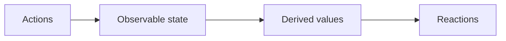

# 1. 概念

MobX在应用程序中区分了以下三个概念

1. State
2. Actions
3. Derivations

MobX是一个基于信号的状态管理库
## 1.1. 定义state并标记observable

state通常用来保存视图的状态、待办的事项等

MobX并不关心存储state所使用的数据结构（对象、数组、引用等），只要确保你想随时间改变的所有属性都被标记为可观察的`observable`，这样MobX就可以跟踪它们

state就像保存值的电子表格单元格，使用observable就像把一个对象的属性变成一个电子表格单元格

```
import { makeObservable, observable, action } from "mobx"

class Todo {
    id = Math.random()
    title = ""
    finished = false

    constructor(title) {
        makeObservable(this, {
            title: observable,
            finished: observable,
            toggle: action
        })
        this.title = title
    }

    toggle() {
        this.finished = !this.finished
    }
}
```
## 1.2. 使用Actions更新状态

Actions是任何一段改变状态的代码，Actions就像用户在电子表格的单元格中输入一个新值。

MobX建议把任何改变可观察对象的代码标记为动作

## 1.3. 创建自动响应状态变化的Derivations

任何可以从state中导出而无需任何进一步交互的东西都是Derivations

Derivations 存在的多种形式
- 用户界面

MobX区分了两种Derivations

- 计算值，它总是可以使用纯函数从当前可观察状态派生出来
- 反应，当状态改变时需要自动发生的副作用(介于命令式编程和响应式编程之间的桥梁)

黄金法则是，如果你希望基于当前状态创建值，则始终使用computed
### 1.3.1. 组件的响应式Derivations

To create a _computed_ value, define a property using a JS getter function `get` and mark it as `computed` with `makeObservable`

```
import { makeObservable, observable, computed } from "mobx"

class TodoList {
    todos = []
    get unfinishedTodoCount() {
        return this.todos.filter(todo => !todo.finished).length
    }
    constructor(todos) {
        makeObservable(this, {
            todos: observable,
            unfinishedTodoCount: computed
        })
        this.todos = todos
    }
}
```

MobX will ensure that `unfinishedTodoCount` is updated automatically when a todo is added or when one of the `finished` properties is modified.
# 2. 准则

MobX 使用单向数据流，通过Actions改变状态，进而更新所有受影响的视图



- 当state改变时，所有的Derivations都会自动更新
- 默认情况下，所有Derivations都同步更新
- Computed values 的更新是懒加载的，当没有被使用时，它不会更新
- 所有Computed values 都应该是纯值。它们不应该改变state。


