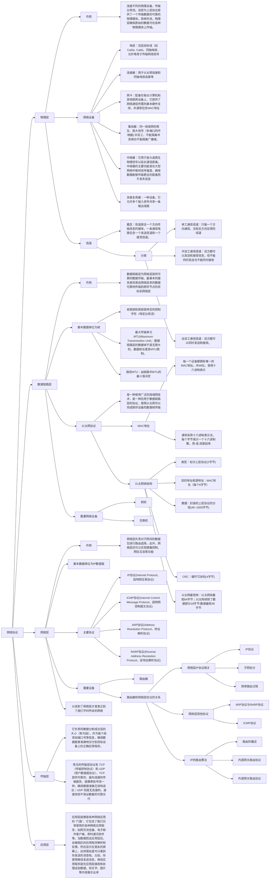

```mermaid
flowchart LR
	4hd0jlppaaci5jh8sc32u5imiv["网络协议"] --> 5uhmej2j4qted8rgduh06ul35a["物理层"]
	5uhmej2j4qted8rgduh06ul35a --> 433olg451ncel3ph68qd5p7pcg["作用"]
	433olg451ncel3ph68qd5p7pcg --> 5c6qkdch196od0509offlb5m3f["连接不同的物理设备，传输比特流。该层为上层协议提供了一个传输数据的可靠的物理媒体。简单的说，物理层确保原始的数据可在各种物理媒体上传输。"]
	5uhmej2j4qted8rgduh06ul35a --> 60g3ndj3sl1377bjdft5cviur2["网络设备"]
	60g3ndj3sl1377bjdft5cviur2 --> 2co2i9ajnqgjhek96gocmd55kl["电缆：包括双绞线（如Cat5e, Cat6)、同轴电缆、光纤等用于传输网络信号"]
	60g3ndj3sl1377bjdft5cviur2 --> 575i9u8g6ktugtu6jspclp8mra["连接器：用于以太网连接和同轴电缆连接等"]
	60g3ndj3sl1377bjdft5cviur2 --> 1djep409cpl45tk0ma9e6beqvr["网卡：配备在每台计算机和其他联网设备上，它提供了网络通信所需的基本硬件支持，并通常包含MAC地址"]
	60g3ndj3sl1377bjdft5cviur2 --> 15kc43sqqpagbjqatr338qsot8["集线器：同一局域网的再生、放大信号（多端口的中继器);半双工，不能隔离冲突域也不能隔离广播域。"]
	60g3ndj3sl1377bjdft5cviur2 --> 0tmtridpkvrvkbh46frkj3tpvb["中继器：它用于放大或再生物理信号以延长通信距离。中继器的主要功能是在大型网络中维持信号强度，确保数据能够传输更远的距离而不丢失信息"]
	60g3ndj3sl1377bjdft5cviur2 --> 0ctev68a97kg6152pbjjd25517["多路复用器：一种设备，它允许多个输入信号共享一条输出线路"]
	5uhmej2j4qted8rgduh06ul35a --> 18s07qec0p3qpifdsf8mt838k3["信道"]
	18s07qec0p3qpifdsf8mt838k3 --> 3jue82ik1q3855cbj6d9sscomv["概念∶信道是往一个方向传输信息的媒体，一条通信电路包含一个发送信道和一个接受信道。"]
	18s07qec0p3qpifdsf8mt838k3 --> 0sm1krdbg9lqakbp4sf3lide0h["分类"]
	0sm1krdbg9lqakbp4sf3lide0h --> 5u5ujk5adhls21po1e244s2ouc["单工通信信道：只能一个方向通信，没有反方向反馈的信道"]
	0sm1krdbg9lqakbp4sf3lide0h --> 1s0sqei7dtb5ifg2fgml890p1l["半双工通信信道：双方都可以发送和接受信息，但不能同时发送也不能同时接收"]
	0sm1krdbg9lqakbp4sf3lide0h --> 5gkj44mjhfp4sa7k4lgrtccid6["全双工通信信道：双方都可以同时发送和接收。"]
	4hd0jlppaaci5jh8sc32u5imiv --> 5so368hv8ugv5b13r5jnpsrmmd["数据链路层"]
	5so368hv8ugv5b13r5jnpsrmmd --> 5ulglvtr3e4jnkbbvut2nf6cf1["作用"]
	5ulglvtr3e4jnkbbvut2nf6cf1 --> 4n0un3so0avirjai2c6f32v09o["数据链路层为网络层提供可靠的数据传输，最基本的服务是将源自网络层来的数据可靠地传输到相邻节点的目标机网络层"]
	5so368hv8ugv5b13r5jnpsrmmd --> 0a576v8aeibi05pp00mufa9k0p["基本数据单位为帧"]
	0a576v8aeibi05pp00mufa9k0p --> 4cu9jv0bo9b6rplo8ocjbojnd2["帧首部和尾部是特定的控制字符（特定比特流）"]
	0a576v8aeibi05pp00mufa9k0p --> 13ptt1mbt7csv64vi8b96d3hro["最大传输单元MTU(Maximum Transmisslion Unit)：数据链路层的数据帧不是无限大的，数据帧长度受MTU限制。"]
	0a576v8aeibi05pp00mufa9k0p --> 4k7ubgcef2kvh6md7db8bpj02o["路径MTU：由链路中MTU的最小值决定"]
	5so368hv8ugv5b13r5jnpsrmmd --> 496tcehp2vh2noqno3e2lq7jpo["以太网协议"]
	496tcehp2vh2noqno3e2lq7jpo --> 0lhss0fg9m1knap8huadumm644["是一种使用广泛的局域网技术，是一种应用于数据链路层的协议，使用以太网可以完成相邻设备的数据帧传输"]
	496tcehp2vh2noqno3e2lq7jpo --> 0o96ne04pvg2305hhit0fq06en["MAC地址"]
	0o96ne04pvg2305hhit0fq06en --> 2qmdshlmnnlj8aegip3qj77mv7["每一个设备都拥有唯一的MAC地址。共48位，使用十六进制表示"]
	0o96ne04pvg2305hhit0fq06en --> 4ef5ohsc3cqarknud3v3cjngni["通常采用十六进制表示法，每个字节表示一个十六进制数，用-或:连接起来"]
	496tcehp2vh2noqno3e2lq7jpo --> 172mehgdnvegvk7gn6sgiok5qc["以太网帧结构"]
	172mehgdnvegvk7gn6sgiok5qc --> 6dqpbs5d6rlvrasdoaho0o9oe0["类型：标识上层协议(2字节)"]
	172mehgdnvegvk7gn6sgiok5qc --> 4pf11uco81jshgvil0hqce8vit["目的地址和源地址：MAC地址（每个6字节）"]
	172mehgdnvegvk7gn6sgiok5qc --> 1thdq1vn82joc1ut7169605do5["数据：封装的上层协议的分组(46~1500字节)"]
	172mehgdnvegvk7gn6sgiok5qc --> 1hekg1m15e5s6gvg0tti5oaght["CRC：循环冗余码(4字节)"]
	172mehgdnvegvk7gn6sgiok5qc --> 5q8dlbs4kuvcjsbfjalppgp4ul["以太网最短帧：以太网帧最短64字节；以太网帧除了数据部分18字节;数据最短46字节"]
	5so368hv8ugv5b13r5jnpsrmmd --> 2d2hqq4kfnuedn9pfpslpg87f6["重要网络设备"]
	2d2hqq4kfnuedn9pfpslpg87f6 --> 0k1ifpji9gtdnu7ci14an2d7u3["网桥"]
	2d2hqq4kfnuedn9pfpslpg87f6 --> 45kusatercbs6shs4b9mo5fq26["交换机"]
	4hd0jlppaaci5jh8sc32u5imiv --> 1nb5mc0890o35u5dg61beicfhe["网络层"]
	1nb5mc0890o35u5dg61beicfhe --> 07k1nnd3jjbmvn0shden42umiu["作用"]
	07k1nnd3jjbmvn0shden42umiu --> 4mpebvkfrijge4vekkvk1gjbl0["网络层负责对子网间的数据包进行路由选择。此外，网络层还可以实现拥塞控制、网际互连等功能"]
	1nb5mc0890o35u5dg61beicfhe --> 7qd2vj648d047pi0nf6q7i6d48["基本数据单位为IP数据报"]
	1nb5mc0890o35u5dg61beicfhe --> 2b9aolu3joo9rq183d6kcjstj2["主要协议"]
	2b9aolu3joo9rq183d6kcjstj2 --> 46843ggkh7g77n9o2ois6orer5["IP协议(Internet Protocol，因特网互联协议)"]
	2b9aolu3joo9rq183d6kcjstj2 --> 0lmdsmsegvbfnlp29u0mrbeq03["ICMP协议(Internet Control Message Protocol，因特网控制报文协议)"]
	2b9aolu3joo9rq183d6kcjstj2 --> 6agjm6fdnkgc40ar7ncntgjrjc["ARP协议(Address Resolution Protocol，地址解析协议)"]
	2b9aolu3joo9rq183d6kcjstj2 --> 1ulj8pptqpu7n4bjp6j71fe1gu["RARP协议(Reverse Address Resolution Protocol，逆地址解析协议)"]
	1nb5mc0890o35u5dg61beicfhe --> 75fjoj4emep3fjr00vntc2dl9l["重要设备"]
	75fjoj4emep3fjr00vntc2dl9l --> 3njsf8bri4h1ot6ljbc1k61jou["路由器"]
	75fjoj4emep3fjr00vntc2dl9l --> 2ec0bbbcqu2rl3u614hd3th7g1["路由器和网络层协议的关系"]
	2ec0bbbcqu2rl3u614hd3th7g1 --> 55ei313earlu3c16fiaaajluvp["网络层IP协议相关"]
	55ei313earlu3c16fiaaajluvp --> 2l3s9i3plb970fhoq7o03evmpg["IP协议"]
	55ei313earlu3c16fiaaajluvp --> 6do1bvl5bqtbpe5steki483bnr["子网划分"]
	55ei313earlu3c16fiaaajluvp --> 6hvma4hq418ll49dbv6gqujhov["简单路由过程"]
	2ec0bbbcqu2rl3u614hd3th7g1 --> 6ahr8qtj6n6ndaeor2nl7u6b6i["网络层其他协议"]
	6ahr8qtj6n6ndaeor2nl7u6b6i --> 0fs50b7i8f6dccmf319o471rn2["ARP协议与RARP协议"]
	6ahr8qtj6n6ndaeor2nl7u6b6i --> 72gvo5m7eluvgh6rdniaio5k21["ICMP协议"]
	2ec0bbbcqu2rl3u614hd3th7g1 --> 50vfon2gtafgcasn685e1maou9["IP的路由算法"]
	50vfon2gtafgcasn685e1maou9 --> 12fvkdc05c0jbpjvi6va1diejk["路由的概述"]
	50vfon2gtafgcasn685e1maou9 --> 0jlhlkubu0lkn6nda8ni9qsuh4["内部网关路由协议"]
	50vfon2gtafgcasn685e1maou9 --> 46vld06noe45tm6n3buehktl75["外部网关路由协议"]
	1nb5mc0890o35u5dg61beicfhe --> 0tb2ln1o7jjdeon55ue5qv6nke["以说到了网络层才是真正到了我们平时所说的网络"]
	4hd0jlppaaci5jh8sc32u5imiv --> 7jl6749tg91qsm8k173ve5m13n["传输层"]
	7jl6749tg91qsm8k173ve5m13n --> 59qcdemlnna5ootf3p5qkufipj["它负责将数据分割成合适的大小（称为段），并为每个段添加端口号等信息，确保数据能够准确地交付到目标设备上的正确应用程序。"]
	7jl6749tg91qsm8k173ve5m13n --> 6kkdgpkk3q5th94ek6m8cvuhni["常见的传输层协议有 TCP（传输控制协议）和 UDP（用户数据报协议），TCP 提供可靠的、面向连接的传输服务，就像寄挂号信一样，确保数据准确无误地送达；UDP 则是无连接的，速度快但不保证数据的可靠交付"]
	4hd0jlppaaci5jh8sc32u5imiv --> 4e2f4q6ai4r9inlajf3983h1ds["应用层"]
	4e2f4q6ai4r9inlajf3983h1ds --> 2ge9ceu2c8h55gi5am12nod76q["应用层就像是各种网络应用的 “门面”，它包含了我们日常使用的各种网络应用程序，如网页浏览器、电子邮件客户端、即时通讯软件等。当数据到达应用层后，会被相应的应用程序解析和处理，然后显示在朋友的屏幕上，这样朋友就可以看到你发送的消息啦。比如，你使用微信发送消息，微信应用程序就在应用层接收和处理这些数据，将文字、图片等内容展示出来"]
```

